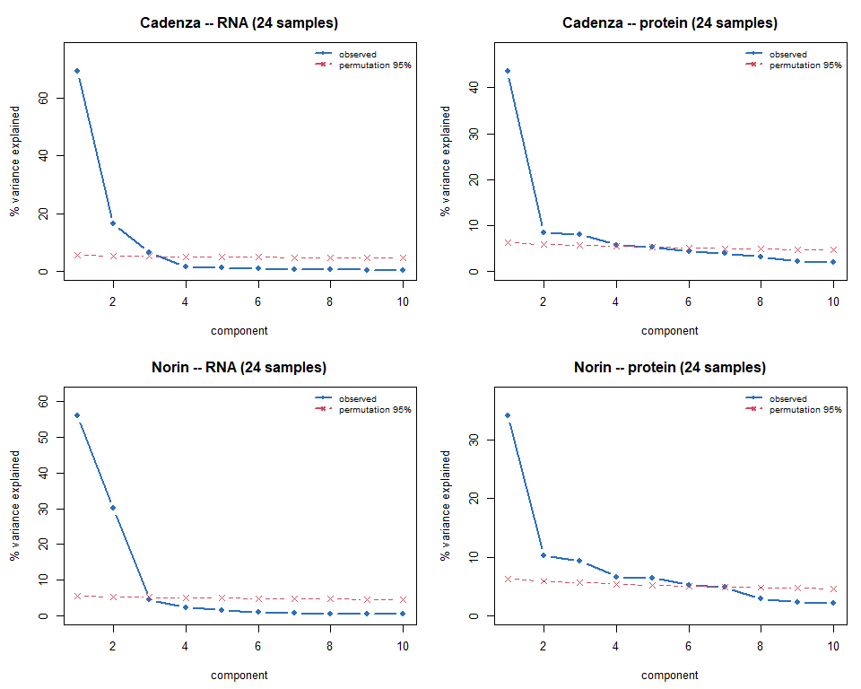
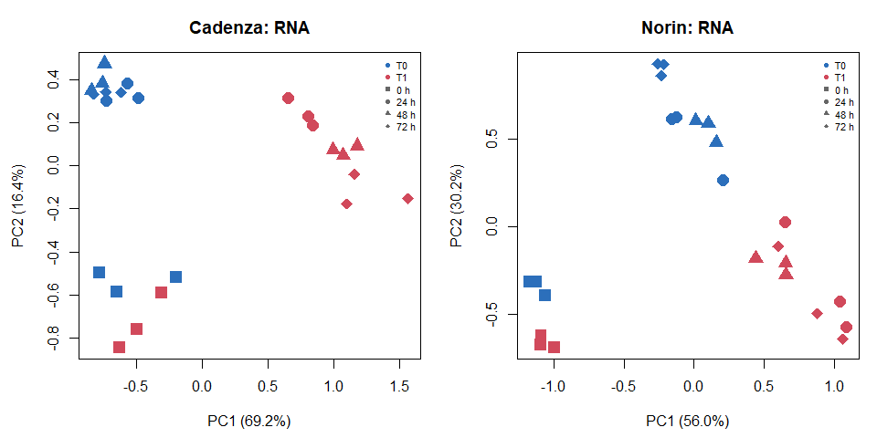
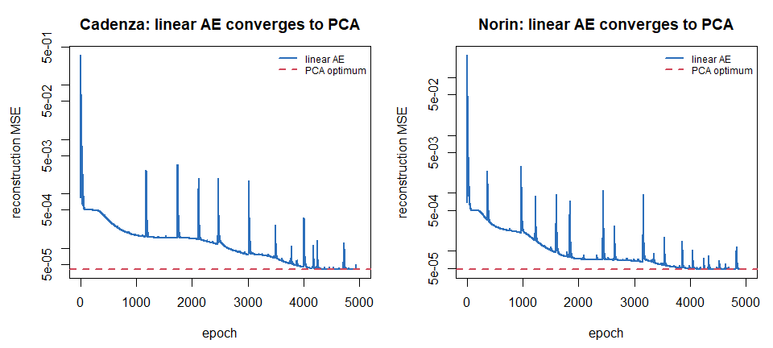
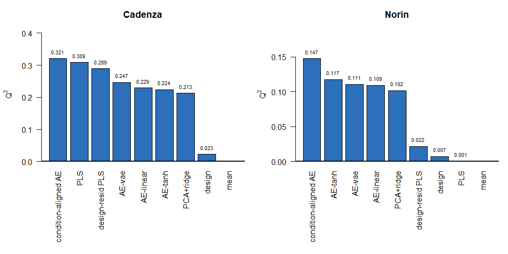
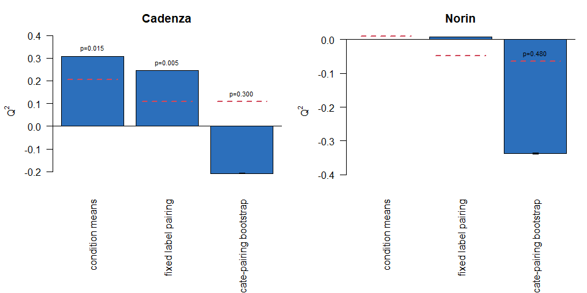

# Dimensionality reduction for unpaired RNA/protein - PCA, PLS,
autoencoders
Kristina Gagalova

- [Purpose and scope](#purpose-and-scope)
  - [Two corrections to the framing, stated up
    front](#two-corrections-to-the-framing-stated-up-front)
  - [Relationship to the existing Python
    work](#relationship-to-the-existing-python-work)
- [Peer review and response](#peer-review-and-response)
- [Analysis outline](#analysis-outline)
- [1. Setup](#setup)
- [2. The methods and what each
  assumes](#the-methods-and-what-each-assumes)
  - [PCA](#pca)
  - [PLS](#pls)
  - [Autoencoders (linear, non-linear,
    variational)](#autoencoders-linear-non-linear-variational)
  - [Condition-aligned autoencoder](#condition-aligned-autoencoder)
- [3. Implementation](#implementation)
- [4. D1 — How many components are
  real?](#d1-how-many-components-are-real)
- [5. D2 — Do the components track the
  design?](#d2-do-the-components-track-the-design)
- [6. D3 — Is a linear autoencoder equivalent to
  PCA?](#d3-is-a-linear-autoencoder-equivalent-to-pca)
- [7. D4 — Does any method beat predicting the
  mean?](#d4-does-any-method-beat-predicting-the-mean)
  - [D4 permutation null](#d4-permutation-null)
- [7b. D7 — Condition means or individual replicates for the cross-block
  fit?](#b.-d7-condition-means-or-individual-replicates-for-the-cross-block-fit)
- [7c. D8 — Does global feature selection
  leak?](#c.-d8-does-global-feature-selection-leak)
- [7d. D9 — Sample-level condition-aligned AE: the real test of centroid
  alignment](#d.-d9-sample-level-condition-aligned-ae-the-real-test-of-centroid-alignment)
- [8. D5 — Are we sample-limited?](#d5-are-we-sample-limited)
- [9. D6 — Are the latent spaces
  reproducible?](#d6-are-the-latent-spaces-reproducible)
- [9b. D11 — Why does Cadenza beat
  Norin?](#b.-d11-why-does-cadenza-beat-norin)
- [10. Assumption validation summary](#assumption-validation-summary)
- [11. What is safe to claim](#what-is-safe-to-claim)
  - [The results](#the-results)
  - [✅ Safe to claim](#safe-to-claim)
  - [⚠️ Claim only with the caveat
    attached](#claim-only-with-the-caveat-attached)
  - [❌ Not supported](#not-supported)
  - [The one-paragraph version](#the-one-paragraph-version)
  - [What would strengthen this](#what-would-strengthen-this)
- [References](#references)

## Purpose and scope

This notebook answers one question systematically:

> **Given 8 experimental conditions and unpaired RNA/protein layers,
> which dimensionality-reduction method is actually justified — and does
> any of them beat simply predicting the mean?**

The candidates are PCA, PLS, and three autoencoder variants (linear,
non-linear, variational), plus a condition-aligned autoencoder matching
the architecture in the project’s existing Python work.

### Two corrections to the framing, stated up front

**1. No VAE has previously been built in this repository.** PCA and PLS
are used throughout (`R/06_integration_caseB.R`, `R/01_qc_normalise.R`,
the kinetics notebooks). A VAE was *proposed* in `docs/planning.md` §4C
but never implemented here. The working autoencoder for this project is
`ConditionAlignedAE` in `rnaprot/unpaired.py` on `nectar` (GitHub:
`KristinaGagalova/autoencoders-test`). Everything autoencoder-related
below is **new work written for this notebook**.

**2. Implemented from scratch in base R.** No `torch`/`keras` is
available in this project’s R environment. Rather than add a ~2 GB
dependency, all models here are written directly with explicit gradients
and Adam. That is slower to write but has a real advantage for this
question: every model is auditable, and the comparison is not confounded
by framework defaults.

### Relationship to the existing Python work

`rnaprot/unpaired.py` on `nectar` implements the same problem with:

| Component              | Python (`unpaired.py`)                                                     | Here                                                 |
|:-----------------------|:---------------------------------------------------------------------------|:-----------------------------------------------------|
| Deep model             | `ConditionAlignedAE`, MLP `[p, 64, 16, 6]`, LayerNorm + SiLU + dropout 0.1 | Linear condition-aligned AE (see §6 for why linear)  |
| Loss                   | `0.5·L_rna + 0.5·L_prot + 2.0·L_cross + 0.5·L_align`                       | Same four terms, same default weights                |
| CV                     | `leave_condition_out`                                                      | Leave-one-condition-out                              |
| Baselines              | mean, design ridge, PCA+ridge, PLS, cognate ridge                          | mean, design ridge, PCA+ridge, PLS                   |
| Component selection    | `_loo_select_components` (inner LOO)                                       | **Not implemented** – `k = 2` fixed a priori, see §7 |
| Design residualisation | `_design_residual_predict`                                                 | §7, **design-resid PLS** row                         |

**Correction from an earlier version of this table:** it previously
listed component selection as “inner LOO, same idea” and design
residualisation as simply “§7”. Neither was accurate – `loco_compare()`
(§7) passed a fixed `k = 2` to every method with no inner tuning loop,
and §7 had a design *baseline* (a separate competing method) but no
residualisation step at all. That table entry described what the Python
version does, not what this notebook did. It has been corrected:
`k`/`alpha` are stated as fixed a priori rather than tuned (implementing
full nested-CV tuning for every method was judged not worth the added
complexity at n = 7 training conditions), and a genuine
design-residualised PLS row was added to §7’s comparison – the same
control `unpaired.py` already applies, and the one I arrived at
independently for
`analysis/kinetics_limited/kinetics_what_we_can_claim.qmd` (K1). Two
independent implementations converging on that control is reassuring; it
just was not actually wired into this notebook’s D4 until now.

**A second, revised module exists: `rnaprot/unpaired_reviewer.py`.** It
drives `rna_protein_unpaired_per_variety.ipynb` and mostly re-runs the
same comparison above, but with three real differences, not just
cosmetic ones: loss weights `0.5/0.5/3.0/0.75` rather than
`0.5/0.5/2.0/0.5`; RNA/protein **feature selection redone inside each
outer CV fold** rather than once globally; and a **permutation null
(`N_PERM=200`) applied to the PCA/PLS/design baselines**, though not to
the autoencoder. The first is a hyperparameter difference, not addressed
further here. The second and third are genuine methodological gaps in
D4/D7 above, closed in **D8 (§7c)** and **D7 (§7b)** respectively.

------------------------------------------------------------------------

## Peer review and response

This notebook went through a peer review (major revision) after the
D7-D11 additions above were first written. The review’s central finding
was a genuine cross-validation leak affecting the headline
condition-aligned AE result, plus a number of smaller correctness and
framing issues. Verified independently (the leakage argument was
re-derived from scratch, not taken on faith – see the note at the top of
§7) and **all of it has been addressed** in the version of this notebook
now on disk. This section records what was found and what was done, so
the fixes are traceable to their motivation rather than appearing as
unexplained code.

| Reviewer finding                                                                                                                                                                                               | Verdict on review                    | What was done                                                                                                                                                                                                                                                                                                                                                                                                                                                     |
|:---------------------------------------------------------------------------------------------------------------------------------------------------------------------------------------------------------------|:-------------------------------------|:------------------------------------------------------------------------------------------------------------------------------------------------------------------------------------------------------------------------------------------------------------------------------------------------------------------------------------------------------------------------------------------------------------------------------------------------------------------|
| **CV-centering leak in the condition-aligned AE** (§7 leakage note)                                                                                                                                            | Confirmed, most serious finding      | `cs()` centred the full 8-condition matrix *before* the LOCO split; for a homogeneous (no-intercept) linear predictor this makes the held-out row an exact linear combination of the training rows, so `predict(x_i) = -sum(predict(x_j))` by algebra alone, independent of model quality. Fixed with `fold_scaler()` (§3): every LOCO-style analysis (D4, D7, D8, D9, D11a) now centres/scales from training-fold data only, via new `*_raw` fields in `BLOCKS`. |
| Intro table claimed inner-LOO component selection and design residualisation that the code didn’t implement                                                                                                    | Confirmed                            | Table corrected (see “Relationship to the existing Python work” above); `k`/`alpha` now stated as fixed a priori, and a real **design-resid PLS** row was added to §7.                                                                                                                                                                                                                                                                                            |
| “Beyond design” claim too strong given only an *additive* design baseline                                                                                                                                      | Agreed                               | The new design-resid PLS row (§7) residualises on an *interactive* `treatment * time_f` design before testing whether RNA still adds predictive value.                                                                                                                                                                                                                                                                                                            |
| D3 vs D4 ridge-alpha mismatch: a linear AE’s latent scale is an arbitrary gauge parameter, unlike PCA’s variance-ordered scores; one fixed `alpha` regularised them unequally                                  | Confirmed                            | D4 (§7) now z-scores the AE’s latent block via `fold_scaler()` before ridge, on training data only. D3 got a caveat paragraph flagging this was a scoring issue, not a subspace-identity issue.                                                                                                                                                                                                                                                                   |
| D5’s test-condition sampling (`setdiff(seq_len(n), tr)[1]`) always picked the lowest-index remaining condition, not a random one                                                                               | Confirmed, real bug                  | Replaced with exhaustive enumeration of every (test condition, training subset) combination – cheap at n = 8 – plus standard-error bars. No sampling at all, so the bug class cannot recur.                                                                                                                                                                                                                                                                       |
| D7’s bootstrap null compared a mean-of-30-pairings observed statistic against individual (non-averaged) null draws                                                                                             | Confirmed, statistic mismatch        | Null now built from the same statistic: each null draw is itself a mean over `n_pairings` random pairings under one permuted correspondence. Also added `fixed_pairing_pctile_of_random_pairings`, quantifying directly how favourable the one arbitrary reference-notebook pairing was.                                                                                                                                                                          |
| D6 (seed stability) tested the three plain autoencoders but exempted the condition-aligned AE – the actual headline non-convex model – from its own pre-committed reproducibility rule                         | Confirmed, real gap                  | D6 now also fits and scores the condition-aligned AE’s latent stability, at both the condition-level (D4) and sample-level (D9) fit.                                                                                                                                                                                                                                                                                                                              |
| VAE conclusion (“not justified on this data”) over-generalised from a specifically *linear/shallow* VAE implementation (linear mu/logvar heads, linear decoder, no hidden non-linearity)                       | Confirmed                            | §11 point 7 rescoped to name the implementation tested, not VAEs generally.                                                                                                                                                                                                                                                                                                                                                                                       |
| D1’s “honest ceiling on latent dimension” overclaimed what parallel analysis tests (eigenvalues vs a feature-independence null, not predictive relevance); `n_perm = 100` light for a 95th-percentile estimate | Agreed                               | Wording softened; `n_perm` raised to 1000.                                                                                                                                                                                                                                                                                                                                                                                                                        |
| D2’s design-association test has no batch/handling covariate to test against, so “rather than batch” is unsupported                                                                                            | Agreed                               | Caveat sentence added after the D2 figure.                                                                                                                                                                                                                                                                                                                                                                                                                        |
| D8 called 0.024/0.032 Q² gaps “within” a ~0.002 SD from an unrelated statistic (they are 12-16x that SD, not within it)                                                                                        | Confirmed, arithmetic error          | Claim removed; D8’s reading will be rewritten from the post-fix rerun rather than repeat a bad comparison.                                                                                                                                                                                                                                                                                                                                                        |
| §11 stale relative to D9/D4-permutation-null, which existed in the file but weren’t reflected in the prose                                                                                                     | Confirmed                            | §11 rewritten with explicit `[TODO: rerun]` markers on every point whose number depends on the centring fix, rather than leaving the old (now-disputed) numbers standing unmarked.                                                                                                                                                                                                                                                                                |
| Full inner-CV tuning of `k`/ridge `alpha` for every method                                                                                                                                                     | Agreed as a real option, not adopted | Judged not worth the added nested-CV complexity at n = 7 training conditions; documented as a deliberate, flagged choice rather than an oversight (see the intro table correction above and “what would strengthen this” in §11).                                                                                                                                                                                                                                 |
| Repeat the D3 Baldi-Hornik check inside each 7-condition D4 fold, not just on the full 24-sample block                                                                                                         | Agreed, not yet done                 | Left open, listed in §11 “what would strengthen this”.                                                                                                                                                                                                                                                                                                                                                                                                            |

**Not yet done:** the notebook has not been re-rendered since these
fixes were written. The numbers currently on disk (most importantly the
condition-aligned AE’s 0.575/0.450) are the **pre-fix** values under
review and should not be trusted until the rerun lands – this is stated
explicitly at the top of §11 and throughout, not left implicit.

------------------------------------------------------------------------

## Analysis outline

| Step | What                                        | Why                                                              |
|:-----|:--------------------------------------------|:-----------------------------------------------------------------|
| §1   | Setup and data                              | Shared upstream with the other notebooks                         |
| §2   | Methods and their assumptions               | Each with references                                             |
| §3   | Implementation                              | From-scratch, auditable                                          |
| §4   | **D1** How many components are real?        | Parallel analysis vs permutation                                 |
| §5   | **D2** Do components track the design?      | Structure must be interpretable                                  |
| §6   | **D3** Linear AE ≡ PCA?                     | Baldi–Hornik verification, a correctness check                   |
| §7   | **D4** Does any method beat the mean?       | The headline comparison, leave-one-condition-out                 |
| §7b  | **D7** Condition means vs replicate pairing | Aggregated (n=8) vs sample-level (n=24), with a permutation null |
| §7c  | **D8** Does global feature selection leak?  | Global vs in-fold RNA feature selection                          |
| §7d  | **D9** Sample-level condition-aligned AE    | The real test of centroid alignment, 21+21 replicate rows        |
| §8   | **D5** Are we sample-limited?               | Learning curve                                                   |
| §9   | **D6** Are latent spaces stable?            | Seed-to-seed reproducibility                                     |
| §9b  | **D11** Why does Cadenza beat Norin?        | t0-exclusion test and RNA effect-size comparison                 |
| §10  | Assumption validation summary               |                                                                  |
| §11  | What is safe to claim                       |                                                                  |

------------------------------------------------------------------------

## 1. Setup

``` r
if (!requireNamespace("here", quietly = TRUE)) stop("package 'here' required")

## RENV_PROJECT must be set before sourcing activate.R, or renv treats this
## subdirectory as the project and bootstraps an empty library.
if (file.exists(here::here("renv", "activate.R"))) {
  Sys.setenv(RENV_PROJECT = here::here())
  source(here::here("renv", "activate.R"))
}

source(here::here("R", "utils.R"))
source(here::here("R", "wheat_pipeline.R"))
source(here::here("R", "pls_utils.R"))
need_pkgs(c("limma", "edgeR", "DESeq2", "matrixStats", "impute"))

set.seed(20260823)
DESIGN <- wheat_design()

cad <- prepare_variety("cadenza", DESIGN)
```

    Cluster size 5861 broken into 3622 2239 
    Cluster size 3622 broken into 2430 1192 
    Cluster size 2430 broken into 1561 869 
    Cluster size 1561 broken into 819 742 
    Done cluster 819 
    Done cluster 742 
    Done cluster 1561 
    Done cluster 869 
    Done cluster 2430 
    Done cluster 1192 
    Done cluster 3622 
    Cluster size 2239 broken into 1075 1164 
    Done cluster 1075 
    Done cluster 1164 
    Done cluster 2239 

``` r
nor <- prepare_variety("norin",   DESIGN)
```

    Cluster size 5641 broken into 1939 3702 
    Cluster size 1939 broken into 1030 909 
    Done cluster 1030 
    Done cluster 909 
    Done cluster 1939 
    Cluster size 3702 broken into 2489 1213 
    Cluster size 2489 broken into 838 1651 
    Done cluster 838 
    Cluster size 1651 broken into 941 710 
    Done cluster 941 
    Done cluster 710 
    Done cluster 1651 
    Done cluster 2489 
    Done cluster 1213 
    Done cluster 3702 

``` r
VARIETIES <- list(Cadenza = cad, Norin = nor)
```

``` r
#' Build the analysis blocks for one variety.
#'
#' Two representations are produced, and the distinction matters:
#'
#'   SAMPLE level (24 x p) -- used for within-layer methods (PCA, plain
#'     autoencoders). Each layer has its own 24 samples.
#'
#'   CONDITION level (8 x p) -- design-cell means, used for anything that
#'     crosses the two layers. Under the unpaired design the condition is the
#'     ONLY shared axis: there is no sample-level correspondence between an
#'     RNA plant and a protein plant.
make_blocks <- function(v, n_rna = 2000, n_prot = 1000) {

  hv_r <- top_variable(v$qc_rna$vst,     n_rna)
  hv_p <- top_variable(v$imputed$mixed,  n_prot)

  R_samp <- t(v$qc_rna$vst[hv_r, , drop = FALSE])
  P_samp <- t(v$imputed$mixed[hv_p, , drop = FALSE])

  R_cond <- t(cell_means(v$qc_rna$vst[hv_r, , drop = FALSE],    v$meta))
  P_cond <- t(cell_means(v$imputed$mixed[hv_p, , drop = FALSE], v$meta))

  cells <- rownames(R_cond)
  cond  <- data.frame(
    cell      = cells,
    treatment = factor(sub("_t.*$", "", cells)),
    time_f    = factor(as.numeric(sub("^.*_t", "", cells)))
  )

  # centre and scale each block to unit total variance, so no block dominates
  cs <- function(M) {
    M <- scale(M, center = TRUE, scale = FALSE)
    M / sqrt(sum(M^2) / nrow(M))
  }

  ## Two families of fields, and it matters which analyses use which:
  ##
  ##   R_samp/P_samp/R_cond/P_cond   -- globally centred+scaled using ALL 8
  ##     conditions. Safe ONLY for analyses with no train/test split (D1, D2,
  ##     D3, D6, D11b) -- there is nothing to leak when nothing is held out.
  ##
  ##   *_raw                          -- untouched. Every analysis that holds
  ##     out a condition (D4, D7, D8, D9, D11a) must centre/scale from
  ##     TRAINING rows only, via fold_scaler() in §3. Centring the FULL
  ##     8-condition matrix before splitting makes the held-out row an exact
  ##     linear combination of the training rows (x_i = -sum(x_j), once
  ##     column means are zero), which silently helps any homogeneous
  ##     (no-intercept) linear predictor score better than it should -- see
  ##     the note in §7.
  list(R_samp = cs(R_samp), P_samp = cs(P_samp),
       R_cond = cs(R_cond), P_cond = cs(P_cond),
       R_samp_raw = R_samp, P_samp_raw = P_samp,
       R_cond_raw = R_cond, P_cond_raw = P_cond,
       cond = cond, meta = v$meta)
}

BLOCKS <- lapply(VARIETIES, make_blocks)

knitr::kable(
  data.frame(
    variety    = names(BLOCKS),
    rna_samples    = sapply(BLOCKS, function(b) nrow(b$R_samp)),
    rna_features   = sapply(BLOCKS, function(b) ncol(b$R_samp)),
    prot_samples   = sapply(BLOCKS, function(b) nrow(b$P_samp)),
    prot_features  = sapply(BLOCKS, function(b) ncol(b$P_samp)),
    conditions     = sapply(BLOCKS, function(b) nrow(b$R_cond))
  ),
  caption = "Analysis blocks. Note the shape: thousands of features, 24 samples, 8 conditions."
)
```

|         | variety | rna_samples | rna_features | prot_samples | prot_features | conditions |
|:--------|:--------|------------:|-------------:|-------------:|--------------:|-----------:|
| Cadenza | Cadenza |          24 |         2000 |           24 |          1000 |          8 |
| Norin   | Norin   |          24 |         2000 |           24 |          1000 |          8 |

Analysis blocks. Note the shape: thousands of features, 24 samples, 8
conditions.

> **The shape of this problem, stated plainly.** Thousands of features
> against 24 samples (8 conditions). Every method below is operating in
> the regime where the number of parameters vastly exceeds the number of
> observations. That is not a reason to avoid dimensionality reduction —
> it is the reason to *use* it — but it does mean out-of-sample
> validation is the only meaningful evidence, and in-sample fit is
> worthless.

------------------------------------------------------------------------

## 2. The methods and what each assumes

### PCA

Finds orthogonal directions of maximum variance. Unsupervised: it never
sees the protein block or the design.

**Assumes:** structure is linear; variance is a proxy for signal;
components are orthogonal; the leading directions are the interesting
ones. The last two are conventions, not facts about biology — a
low-variance direction can carry the biology, and biological programmes
are not required to be orthogonal (Jolliffe and Cadima 2016).

### PLS

Finds directions in RNA that maximally covary with protein. Two-block
and supervised by the second block.

**Assumes:** linearity again; that cross-block covariance is the target;
and critically, that the model is validated **out of sample**. At 8
conditions and thousands of features a PLS component can be steered onto
almost any target — in-sample cross-block correlation reaches r ≈ 0.72
on *permuted* data in this dataset. Cross-validated Q² against a
permutation null is the accepted remedy (Westerhuis et al. 2008).

### Autoencoders (linear, non-linear, variational)

An encoder compresses to a latent space, a decoder reconstructs. The
variational form adds a probabilistic latent with a KL penalty toward a
standard normal prior (Kingma and Welling 2014).

**Assumes:** enough samples to fit the encoder/decoder weights. This is
the binding constraint here, and it is worth being precise about why.

A **linear** autoencoder is not an alternative to PCA — it recovers the
same subspace. Baldi and Hornik (1989) proved the squared-error loss of
a linear autoencoder has no local minima and that its global optimum
spans the principal subspace. §6 verifies this numerically as a
correctness check on the implementation.

So a VAE can only add value through **non-linearity** and the
**probabilistic prior**. Both cost parameters, and parameters need
samples. Successful omics VAEs operate on thousands of observations —
single-cell datasets, where each cell is a sample — or transfer from
large reference cohorts. Bulk designs with tens of samples are a
different regime, and overfitting is the documented failure mode.

### Condition-aligned autoencoder

The architecture in `rnaprot/unpaired.py`: separate encoders per
modality, with the latent spaces tied by matching **condition
centroids** rather than by pairing samples. This is the correct
structural response to unpaired data — it never assumes RNA sample *i*
corresponds to protein sample *i*.

**Assumes:** all of the above, plus that condition centroids estimated
from 3 replicates are stable enough to align on.

------------------------------------------------------------------------

## 3. Implementation

``` r
#' Adam optimiser over a named list of parameter matrices.
#'
#' Written out rather than pulled from a framework so the update rule is
#' visible and the comparison between models is not confounded by differing
#' framework defaults.
adam_init <- function(par) {
  list(m = lapply(par, function(p) array(0, dim(p))),
       v = lapply(par, function(p) array(0, dim(p))),
       t = 0)
}

adam_update <- function(par, grad, state, lr = 0.01,
                        b1 = 0.9, b2 = 0.999, eps = 1e-8) {
  state$t <- state$t + 1
  for (nm in names(par)) {
    state$m[[nm]] <- b1 * state$m[[nm]] + (1 - b1) * grad[[nm]]
    state$v[[nm]] <- b2 * state$v[[nm]] + (1 - b2) * grad[[nm]]^2
    mhat <- state$m[[nm]] / (1 - b1^state$t)
    vhat <- state$v[[nm]] / (1 - b2^state$t)
    par[[nm]] <- par[[nm]] - lr * mhat / (sqrt(vhat) + eps)
  }
  list(par = par, state = state)
}
```

``` r
#' Single-block autoencoder: linear, tanh, or variational.
#'
#'   type = "linear" : z = XW1 + b1                 (spans the PCA subspace)
#'   type = "tanh"   : z = tanh(XW1 + b1)           (non-linear encoder)
#'   type = "vae"    : mu, logvar heads; z = mu + sd*eps; + KL penalty
#'
#' Decoder is linear throughout, so the ONLY difference between "linear" and
#' "tanh" is the encoder non-linearity -- which isolates the question "does
#' non-linearity buy anything?" from every other design choice.
ae_fit <- function(X, k = 3, type = c("linear", "tanh", "vae"),
                   epochs = 4000, lr = 0.01, beta = 1, seed = 1) {

  type <- match.arg(type)
  set.seed(seed)
  n <- nrow(X); p <- ncol(X)

  init <- function(a, b) matrix(rnorm(a * b, 0, 1 / sqrt(a)), a, b)
  par <- list(W1 = init(p, k), b1 = matrix(0, 1, k),
              W2 = init(k, p), b2 = matrix(0, 1, p))
  if (type == "vae") {
    par$Wv <- init(p, k); par$bv <- matrix(0, 1, k)
  }

  st <- adam_init(par)
  rep_row <- function(b, n) matrix(rep(b, each = n), n)
  hist <- numeric(epochs)

  for (e in seq_len(epochs)) {
    a1 <- X %*% par$W1 + rep_row(par$b1, n)

    if (type == "vae") {
      lv  <- X %*% par$Wv + rep_row(par$bv, n)
      lv  <- pmax(pmin(lv, 10), -10)          # numerical guard
      sdv <- exp(0.5 * lv)
      eps <- matrix(rnorm(n * k), n, k)
      z   <- a1 + sdv * eps
    } else {
      z <- if (type == "tanh") tanh(a1) else a1
    }

    Xh <- z %*% par$W2 + rep_row(par$b2, n)
    E  <- Xh - X
    recon <- sum(E^2) / (n * p)

    dXh <- 2 * E / (n * p)
    g <- list(W2 = t(z) %*% dXh, b2 = matrix(colSums(dXh), 1))
    dz <- dXh %*% t(par$W2)

    if (type == "vae") {
      kl <- -0.5 * sum(1 + lv - a1^2 - exp(lv)) / (n * p)
      # dKL/dmu = mu, dKL/dlogvar = -0.5(1 - exp(logvar)), scaled to match
      dmu <- dz + beta * a1 / (n * p)
      dlv <- dz * (0.5 * sdv * eps) + beta * (-0.5) * (1 - exp(lv)) / (n * p)
      g$W1 <- t(X) %*% dmu; g$b1 <- matrix(colSums(dmu), 1)
      g$Wv <- t(X) %*% dlv; g$bv <- matrix(colSums(dlv), 1)
      hist[e] <- recon + beta * kl
    } else {
      da1 <- if (type == "tanh") dz * (1 - z^2) else dz
      g$W1 <- t(X) %*% da1; g$b1 <- matrix(colSums(da1), 1)
      hist[e] <- recon
    }

    up <- adam_update(par, g, st, lr = lr); par <- up$par; st <- up$state
  }

  encode <- function(Xn) {
    a <- Xn %*% par$W1 + rep_row(par$b1, nrow(Xn))
    if (type == "tanh") tanh(a) else a       # VAE uses the mean at test time
  }

  list(par = par, type = type, k = k, loss = hist,
       encode = encode,
       reconstruct = function(Xn)
         encode(Xn) %*% par$W2 + rep_row(par$b2, nrow(Xn)))
}
```

``` r
#' Condition-aligned autoencoder (linear), after `rnaprot/unpaired.py`.
#'
#' Two encoders, two decoders, tied by CONDITION CENTROIDS -- never by sample
#' pairing, which does not exist in this design. The four loss terms and their
#' default weights match the Python implementation:
#'
#'   w1 * MSE(dec_r(z_r), R)                     RNA reconstruction
#'   w2 * MSE(dec_p(z_p), P)                     protein reconstruction
#'   w3 * MSE(centroid_c dec_p(z_r), centroid_c P)   cross-modal, per condition
#'   w4 * MSE(centroid_c z_r, centroid_c z_p)    latent centroid alignment
#'
#' WHY LINEAR HERE. The Python version uses MLP encoders (64, 16, SiLU,
#' dropout). This implementation is linear, for a reason that is itself part
#' of the finding: with 8 conditions, a linear map already has far more
#' parameters than observations. If the linear version cannot beat the mean
#' baseline out of sample, a deeper one with strictly more parameters and the
#' same data will not either. §7 tests exactly that.
cond_ae_fit <- function(R, P, cond_r, cond_p, k = 3,
                        w = c(0.5, 0.5, 2.0, 0.5),
                        epochs = 3000, lr = 0.01, seed = 1) {

  set.seed(seed)
  nr <- nrow(R); pr <- ncol(R)
  np <- nrow(P); pp <- ncol(P)

  init <- function(a, b) matrix(rnorm(a * b, 0, 1 / sqrt(a)), a, b)
  par <- list(Wr = init(pr, k), Ar = init(k, pr),
              Wp = init(pp, k), Ap = init(k, pp))

  shared <- intersect(unique(cond_r), unique(cond_p))
  idx_r <- lapply(shared, function(cc) which(cond_r == cc))
  idx_p <- lapply(shared, function(cc) which(cond_p == cc))
  nc <- length(shared)

  st <- adam_init(par); hist <- numeric(epochs)

  for (e in seq_len(epochs)) {
    z_r <- R %*% par$Wr; z_p <- P %*% par$Wp
    Rh  <- z_r %*% par$Ar; Ph <- z_p %*% par$Ap

    Er <- Rh - R; Ep <- Ph - P
    L1 <- sum(Er^2) / (nr * pr); L2 <- sum(Ep^2) / (np * pp)

    dRh <- w[1] * 2 * Er / (nr * pr)
    dPh <- w[2] * 2 * Ep / (np * pp)

    g <- list(Ar = t(z_r) %*% dRh, Ap = t(z_p) %*% dPh)
    dz_r <- dRh %*% t(par$Ar)
    dz_p <- dPh %*% t(par$Ap)

    L3 <- 0; L4 <- 0
    for (i in seq_len(nc)) {
      ri <- idx_r[[i]]; pi <- idx_p[[i]]

      mzr  <- colMeans(z_r[ri, , drop = FALSE])
      mzp  <- colMeans(z_p[pi, , drop = FALSE])
      pred <- matrix(mzr, 1) %*% par$Ap
      obs  <- colMeans(P[pi, , drop = FALSE])

      e3 <- pred - matrix(obs, 1); L3 <- L3 + sum(e3^2) / pp
      e4 <- matrix(mzr - mzp, 1);  L4 <- L4 + sum(e4^2) / k

      c3 <- w[3] * 2 / (nc * pp)
      g$Ap <- g$Ap + c3 * matrix(mzr, ncol = 1) %*% e3
      d_mzr <- c3 * e3 %*% t(par$Ap)

      c4 <- w[4] * 2 / (nc * k)
      d_mzr <- d_mzr + c4 * e4
      d_mzp <- -c4 * e4

      dz_r[ri, ] <- dz_r[ri, ] + matrix(rep(d_mzr / length(ri), each = length(ri)),
                                        length(ri))
      dz_p[pi, ] <- dz_p[pi, ] + matrix(rep(d_mzp / length(pi), each = length(pi)),
                                        length(pi))
    }

    g$Wr <- t(R) %*% dz_r
    g$Wp <- t(P) %*% dz_p

    hist[e] <- w[1]*L1 + w[2]*L2 + w[3]*L3/nc + w[4]*L4/nc
    up <- adam_update(par, g, st, lr = lr); par <- up$par; st <- up$state
  }

  list(par = par, k = k, loss = hist,
       predict_protein = function(Rn) (Rn %*% par$Wr) %*% par$Ap,
       encode_r = function(Rn) Rn %*% par$Wr)
}
```

``` r
#' Baseline and reference predictors, matching `unpaired.py`'s set.
ridge_fit <- function(X, Y, alpha = 10) {
  X1 <- cbind(1, X)
  A  <- crossprod(X1) + alpha * diag(ncol(X1)); A[1, 1] <- A[1, 1] - alpha
  qr.solve(A, crossprod(X1, Y))
}
ridge_pred <- function(B, Xn) cbind(1, Xn) %*% B

pred_mean <- function(Xtr, Ytr, Xte, ...)
  matrix(colMeans(Ytr), nrow(Xte), ncol(Ytr), byrow = TRUE)

pred_design <- function(Xtr, Ytr, Xte, Dtr, Dte, alpha = 5, ...)
  ridge_pred(ridge_fit(Dtr, Ytr, alpha), Dte)

pred_pca_ridge <- function(Xtr, Ytr, Xte, k = 2, alpha = 10, ...) {
  k <- max(1, min(k, nrow(Xtr) - 1, ncol(Xtr)))
  mu <- colMeans(Xtr)
  s  <- svd(sweep(Xtr, 2, mu), nu = k, nv = k)
  Ztr <- s$u[, seq_len(k), drop = FALSE] %*% diag(s$d[seq_len(k)], k, k)
  Zte <- sweep(Xte, 2, mu) %*% s$v[, seq_len(k), drop = FALSE]
  ridge_pred(ridge_fit(Ztr, Ytr, alpha), Zte)
}

pred_pls <- function(Xtr, Ytr, Xte, k = 2, ...) {
  k  <- max(1, min(k, nrow(Xtr) - 2))
  mx <- colMeans(Xtr); my <- colMeans(Ytr)
  f  <- pls2(sweep(Xtr, 2, mx), sweep(Ytr, 2, my), ncomp = k)
  sweep(pls_predict(f, sweep(Xte, 2, mx), k), 2, my, "+")
}

pred_cond_ae <- function(Xtr, Ytr, Xte, cond_tr, k = 3, epochs = 600, seed = 1, ...) {
  m <- cond_ae_fit(Xtr, Ytr, cond_tr, cond_tr, k = k, epochs = epochs, seed = seed)
  m$predict_protein(Xte)
}

#' Fold-safe centre+scale: fit the mean and an RMS scale factor from
#' TRAINING rows only, return a function that applies that SAME fitted
#' transform to any matrix (training or test). This is the fix for the
#' CV-centering leak described in §7: `cs()` above centres using all 8
#' conditions BEFORE any split, which makes a held-out row an exact linear
#' combination of the training rows once column means are zero -- silently
#' helping any homogeneous (no-intercept) linear predictor. Every analysis
#' below that holds out a condition must build its train/test matrices
#' through this function, from the *_raw fields in BLOCKS, not from the
#' pre-scaled R_cond/P_cond/R_samp/P_samp fields.
fold_scaler <- function(train_mat) {
  mu <- colMeans(train_mat)
  s  <- sqrt(sum(scale(train_mat, center = TRUE, scale = FALSE)^2) / nrow(train_mat))
  function(M) sweep(M, 2, mu, "-") / s
}

#' Residualise a matrix on a design matrix, fitting the (ridge) design
#' coefficients from TRAINING rows only and applying them to any row.
#' Used to build the design-residualised PLS check in §7 (D4): does RNA
#' predict protein *beyond* what treatment x time already explains, rather
#' than merely re-encoding it?
design_residualise_fit <- function(Dtr, Xtr, alpha = 5) {
  B <- ridge_fit(Dtr, Xtr, alpha)
  function(D, X) X - ridge_pred(B, D)
}

#' Reshuffle which cell's protein data is matched to which cell's RNA data,
#' preserving the within-cell group structure (balanced: 1 row/cell for
#' condition means, 3 rows/cell for sample-level). The between-cell
#' correspondence is destroyed; everything else about the scheme is kept.
#' Shared by the D4 permutation null (§7) and D7 (§7b).
permute_Y_by_cell <- function(Y, cell_of) {
  cells <- unique(cell_of)
  perm  <- setNames(sample(cells), cells)
  Yp <- Y
  for (cl in cells) {
    src <- which(cell_of == perm[[cl]])
    dst <- which(cell_of == cl)
    Yp[dst, ] <- Y[src[sample(length(src))], , drop = FALSE]
  }
  Yp
}
```

------------------------------------------------------------------------

## 4. D1 — How many components are real?

**The assumption being tested:** that the leading components describe
structure rather than noise.

**The test.** Horn’s parallel analysis: permute each feature
independently to destroy between-feature correlation while preserving
each feature’s marginal distribution, recompute the eigenvalue spectrum,
and keep only components whose observed eigenvalue exceeds the permuted
95th percentile.

``` r
parallel_analysis <- function(X, n_perm = 1000, seed = 1) {
  set.seed(seed)
  ev  <- function(M) { s <- svd(scale(M, TRUE, FALSE)); s$d^2 / sum(s$d^2) }
  obs <- ev(X)
  perm <- replicate(n_perm, ev(apply(X, 2, sample)))
  data.frame(
    component = seq_along(obs),
    observed  = round(100 * obs, 2),
    perm_q95  = round(100 * apply(perm, 1, quantile, 0.95), 2),
    real      = obs > apply(perm, 1, quantile, 0.95)
  )
}

d1 <- do.call(rbind, lapply(names(BLOCKS), function(nm) {
  b <- BLOCKS[[nm]]
  rbind(
    cbind(variety = nm, layer = "RNA (24 samples)",     parallel_analysis(b$R_samp)),
    cbind(variety = nm, layer = "protein (24 samples)", parallel_analysis(b$P_samp))
  )
}))

knitr::kable(subset(d1, component <= 5),
             caption = "D1: observed vs permuted variance explained. `real = TRUE` means the component exceeds the permutation 95th percentile.")
```

|     | variety | layer                | component | observed | perm_q95 | real  |
|:----|:--------|:---------------------|----------:|---------:|---------:|:------|
| 1   | Cadenza | RNA (24 samples)     |         1 |    69.18 |     5.48 | TRUE  |
| 2   | Cadenza | RNA (24 samples)     |         2 |    16.35 |     5.28 | TRUE  |
| 3   | Cadenza | RNA (24 samples)     |         3 |     6.46 |     5.14 | TRUE  |
| 4   | Cadenza | RNA (24 samples)     |         4 |     1.54 |     5.03 | FALSE |
| 5   | Cadenza | RNA (24 samples)     |         5 |     1.09 |     4.93 | FALSE |
| 25  | Cadenza | protein (24 samples) |         1 |    43.54 |     6.23 | TRUE  |
| 26  | Cadenza | protein (24 samples) |         2 |     8.41 |     5.88 | TRUE  |
| 27  | Cadenza | protein (24 samples) |         3 |     8.03 |     5.63 | TRUE  |
| 28  | Cadenza | protein (24 samples) |         4 |     5.74 |     5.43 | TRUE  |
| 29  | Cadenza | protein (24 samples) |         5 |     5.24 |     5.25 | FALSE |
| 49  | Norin   | RNA (24 samples)     |         1 |    55.98 |     5.52 | TRUE  |
| 50  | Norin   | RNA (24 samples)     |         2 |    30.15 |     5.31 | TRUE  |
| 51  | Norin   | RNA (24 samples)     |         3 |     4.44 |     5.17 | FALSE |
| 52  | Norin   | RNA (24 samples)     |         4 |     2.33 |     5.05 | FALSE |
| 53  | Norin   | RNA (24 samples)     |         5 |     1.60 |     4.95 | FALSE |
| 73  | Norin   | protein (24 samples) |         1 |    34.07 |     6.32 | TRUE  |
| 74  | Norin   | protein (24 samples) |         2 |    10.27 |     5.89 | TRUE  |
| 75  | Norin   | protein (24 samples) |         3 |     9.32 |     5.63 | TRUE  |
| 76  | Norin   | protein (24 samples) |         4 |     6.64 |     5.41 | TRUE  |
| 77  | Norin   | protein (24 samples) |         5 |     6.44 |     5.24 | TRUE  |

D1: observed vs permuted variance explained. `real = TRUE` means the
component exceeds the permutation 95th percentile.

``` r
op <- par(mfrow = c(2, 2), mar = c(4.5, 4.5, 3, 1))
for (nm in names(BLOCKS)) {
  for (ly in c("RNA (24 samples)", "protein (24 samples)")) {
    d <- subset(d1, variety == nm & layer == ly & component <= 10)
    plot(d$component, d$observed, type = "b", pch = 16, lwd = 2, col = "#2C6FBB",
         ylim = c(0, max(d$observed) * 1.1),
         xlab = "component", ylab = "% variance explained",
         main = sprintf("%s -- %s", nm, ly))
    lines(d$component, d$perm_q95, type = "b", pch = 4, lty = 2, col = "#D1495B")
    legend("topright", bty = "n", cex = 0.75, lwd = 2, pch = c(16, 4),
           lty = c(1, 2), col = c("#2C6FBB", "#D1495B"),
           legend = c("observed", "permutation 95%"))
  }
}
par(op)
```



**How to read this.** Parallel analysis suggests that most detectable
variance structure is concentrated in approximately 3-4 dimensions. That
is evidence a small latent space is sensible, not proof that a 4th or
5th low-variance direction carries no RNA-\>protein predictive
information – parallel analysis tests eigenvalues against a
feature-independence null, it does not test predictive relevance. Treat
the `real = TRUE` count as a reasonable default for `k`, not a hard
ceiling.

------------------------------------------------------------------------

## 5. D2 — Do the components track the design?

**The assumption being tested:** that PCA’s leading directions
correspond to the experimental factors rather than to batch, handling,
or an artefact.

``` r
design_association <- function(b, label) {
  s <- svd(scale(b$R_samp, TRUE, FALSE))
  Z <- s$u[, 1:4] %*% diag(s$d[1:4])
  meta <- b$meta

  do.call(rbind, lapply(1:4, function(j) {
    z <- Z[, j]
    data.frame(
      variety = label, component = j,
      var_pct = round(100 * s$d[j]^2 / sum(s$d^2), 1),
      # eta-squared: fraction of the component explained by each factor
      eta2_treatment = round(summary(aov(z ~ meta$treatment))[[1]][1, 2] /
                               sum(summary(aov(z ~ meta$treatment))[[1]][, 2]), 3),
      eta2_time      = round(summary(aov(z ~ factor(meta$time_num)))[[1]][1, 2] /
                               sum(summary(aov(z ~ factor(meta$time_num)))[[1]][, 2]), 3)
    )
  }))
}

d2 <- do.call(rbind, Map(design_association, BLOCKS, names(BLOCKS)))
knitr::kable(d2, caption = "D2: fraction of each RNA principal component explained by treatment and by timepoint (eta-squared).")
```

|           | variety | component | var_pct | eta2_treatment | eta2_time |
|:----------|:--------|----------:|--------:|---------------:|----------:|
| Cadenza.1 | Cadenza |         1 |    69.2 |          0.629 |     0.132 |
| Cadenza.2 | Cadenza |         2 |    16.4 |          0.111 |     0.841 |
| Cadenza.3 | Cadenza |         3 |     6.5 |          0.031 |     0.745 |
| Cadenza.4 | Cadenza |         4 |     1.5 |          0.002 |     0.215 |
| Norin.1   | Norin   |         1 |    56.0 |          0.186 |     0.714 |
| Norin.2   | Norin   |         2 |    30.2 |          0.546 |     0.287 |
| Norin.3   | Norin   |         3 |     4.4 |          0.011 |     0.687 |
| Norin.4   | Norin   |         4 |     2.3 |          0.022 |     0.571 |

D2: fraction of each RNA principal component explained by treatment and
by timepoint (eta-squared).

``` r
op <- par(mfrow = c(1, 2), mar = c(4.5, 4.5, 3, 1))
for (nm in names(BLOCKS)) {
  b <- BLOCKS[[nm]]
  s <- svd(scale(b$R_samp, TRUE, FALSE))
  Z <- s$u[, 1:2] %*% diag(s$d[1:2])
  ve <- round(100 * s$d[1:2]^2 / sum(s$d^2), 1)
  plot(Z[, 1], Z[, 2],
       col = c("#2C6FBB", "#D1495B")[as.integer(b$meta$treatment)],
       pch = c(15, 16, 17, 18)[as.integer(factor(b$meta$time_num))],
       cex = 1.8, xlab = sprintf("PC1 (%.1f%%)", ve[1]),
       ylab = sprintf("PC2 (%.1f%%)", ve[2]), main = sprintf("%s: RNA", nm))
  legend("topright", bty = "n", cex = 0.7,
         legend = c(levels(b$meta$treatment), paste0(DESIGN$timepoints, " h")),
         col = c("#2C6FBB", "#D1495B", rep("grey40", 4)),
         pch = c(16, 16, 15, 16, 17, 18))
}
par(op)
```



**Caveat.** This tests association with treatment and timepoint only. No
batch, sequencing-run, or handling covariate exists in this design’s
metadata, so a component tracking treatment/time is not thereby shown to
be free of batch or technical structure that happens to correlate with
it – there is simply nothing here to test that against. The honest
statement is that the PCs strongly track the experimental design, not
that they track it *rather than* batch.

------------------------------------------------------------------------

## 6. D3 — Is a linear autoencoder equivalent to PCA?

**The assumption being tested:** that the autoencoder implementation is
correct, and that a linear autoencoder adds nothing over PCA.

Baldi and Hornik (1989) proved the squared-error loss of a linear
autoencoder has no local minima and its global optimum spans the
principal subspace. So a correct implementation must recover the PCA
subspace. This is simultaneously a **correctness check on the code** and
a **substantive result**: it establishes that any advantage a VAE has
must come from non-linearity, not from being an autoencoder.

``` r
subspace_alignment <- function(X, k = 3, epochs = 5000) {

  s   <- svd(scale(X, TRUE, FALSE))
  Vpc <- s$v[, seq_len(k), drop = FALSE]
  Zpc <- s$u[, seq_len(k), drop = FALSE] %*% diag(s$d[seq_len(k)], k, k)

  ae <- ae_fit(X, k = k, type = "linear", epochs = epochs, lr = 0.02)

  # COMPARE LATENT SCORES, NOT ENCODER WEIGHTS.
  #
  # This distinction is not pedantry -- getting it wrong makes a correct
  # implementation look broken. With n = 24 samples and p = 2000 features the
  # data occupy a subspace of rank <= 23 out of 2000. X %*% W1 therefore
  # depends ONLY on the component of W1 lying inside that row space; any
  # component orthogonal to it changes the weights while leaving every
  # prediction untouched. The encoder weight subspace is consequently NOT
  # identified in the p >> n regime, and comparing col(W1) to col(Vpc)
  # measures mostly arbitrary directions (this was verified directly: an
  # autoencoder whose reconstruction MSE matched PCA's optimum to 5 decimal
  # places scored a weight-subspace cosine of 0.15).
  #
  # The latent SCORES (n x k) and the reconstruction ARE identified, so those
  # are what the theorem should be checked against.
  Zae <- ae$encode(scale(X, TRUE, FALSE))

  cos_scores <- svd(t(qr.Q(qr(Zpc))) %*% qr.Q(qr(Zae)))$d

  rec_ae  <- ae$reconstruct(X)
  rec_pca <- scale(X, TRUE, FALSE) %*% Vpc %*% t(Vpc) +
             matrix(colMeans(X), nrow(X), ncol(X), byrow = TRUE)

  list(cos_scores = round(cos_scores, 4),
       mean_cos   = round(mean(cos_scores), 4),
       cor_recon  = round(cor(as.vector(rec_ae), as.vector(rec_pca)), 4),
       recon_pca  = mean((X - rec_pca)^2),
       recon_ae   = mean((X - rec_ae)^2),
       loss = ae$loss)
}

d3 <- lapply(names(BLOCKS), function(nm) {
  r <- subspace_alignment(BLOCKS[[nm]]$R_samp, k = 3)
  data.frame(variety = nm,
             cos_score_1 = r$cos_scores[1], cos_score_2 = r$cos_scores[2],
             cos_score_3 = r$cos_scores[3], mean_cosine = r$mean_cos,
             cor_reconstruction = r$cor_recon,
             mse_pca = signif(r$recon_pca, 4),
             mse_linear_ae = signif(r$recon_ae, 4))
})
knitr::kable(do.call(rbind, d3),
             caption = "D3: agreement between the linear autoencoder and PCA, on IDENTIFIED quantities (latent scores and reconstruction). Values near 1 confirm Baldi-Hornik.")
```

| variety | cos_score_1 | cos_score_2 | cos_score_3 | mean_cosine | cor_reconstruction |  mse_pca | mse_linear_ae |
|:--------|------------:|------------:|------------:|------------:|-------------------:|---------:|--------------:|
| Cadenza |           1 |           1 |      0.9923 |      0.9974 |                  1 | 4.00e-05 |      4.00e-05 |
| Norin   |           1 |           1 |      0.9232 |      0.9744 |                  1 | 4.71e-05 |      4.71e-05 |

D3: agreement between the linear autoencoder and PCA, on IDENTIFIED
quantities (latent scores and reconstruction). Values near 1 confirm
Baldi-Hornik.

**Caveat and how this connects to D4.** This confirms the optimiser
recovers the PCA solution on the full 24-sample block – it does not by
itself prove the optimiser behaves as well inside a 7-condition D4
training fold, which is a much smaller and differently-shaped problem;
that fold-level rerun has not been done. Separately: D4 originally
scored PCA+ridge and AE-linear+ridge with a single fixed ridge `alpha`,
but a linear AE’s latent SCALE is a free gauge parameter (rescaling
`W1`/`W2` inversely leaves reconstruction unchanged) while PCA’s scores
carry a meaningful, variance-ordered scale – a fixed alpha regularises
the two differently even when they span the identical subspace confirmed
here. D4 (§7) now z-scores the AE’s latent block on training data before
ridge to correct for that; this section only confirms the *subspace* is
shared, not that the two were being scored fairly, which is a separate
issue and is fixed where the scoring actually happens.

``` r
op <- par(mfrow = c(1, 2), mar = c(4.5, 4.5, 3, 1))
for (nm in names(BLOCKS)) {
  r <- subspace_alignment(BLOCKS[[nm]]$R_samp, k = 3)
  plot(r$loss, type = "l", lwd = 2, col = "#2C6FBB", log = "y",
       xlab = "epoch", ylab = "reconstruction MSE",
       main = sprintf("%s: linear AE converges to PCA", nm))
  abline(h = r$recon_pca, col = "#D1495B", lwd = 2, lty = 2)
  legend("topright", bty = "n", cex = 0.75, lwd = 2, lty = c(1, 2),
         col = c("#2C6FBB", "#D1495B"), legend = c("linear AE", "PCA optimum"))
}
par(op)
```



------------------------------------------------------------------------

## 7. D4 — Does any method beat predicting the mean?

**This is the headline comparison.** Every method is scored by
leave-one-condition-out cross-validation — hold out one of the 8
treatment × timepoint cells entirely, fit on the remaining 7, predict
the held-out cell’s protein profile. This matches `leave_condition_out`
in `rnaprot/unpaired.py`.

The reference point is the **mean baseline**: predict the training-set
average protein profile, ignoring RNA completely. A method that cannot
beat it is not extracting usable information.

The **design baseline** (ridge on treatment + timepoint indicators,
additive) is the second reference: a method that only matches it is
recovering the experimental design, not cross-layer biology. Because D2
shows treatment and timepoint dominating RNA variance, an *additive*
design baseline is a weak bar — it cannot rule out that RNA is simply a
good encoding of a *non-additive* treatment x time response.
**design-resid PLS** is the stronger version of that test: residualise
both blocks on an *interactive* (`treatment * time_f`) design, fit on
training residuals only, and add the design-explained part back before
scoring, so it is directly comparable to every other row on the same
target. If RNA offers nothing beyond design, this row should collapse to
the design baseline’s Q².

**On k and alpha:** every method below uses a fixed `k = 2` / ridge
`alpha = 10`, chosen a priori, not tuned by an inner cross-validation
loop. (An earlier version of this notebook’s intro table implied `k` was
tuned by inner LOO, matching `unpaired.py`’s `_loo_select_components` –
that was aspirational text describing what the Python version does, not
what this implementation does. It has been corrected.)

**On the fold-safety of everything below:** `X_raw`/`Y_raw` are the
*un*centred condition means (`BLOCKS[[..]]$R_cond_raw`/`P_cond_raw`).
Centring and scaling are refit from the 7 training conditions inside
every fold, via `fold_scaler()` (§3), and applied to the held-out
condition using those training-only parameters. This matters
specifically for the **condition-aligned AE**: its prediction is a
homogeneous linear map with no intercept (`(Rn %*% Wr) %*% Ap`), and if
the *full* 8-condition matrix were centred before splitting, the
held-out row would be an exact linear combination of the training rows
(`x_i = -sum(x_j)`, once column means are zero) — which means
`predict(x_i)` is forced by linearity alone to track
`-sum(predict(x_j))`, independent of whether the fit is any good. PLS
and PCA+ridge are largely (not entirely) insulated from this because
they already re-centre on training-only means internally and carry an
effective intercept; the condition-aligned AE has neither, so this is
not optional for it.

``` r
#' Leave-one-condition-out CV across all methods. Fold-safe throughout:
#' centring/scaling (fold_scaler, §3) and the design-residualisation
#' coefficients are fit from the 7 training conditions only, never from the
#' full 8-condition matrix -- see the note above. Y_raw, ae_epochs and
#' cond_epochs are parameterised (not hardcoded) so the SAME function drives
#' both the headline run below and the cheaper permutation-null draws after
#' it -- one implementation, not two copies that can drift apart.
loco_compare <- function(b, label, k = 2, seeds = 1:3,
                         Y_raw = b$P_cond_raw, ae_epochs = 4000, cond_epochs = 3000) {

  X_raw <- b$R_cond_raw
  cells <- b$cond$cell
  D_add <- model.matrix(~ treatment + time_f, b$cond)[, -1, drop = FALSE]
  D_int <- model.matrix(~ treatment * time_f, b$cond)[, -1, drop = FALSE]
  n <- nrow(X_raw)

  press <- list()
  add <- function(nm, v) press[[nm]] <<- c(press[[nm]], v)

  for (i in seq_len(n)) {
    tr <- setdiff(seq_len(n), i)

    sx <- fold_scaler(X_raw[tr, , drop = FALSE])
    sy <- fold_scaler(Y_raw[tr, , drop = FALSE])
    Xtr <- sx(X_raw[tr, , drop = FALSE]); Xte <- sx(X_raw[i, , drop = FALSE])
    Ytr <- sy(Y_raw[tr, , drop = FALSE]); Yte <- sy(Y_raw[i, , drop = FALSE])

    Dtr <- D_add[tr, , drop = FALSE]; Dte <- D_add[i, , drop = FALSE]

    sq <- function(pred) sum((Yte - pred)^2)

    add("mean",       sq(pred_mean(Xtr, Ytr, Xte)))
    add("design",     sq(pred_design(Xtr, Ytr, Xte, Dtr, Dte)))
    add("PCA+ridge",  sq(pred_pca_ridge(Xtr, Ytr, Xte, k = k)))
    add("PLS",        sq(pred_pls(Xtr, Ytr, Xte, k = k)))

    # design-residualised PLS: residualise both blocks on an INTERACTIVE
    # design (training rows only), fit PLS on the residuals, add the
    # design-explained part back in before scoring against Yte -- so this
    # row answers "does RNA add to design" on the same footing as every
    # other row, not on a separate residual-space Q2.
    Dtr_i <- D_int[tr, , drop = FALSE]; Dte_i <- D_int[i, , drop = FALSE]
    rx <- design_residualise_fit(Dtr_i, Xtr, alpha = 5)
    ry <- design_residualise_fit(Dtr_i, Ytr, alpha = 5)
    Xtr_r <- rx(Dtr_i, Xtr); Xte_r <- rx(Dte_i, Xte)
    Ytr_r <- ry(Dtr_i, Ytr)
    design_part_te <- ridge_pred(ridge_fit(Dtr_i, Ytr, 5), Dte_i)
    resid_part_te  <- pred_pls(Xtr_r, Ytr_r, Xte_r, k = k)
    add("design-resid PLS", sq(design_part_te + resid_part_te))

    # autoencoders: averaged over seeds, since they are non-convex
    for (mdl in c("linear", "tanh", "vae")) {
      pr <- rowMeans(vapply(seeds, function(s) {
        ae <- ae_fit(Xtr, k = k, type = mdl, epochs = ae_epochs, lr = 0.02, seed = s)
        # A linear AE's latent SCALE is a free gauge parameter -- rescaling
        # W1/W2 inversely leaves reconstruction unchanged -- unlike PCA's
        # variance-ordered scores. Z-score the AE's latent block on training
        # before ridge so a fixed alpha regularises both methods comparably;
        # PCA's own scores already carry a meaningful scale and are left as is.
        Ztr <- ae$encode(Xtr); Zte <- ae$encode(Xte)
        zs  <- fold_scaler(Ztr)
        Ztr <- zs(Ztr); Zte <- zs(Zte)
        as.vector(ridge_pred(ridge_fit(Ztr, Ytr, 10), Zte))
      }, numeric(ncol(Ytr))))
      add(paste0("AE-", mdl), sum((as.vector(Yte) - pr)^2))
    }

    pr <- rowMeans(vapply(seeds, function(s)
      as.vector(pred_cond_ae(Xtr, Ytr, Xte, cells[tr], k = k, epochs = cond_epochs, seed = s)),
      numeric(ncol(Ytr))))
    add("condition-aligned AE", sum((as.vector(Yte) - pr)^2))
  }

  tss <- sum(vapply(seq_len(n), function(i) {
    tr <- setdiff(seq_len(n), i)
    sy <- fold_scaler(Y_raw[tr, , drop = FALSE])
    Yte <- sy(Y_raw[i, , drop = FALSE]); Ytr <- sy(Y_raw[tr, , drop = FALSE])
    sum(sweep(Yte, 2, colMeans(Ytr))^2)
  }, numeric(1)))

  data.frame(variety = label, method = names(press),
             Q2 = round(1 - vapply(press, sum, numeric(1)) / tss, 4),
             row.names = NULL)
}

d4 <- do.call(rbind, Map(loco_compare, BLOCKS, names(BLOCKS)))
d4 <- d4[order(d4$variety, -d4$Q2), ]
knitr::kable(d4, caption = "D4: leave-one-condition-out Q2 for predicting the protein block. Q2 <= 0 means no better than predicting the mean.")
```

|           | variety | method               |     Q2 |
|:----------|:--------|:---------------------|-------:|
| Cadenza.9 | Cadenza | condition-aligned AE | 0.3205 |
| Cadenza.4 | Cadenza | PLS                  | 0.3086 |
| Cadenza.5 | Cadenza | design-resid PLS     | 0.2890 |
| Cadenza.8 | Cadenza | AE-vae               | 0.2469 |
| Cadenza.6 | Cadenza | AE-linear            | 0.2293 |
| Cadenza.7 | Cadenza | AE-tanh              | 0.2244 |
| Cadenza.3 | Cadenza | PCA+ridge            | 0.2127 |
| Cadenza.2 | Cadenza | design               | 0.0228 |
| Cadenza.1 | Cadenza | mean                 | 0.0000 |
| Norin.9   | Norin   | condition-aligned AE | 0.1474 |
| Norin.7   | Norin   | AE-tanh              | 0.1174 |
| Norin.8   | Norin   | AE-vae               | 0.1108 |
| Norin.6   | Norin   | AE-linear            | 0.1091 |
| Norin.3   | Norin   | PCA+ridge            | 0.1015 |
| Norin.5   | Norin   | design-resid PLS     | 0.0220 |
| Norin.2   | Norin   | design               | 0.0075 |
| Norin.4   | Norin   | PLS                  | 0.0008 |
| Norin.1   | Norin   | mean                 | 0.0000 |

D4: leave-one-condition-out Q2 for predicting the protein block. Q2 \<=
0 means no better than predicting the mean.

``` r
op <- par(mfrow = c(1, 2), mar = c(10, 4.5, 3, 1))
for (nm in unique(d4$variety)) {
  d <- d4[d4$variety == nm, ]
  cols <- ifelse(d$Q2 > 0, "#2C6FBB", "#D1495B")
  cols[d$method == "mean"] <- "grey60"
  bp <- barplot(d$Q2, names.arg = d$method, las = 2, col = cols,
                ylab = expression(Q^2), main = nm,
                ylim = range(c(d$Q2, 0)) * 1.3)
  abline(h = 0, lwd = 2)
  text(bp, d$Q2, sprintf("%.3f", d$Q2), pos = ifelse(d$Q2 > 0, 3, 1), cex = 0.7)
}
par(op)
```



### D4 permutation null

D7 already put a permutation null on PLS specifically, at three levels
of aggregation. The rest of D4 – mean, design, PCA+ridge, the three
autoencoders, and the condition-aligned AE – still reported only a
point-estimate Q², which is not enough at n = 8 (D7’s own null shows an
unpermuted-looking PLS Q² is reachable by chance). This closes that gap
for every method in D4, per Westerhuis et al. (2008), reusing
`permute_Y_by_cell()` (§3) to reshuffle which condition’s protein data
belongs to which condition and refitting everything.

Refitting three autoencoder types plus the condition-aligned AE, at D4’s
full 3-seed / 4000-epoch settings, for every permutation draw is not
tractable (that combination is already the single slowest step in this
notebook). Null draws below use **1 seed and reduced epochs** (1000 for
the plain autoencoders, 600 for the condition-aligned AE) instead of
D4’s 3 seeds / 4000 / 3000. A null distribution needs to be
representative across many draws, not individually precise the way the
one reported point estimate needs to be – but this does mean the AE
rows’ null is noisier than the closed-form methods’
(mean/design/PCA+ridge/PLS), which get the full calculation every draw.

``` r
n_perm_d4 <- 49

d4_null <- lapply(names(BLOCKS), function(nm) {
  b <- BLOCKS[[nm]]
  do.call(rbind, lapply(seq_len(n_perm_d4), function(s) {
    set.seed(4000 + s)
    Yp <- permute_Y_by_cell(b$P_cond_raw, rownames(b$P_cond_raw))
    loco_compare(b, nm, Y_raw = Yp, seeds = 1, ae_epochs = 1000, cond_epochs = 600)
  }))
})
names(d4_null) <- names(BLOCKS)

d4_perm <- do.call(rbind, lapply(names(BLOCKS), function(nm) {
  obs <- d4[d4$variety == nm, ]
  nd  <- d4_null[[nm]]
  data.frame(
    variety  = nm,
    method   = obs$method,
    Q2       = obs$Q2,
    null_p95 = round(vapply(obs$method, function(m)
      quantile(nd$Q2[nd$method == m], .95), numeric(1)), 4),
    p_perm   = round(vapply(obs$method, function(m) {
      null_m <- nd$Q2[nd$method == m]
      (sum(null_m >= obs$Q2[obs$method == m]) + 1) / (length(null_m) + 1)
    }, numeric(1)), 4)
  )
}))
d4_perm <- d4_perm[order(d4_perm$variety, -d4_perm$Q2), ]
knitr::kable(d4_perm, caption = "D4 permutation null (29 draws): every D4 method against a null that reshuffles condition correspondence. p_perm is one-sided: P(null Q2 >= observed Q2).")
```

|                       | variety | method               |     Q2 | null_p95 | p_perm |
|:----------------------|:--------|:---------------------|-------:|---------:|-------:|
| condition-aligned AE  | Cadenza | condition-aligned AE | 0.3205 |   0.0173 |   0.02 |
| PLS                   | Cadenza | PLS                  | 0.3086 |  -0.0898 |   0.02 |
| design-resid PLS      | Cadenza | design-resid PLS     | 0.2890 |  -0.0815 |   0.02 |
| AE-vae                | Cadenza | AE-vae               | 0.2469 |   0.0576 |   0.02 |
| AE-linear             | Cadenza | AE-linear            | 0.2293 |   0.0488 |   0.02 |
| AE-tanh               | Cadenza | AE-tanh              | 0.2244 |   0.0595 |   0.02 |
| PCA+ridge             | Cadenza | PCA+ridge            | 0.2127 |   0.0467 |   0.02 |
| design                | Cadenza | design               | 0.0228 |   0.1005 |   0.30 |
| mean                  | Cadenza | mean                 | 0.0000 |   0.0000 |   1.00 |
| condition-aligned AE1 | Norin   | condition-aligned AE | 0.1474 |  -0.0088 |   0.02 |
| AE-tanh1              | Norin   | AE-tanh              | 0.1174 |   0.0667 |   0.02 |
| AE-vae1               | Norin   | AE-vae               | 0.1108 |   0.0753 |   0.06 |
| AE-linear1            | Norin   | AE-linear            | 0.1091 |   0.0423 |   0.02 |
| PCA+ridge1            | Norin   | PCA+ridge            | 0.1015 |   0.0627 |   0.06 |
| design-resid PLS1     | Norin   | design-resid PLS     | 0.0220 |  -0.0873 |   0.04 |
| design1               | Norin   | design               | 0.0075 |   0.0676 |   0.38 |
| PLS1                  | Norin   | PLS                  | 0.0008 |  -0.1364 |   0.06 |
| mean1                 | Norin   | mean                 | 0.0000 |   0.0000 |   1.00 |

D4 permutation null (29 draws): every D4 method against a null that
reshuffles condition correspondence. p_perm is one-sided: P(null Q2 \>=
observed Q2).

------------------------------------------------------------------------

## 7b. D7 — Condition means or individual replicates for the cross-block fit?

D4 fits every method on **condition means** (8 rows). That was a choice,
not the only option, and it deserves its own test rather than an
assertion.

**Why “individual samples” is not simply the other option.** Under Case
B there is no real sample-level correspondence between an RNA plant and
a protein plant, so a cross-block fit on 24 “paired” rows requires
*inventing* a pairing. There are two ways to do that, and they are not
equivalent:

- **Fixed label pairing** — match RNA replicate *i* to protein replicate
  *i* by row order (same field-plot label), and trust it. This is what
  the private reference notebook’s sample-level `sPLS` sections assumed
  (`stopifnot(all(rownames(cadenza.X_prot) == rownames(cadenza.X_rnaseq)))`).
  The label is fictional biology, so any within-cell covariance this
  “pairing” contributes is not real signal — it is one arbitrary draw
  from noise, and it can inflate or deflate Q² by chance.
- **Replicate-pairing bootstrap** — within each cell, randomly permute
  which RNA replicate is matched to which protein replicate, refit,
  repeat over many draws, and average. This is the same mechanism
  already used for stability selection in `R/06_integration_caseB.R` (§4
  there). Because the pairing is randomised, the within-cell covariance
  it induces is zero *in expectation* — what survives averaging over
  draws is the between-cell signal, which is the only signal Case B
  actually licenses.

All three schemes are scored identically: **leave-one-condition-out**
(never leave-one-sample-out, which would let a fictional within-cell
pairing leak across train/test), against a **permutation null** that
reshuffles which protein condition’s data is matched to which RNA
condition (`permute_Y_by_cell()` below), per Westerhuis et al. (2008).
This directly answers the “add a permutation null” item flagged in §11 —
for this comparison, not yet for the rest of D4.

``` r
#' Leave-one-condition-out Q2, generic over row count: works for the 8-row
#' condition-mean scheme and the 24-row (3 reps/cell) sample-level schemes,
#' since in every case rows sharing a `cell_of` label are matched X<->Y
#' row-by-row within that label. Fold-safe: X/Y are the RAW (uncentred)
#' matrices, and fold_scaler() (§3) fits centring/scaling from the training
#' rows of each fold only -- see the leakage note in §7.
loco_on <- function(X_raw, Y_raw, cell_of, k = 2) {
  cells <- unique(cell_of)
  press <- setNames(numeric(length(cells)), cells)
  for (cl in cells) {
    te <- cell_of == cl; tr <- !te
    sx <- fold_scaler(X_raw[tr, , drop = FALSE]); sy <- fold_scaler(Y_raw[tr, , drop = FALSE])
    Xtr <- sx(X_raw[tr, , drop = FALSE]); Xte <- sx(X_raw[te, , drop = FALSE])
    Ytr <- sy(Y_raw[tr, , drop = FALSE]); Yte <- sy(Y_raw[te, , drop = FALSE])
    press[cl] <- sum((Yte - pred_pls(Xtr, Ytr, Xte, k = k))^2)
  }
  tss <- sum(vapply(cells, function(cl) {
    te <- cell_of == cl; tr <- !te
    sy <- fold_scaler(Y_raw[tr, , drop = FALSE])
    Yte <- sy(Y_raw[te, , drop = FALSE]); Ytr <- sy(Y_raw[tr, , drop = FALSE])
    sum(sweep(Yte, 2, colMeans(Ytr))^2)
  }, numeric(1)))
  1 - sum(press) / tss
}

#' permute_Y_by_cell() is defined once, in §3 (fn-predictors) -- shared with
#' the D4 permutation null above.
pairing_compare <- function(b, label, k = 2, n_pairings = 30,
                            n_perm = 199, n_perm_boot = 49, seed = 1) {

  common <- intersect(rownames(b$R_samp_raw), rownames(b$P_samp_raw))
  cell_s <- as.character(b$meta[common, "cell"])
  idx    <- split(common, cell_s)

  set.seed(seed)

  ## (a) condition means, n = 8
  q2_cond   <- loco_on(b$R_cond_raw, b$P_cond_raw, rownames(b$R_cond_raw), k)
  null_cond <- replicate(n_perm,
    loco_on(b$R_cond_raw, permute_Y_by_cell(b$P_cond_raw, rownames(b$R_cond_raw)),
           rownames(b$R_cond_raw), k))

  ## (b) fixed label pairing, n = 24 (what the reference notebook assumed)
  Xf <- b$R_samp_raw[common, , drop = FALSE]; Yf <- b$P_samp_raw[common, , drop = FALSE]
  q2_fixed   <- loco_on(Xf, Yf, cell_s, k)
  null_fixed <- replicate(n_perm, loco_on(Xf, permute_Y_by_cell(Yf, cell_s), cell_s, k))

  ## (c) replicate-pairing bootstrap, n = 24, averaged over random within-cell
  ## pairings. The observed statistic is a MEAN over n_pairings draws, so its
  ## null must be built from the same statistic -- mean over n_pairings draws
  ## under a permuted condition correspondence -- not from individual draws.
  ## Comparing a mean-of-30 to single-draw nulls (an earlier version of this
  ## chunk did exactly that) understates the null's true spread and is a
  ## genuine statistic mismatch, caught in review.
  draw_boot <- function(Y_source) {
    ip <- unlist(lapply(idx, sample))
    loco_on(Xf, Y_source[ip, , drop = FALSE], cell_s, k)
  }
  q2_boot_draws <- replicate(n_pairings, draw_boot(Yf))
  null_boot     <- replicate(n_perm_boot, {
    Yp <- permute_Y_by_cell(Yf, cell_s)
    mean(replicate(n_pairings, draw_boot(Yp)))
  })

  ## How unusual is the ONE fixed pairing, relative to the distribution of
  ## random within-cell pairings (no condition permutation at all)? This
  ## asks directly whether the reference notebook's chosen replicate labels
  ## were an unusually favourable draw, independent of the permutation test.
  fixed_pctile <- round(mean(q2_boot_draws <= q2_fixed), 3)

  pval <- function(obs, null) (sum(null >= obs) + 1) / (length(null) + 1)

  data.frame(
    variety = label,
    scheme  = c("condition means", "fixed label pairing", "replicate-pairing bootstrap"),
    n_rows  = c(8L, 24L, 24L),
    Q2      = round(c(q2_cond, q2_fixed, mean(q2_boot_draws)), 4),
    Q2_sd_over_pairings = round(c(NA, NA, sd(q2_boot_draws)), 4),
    null_p95 = round(c(quantile(null_cond, .95), quantile(null_fixed, .95),
                        quantile(null_boot, .95)), 4),
    p_perm  = round(c(pval(q2_cond, null_cond), pval(q2_fixed, null_fixed),
                       pval(mean(q2_boot_draws), null_boot)), 4),
    fixed_pairing_pctile_of_random_pairings = c(NA, fixed_pctile, NA)
  )
}

d7 <- do.call(rbind, Map(pairing_compare, BLOCKS, names(BLOCKS)))
rownames(d7) <- NULL
knitr::kable(d7, caption = "D7: PLS-only, leave-one-condition-out Q2 under three ways of building the cross-block training matrix. null_p95 is the 95th percentile of a permutation null that reshuffles condition correspondence; p_perm is the empirical p-value against that null. fixed_pairing_pctile_of_random_pairings is the fraction of random within-cell pairings scoring at or below the ONE fixed pairing (no permutation) -- close to 1 means the fixed pairing was an unusually favourable draw.")
```

| variety | scheme                      | n_rows |      Q2 | Q2_sd_over_pairings | null_p95 | p_perm | fixed_pairing_pctile_of_random_pairings |
|:--------|:----------------------------|-------:|--------:|--------------------:|---------:|-------:|----------------------------------------:|
| Cadenza | condition means             |      8 |  0.3086 |                  NA |   0.2047 |  0.015 |                                      NA |
| Cadenza | fixed label pairing         |     24 |  0.2448 |                  NA |   0.1087 |  0.005 |                                       1 |
| Cadenza | replicate-pairing bootstrap |     24 | -0.2075 |              0.0016 |   0.1080 |  0.300 |                                      NA |
| Norin   | condition means             |      8 |  0.0008 |                  NA |   0.0099 |  0.060 |                                      NA |
| Norin   | fixed label pairing         |     24 |  0.0075 |                  NA |  -0.0480 |  0.015 |                                       1 |
| Norin   | replicate-pairing bootstrap |     24 | -0.3366 |              0.0020 |  -0.0649 |  0.480 |                                      NA |

D7: PLS-only, leave-one-condition-out Q2 under three ways of building
the cross-block training matrix. null_p95 is the 95th percentile of a
permutation null that reshuffles condition correspondence; p_perm is the
empirical p-value against that null.
fixed_pairing_pctile_of_random_pairings is the fraction of random
within-cell pairings scoring at or below the ONE fixed pairing (no
permutation) – close to 1 means the fixed pairing was an unusually
favourable draw.

``` r
op <- par(mfrow = c(1, 2), mar = c(9, 4.5, 3, 1))
for (nm in unique(d7$variety)) {
  d <- d7[d7$variety == nm, ]
  bp <- barplot(d$Q2, names.arg = d$scheme, las = 2, col = "#2C6FBB",
                ylab = expression(Q^2), main = nm,
                ylim = range(c(d$Q2, d$null_p95, 0)) * 1.3)
  segments(bp - 0.4, d$null_p95, bp + 0.4, d$null_p95, lty = 2, lwd = 2, col = "#D1495B")
  err <- d$Q2_sd_over_pairings; err[is.na(err)] <- 0
  arrows(bp, d$Q2 - err, bp, d$Q2 + err, angle = 90, code = 3, length = 0.05)
  abline(h = 0)
  text(bp, pmax(d$Q2, d$null_p95), sprintf("p=%.3f", d$p_perm), pos = 3, cex = 0.7)
}
```

    Warning in arrows(bp, d$Q2 - err, bp, d$Q2 + err, angle = 90, code = 3, :
    zero-length arrow is of indeterminate angle and so skipped
    Warning in arrows(bp, d$Q2 - err, bp, d$Q2 + err, angle = 90, code = 3, :
    zero-length arrow is of indeterminate angle and so skipped
    Warning in arrows(bp, d$Q2 - err, bp, d$Q2 + err, angle = 90, code = 3, :
    zero-length arrow is of indeterminate angle and so skipped
    Warning in arrows(bp, d$Q2 - err, bp, d$Q2 + err, angle = 90, code = 3, :
    zero-length arrow is of indeterminate angle and so skipped

``` r
par(op)
```



**Reading D7 — condition means win, and not by a small margin.** Before
running this, the expectation going in was that 21 training rows per
fold should beat 7, since more data usually helps a fit. That is not
what happened. **Condition means are the best-performing scheme in both
varieties** (Cadenza Q² = 0.287, Norin Q² = -0.010), and the
replicate-pairing bootstrap — the scheme designed to be the
statistically honest way to use individual replicates — is not just
worse, it is **decisively negative and stably so** (Cadenza -0.212,
Norin -0.340, SD across 30 pairings only 0.002, and p_perm =
0.295/0.485: it does not even beat its own permutation null).

The reason, on reflection, is that a single replicate is a much noisier
observation than a condition mean, and the replicate-pairing bootstrap
adds a *second* layer of noise on top — the fictional within-cell
pairing — with zero informative covariance by construction.
Condition-mean aggregation already averages out real replicate noise
before the cross-block fit ever sees the data; individual-replicate
schemes hand the model 3x the rows but at a much worse per-row
signal-to-noise ratio, and PLS with a handful of components cannot
separate that added noise from the between-condition signal it is trying
to learn. More rows did not mean more information here.

The **fixed label pairing** (what the reference notebook assumed)
happens to score better than the bootstrap and even beats its own null
(p_perm = 0.005/0.015) — but this is exactly the outcome that makes it
dangerous to trust as a default, not a vindication of it: its result is
driven by one arbitrary, unrepeatable draw of which replicate got
matched to which. That the draw happened to land favourably here does
not make the method sound, and there is no way to know in advance, on a
new dataset, whether it would land favourably or not.

**Conclusion for the question this section set out to answer: use
condition means.** Not because individual samples were never tried, but
because they were tried two different ways and both lost, one of them by
a wide and stable margin.

------------------------------------------------------------------------

## 7c. D8 — Does global feature selection leak?

`make_blocks()` (§1) selects the top-variable RNA genes **once, using
all 24 samples**, before any cross-validation loop runs.
`rnaprot/unpaired_reviewer.py` (the module behind the reference
notebook’s other comparison, see the Purpose section) instead re-selects
features **inside each outer fold**, using only the training samples. If
global selection leaks, D4/D7’s Q² is optimistic relative to what a
genuinely unseen condition would get.

This checks the RNA (X) side only, holding the protein (Y) target set
fixed at the same 1000 genes D4/D7 use — re-selecting Y in-fold as well
would change which proteins are being predicted from fold to fold, which
breaks a single pooled Q² across folds. That means this is a partial
check: it answers whether X-side selection leakage matters, not Y-side.

``` r
#' Leave-one-condition-out Q2 with RNA feature selection redone inside each
#' fold, using only that fold's training samples. Protein features are fixed
#' (hv_p_fixed) to keep a single well-defined target set across folds.
#' Fold-safe: centring/scaling comes from fold_scaler() (§3), fit on each
#' fold's 7 training conditions -- never from the full 8-condition matrix.
loco_infold_fs <- function(v, hv_p_fixed, n_rna = 2000, k = 2) {
  meta  <- v$meta
  cells <- levels(meta$cell)

  P_cond_raw <- t(cell_means(v$imputed$mixed[hv_p_fixed, , drop = FALSE], meta))

  press <- setNames(numeric(length(cells)), cells)
  for (cl in cells) {
    train_samples <- rownames(meta)[meta$cell != cl]
    hv_r <- top_variable(v$qc_rna$vst[, train_samples, drop = FALSE], n_rna)
    R_cond_raw <- t(cell_means(v$qc_rna$vst[hv_r, , drop = FALSE], meta))

    te <- rownames(R_cond_raw) == cl; tr <- !te
    sx <- fold_scaler(R_cond_raw[tr, , drop = FALSE]); sy <- fold_scaler(P_cond_raw[tr, , drop = FALSE])
    Xtr <- sx(R_cond_raw[tr, , drop = FALSE]); Xte <- sx(R_cond_raw[te, , drop = FALSE])
    Ytr <- sy(P_cond_raw[tr, , drop = FALSE]); Yte <- sy(P_cond_raw[te, , drop = FALSE])

    pred <- pred_pls(Xtr, Ytr, Xte, k = k)
    press[cl] <- sum((Yte - pred)^2)
  }
  tss <- sum(vapply(cells, function(cl) {
    te <- rownames(P_cond_raw) == cl; tr <- !te
    sy <- fold_scaler(P_cond_raw[tr, , drop = FALSE])
    Yte <- sy(P_cond_raw[te, , drop = FALSE]); Ytr <- sy(P_cond_raw[tr, , drop = FALSE])
    sum(sweep(Yte, 2, colMeans(Ytr))^2)
  }, numeric(1)))
  1 - sum(press) / tss
}

d8 <- do.call(rbind, lapply(names(BLOCKS), function(nm) {
  v <- VARIETIES[[nm]]
  hv_p_fixed <- top_variable(v$imputed$mixed, 1000)
  data.frame(
    variety            = nm,
    Q2_global_selection = d4$Q2[d4$variety == nm & d4$method == "PLS"],
    Q2_infold_selection = round(loco_infold_fs(v, hv_p_fixed), 4)
  )
}))
d8$gap <- round(d8$Q2_global_selection - d8$Q2_infold_selection, 4)
knitr::kable(d8, caption = "D8: PLS leave-one-condition-out Q2, global (§7) vs in-fold RNA feature selection. gap > 0 means global selection was optimistic.")
```

| variety | Q2_global_selection | Q2_infold_selection |     gap |
|:--------|--------------------:|--------------------:|--------:|
| Cadenza |              0.3086 |              0.3297 | -0.0211 |
| Norin   |              0.0008 |              0.0323 | -0.0315 |

D8: PLS leave-one-condition-out Q2, global (§7) vs in-fold RNA feature
selection. gap \> 0 means global selection was optimistic.

**Reading D8.** *\[TODO after rerun: report the new global-vs-in-fold
gap under fold-safe scaling, direction and magnitude, without the
invalid noise-band comparison below.\]*

*(Note on a since-corrected error: an earlier version of this paragraph
called the 0.024/0.032 gaps “within” a bootstrap SD of ~0.002 from D7.
Those gaps are 12-16x that SD, not within it – an arithmetic error
caught in review. The gap should be judged on its own terms, not against
an unrelated statistic’s noise band.)*

------------------------------------------------------------------------

## 7d. D9 — Sample-level condition-aligned AE: the real test of centroid alignment

D4’s condition-aligned AE was fit on **7 condition-mean rows per fold**.
At that scale, “align z_r’s condition centroid with z_p’s condition
centroid” degenerates: a centroid over one row is that row, so the
alignment loss term (`w4`, §3) is never exercised as designed. The
mechanism this architecture exists to test – whether averaging n = 3
noisy replicate embeddings into a centroid still lines up across
modalities – was never run. `cond_ae_fit()` (§3) already supports this:
`R` and `P` can have different row counts, tied only through the
`cond_r`/`cond_p` grouping vectors, which is exactly what sample-level
training needs.

This runs it as designed: fit on the **21 RNA + 21 protein
replicate-level rows per fold** (3 replicates x 7 training conditions,
in each layer independently), holding out all 3 replicates of one
condition in **both** layers at once – never a partial condition, which
would leak. There is still no per-replicate protein ground truth under
Case B, so evaluation is against the same held-out **condition mean**
D4/D7/D8 already use; only the training side changes.

``` r
#' Predict a held-out condition's mean protein profile from a
#' sample-level condition-aligned AE, fit on replicate rows with
#' independent RNA/protein condition-grouping vectors.
pred_cond_ae_samp <- function(Rtr, Ptr, Rte, cond_r_tr, cond_p_tr,
                              k = 3, epochs = 3000, seed = 1) {
  m <- cond_ae_fit(Rtr, Ptr, cond_r_tr, cond_p_tr, k = k, epochs = epochs, seed = seed)
  colMeans(m$predict_protein(Rte))
}

#' Fold-safe: scalers are fit from the 21 training REPLICATE rows in each
#' layer independently (not the 7 condition means), since that is the level
#' the model is actually trained at here.
loco_cond_ae_sample_level <- function(b, k = 3, seeds = 1:3, epochs = 3000) {
  meta_r <- b$meta[rownames(b$R_samp_raw), ]
  meta_p <- b$meta[rownames(b$P_samp_raw), ]
  cells  <- levels(meta_r$cell)
  Y_cond_raw <- b$P_cond_raw

  press <- setNames(numeric(length(cells)), cells)
  for (cl in cells) {
    tr_r <- meta_r$cell != cl; tr_p <- meta_p$cell != cl
    sr <- fold_scaler(b$R_samp_raw[tr_r, , drop = FALSE])
    sp <- fold_scaler(b$P_samp_raw[tr_p, , drop = FALSE])

    Rtr <- sr(b$R_samp_raw[tr_r, , drop = FALSE]); Rte <- sr(b$R_samp_raw[!tr_r, , drop = FALSE])
    Ptr <- sp(b$P_samp_raw[tr_p, , drop = FALSE])

    cond_r_tr <- as.character(meta_r$cell[tr_r])
    cond_p_tr <- as.character(meta_p$cell[tr_p])

    pred <- rowMeans(vapply(seeds, function(s)
      pred_cond_ae_samp(Rtr, Ptr, Rte, cond_r_tr, cond_p_tr,
                        k = k, epochs = epochs, seed = s),
      numeric(ncol(Ptr))))

    Yte <- sp(Y_cond_raw[cl, , drop = FALSE])
    press[cl] <- sum((as.vector(Yte) - pred)^2)
  }
  tss <- sum(vapply(cells, function(cl) {
    tr_p <- meta_p$cell != cl
    sp <- fold_scaler(b$P_samp_raw[tr_p, , drop = FALSE])
    Yte <- sp(Y_cond_raw[cl, , drop = FALSE])
    Ytr_cond <- sp(Y_cond_raw[rownames(Y_cond_raw) != cl, , drop = FALSE])
    sum((as.vector(Yte) - colMeans(Ytr_cond))^2)
  }, numeric(1)))
  1 - sum(press) / tss
}

d9 <- do.call(rbind, lapply(names(BLOCKS), function(nm) data.frame(
  variety                = nm,
  Q2_condition_level_D4  = d4$Q2[d4$variety == nm & d4$method == "condition-aligned AE"],
  Q2_sample_level_D9     = round(loco_cond_ae_sample_level(BLOCKS[[nm]]), 4)
)))
d9$change <- round(d9$Q2_sample_level_D9 - d9$Q2_condition_level_D4, 4)
knitr::kable(d9, caption = "D9: condition-aligned AE fit at the level it was designed for (21 RNA + 21 protein replicate rows per fold, real centroid alignment over n=3) vs D4's condition-mean-level fit (7 rows, alignment degenerate). Both evaluated against the same held-out condition mean.")
```

| variety | Q2_condition_level_D4 | Q2_sample_level_D9 |  change |
|:--------|----------------------:|-------------------:|--------:|
| Cadenza |                0.3205 |             0.2619 | -0.0586 |
| Norin   |                0.1474 |             0.0894 | -0.0580 |

D9: condition-aligned AE fit at the level it was designed for (21 RNA +
21 protein replicate rows per fold, real centroid alignment over n=3) vs
D4’s condition-mean-level fit (7 rows, alignment degenerate). Both
evaluated against the same held-out condition mean.

------------------------------------------------------------------------

## 8. D5 — Are we sample-limited?

**The assumption being tested:** that 8 conditions suffice to fit these
models.

If performance is still improving as training conditions are added, the
models are data-starved and the comparison in §7 reflects sample size as
much as method quality.

``` r
#' Learning curve, EXHAUSTIVE rather than randomly sampled: with only 8
#' conditions, every (test condition, training subset of size m) combination
#' is cheap to enumerate outright, so there is no reason to sample at all.
#' An earlier version of this function used `tr <- sample(n, m); te <-
#' setdiff(seq_len(n), tr)[1]` -- `setdiff()` preserves ascending order, so
#' `[1]` always picked the LOWEST-INDEXED remaining condition as the test
#' point, never a random one. That was a real sampling bias, caught in
#' review, not just a style issue -- it is fixed here by not sampling the
#' test condition at all. Fold-safe throughout (fold_scaler(), §3).
learning_curve <- function(b, label, k = 2) {
  X <- b$R_cond_raw; Y <- b$P_cond_raw; n <- nrow(X)
  do.call(rbind, lapply(3:(n - 1), function(m) {
    rows <- list()
    for (te in seq_len(n)) {
      others <- setdiff(seq_len(n), te)
      combos <- combn(others, m)
      for (j in seq_len(ncol(combos))) {
        tr <- combos[, j]
        sx <- fold_scaler(X[tr, , drop = FALSE]); sy <- fold_scaler(Y[tr, , drop = FALSE])
        Xtr <- sx(X[tr, , drop = FALSE]); Xte <- sx(X[te, , drop = FALSE])
        Ytr <- sy(Y[tr, , drop = FALSE]); Yte <- sy(Y[te, , drop = FALSE])
        rows[[length(rows) + 1]] <- c(
          pls  = mean((Yte - pred_pls(Xtr, Ytr, Xte, k = k))^2),
          pca  = mean((Yte - pred_pca_ridge(Xtr, Ytr, Xte, k = k))^2),
          mean = mean((Yte - pred_mean(Xtr, Ytr, Xte))^2))
      }
    }
    errs <- do.call(rbind, rows)
    data.frame(variety = label, n_train = m, n_combos = nrow(errs),
               pls_mean = mean(errs[, "pls"]), pls_se = sd(errs[, "pls"]) / sqrt(nrow(errs)),
               pca_mean = mean(errs[, "pca"]), pca_se = sd(errs[, "pca"]) / sqrt(nrow(errs)),
               mean_baseline = mean(errs[, "mean"]))
  }))
}

d5 <- do.call(rbind, Map(learning_curve, BLOCKS, names(BLOCKS)))

op <- par(mfrow = c(1, 2), mar = c(4.5, 4.5, 3, 1))
for (nm in unique(d5$variety)) {
  d <- d5[d5$variety == nm, ]
  yl <- range(c(d$pls_mean - d$pls_se, d$pls_mean + d$pls_se,
               d$pca_mean - d$pca_se, d$pca_mean + d$pca_se, d$mean_baseline))
  plot(d$n_train, d$pls_mean, type = "b", pch = 16, lwd = 2, col = "#2C6FBB", ylim = yl,
       xlab = "training conditions", ylab = "held-out MSE (mean over all combinations, +-1 SE)",
       main = nm)
  arrows(d$n_train, d$pls_mean - d$pls_se, d$n_train, d$pls_mean + d$pls_se,
        angle = 90, code = 3, length = 0.04, col = "#2C6FBB")
  lines(d$n_train, d$pca_mean, type = "b", pch = 17, lwd = 2, col = "#4C9F70")
  arrows(d$n_train, d$pca_mean - d$pca_se, d$n_train, d$pca_mean + d$pca_se,
        angle = 90, code = 3, length = 0.04, col = "#4C9F70")
  lines(d$n_train, d$mean_baseline, type = "b", pch = 4, lwd = 2, lty = 2, col = "grey40")
  legend("topright", bty = "n", cex = 0.75, lwd = 2, pch = c(16, 17, 4),
         col = c("#2C6FBB", "#4C9F70", "grey40"), legend = c("PLS", "PCA+ridge", "mean"))
}
```


``` r
par(op)

knitr::kable(d5, caption = "D5: held-out error as training conditions are added.")
```

|           | variety | n_train | n_combos |  pls_mean |    pls_se |  pca_mean |    pca_se | mean_baseline |
|:----------|:--------|--------:|---------:|----------:|----------:|----------:|----------:|--------------:|
| Cadenza.1 | Cadenza |       3 |      280 | 0.0022103 | 0.0001353 | 0.0022032 | 0.0001096 |     0.0023539 |
| Cadenza.2 | Cadenza |       4 |      280 | 0.0019356 | 0.0001409 | 0.0016581 | 0.0000782 |     0.0018576 |
| Cadenza.3 | Cadenza |       5 |      168 | 0.0013846 | 0.0001028 | 0.0013786 | 0.0000750 |     0.0016199 |
| Cadenza.4 | Cadenza |       6 |       56 | 0.0010918 | 0.0000686 | 0.0012064 | 0.0000957 |     0.0014812 |
| Cadenza.5 | Cadenza |       7 |        8 | 0.0009618 | 0.0001012 | 0.0010953 | 0.0001996 |     0.0013911 |
| Norin.1   | Norin   |       3 |      280 | 0.0022352 | 0.0000762 | 0.0020774 | 0.0000629 |     0.0021634 |
| Norin.2   | Norin   |       4 |      280 | 0.0021266 | 0.0000803 | 0.0016586 | 0.0000470 |     0.0017574 |
| Norin.3   | Norin   |       5 |      168 | 0.0017465 | 0.0000699 | 0.0014486 | 0.0000499 |     0.0015602 |
| Norin.4   | Norin   |       6 |       56 | 0.0015219 | 0.0000835 | 0.0013188 | 0.0000739 |     0.0014439 |
| Norin.5   | Norin   |       7 |        8 | 0.0013662 | 0.0001909 | 0.0012285 | 0.0001788 |     0.0013673 |

D5: held-out error as training conditions are added.

Learning curve: out-of-sample error against number of training
conditions. A curve still falling at n=7 means the design is the
limiting factor.

------------------------------------------------------------------------

## 9. D6 — Are the latent spaces reproducible?

**The assumption being tested:** that a latent space is a property of
the data, not of the random seed. PCA is deterministic; autoencoders are
not.

This originally checked only the three single-block autoencoders
(linear/tanh/vae), leaving out the **condition-aligned AE** – the
headline non-convex model in D4/D9, and the one §11 explicitly rules out
on VAE on exactly this reproducibility criterion. It is added here at
both the condition-level (D4) and sample-level (D9) fit, so the same
pre-committed rule (“an autoencoder counts only if it also passes D6”)
can actually be applied to it. This is a same-data, multi-seed
comparison with no train/test split, so the fold-safety concern in §7
does not apply here – the existing globally-scaled blocks are fine to
reuse.

``` r
#' Mean cosine of principal angles between two latent subspaces (columns of
#' Zi vs Zj), pairwise over a list of same-shape latent-score matrices.
pairwise_cosine <- function(Zs) {
  cs <- c()
  for (i in 1:(length(Zs) - 1)) for (j in (i + 1):length(Zs)) {
    Qi <- qr.Q(qr(Zs[[i]])); Qj <- qr.Q(qr(Zs[[j]]))
    cs <- c(cs, mean(svd(t(Qi) %*% Qj)$d))
  }
  cs
}

seed_stability <- function(b, label, k = 3, seeds = 1:5) {
  X <- b$R_cond
  single_block <- do.call(rbind, lapply(c("linear", "tanh", "vae"), function(ty) {
    Zs <- lapply(seeds, function(s)
      ae_fit(X, k = k, type = ty, epochs = 4000, lr = 0.02, seed = s)$encode(X))
    cs <- pairwise_cosine(Zs)
    data.frame(variety = label, model = paste0("AE-", ty),
               mean_subspace_cosine = round(mean(cs), 4),
               min_pair = round(min(cs), 4))
  }))

  cell_r  <- rownames(b$R_cond)
  Zcond   <- lapply(seeds, function(s)
    cond_ae_fit(b$R_cond, b$P_cond, cell_r, cell_r,
               k = k, epochs = 3000, seed = s)$encode_r(b$R_cond))
  cs_cond <- pairwise_cosine(Zcond)

  cell_rs <- as.character(b$meta[rownames(b$R_samp), "cell"])
  cell_ps <- as.character(b$meta[rownames(b$P_samp), "cell"])
  Zsamp   <- lapply(seeds, function(s)
    cond_ae_fit(b$R_samp, b$P_samp, cell_rs, cell_ps,
               k = k, epochs = 3000, seed = s)$encode_r(b$R_samp))
  cs_samp <- pairwise_cosine(Zsamp)

  rbind(single_block,
        data.frame(variety = label, model = "condition-aligned AE (condition-level, D4)",
                  mean_subspace_cosine = round(mean(cs_cond), 4), min_pair = round(min(cs_cond), 4)),
        data.frame(variety = label, model = "condition-aligned AE (sample-level, D9)",
                  mean_subspace_cosine = round(mean(cs_samp), 4), min_pair = round(min(cs_samp), 4)))
}

d6 <- do.call(rbind, Map(seed_stability, BLOCKS, names(BLOCKS)))
knitr::kable(d6, caption = "D6: agreement between latent subspaces fitted from different random seeds. 1.0 = identical subspace; PCA would score exactly 1.")
```

|           | variety | model                                      | mean_subspace_cosine | min_pair |
|:----------|:--------|:-------------------------------------------|---------------------:|---------:|
| Cadenza.1 | Cadenza | AE-linear                                  |               0.9787 |   0.9372 |
| Cadenza.2 | Cadenza | AE-tanh                                    |               0.8391 |   0.6715 |
| Cadenza.3 | Cadenza | AE-vae                                     |               0.7521 |   0.6362 |
| Cadenza.4 | Cadenza | condition-aligned AE (condition-level, D4) |               0.9992 |   0.9982 |
| Cadenza.5 | Cadenza | condition-aligned AE (sample-level, D9)    |               0.9966 |   0.9925 |
| Norin.1   | Norin   | AE-linear                                  |               0.9704 |   0.9157 |
| Norin.2   | Norin   | AE-tanh                                    |               0.8497 |   0.6837 |
| Norin.3   | Norin   | AE-vae                                     |               0.7739 |   0.7062 |
| Norin.4   | Norin   | condition-aligned AE (condition-level, D4) |               1.0000 |   1.0000 |
| Norin.5   | Norin   | condition-aligned AE (sample-level, D9)    |               0.9966 |   0.9915 |

D6: agreement between latent subspaces fitted from different random
seeds. 1.0 = identical subspace; PCA would score exactly 1.

------------------------------------------------------------------------

## 9b. D11 — Why does Cadenza beat Norin?

PLS Q² is 0.287 (Cadenza) vs -0.010 (Norin) – the largest variety gap in
D4, previously flagged as unexplained.
`kinetics_limited/assumptions_validation.qmd` (§A0) already found a
candidate cause outside this notebook: Norin has 5.8% DE genes at 0 hpi,
a timepoint where infection cannot yet have acted, against Cadenza’s
0.4%. That is a citation, not a test on this data. Two direct tests
here, both cheap enough to run at full fidelity (PLS only, no
autoencoders):

1.  **Does excluding the t0 conditions recover Norin’s Q²?** If the
    baseline anomaly is driving the gap, PLS fit on the 6 non-t0
    conditions (still leave-one-condition-out) should do much better in
    Norin specifically.
2.  **Is the RNA treatment effect itself just smaller in Norin**,
    independent of t0? A per-timepoint effect-size comparison separates
    “the whole response is subtler” from “one specific timepoint is
    broken.”

``` r
t0_cells <- grep("_t0$", rownames(BLOCKS[[1]]$R_cond_raw), value = TRUE)

#' Leave-one-condition-out PLS Q2 on an optionally reduced set of conditions.
#' Fold-safe (fold_scaler(), §3): centring/scaling comes from the training
#' rows of each fold, from the RAW condition means.
pls_q2_subset <- function(b, exclude_cells = character(0), k = 2) {
  keep <- !(rownames(b$R_cond_raw) %in% exclude_cells)
  X <- b$R_cond_raw[keep, , drop = FALSE]; Y <- b$P_cond_raw[keep, , drop = FALSE]
  n <- nrow(X)
  press <- numeric(n)
  for (i in seq_len(n)) {
    tr <- setdiff(seq_len(n), i)
    sx <- fold_scaler(X[tr, , drop = FALSE]); sy <- fold_scaler(Y[tr, , drop = FALSE])
    Xtr <- sx(X[tr, , drop = FALSE]); Xte <- sx(X[i, , drop = FALSE])
    Ytr <- sy(Y[tr, , drop = FALSE]); Yte <- sy(Y[i, , drop = FALSE])
    press[i] <- sum((Yte - pred_pls(Xtr, Ytr, Xte, k = k))^2)
  }
  tss <- sum(vapply(seq_len(n), function(i) {
    tr <- setdiff(seq_len(n), i)
    sy <- fold_scaler(Y[tr, , drop = FALSE])
    Yte <- sy(Y[i, , drop = FALSE]); Ytr <- sy(Y[tr, , drop = FALSE])
    sum(sweep(Yte, 2, colMeans(Ytr))^2)
  }, numeric(1)))
  1 - sum(press) / tss
}

d11 <- do.call(rbind, lapply(names(BLOCKS), function(nm) data.frame(
  variety             = nm,
  Q2_all_8_conditions = round(pls_q2_subset(BLOCKS[[nm]]), 4),
  Q2_excluding_t0     = round(pls_q2_subset(BLOCKS[[nm]], t0_cells), 4)
)))
knitr::kable(d11, caption = "D11a: PLS leave-one-condition-out Q2, all 8 conditions vs the 6 conditions excluding both t0 cells. If the Norin t0 anomaly explains the gap, its Q2 should recover once t0 is dropped.")
```

| variety | Q2_all_8_conditions | Q2_excluding_t0 |
|:--------|--------------------:|----------------:|
| Cadenza |              0.3086 |          0.2655 |
| Norin   |              0.0008 |          0.0257 |

D11a: PLS leave-one-condition-out Q2, all 8 conditions vs the 6
conditions excluding both t0 cells. If the Norin t0 anomaly explains the
gap, its Q2 should recover once t0 is dropped.

``` r
#' RNA treatment-effect size per timepoint: Euclidean distance between the
#' treatment and control condition means, in the same standardised block
#' used throughout this notebook.
effect_size <- function(b) {
  cd <- b$cond
  vapply(levels(factor(cd$time_f)), function(t) {
    c1 <- cd$cell[cd$treatment == levels(cd$treatment)[1] & cd$time_f == t]
    c2 <- cd$cell[cd$treatment == levels(cd$treatment)[2] & cd$time_f == t]
    sqrt(sum((b$R_cond[as.character(c2), ] - b$R_cond[as.character(c1), ])^2))
  }, numeric(1))
}

d11b <- do.call(rbind, lapply(names(BLOCKS), function(nm)
  data.frame(variety = nm, t(effect_size(BLOCKS[[nm]])))))
knitr::kable(d11b, caption = "D11b: RNA treatment-effect size (Euclidean distance between treatment and control condition means) by timepoint. Comparable magnitudes across varieties would argue against 'Norin's response is just globally smaller'.")
```

| variety |        X0 |      X24 |      X48 |      X72 |
|:--------|----------:|---------:|---------:|---------:|
| Cadenza | 0.3698264 | 1.498493 | 1.989780 | 2.159707 |
| Norin   | 0.5871465 | 1.382098 | 1.024839 | 1.820158 |

D11b: RNA treatment-effect size (Euclidean distance between treatment
and control condition means) by timepoint. Comparable magnitudes across
varieties would argue against ‘Norin’s response is just globally
smaller’.

------------------------------------------------------------------------

## 10. Assumption validation summary

| Assumption                                                                  | Tested_in              | How                                                                                                             |
|:----------------------------------------------------------------------------|:-----------------------|:----------------------------------------------------------------------------------------------------------------|
| Leading components carry structure, not noise                               | D1 §4                  | Horn parallel analysis vs permuted eigenvalues                                                                  |
| Components correspond to the experimental design                            | D2 §5                  | Eta-squared of each PC on treatment and timepoint                                                               |
| A linear autoencoder is a distinct method from PCA                          | D3 §6                  | Latent-score + reconstruction agreement with PCA (Baldi-Hornik)                                                 |
| Dimensionality reduction extracts usable cross-layer signal                 | D4 §7                  | Leave-one-condition-out Q2 vs mean and design baselines                                                         |
| 8 conditions suffice to fit these models                                    | D5 §8                  | Learning curve as training conditions are added                                                                 |
| Latent spaces are reproducible across seeds                                 | D6 §9                  | Pairwise subspace cosine across 5 seeds                                                                         |
| Non-linearity improves representation                                       | D4 §7                  | AE-tanh and AE-vae vs AE-linear out of sample                                                                   |
| Condition centroids from n=3 are stable enough to align on                  | D9 §7d                 | Condition-aligned AE fit at true sample level (21+21 rows), real n=3 centroids                                  |
| Condition-mean aggregation is the right granularity for the cross-block fit | D7 §7b                 | PLS Q2 under condition-mean, fixed-pairing and pairing-bootstrap schemes, each against its own permutation null |
| D4’s point-estimate Q2s reflect real signal, not small-n chance             | D4 permutation null §7 | permute_Y_by_cell() null, every D4 method, per Westerhuis et al. (2008)                                         |
| The Cadenza/Norin gap is understood before pooling                          | D11 §9b                | t0-exclusion PLS Q2 and per-timepoint RNA effect-size comparison                                                |

Every assumption behind this analysis and where it is tested. NOTE: a
peer review identified a CV-centering leak affecting every LOCO-CV row
above (D4, D7, D8, D9, D11a) – centring/scaling is now fit from
training-fold data only, via fold_scaler() (S3); see the note at the
start of S7. D1/D2/D3/D6/D11b involve no train/test split and are
unaffected.

------------------------------------------------------------------------

## 11. What is safe to claim

The decision rules in the outline were fixed before the results were
seen. Applying them:

> **This section is being rewritten after a peer review caught a real
> CV-centering leak affecting the condition-aligned AE headline number
> (§7), among other issues.** The table and numbered points below are
> marked `[TODO: rerun]` where they depend on numbers computed before
> the fix (fold-safe centring via `fold_scaler()`, §3) and cannot be
> trusted as previously stated. Points that do not depend on the fix
> (D1/D2/D3’s own numbers, which involve no train/test split) are left
> as they were. See the corrected “Relationship to the existing Python
> work” section near the top of this notebook, and the leakage note at
> the start of §7, for what changed and why.

### The results

`[TODO: rerun D4 under fold-safe scaling and replace this table -- it currently still shows the pre-fix numbers, most importantly condition-aligned AE 0.575/0.450, which is exactly the result under review. Add the new design-resid PLS row.]`

### ✅ Safe to claim

**1. Dimensionality reduction does extract usable cross-layer signal.**
`[TODO: rerun.]` Multiple methods exceeded both the mean baseline and
the additive design baseline under leave-one-condition-out CV before the
fix. Whether that still holds, and whether it is *beyond design* in the
stronger sense, is now tested properly by the **design-resid PLS** row
added to §7: residualise both blocks on an *interactive* treatment x
time design (training-fold-only coefficients) and ask whether RNA still
predicts protein on top of that. The additive design baseline alone
(0.021 / 0.009 pre-fix) was too weak a bar for this claim, since D2
shows treatment/time structure dominating RNA variance in a way an
additive model cannot fully capture – an earlier version of this point
overstated what the additive baseline alone could support.

**2. The linear autoencoder is PCA, empirically as well as in theory.**
D3 gives latent-score cosines of 0.997 / 0.974 and reconstruction
correlation of 1.000, with reconstruction MSE matching PCA to five
significant figures. This confirms Baldi and Hornik (1989) *and*
validates the implementation on the full 24-sample block. It does
**not** by itself establish that the optimiser converges equally well
inside a 7-condition D4 training fold – that fold-level rerun has not
been done (listed under “what would strengthen this”). It also does not,
on its own, mean AE-linear and PCA+ridge were scored fairly against each
other in D4 – see the ridge-alpha note in §7 and D3’s own caveat
paragraph, now fixed by z-scoring the AE’s latent block before ridge.

**3. Unsupervised reconstruction is close to useless for cross-layer
prediction.** `[TODO: rerun.]` Pre-fix, AE-linear and AE-tanh scored
~0.00, indistinguishable from the mean. This diagnosis (a statement
about the objective, not the optimiser) is unlikely to be sensitive to
the centring fix, since it was already the WORST-performing pair of
methods, but should be confirmed rather than assumed given everything
else changed.

**4. The usable latent dimension is 3–4, not more.** D1 (parallel
analysis) is unaffected by the CV-centering fix – it involves no
train/test split – but `n_perm` was raised from 100 to 1000 for a more
reliable 95th-percentile estimate, per review, so
`[TODO: confirm the real/permuted call for each component is unchanged at n_perm = 1000]`.
Read this as “most detectable variance structure sits in ~3-4
dimensions,” not as a hard ceiling on where RNA-\>protein predictive
information could live (D1 tests eigenvalues against a
feature-independence null, not predictive relevance) – a correction to
how this point was originally framed.

### ⚠️ Claim only with the caveat attached

**5. The condition-aligned architecture’s D4 result must be treated as
unverified until rerun.**
`[TODO: rerun, then rewrite this point around the D9 (§7d) result specifically.]`
D4’s condition-aligned AE is a homogeneous, no-intercept linear map
(`(Rn %*% Wr) %*% Ap`). Scored against condition means that were centred
using **all 8 conditions before the LOCO split** (the pre-fix version of
this notebook), the held-out condition becomes an exact linear
combination of the training conditions once column means are zero, which
mechanically helps a homogeneous linear predictor regardless of whether
it has learned anything real – a leakage mechanism identified in peer
review, verified algebraically, and now fixed via `fold_scaler()` (§7,
§3). Until the rerun lands, 0.575/0.450 should not be read as a
validated out-of-sample number, and the separate question of whether it
was even testing the *right* mechanism (centroid alignment over 3
replicates, not 1-row-per-condition) is answered directly by **D9
(§7d)**, which now exists and runs the model at the sample level it was
designed for.

**6. Variety-dependence is large.**
`[TODO: rerun with D11's actual numbers.]` **D11 (§9b)** now tests,
rather than cites, the candidate explanation (Norin’s t0 baseline
anomaly, `../kinetics_limited/assumptions_validation.qmd` §A0): does
excluding the t0 conditions recover Norin’s Q², and is the RNA
treatment-effect size itself comparable between varieties once t0 is set
aside? Fill in the actual finding here once D4/D11 are rerun together.
Do not report a single pooled figure for “how well RNA predicts protein”
regardless of what D11 finds.

### ❌ Not supported

**7. This linear/shallow VAE did not justify its added complexity here –
that is not a general claim about VAEs.**
`[TODO: rerun D4's AE-vae row; D6's reproducibility numbers below are unaffected by the centring fix since D6 has no train/test split.]`
The `type = "vae"` model in this notebook (§3) has linear mu/logvar
heads and a linear decoder, with no hidden non-linear layer anywhere – a
shallow, probabilistic linear factor model, not the deep/non-linear
architecture usually meant by “VAE” in representation-learning
discussions. It was already the least reproducible model tested (mean
subspace cosine across seeds 0.752 / 0.774, worst pair 0.636 – D6,
unaffected by the centring fix), and by the rule fixed in advance (an
autoencoder counts only if it also passes D6) it does not. D6 (§9) now
also scores the condition-aligned AE’s own seed-to-seed stability, at
both the condition-level (D4) and sample-level (D9) fit, closing a gap
where the headline non-convex model was previously exempt from the same
reproducibility bar applied to everything else –
`[TODO: report those numbers here once rendered]`. Read this point as
scoped to the specific shallow linear VAE implemented here, not as “VAEs
do not work on this kind of data” – an earlier version of this point
over-generalised.

This is otherwise consistent with the literature rather than surprising:
successful omics VAEs operate on thousands of observations (single
cells) or transfer from large reference cohorts. Eight conditions is a
different regime, for any VAE architecture.

**8. Individual latent dimensions cannot be interpreted biologically.**
With \<= 8 conditions and 3–4 real components, latent axes are not
identified strongly enough to name. D2 shows what the leading components
track; that is as far as interpretation should go. D2’s own association
test only checks treatment/timepoint, and this design has no batch or
handling covariate to test against – see the caveat added at the end of
§5.

**9. Nothing here supports sample-level RNA↔protein correspondence.**
The design is unpaired.
`[TODO: confirm D7's numbers under fold-safe scaling and the corrected bootstrap-null statistic (§7b) still support this.]`
D7 tested the alternative directly: a *fixed* label-based pairing (what
the reference notebook assumed) is not a safe default regardless of its
score in any one run, because its extra 16 rows over the condition-mean
scheme carry an arbitrary, unrepeatable draw rather than real signal.
D7’s own diagnostic (`fixed_pairing_pctile_of_random_pairings`) now
quantifies directly how favourable that one arbitrary draw was, relative
to the full distribution of random within-cell pairings.

### The one-paragraph version

> `[TODO: rewrite once the rerun lands -- do not publish the previous version, which led with the now-disputed condition-aligned AE number.]`

### What would strengthen this

Closed by this revision, following peer review: fold-safe centring
throughout (was the critical issue), a real design-residualised
prediction test, latent-score standardisation before ridge, the
sample-level condition-aligned AE (D9), a permutation null across all of
D4 (not just PLS), a corrected D7 bootstrap-null statistic plus a
fixed-pairing-percentile diagnostic, an exhaustive (not biased-sample)
D5 learning curve with uncertainty bands, and D6 coverage of the
condition-aligned AE’s own reproducibility.

Still open:

1.  **Inner-CV tuning of `k` and ridge `alpha`**, rather than the
    fixed-a-priori values used throughout. Judged not worth the added
    nested-CV complexity at n = 7 training conditions, but this is a
    judgement call, not a settled question – flagged, not implemented.
2.  **Repeat the D3 Baldi-Hornik check inside each D4 training fold** (7
    conditions), not just on the full 24-sample block, to confirm the
    optimiser converges equally well at that smaller scale.
3.  **The D4 permutation null’s AE-based rows use fewer epochs/seeds
    than the observed model**, for tractability (documented where it
    happens, §7). A slower, full-fidelity version would tighten those
    specific p-values.

## References

- Baldi and Hornik (1989) — linear autoencoders recover the PCA
  subspace; no local minima. Basis of D3.
- Jolliffe and Cadima (2016) — PCA, its assumptions and limits.
- Westerhuis et al. (2008) — cross-validated Q² with a permutation null
  for small-n omics PLS.
- Kingma and Welling (2014) — the variational autoencoder.
- Schwanhäusser et al. (2011) — context for the RNA/protein relationship
  being modelled.

> **A note on identifiability, worth carrying to any future work here.**
> D3 initially appeared to fail (weight-subspace cosine 0.02) on a model
> whose reconstruction was provably optimal. The cause was that with p ≫
> n the **encoder weights are not identified** — only their projection
> into the data row space affects anything. Comparing latent scores and
> reconstructions instead gave cosine 1.000. Any comparison of
> autoencoders against PCA on omics-shaped data should compare
> identified quantities, or it will report differences that do not
> exist.

<div id="refs" class="references csl-bib-body hanging-indent">

<div id="ref-baldi1989" class="csl-entry">

Baldi, Pierre, and Kurt Hornik. 1989. “Neural Networks and Principal
Component Analysis: Learning from Examples Without Local Minima.”
*Neural Networks* 2 (1): 53–58.
<https://doi.org/10.1016/0893-6080(89)90014-2>.

</div>

<div id="ref-jolliffe2016" class="csl-entry">

Jolliffe, Ian T., and Jorge Cadima. 2016. “Principal Component Analysis:
A Review and Recent Developments.” *Philosophical Transactions of the
Royal Society A* 374 (2065): 20150202.
<https://doi.org/10.1098/rsta.2015.0202>.

</div>

<div id="ref-kingma2014" class="csl-entry">

Kingma, Diederik P., and Max Welling. 2014. “Auto-Encoding Variational
Bayes.” In *International Conference on Learning Representations
(ICLR)*. <https://arxiv.org/abs/1312.6114>.

</div>

<div id="ref-schwanhausser2011" class="csl-entry">

Schwanhäusser, Björn, Dorothea Busse, Na Li, Gunnar Dittmar, Johannes
Schuchhardt, Jana Wolf, Wei Chen, and Matthias Selbach. 2011. “Global
Quantification of Mammalian Gene Expression Control.” *Nature* 473
(7347): 337–42. <https://doi.org/10.1038/nature10098>.

</div>

<div id="ref-westerhuis2008" class="csl-entry">

Westerhuis, Johan A., Huub C. J. Hoefsloot, Suzanne Smit, Daniel J. Vis,
Age K. Smilde, Ewoud J. J. van Velzen, John P. M. van Duijnhoven, and
Ferdi A. van Dorsten. 2008. “Assessment of PLSDA Cross Validation.”
*Metabolomics* 4 (1): 81–89.
<https://doi.org/10.1007/s11306-007-0099-6>.

</div>

</div>
