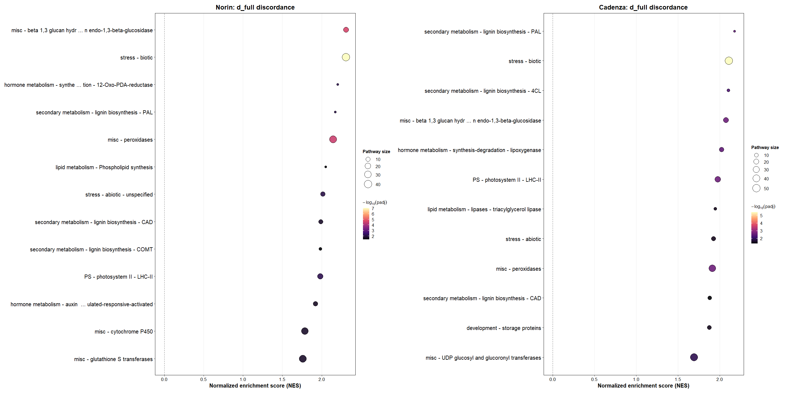
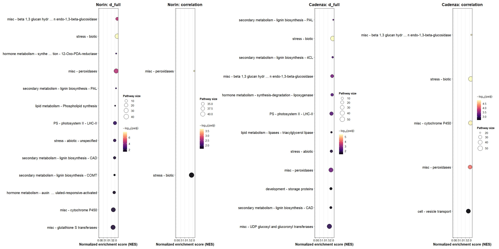
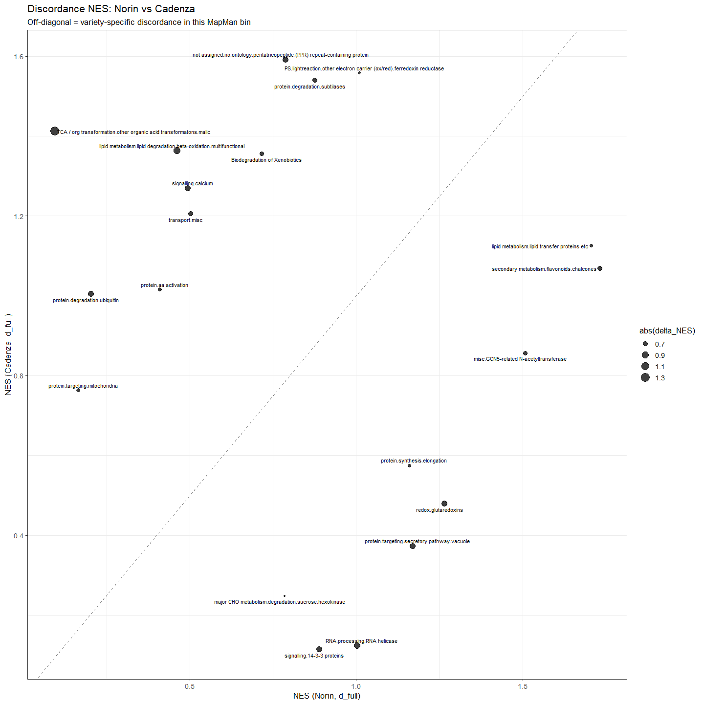

# Functional enrichment (fgsea) of RNA-protein integration statistics
Kristina Gagalova

- [Purpose and scope](#purpose-and-scope)
  - [What this pulls in from
    elsewhere](#what-this-pulls-in-from-elsewhere)
  - [Annotation caveats, established before running
    anything](#annotation-caveats-established-before-running-anything)
- [1. Setup](#setup)
- [2. Annotation universes](#annotation-universes)
  - [2.1 Detected proteome per variety](#detected-proteome-per-variety)
  - [2.2 MapMan/Mercator bins (primary
    vocabulary)](#mapmanmercator-bins-primary-vocabulary)
  - [2.3 GO / Pfam / InterPro (secondary
    vocabulary)](#go-pfam-interpro-secondary-vocabulary)
- [3. Load the integration statistics to rank
  on](#load-the-integration-statistics-to-rank-on)
- [4. E1 – Discordance GSEA: which bins go out of RNA/protein
  sync?](#e1-discordance-gsea-which-bins-go-out-of-rnaprotein-sync)
- [5. E2 – Three-metric decomposition: distance, correlation,
  amplitude](#e2-three-metric-decomposition-distance-correlation-amplitude)
- [6. E3 – Cross-variety differential
  enrichment](#e3-cross-variety-differential-enrichment)
- [7. Not yet wired up here](#not-yet-wired-up-here)
- [8. Outputs](#outputs)

## Purpose and scope

This notebook asks: **do the per-gene statistics already computed
elsewhere in this project (discordance distance, kinetic amplitude,
cross-variety comparison) concentrate in specific functional categories,
more than chance would predict?**

Every other notebook in `analysis/` classifies or ranks genes
individually and then states, explicitly, where individual-gene calls
are unsafe – `kinetics_limited` in `analysis/kinetics_limited`, “not
supported at the individual-gene level” for K5 in
`kinetics_what_we_can_claim.qmd`. Gene-set enrichment is the standard
fix for exactly that gap: aggregate a noisy per-gene statistic over a
functional category and ask whether the *category* moves, which needs
far less per-gene precision than an individual call does.

The method is **not new** – it is the same machinery already used in the
companion project’s variety-level enrichment write-up
(`norinXcadenza-shared/analysis/rnaseq/wheat/Enrichment-varieties.md`):
`fgsea::fgseaMultilevel()` on a ranked statistic, gene sets built with
`check_id_overlap_annotations()` / `make_fgsea_annotation_table()`
(`R/Enrichment.R`, ported verbatim). What is new here is *which*
statistic gets ranked – not DE `t`, but the gene-distance and kinetic
statistics this project’s own pipeline produces.

### What this pulls in from elsewhere

| Source                                                                | What it provides                                                                                                |
|-----------------------------------------------------------------------|-----------------------------------------------------------------------------------------------------------------|
| `data/annotations/*-CS-rbh-final-MAPMAN.tsv.gz`                       | MapMan/Mercator bins (`MapCave.bin.name`), wide format – the primary vocabulary, matching the upstream notebook |
| `data/annotations/*-CS-rbh-final.tsv.gz`                              | GO / Pfam / InterPro, long format – secondary vocabulary, see caveats below                                     |
| `results/gene-distance/{norin,cadenza}_gene_distances_8condition.csv` | `d_full`, `d_pca2`, `d_umap`, `correlation`, `amplitude` per gene (`analysis/gene-distance`)                    |
| `data/real/norin_cadenza_rbh-clean.csv`                               | Direct Norin\<-\>Cadenza reciprocal-best-hit map, for cross-variety comparison                                  |

### Annotation caveats, established before running anything

A profiling pass over these annotation files (done before writing this
notebook) found:

1.  **The detected proteome is the binding constraint.** Norin: 5,879
    quantified proteins, 4,561 annotated. Cadenza: 6,105 quantified,
    5,548 annotated. Every gene set below is built **from the detected
    proteome only**, never the whole genome – an enrichment background
    of “everything IWGSC ever annotated” would just recover “MS detects
    abundant, well-known proteins” (ribosome, Rubisco, glycolysis).
2.  **GO in these files is thin and unpropagated.** Within the Norin
    proteome universe there are only 48 GO:BP terms with \>= 10 genes
    (MF 88, CC 17), and terms are raw InterPro2GO leaves, not
    ancestor-propagated (`GO:0008152     metabolic process` sits
    alongside its own child terms as a direct annotation). GO is kept
    here as a secondary, coarser cross-check only.
3.  **MapMan/Mercator is the primary vocabulary** for exactly this
    reason – it is purpose-built, hand-curated, and richer for wheat
    than raw InterPro2GO. This mirrors the choice already made in the
    companion project’s own enrichment notebook.
4.  **RBH is many-to-many.** 408 of 4,561 Norin proteome genes map to
    more than one CS v2.1 gene (up to 6).
    `check_id_overlap_annotations()` already handles this (the
    `mixed_terms` status), so it is not re-solved here.

------------------------------------------------------------------------

## 1. Setup

``` r
if (!requireNamespace("here", quietly = TRUE)) stop("package 'here' required")

## RENV_PROJECT must be set before sourcing activate.R, or renv treats this
## subdirectory as the project and bootstraps an empty library.
if (file.exists(here::here("renv", "activate.R"))) {
  Sys.setenv(RENV_PROJECT = here::here())
  source(here::here("renv", "activate.R"))
}

source(here::here("R", "utils.R"))
need_pkgs(c("dplyr", "tidyr", "stringr", "tibble", "data.table", "readr",
            "fgsea", "ggplot2", "patchwork", "ggrepel", "BiocParallel"))

library(dplyr)
library(tidyr)
library(stringr)
library(tibble)
library(ggplot2)
library(fgsea)
library(patchwork)

source(here::here("R", "Enrichment.R"))

set.seed(20260825)

ANNO_DIR <- here::here("data", "annotations")
GD_DIR   <- here::here("results", "gene-distance")
REAL_DIR <- here::here("data", "real")

#' Canonical gene-ID normalisation for this notebook.
#'
#' Four ID conventions have to be reconciled here, and they disagree in both
#' CASE and SUFFIX:
#'   proteomics matrices  TraesNOR1A03G00000030            (upper, bare)
#'   MapMan (Norin)       TraesNOR3B03G01717390.1.CDS1     (upper, isoform+CDS)
#'   MapMan (Cadenza)     TraesCAD_scaffold_081796_01G000400.1  (upper, isoform)
#'   gene-distance table  TraesNOR1D03G00570400            (upper, bare)
#'
#' `check_id_overlap_annotations()` lowercases internally, so lowercase is the
#' project-wide join key. EVERY id that participates in a join must go through
#' this function -- normalising only one side is a silent zero-overlap join,
#' which is exactly what produced empty gene sets on the first run.
strip_isoform <- function(x) {
  x <- tolower(x)
  x <- gsub("\\.cds[0-9]+$", "", x)
  x <- gsub("\\.[0-9]+$", "", x)
  x
}

#' Guard against the silent-empty-join failure mode. fgsea returns 0 rows
#' rather than erroring when nothing overlaps, so the check has to be explicit.
assert_overlap <- function(a, b, what) {
  n <- length(intersect(a, b))
  if (n == 0) stop("zero overlap in ", what,
                   " -- check ID normalisation (case / isoform suffix)",
                   call. = FALSE)
  cat(sprintf("%-46s %6d ids overlap\n", what, n))
  invisible(n)
}
```

------------------------------------------------------------------------

## 2. Annotation universes

### 2.1 Detected proteome per variety

The enrichment background throughout this notebook – gene sets are built
*only* from genes actually quantified in the proteomics data, never the
whole genome.

``` r
## strip_isoform() here is what makes the universe join-compatible with the
## annotation tables; without it every downstream %in% silently matches nothing.
read_id_col <- function(path) {
  x <- data.table::fread(path, select = 1L, header = TRUE)
  unique(strip_isoform(x[[1]]))
}

universe <- list(
  norin   = read_id_col(file.path(REAL_DIR, "norin-prot.csv")),
  cadenza = read_id_col(file.path(REAL_DIR, "cadenza-prot.csv"))
)

cat("Norin proteome:   ", length(universe$norin),   "quantified proteins\n")
```

    Norin proteome:    5879 quantified proteins

``` r
cat("Cadenza proteome: ", length(universe$cadenza), "quantified proteins\n")
```

    Cadenza proteome:  6105 quantified proteins

### 2.2 MapMan/Mercator bins (primary vocabulary)

Wide-format annotation, one row per gene, `MapCave.bin.name` carries the
MapMan bin. Gene IDs here carry a `.<isoform>.CDS<n>` suffix that the
upstream `check_id_overlap_annotations()` does not fully strip (it only
removes the `.CDS<n>` part) – so isoform suffixes are stripped
explicitly here first, to match the bare gene IDs used everywhere else
in this project.

``` r
load_mapman <- function(variety) {
  path <- file.path(ANNO_DIR, sprintf("%s-CS-rbh-final-MAPMAN.tsv.gz",
                                       tools::toTitleCase(variety)))
  df <- readr::read_tsv(path, show_col_types = FALSE, progress = FALSE)
  df[[variety]] <- strip_isoform(df[[variety]])
  assert_overlap(df[[variety]], universe[[variety]],
                 sprintf("MapMan x %s proteome", variety))
  df[df[[variety]] %in% universe[[variety]], ]
}

mapman <- list(
  norin   = load_mapman("norin"),
  cadenza = load_mapman("cadenza")
)
```

    MapMan x norin proteome                          4643 ids overlap
    MapMan x cadenza proteome                        4882 ids overlap

``` r
cat("\nNorin MapMan rows restricted to proteome:  ", nrow(mapman$norin), "\n")
```


    Norin MapMan rows restricted to proteome:   6344 

``` r
cat("Cadenza MapMan rows restricted to proteome:", nrow(mapman$cadenza), "\n")
```

    Cadenza MapMan rows restricted to proteome: 5394 

Build the fgsea gene-set table exactly as the upstream notebook does –
`check_id_overlap_annotations()` classifies each gene as `specific` /
`generic` / `mixed_generic` / `mixed_terms` / `non.annotated`, and
`make_fgsea_annotation_table()` collapses that to one `term_for_fgsea`
string per gene, ready to `split()` into pathways.

``` r
build_mapman_annotation_table <- function(variety) {
  genes_df <- tibble(gene_id = universe[[variety]])

  res <- check_id_overlap_annotations(
    ranked_df       = genes_df,
    annotation_df   = mapman[[variety]],
    rank_gene_col   = "gene_id",
    assign_gene_col = variety,
    term_col        = "MapCave.bin.name",
    not_assigned_terms = c("not assigned.unknown", "not assigned.no ontology")
  )

  make_fgsea_annotation_table(res$checked_df, id_col = "gene_id")
}

mapman_anno_table <- list(
  norin   = build_mapman_annotation_table("norin"),
  cadenza = build_mapman_annotation_table("cadenza")
)

lapply(mapman_anno_table, function(x) table(x$status))
```

    $norin

      mixed_terms non.annotated      specific 
                7          2012          3860 

    $cadenza

      mixed_terms non.annotated      specific 
                1          2030          4074 

### 2.3 GO / Pfam / InterPro (secondary vocabulary)

Long format: one row per (gene, annotation-type). Restricted to the
detected proteome, split by `f.type` (and by `f.domain` for Gene
Ontology), each category built into its own set of pathways.

``` r
load_longfmt <- function(variety) {
  path <- file.path(ANNO_DIR, sprintf("%s-CS-rbh-final.tsv.gz",
                                       tools::toTitleCase(variety)))
  dt <- data.table::fread(path, sep = "\t", header = TRUE, quote = "")
  id_col <- variety
  dt[[id_col]] <- strip_isoform(dt[[id_col]])
  assert_overlap(dt[[id_col]], universe[[variety]],
                 sprintf("GO/Pfam/InterPro x %s proteome", variety))
  dt[dt[[id_col]] %in% universe[[variety]]]
}

longfmt <- list(
  norin   = load_longfmt("norin"),
  cadenza = load_longfmt("cadenza")
)
```

    GO/Pfam/InterPro x norin proteome                5242 ids overlap
    GO/Pfam/InterPro x cadenza proteome              5548 ids overlap

``` r
#' Build one fgsea pathway list from the long-format annotation.
#' @param f_type "Pfam", "InterPro", or "Gene Ontology"
#' @param go_domain restrict to a GO domain (BP/MF/CC); ignored otherwise
build_pathways_longfmt <- function(dt, id_col, f_type, go_domain = NULL,
                                    min_size = 5, max_size = 500) {
  sub <- dt[dt$f.type == f_type]
  if (!is.null(go_domain)) sub <- sub[sub$f.domain == go_domain]
  sub <- sub[!is.na(sub$f.name) & sub$f.name != ""]

  label <- ifelse(is.na(sub$f.label) | sub$f.label == "", sub$f.name, sub$f.label)
  prefix <- if (!is.null(go_domain)) sprintf("GO:%s", go_domain) else f_type
  sub$term <- sprintf("%s: %s (%s)", prefix, label, sub$f.name)

  sets <- split(sub[[id_col]], sub$term)
  sets <- lapply(sets, unique)
  sets[lengths(sets) >= min_size & lengths(sets) <= max_size]
}

build_all_longfmt_pathways <- function(variety) {
  dt <- longfmt[[variety]]
  c(
    build_pathways_longfmt(dt, variety, "Pfam"),
    build_pathways_longfmt(dt, variety, "InterPro"),
    build_pathways_longfmt(dt, variety, "Gene Ontology", "BP"),
    build_pathways_longfmt(dt, variety, "Gene Ontology", "MF"),
    build_pathways_longfmt(dt, variety, "Gene Ontology", "CC")
  )
}

longfmt_pathways <- list(
  norin   = build_all_longfmt_pathways("norin"),
  cadenza = build_all_longfmt_pathways("cadenza")
)

cat("Norin:   ", length(longfmt_pathways$norin),   "Pfam/InterPro/GO sets (proteome, size 5-500)\n")
```

    Norin:    1461 Pfam/InterPro/GO sets (proteome, size 5-500)

``` r
cat("Cadenza: ", length(longfmt_pathways$cadenza), "Pfam/InterPro/GO sets (proteome, size 5-500)\n")
```

    Cadenza:  1517 Pfam/InterPro/GO sets (proteome, size 5-500)

------------------------------------------------------------------------

## 3. Load the integration statistics to rank on

`analysis/gene-distance/gene_distance_shared_space.qmd` already
produced, per gene, a shared-space discordance distance (`d_full`,
full-dimensional; `d_pca2`/`d_umap`, low-dimensional), a
total-least-squares `correlation` between the RNA and protein condition
profiles, and an `amplitude` (protein range relative to RNA range).
These are real-data outputs, already on disk – nothing is recomputed
here.

``` r
gene_distance <- list(
  norin   = read.csv(file.path(GD_DIR, "norin_gene_distances_8condition.csv")),
  cadenza = read.csv(file.path(GD_DIR, "cadenza_gene_distances_8condition.csv"))
)

lapply(gene_distance, function(d) { d$gene_id <- strip_isoform(d$gene_id); nrow(d) })
```

    $norin
    [1] 5159

    $cadenza
    [1] 5580

``` r
gene_distance <- lapply(gene_distance, function(d) { d$gene_id <- strip_isoform(d$gene_id); d })

str(gene_distance$norin)
```

    'data.frame':   5159 obs. of  6 variables:
     $ gene_id    : chr  "traesnor1d03g00570400" "traesnor6a03g03297390" "traesnor2b03g00927270" "traesnor2d03g01226140" ...
     $ d_full     : num  15 14.1 14.1 13 12.9 ...
     $ d_pca2     : num  3.89 10.19 9.51 9.85 10.18 ...
     $ d_umap     : num  4.89 4.88 3.99 5.1 11.01 ...
     $ correlation: num  -0.0626 -0.2789 0.2968 -0.1558 0.3194 ...
     $ amplitude  : num  1.426 0.747 3.966 2.569 0.739 ...

------------------------------------------------------------------------

## 4. E1 – Discordance GSEA: which bins go out of RNA/protein sync?

Rank every gene by `d_full` (higher = more discordant) and ask which
MapMan bins sit systematically toward one end of that ranking – no
arbitrary top-decile cutoff, the full ranking is used, exactly as
`fgsea` is designed for.

``` r
#' @param score_type passed to fgsea. "std" for a SIGNED statistic (enrichment
#'   can be at either tail); "pos" for a strictly NON-NEGATIVE one. Getting this
#'   wrong is not cosmetic: with an all-positive statistic under "std", fgsea's
#'   running sum can only ever walk one way, so the two-tailed null it compares
#'   against is the wrong null and the p-values are not interpretable. `d_full`
#'   is a Euclidean distance and so is strictly positive -- it needs "pos".
run_fgsea_on_stat <- function(df, stat_col, pathways, min_size = 5, max_size = 500,
                              score_type = c("std", "pos"), decreasing = TRUE) {
  score_type <- match.arg(score_type)

  ranks <- setNames(df[[stat_col]], df$gene_id)
  ranks <- ranks[is.finite(ranks)]
  ranks <- sort(ranks, decreasing = decreasing)

  assert_overlap(names(ranks), unlist(pathways, use.names = FALSE),
                 sprintf("ranked %s x gene sets", stat_col))

  fgseaMultilevel(
    pathways  = pathways,
    stats     = ranks,
    minSize   = min_size,
    maxSize   = max_size,
    scoreType = score_type,
    nproc     = 1
  )
}

e1_mapman_pathways <- lapply(mapman_anno_table, function(tab) {
  tab <- tab %>% filter(keep_for_fgsea, !is.na(term_for_fgsea))
  sets <- split(tab$gene_ids, tab$term_for_fgsea)
  sets <- lapply(sets, unique)
  sets[lengths(sets) >= 5 & lengths(sets) <= 500]
})

cat("MapMan gene sets (size 5-500) --",
    "Norin:", length(e1_mapman_pathways$norin),
    "| Cadenza:", length(e1_mapman_pathways$cadenza), "\n")
```

    MapMan gene sets (size 5-500) -- Norin: 181 | Cadenza: 185 

``` r
## d_full is a Euclidean distance -> strictly positive -> scoreType "pos".
e1_norin   <- run_fgsea_on_stat(gene_distance$norin,   "d_full", e1_mapman_pathways$norin,
                                score_type = "pos")
```

    ranked d_full x gene sets                        2329 ids overlap

      |                                                                            
      |                                                                      |   0%
      |                                                                            
      |=====                                                                 |   7%
      |                                                                            
      |=========                                                             |  13%
      |                                                                            
      |==============                                                        |  20%
      |                                                                            
      |===================                                                   |  27%
      |                                                                            
      |=======================                                               |  33%
      |                                                                            
      |============================                                          |  40%
      |                                                                            
      |=================================                                     |  47%
      |                                                                            
      |=====================================                                 |  53%
      |                                                                            
      |==========================================                            |  60%
      |                                                                            
      |===============================================                       |  67%
      |                                                                            
      |===================================================                   |  73%
      |                                                                            
      |========================================================              |  80%
      |                                                                            
      |=============================================================         |  87%
      |                                                                            
      |=================================================================     |  93%
      |                                                                            
      |======================================================================| 100%

``` r
e1_cadenza <- run_fgsea_on_stat(gene_distance$cadenza, "d_full", e1_mapman_pathways$cadenza,
                                score_type = "pos")
```

    ranked d_full x gene sets                        2553 ids overlap

      |                                                                            
      |                                                                      |   0%
      |                                                                            
      |====                                                                  |   6%
      |                                                                            
      |=========                                                             |  12%
      |                                                                            
      |=============                                                         |  19%
      |                                                                            
      |==================                                                    |  25%
      |                                                                            
      |======================                                                |  31%
      |                                                                            
      |==========================                                            |  38%
      |                                                                            
      |===============================                                       |  44%
      |                                                                            
      |===================================                                   |  50%
      |                                                                            
      |=======================================                               |  56%
      |                                                                            
      |============================================                          |  62%
      |                                                                            
      |================================================                      |  69%
      |                                                                            
      |====================================================                  |  75%
      |                                                                            
      |=========================================================             |  81%
      |                                                                            
      |=============================================================         |  88%
      |                                                                            
      |==================================================================    |  94%
      |                                                                            
      |======================================================================| 100%

``` r
e1_plots <- list(
  Norin   = plot_fgsea_bubble(e1_norin,   top_n = 25, plot_title = "Norin: d_full discordance"),
  Cadenza = plot_fgsea_bubble(e1_cadenza, top_n = 25, plot_title = "Cadenza: d_full discordance")
)
```


    ==============================

    Plot: Norin: d_full discordance

    Initial fgsea rows: 168

    Columns: pathway, pval, padj, log2err, ES, NES, size, leadingEdge

    Rows before padj filter: 168

    padj cutoff: 0.05

    Rows passing padj cutoff: 13

    padj summary:

         Min.   1st Qu.    Median      Mean   3rd Qu.      Max. 
    0.0000001 0.7514304 0.9745709 0.8168770 1.0000000 1.0000000 

    Rows after top_n filter: 13

    Building plot now.


    ==============================

    Plot: Cadenza: d_full discordance

    Initial fgsea rows: 174

    Columns: pathway, pval, padj, log2err, ES, NES, size, leadingEdge

    Rows before padj filter: 174

    padj cutoff: 0.05

    Rows passing padj cutoff: 12

    padj summary:

         Min.   1st Qu.    Median      Mean   3rd Qu.      Max. 
    0.0000038 0.6257742 1.0000000 0.7817797 1.0000000 1.0000000 

    Rows after top_n filter: 12

    Building plot now.

``` r
e1_plots <- Filter(Negate(is.null), e1_plots)
if (length(e1_plots) > 0) Reduce(`|`, e1_plots)
```



------------------------------------------------------------------------

## 5. E2 – Three-metric decomposition: distance, correlation, amplitude

`d_full` alone conflates two different failure modes: a gene can be far
in shared space because its RNA and protein *shapes* differ (low
correlation – lag/timing mismatch) or because the shapes agree but the
*scale* differs (high correlation, extreme amplitude –
buffering/amplification). Running `fgsea` on each statistic separately
is the direct way to ask which bins drive which failure mode.

Reading the three together is the point: a bin that is high on `d_full`
**and** low on `correlation` is going out of sync in *timing*; a bin
high on `d_full` but with correlation intact and `log2_amplitude`
displaced is going out of sync in *magnitude* – which is the
buffered/amplified axis the kinetic model in `analysis/kinetics_limited`
estimates per gene, reached here at category level where the per-gene
call is not safe.

``` r
## `amplitude` is a RATIO of protein to RNA response range: 1 = matched, <1
## buffered, >1 amplified. On the raw scale it is positive and multiplicatively
## symmetric around 1, so a rank on it is dominated by the amplified tail and
## compresses the buffered half into (0, 1). log2 puts buffering and
## amplification on symmetric, additive footing around 0 -- the same axis the
## kinetic model's `a` uses -- and makes scoreType "std" the correct choice.
gene_distance <- lapply(gene_distance, function(d) {
  d$log2_amplitude <- log2(d$amplitude)
  d
})
```

    Warning in FUN(X[[i]], ...): NaNs produced
    Warning in FUN(X[[i]], ...): NaNs produced

``` r
## Signed statistics take "std"; the strictly-positive distance takes "pos".
e2_spec <- list(
  d_full         = "pos",
  correlation    = "std",
  log2_amplitude = "std"
)

e2_results <- lapply(names(gene_distance), function(v) {
  lapply(names(e2_spec), function(s) {
    run_fgsea_on_stat(gene_distance[[v]], s, e1_mapman_pathways[[v]],
                      score_type = e2_spec[[s]])
  }) |> setNames(names(e2_spec))
})
```

    ranked d_full x gene sets                        2329 ids overlap

      |                                                                            
      |                                                                      |   0%
      |                                                                            
      |=====                                                                 |   8%
      |                                                                            
      |===========                                                           |  15%
      |                                                                            
      |================                                                      |  23%
      |                                                                            
      |======================                                                |  31%
      |                                                                            
      |===========================                                           |  38%
      |                                                                            
      |================================                                      |  46%
      |                                                                            
      |======================================                                |  54%
      |                                                                            
      |===========================================                           |  62%
      |                                                                            
      |================================================                      |  69%
      |                                                                            
      |======================================================                |  77%
      |                                                                            
      |===========================================================           |  85%
      |                                                                            
      |=================================================================     |  92%
      |                                                                            
      |======================================================================| 100%

    ranked correlation x gene sets                   2329 ids overlap

      |                                                                            
      |                                                                      |   0%
      |                                                                            
      |====                                                                  |   6%
      |                                                                            
      |========                                                              |  12%
      |                                                                            
      |============                                                          |  18%
      |                                                                            
      |================                                                      |  24%
      |                                                                            
      |=====================                                                 |  29%
      |                                                                            
      |=========================                                             |  35%
      |                                                                            
      |=============================                                         |  41%
      |                                                                            
      |=================================                                     |  47%
      |                                                                            
      |=====================================                                 |  53%
      |                                                                            
      |=========================================                             |  59%
      |                                                                            
      |=============================================                         |  65%
      |                                                                            
      |=================================================                     |  71%
      |                                                                            
      |======================================================                |  76%
      |                                                                            
      |==========================================================            |  82%
      |                                                                            
      |==============================================================        |  88%
      |                                                                            
      |==================================================================    |  94%
      |                                                                            
      |======================================================================| 100%

    ranked log2_amplitude x gene sets                 904 ids overlap

      |                                                                            
      |                                                                      |   0%
      |                                                                            
      |=======================                                               |  33%
      |                                                                            
      |===============================================                       |  67%
      |                                                                            
      |======================================================================| 100%

    ranked d_full x gene sets                        2553 ids overlap

      |                                                                            
      |                                                                      |   0%
      |                                                                            
      |=====                                                                 |   7%
      |                                                                            
      |==========                                                            |  14%
      |                                                                            
      |===============                                                       |  21%
      |                                                                            
      |====================                                                  |  29%
      |                                                                            
      |=========================                                             |  36%
      |                                                                            
      |==============================                                        |  43%
      |                                                                            
      |===================================                                   |  50%
      |                                                                            
      |========================================                              |  57%
      |                                                                            
      |=============================================                         |  64%
      |                                                                            
      |==================================================                    |  71%
      |                                                                            
      |=======================================================               |  79%
      |                                                                            
      |============================================================          |  86%
      |                                                                            
      |=================================================================     |  93%
      |                                                                            
      |======================================================================| 100%

    ranked correlation x gene sets                   2553 ids overlap

      |                                                                            
      |                                                                      |   0%
      |                                                                            
      |=====                                                                 |   7%
      |                                                                            
      |=========                                                             |  13%
      |                                                                            
      |==============                                                        |  20%
      |                                                                            
      |===================                                                   |  27%
      |                                                                            
      |=======================                                               |  33%
      |                                                                            
      |============================                                          |  40%
      |                                                                            
      |=================================                                     |  47%
      |                                                                            
      |=====================================                                 |  53%
      |                                                                            
      |==========================================                            |  60%
      |                                                                            
      |===============================================                       |  67%
      |                                                                            
      |===================================================                   |  73%
      |                                                                            
      |========================================================              |  80%
      |                                                                            
      |=============================================================         |  87%
      |                                                                            
      |=================================================================     |  93%
      |                                                                            
      |======================================================================| 100%

    ranked log2_amplitude x gene sets                1118 ids overlap

      |                                                                            
      |                                                                      |   0%
      |                                                                            
      |==========                                                            |  14%
      |                                                                            
      |====================                                                  |  29%
      |                                                                            
      |==============================                                        |  43%
      |                                                                            
      |========================================                              |  57%
      |                                                                            
      |==================================================                    |  71%
      |                                                                            
      |============================================================          |  86%
      |                                                                            
      |======================================================================| 100%

``` r
names(e2_results) <- names(gene_distance)
e2_stats <- names(e2_spec)
```

``` r
e2_plots <- lapply(names(e2_results), function(v) {
  lapply(e2_stats, function(s) {
    plot_fgsea_bubble(e2_results[[v]][[s]], top_n = 15,
                      plot_title = sprintf("%s: %s", tools::toTitleCase(v), s))
  })
})
```


    ==============================

    Plot: Norin: d_full

    Initial fgsea rows: 168

    Columns: pathway, pval, padj, log2err, ES, NES, size, leadingEdge

    Rows before padj filter: 168

    padj cutoff: 0.05

    Rows passing padj cutoff: 13

    padj summary:

       Min. 1st Qu.  Median    Mean 3rd Qu.    Max. 
     0.0000  0.7845  1.0000  0.8170  1.0000  1.0000 

    Rows after top_n filter: 13

    Building plot now.


    ==============================

    Plot: Norin: correlation

    Initial fgsea rows: 168

    Columns: pathway, pval, padj, log2err, ES, NES, size, leadingEdge

    Rows before padj filter: 168

    padj cutoff: 0.05

    Rows passing padj cutoff: 2

    padj summary:

         Min.   1st Qu.    Median      Mean   3rd Qu.      Max. 
    0.0001983 0.5303496 0.8064860 0.7246375 0.9842897 1.0000000 

    Rows after top_n filter: 2

    Building plot now.


    ==============================

    Plot: Norin: log2_amplitude

    Initial fgsea rows: 64

    Columns: pathway, pval, padj, log2err, ES, NES, size, leadingEdge

    Rows before padj filter: 64

    padj cutoff: 0.05

    Rows passing padj cutoff: 0

    padj summary:

       Min. 1st Qu.  Median    Mean 3rd Qu.    Max. 
     0.3917  0.9083  0.9624  0.9107  0.9624  0.9881 

    Stopping: no rows left after padj filter for plot: Norin: log2_amplitude


    ==============================

    Plot: Cadenza: d_full

    Initial fgsea rows: 174

    Columns: pathway, pval, padj, log2err, ES, NES, size, leadingEdge

    Rows before padj filter: 174

    padj cutoff: 0.05

    Rows passing padj cutoff: 12

    padj summary:

        Min.  1st Qu.   Median     Mean  3rd Qu.     Max. 
    0.000003 0.638622 1.000000 0.790689 1.000000 1.000000 

    Rows after top_n filter: 12

    Building plot now.


    ==============================

    Plot: Cadenza: correlation

    Initial fgsea rows: 174

    Columns: pathway, pval, padj, log2err, ES, NES, size, leadingEdge

    Rows before padj filter: 174

    padj cutoff: 0.05

    Rows passing padj cutoff: 5

    padj summary:

         Min.   1st Qu.    Median      Mean   3rd Qu.      Max. 
    0.0000124 0.5128476 0.7632185 0.7014487 0.9808462 1.0000000 

    Rows after top_n filter: 5

    Building plot now.


    ==============================

    Plot: Cadenza: log2_amplitude

    Initial fgsea rows: 79

    Columns: pathway, pval, padj, log2err, ES, NES, size, leadingEdge

    Rows before padj filter: 79

    padj cutoff: 0.05

    Rows passing padj cutoff: 0

    padj summary:

       Min. 1st Qu.  Median    Mean 3rd Qu.    Max. 
     0.2379  0.6456  0.8243  0.7968  0.9859  0.9912 

    Stopping: no rows left after padj filter for plot: Cadenza: log2_amplitude

``` r
names(e2_plots) <- names(e2_results)

e2_plots_flat <- Filter(Negate(is.null), unlist(e2_plots, recursive = FALSE))
if (length(e2_plots_flat) > 0) Reduce(`|`, e2_plots_flat)
```



------------------------------------------------------------------------

## 6. E3 – Cross-variety differential enrichment

Join the two varieties’ `d_full` rankings on the direct
Norin\<-\>Cadenza reciprocal-best-hit map
(`data/real/norin_cadenza_rbh-clean.csv`) and compare NES for each
MapMan bin between varieties – which functional categories are
discordant in one variety but not the other.

``` r
rbh_nc <- read.csv(file.path(REAL_DIR, "norin_cadenza_rbh-clean.csv"))
rbh_nc$query  <- strip_isoform(rbh_nc$query)
rbh_nc$target <- strip_isoform(rbh_nc$target)

cat("Norin<->Cadenza 1:1 RBH pairs:", nrow(distinct(rbh_nc, query, target)), "\n")
```

    Norin<->Cadenza 1:1 RBH pairs: 105305 

``` r
e3_table <- function(res, label) {
  as.data.frame(res) %>%
    transmute(pathway, NES, padj, size) %>%
    rename_with(~ paste0(., "_", label), c(NES, padj, size))
}

e3_compare <- full_join(
  e3_table(e1_norin,   "norin"),
  e3_table(e1_cadenza, "cadenza"),
  by = "pathway"
) %>%
  mutate(delta_NES = NES_norin - NES_cadenza) %>%
  arrange(desc(abs(delta_NES)))

head(e3_compare, 20)
```

                                                                          pathway
    1            TCA / org transformation.other organic acid transformatons.malic
    2           lipid metabolism.lipid degradation.beta-oxidation.multifunctional
    3                                                 RNA.processing.RNA helicase
    4  not assigned.no ontology.pentatricopeptide (PPR) repeat-containing protein
    5                                               protein.degradation.ubiquitin
    6                                 protein.targeting.secretory pathway.vacuole
    7                                                         redox.glutaredoxins
    8                                                  signalling.14-3-3 proteins
    9                                                          signalling.calcium
    10                                                             transport.misc
    11                                  secondary metabolism.flavonoids.chalcones
    12                                             protein.degradation.subtilases
    13                                      misc.GCN5-related N-acetyltransferase
    14                                              Biodegradation of Xenobiotics
    15                                                      protein.aa activation
    16                                             protein.targeting.mitochondria
    17                                               protein.synthesis.elongation
    18                               lipid metabolism.lipid transfer proteins etc
    19      PS.lightreaction.other electron carrier (ox/red).ferredoxin reductase
    20                        major CHO metabolism.degradation.sucrose.hexokinase
        NES_norin padj_norin size_norin NES_cadenza padj_cadenza size_cadenza
    1  0.09493277  1.0000000          5   1.4121144    0.5765941            6
    2  0.46172328  1.0000000          5   1.3632915    0.6562825            5
    3  1.00211858  0.9745709         13   0.1234327    1.0000000            9
    4  0.78786357  1.0000000         17   1.5913407    0.1503451           24
    5  0.20393630  1.0000000         16   1.0041455    1.0000000           17
    6  1.17060334  0.9149560          8   0.3728444    1.0000000            9
    7  1.26519498  0.8760839          8   0.4789188    1.0000000            9
    8  0.88963866  1.0000000          7   0.1135658    1.0000000            6
    9  0.49392343  1.0000000         27   1.2694567    0.6257742           31
    10 0.50363990  1.0000000         10   1.2048679    0.8053946           12
    11 1.73194472  0.3356643          5   1.0685887    1.0000000            7
    12 0.87644287  1.0000000         10   1.5393888    0.3786927           10
    13 1.50717655  0.5574426          8   0.8564641    1.0000000           10
    14 0.71653917  1.0000000          8   1.3554760    0.6257742           10
    15 0.41133802  1.0000000          6   1.0155859    1.0000000            5
    16 0.16561930  1.0000000         22   0.7628530    1.0000000           23
    17 1.15972858  0.8898272         21   0.5748263    1.0000000           23
    18 1.70585695  0.3183800          7   1.1253271    0.9826973            6
    19 1.01013989  0.9745709          6   1.5579368    0.3786927            7
    20 0.78577370  1.0000000          6   0.2474968    1.0000000            6
        delta_NES
    1  -1.3171816
    2  -0.9015682
    3   0.8786859
    4  -0.8034771
    5  -0.8002092
    6   0.7977589
    7   0.7862762
    8   0.7760728
    9  -0.7755333
    10 -0.7012280
    11  0.6633560
    12 -0.6629460
    13  0.6507124
    14 -0.6389368
    15 -0.6042479
    16 -0.5972337
    17  0.5849023
    18  0.5805299
    19 -0.5477969
    20  0.5382769

``` r
e3_top <- e3_compare %>%
  filter(!is.na(delta_NES)) %>%
  slice_max(abs(delta_NES), n = 20)

if (nrow(e3_top) > 0) {
  ggplot(e3_top, aes(x = NES_norin, y = NES_cadenza)) +
    geom_abline(slope = 1, intercept = 0, linetype = "dashed", color = "grey50") +
    geom_point(aes(size = abs(delta_NES)), alpha = 0.75) +
    ggrepel::geom_text_repel(aes(label = pathway), size = 3, max.overlaps = 15) +
    theme_bw(base_size = 13) +
    labs(title = "Discordance NES: Norin vs Cadenza",
         subtitle = "Off-diagonal = variety-specific discordance in this MapMan bin",
         x = "NES (Norin, d_full)", y = "NES (Cadenza, d_full)")
}
```



------------------------------------------------------------------------

## 7. Not yet wired up here

Two items from the enrichment-extension catalogue are deliberately
**not** implemented in this pass, because the inputs they need do not
exist on disk yet – rather than fake them, they are listed here as the
next step.

- **Kinetic archetype / amplitude enrichment** (rank by `log2(a)` or
  `t_half`, or ORA on archetype membership).
  `analysis/kinetics_limited/de_proteomics_wheat.qmd` computes archetype
  classification and per-gene amplitude `a_hat` for the real wheat data
  (482/431 amplified, 1278/978 concordant, etc. – Cadenza/Norin), but
  classifies **inline in that notebook’s own session** and never writes
  an `archetypes.tsv` for real data (unlike the simulated pipeline’s
  `R/05_concordance_archetypes.R`, which does). Before A1/A4 from the
  catalogue can run here, that classification block needs factoring out
  into a function that writes
  `results/kinetics/archetypes_{norin,cadenza}.tsv`.
- **Per-condition discordance heatmap** (8 separate rankings, one per
  treatment x timepoint cell, MapMan bins x cells). The saved
  `*_gene_distances_8condition.csv` files carry only the *aggregate*
  `d_full`/`correlation`/`amplitude` per gene, not the per-condition
  contribution to that distance – that decomposition exists only inside
  `gene_distance_shared_space.qmd` §8b/V3c (in-session, not saved).
  Needs a `results/gene-distance/*_per_condition_contrib.csv` export
  from that notebook first.

------------------------------------------------------------------------

## 8. Outputs

``` r
outdir <- here::here("results", "enrichment")
ensure_dir(outdir)
```

    [1] "C:/Claude/Projects/IntegrateProtRNA/results/enrichment"

``` r
save_fgsea <- function(res, path) {
  df <- as.data.frame(res)
  df[] <- lapply(df, function(x) if (is.list(x)) sapply(x, paste, collapse = ";") else x)
  write.table(df, path, sep = "\t", row.names = FALSE, quote = FALSE)
}

save_fgsea(e1_norin,   file.path(outdir, "E1_discordance_mapman_norin.tsv"))
save_fgsea(e1_cadenza, file.path(outdir, "E1_discordance_mapman_cadenza.tsv"))
write.table(e3_compare, file.path(outdir, "E3_cross_variety_discordance.tsv"),
            sep = "\t", row.names = FALSE, quote = FALSE)

list.files(outdir)
```

    [1] "E1_discordance_mapman_cadenza.tsv" "E1_discordance_mapman_norin.tsv"  
    [3] "E3_cross_variety_discordance.tsv" 
