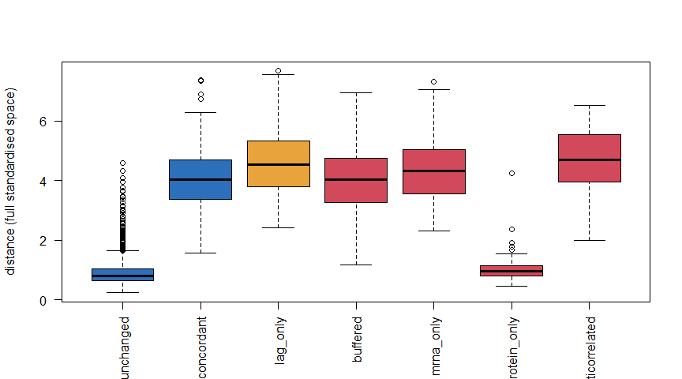
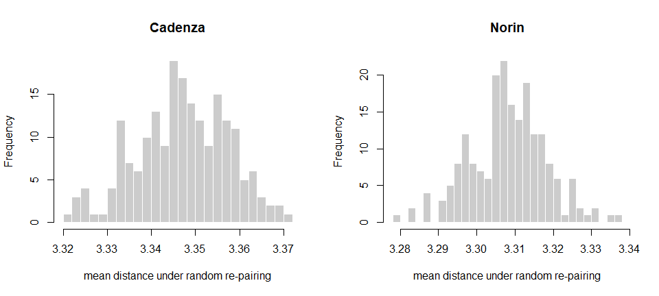

# RNA-protein condition-profile distance — can genes be ranked by
discordance?
Kristina Gagalova

- [Purpose and scope](#purpose-and-scope)
  - [Relationship to the existing Python
    work](#relationship-to-the-existing-python-work)
- [Analysis outline](#analysis-outline)
- [1. Setup](#setup)
- [2. The method and its assumptions](#the-method-and-its-assumptions)
  - [Assumptions, stated up front](#assumptions-stated-up-front)
- [3. Implementation](#implementation)
- [4. G1 — Does distance separate the true
  archetypes?](#g1-does-distance-separate-the-true-archetypes)
- [5. G2 — Full space vs 2D embedding](#g2-full-space-vs-2d-embedding)
- [6. G3 — Permutation null on real
  data](#g3-permutation-null-on-real-data)
- [7. G4 — Replicate-level stability](#g4-replicate-level-stability)
- [8. Apply to real data](#apply-to-real-data)
- [9. Assumption validation summary](#assumption-validation-summary)
- [10. What is safe to claim](#what-is-safe-to-claim)
  - [✅ Safe to claim](#safe-to-claim)
  - [❌ Not supported](#not-supported)
  - [The one-paragraph version](#the-one-paragraph-version)
  - [What would strengthen this](#what-would-strengthen-this)
- [References](#references)

## Purpose and scope

This notebook asks a question distinct from anything in
`analysis/kinetics_limited` or `analysis/dimensionality-reduction`:

> **For an individual gene, does its protein’s condition-response
> profile look like its RNA’s condition-response profile — and can that
> resemblance be turned into a per-gene distance that ranks genes by
> RNA/protein discordance?**

`kinetics_limited` tests a *mechanistic* null (first-order kinetics) per
gene. `dimensionality-reduction` asks whether RNA predicts protein *in
aggregate*, across all genes at once. This notebook asks a *geometric*
question per gene: place each gene’s RNA profile and its own protein
profile as two points in a shared coordinate system built from the
population’s dominant response shapes, and measure how far apart they
land.

### Relationship to the existing Python work

Two notebooks in `KristinaGagalova/autoencoders-test` motivate this:

**`rna_protein_unpaired_per_variety.ipynb`** is a thin driver over
`rnaprot/unpaired_reviewer.py` (a revised module – not the `unpaired.py`
referenced in `dimensionality_reduction_wheat.qmd`; the two have
different loss weights, 3.0/0.75 here vs 2.0/0.5 there). It re-runs
essentially the same leave-condition-out comparison (mean, design,
cognate ridge, PCA+ridge, PLS, design-residualised variants,
condition-aligned AE) already built in this repository’s
`dimensionality_reduction_wheat.qmd` §7 (D4) and §7b (D7). Two things in
it are genuinely different from what is already here, and are picked up
as an addendum (**D8**) in that notebook rather than duplicated
wholesale in a second ~40-chunk document:

1.  Feature selection is done **inside each outer CV fold**, not once
    globally before the loop – D4/D7 currently select the top-variable
    genes once, which is a selection-leakage risk.
2.  A permutation null (`N_PERM=200`) is applied to the PCA/PLS/design
    baselines (not to the autoencoder).

See `dimensionality_reduction_wheat.qmd` §7c for that check. This
document does not repeat D4/D7.

**`rna_protein_umap_shared_space.ipynb`** is the actual source of the
“distance between genes” idea, and *is* new work relative to everything
else in this repository. It builds condition-mean profiles for RNA and
for cognate proteins, fits a shared coordinate system (PCA or UMAP) on
the RNA profiles only, projects the protein profiles into that same
system, and measures the Euclidean distance between a gene’s RNA point
and its own protein point. Two things about it matter for how it is
ported here:

1.  **Its own synthetic validation found that 2D UMAP hurts the
    ranking**: distance-to-truth-divergence correlation was Spearman
    $\rho = 0.923$ in the full aligned input space, but only
    $\rho = 0.713$ after compressing to a 2D UMAP embedding. That is
    carried over below as a **hypothesis to test on this project’s own
    ground truth**, not assumed.
2.  **It was never actually run to completion on real data.** The
    real-data cells stop at the visualization step; no per-gene distance
    table or ranking exists for Cadenza or Norin. Building that is the
    new work in §6-§8 below.

------------------------------------------------------------------------

## Analysis outline

| Step | What                                           | Why                                                       |
|:-----|:-----------------------------------------------|:----------------------------------------------------------|
| §1   | Setup and data (real + simulated)              | Validate on known ground truth before touching real data  |
| §2   | The method and its assumptions                 | Each with references                                      |
| §3   | Implementation                                 | Shared-space construction, from scratch                   |
| §4   | **G1** Does distance separate true archetypes? | Validation against `truth.tsv`, incl. the `lag_only` trap |
| §5   | **G2** Full space vs 2D embedding              | Replicates the source notebook’s own finding, on our data |
| §6   | **G3** Permutation null on real data           | No ground truth on real data – this substitutes for it    |
| §7   | **G4** Replicate-level stability               | Bootstrap over which replicates feed the condition means  |
| §8   | Apply to real data                             | Per-gene distance tables, Cadenza and Norin               |
| §9   | Assumption validation summary                  |                                                           |
| §10  | What is safe to claim                          |                                                           |

------------------------------------------------------------------------

## 1. Setup

``` r
if (!requireNamespace("here", quietly = TRUE)) stop("package 'here' required")

## RENV_PROJECT must be set before sourcing activate.R, or renv treats this
## subdirectory as the project and bootstraps an empty library.
if (file.exists(here::here("renv", "activate.R"))) {
  Sys.setenv(RENV_PROJECT = here::here())
  source(here::here("renv", "activate.R"))
}

source(here::here("R", "utils.R"))
source(here::here("R", "wheat_pipeline.R"))
need_pkgs(c("limma", "edgeR", "DESeq2", "matrixStats", "impute", "uwot", "yaml"))

set.seed(20260823)
```

``` r
DESIGN <- wheat_design()
cad <- prepare_variety("cadenza", DESIGN)
```

    Cluster size 5861 broken into 3622 2239 
    Cluster size 3622 broken into 2430 1192 
    Cluster size 2430 broken into 1561 869 
    Cluster size 1561 broken into 819 742 
    Done cluster 819 
    Done cluster 742 
    Done cluster 1561 
    Done cluster 869 
    Done cluster 2430 
    Done cluster 1192 
    Done cluster 3622 
    Cluster size 2239 broken into 1075 1164 
    Done cluster 1075 
    Done cluster 1164 
    Done cluster 2239 

``` r
nor <- prepare_variety("norin",   DESIGN)
```

    Cluster size 5641 broken into 1939 3702 
    Cluster size 1939 broken into 1030 909 
    Done cluster 1030 
    Done cluster 909 
    Done cluster 1939 
    Cluster size 3702 broken into 2489 1213 
    Cluster size 2489 broken into 838 1651 
    Done cluster 838 
    Cluster size 1651 broken into 941 710 
    Done cluster 941 
    Done cluster 710 
    Done cluster 1651 
    Done cluster 2489 
    Done cluster 1213 
    Done cluster 3702 

``` r
REAL <- list(Cadenza = cad, Norin = nor)
```

``` r
#' Loader for the project's own Case B ground-truth simulator
#' (`R/00_simulate_data.R`), parallel to `load_variety()` in
#' `wheat_pipeline.R` but pointed at `data/simulated` and its different file
#' layout. This gives archetype-labelled truth to validate the distance
#' metric against, before it is trusted on real data -- the same validate-
#' on-simulation-first discipline used for the rest of this pipeline.
load_simulated <- function(cfg, data_dir = here::here("data", "simulated")) {

  rna_counts <- as.matrix(read.delim(file.path(data_dir, "rna_counts.tsv"),
                                     row.names = 1, check.names = FALSE))
  prot_int   <- as.matrix(read.delim(file.path(data_dir, "protein_intensities.tsv"),
                                     row.names = 1, check.names = FALSE))
  rna_meta   <- read.delim(file.path(data_dir, "rna_coldata.tsv"),
                           row.names = "sample_id", stringsAsFactors = FALSE)
  prot_meta  <- read.delim(file.path(data_dir, "protein_coldata.tsv"),
                           row.names = "sample_id", stringsAsFactors = FALSE)
  truth <- read.delim(file.path(data_dir, "truth.tsv"), stringsAsFactors = FALSE)
  gmap  <- read.delim(file.path(data_dir, "truth_gene_group_map.tsv"),
                      stringsAsFactors = FALSE)

  lv <- cell_levels(cfg)
  rna_meta$cell  <- factor(rna_meta$cell,  levels = lv)
  prot_meta$cell <- factor(prot_meta$cell, levels = lv)

  design <- list(treatments = cfg$design$treatments,
                timepoints = cfg$design$timepoints,
                n_reps     = cfg$design$n_reps)

  list(rna  = rna_counts[, rownames(rna_meta), drop = FALSE],
       prot = prot_int[,  rownames(prot_meta), drop = FALSE],
       rna_meta = rna_meta, prot_meta = prot_meta,
       design = design, truth = truth, gmap = gmap)
}

sim_cfg <- load_config(here::here("config", "config.yaml"))
sim_raw <- load_simulated(sim_cfg)

sim_qc <- local({
  qr <- run_qc_rna(sim_raw$rna, sim_raw$rna_meta, sim_raw$design)
  qp <- run_qc_prot(sim_raw$prot, sim_raw$prot_meta)
  mi <- run_missingness(qp$norm, sim_raw$prot_meta)
  list(vst = qr$vst, prot = mi$mixed)
})
```

    Warning in run_qc_prot(sim_raw$prot, sim_raw$prot_meta): NaNs produced

    Cluster size 1781 broken into 663 1118 
    Done cluster 663 
    Done cluster 1118 

``` r
cat("Simulated genes after RNA QC:   ", nrow(sim_qc$vst),  "\n")
```

    Simulated genes after RNA QC:    4000 

``` r
cat("Simulated groups after prot QC: ", nrow(sim_qc$prot), "\n")
```

    Simulated groups after prot QC:  1781 

------------------------------------------------------------------------

## 2. The method and its assumptions

For each gene present in both layers:

1.  Take its **condition-mean profile** in each layer separately (8
    treatment x timepoint cells) – the only aggregation licensed under
    Case B, per `dimensionality_reduction_wheat.qmd` §7b (D7).
2.  **Row-centre** each profile (subtract the gene’s own
    across-condition mean). This compares response *shape*, not absolute
    level – required regardless of Case B, since RNA (VST) and protein
    (log2 intensity) are on incommensurable physical scales to begin
    with.
3.  **Standardise per condition** (z-score each of the 8 condition
    columns across genes), fit on the RNA block only, and apply the same
    transform to protein. This matches the source notebook’s
    `StandardScaler().fit(Xr)` step.
4.  Fit **PCA on the RNA profiles only** (their dominant shapes of
    response across the gene population), and project the protein
    profiles into that same space with no refitting.
5.  **Distance** = Euclidean distance between a gene’s transformed RNA
    point and its own transformed protein point – computed in the full
    standardised space, in the top-2 PCA components, and in a 2D UMAP
    embedding fit on RNA and transformed for protein.

### Assumptions, stated up front

| \#  | Assumption                                                                               | Status                                                                     |
|:----|:-----------------------------------------------------------------------------------------|:---------------------------------------------------------------------------|
| A1  | The RNA\<-\>protein correspondence used is genuinely 1:1 for the genes scored            | Enforced by construction (see §4); ambiguous groups excluded               |
| A2  | Condition means are the right granularity for a cross-block comparison                   | Carried over from D7, not re-derived here                                  |
| A3  | Comparing row-centred *shape*, not absolute level, is the right notion of “look alike”   | Design choice, stated not tested                                           |
| A4  | Distance in the full standardised space is more informative than in a 2D embedding       | **Tested in G2**, not assumed                                              |
| A5  | A short Euclidean distance means concordant regulation, not just similar kinetics/timing | **Tested in G1** – this is where `lag_only` genes are the adversarial case |

McInnes, Healy, and Melville (2018) and Becht et al. (2019) are the
basis for A4: UMAP is explicitly designed to preserve local
neighbourhood structure, not global pairwise distances, so a 2D UMAP
distance between two specific, possibly-distant points is not guaranteed
to track their true distance in the original space – exactly the
degradation the source notebook’s own synthetic check already found
($\rho$ 0.923 to 0.713).

------------------------------------------------------------------------

## 3. Implementation

``` r
#' Per-gene shape: subtract the gene's own across-condition mean.
row_center <- function(M) M - rowMeans(M)

#' Fit a per-column (per-condition) z-scorer on one matrix, return a function
#' that applies it to any matrix with the same columns. Fit on RNA only, per
#' the source notebook.
fit_col_scaler <- function(M) {
  mu  <- colMeans(M)
  sdv <- apply(M, 2, sd); sdv[sdv < 1e-8] <- 1
  function(X) sweep(sweep(X, 2, mu, "-"), 2, sdv, "/")
}

#' Build the shared space: row-centre, z-score on RNA's column moments, PCA
#' fit on RNA only. Returns the standardised profiles (full-space distance
#' needs nothing else, since the PCA rotation below is orthonormal and
#' therefore distance-preserving) and their PCA scores (for the 2D check).
build_shared_space <- function(R_cond, P_cond) {
  stopifnot(identical(rownames(R_cond), rownames(P_cond)))
  scaler <- fit_col_scaler(row_center(R_cond))
  Rs <- scaler(row_center(R_cond))
  Ps <- scaler(row_center(P_cond))

  sv <- svd(Rs)
  list(Rs = Rs, Ps = Ps,
       Zr = Rs %*% sv$v, Zp = Ps %*% sv$v,
       var_explained = sv$d^2 / sum(sv$d^2))
}

euclid <- function(A, B, k = NULL) {
  if (!is.null(k)) { A <- A[, seq_len(k), drop = FALSE]; B <- B[, seq_len(k), drop = FALSE] }
  sqrt(rowSums((A - B)^2))
}

#' UMAP fit on RNA, protein transformed into the same embedding -- matching
#' the source notebook's asymmetric fit/transform (never a joint/symmetric
#' fit, which would let protein leak into the axes it is being scored against).
umap_distance <- function(Rs, Ps, seed = 1) {
  nn <- max(2, min(15, nrow(Rs) %/% 4))
  set.seed(seed)
  fit <- uwot::umap(Rs, n_neighbors = nn, min_dist = 0.10, n_components = 2,
                    metric = "euclidean", ret_model = TRUE)
  Ep <- uwot::umap_transform(Ps, fit)
  sqrt(rowSums((fit$embedding - Ep)^2))
}
```

------------------------------------------------------------------------

## 4. G1 — Does distance separate the true archetypes?

The simulator’s `truth.tsv` labels every gene with the *mechanism* that
generated it: `unchanged`, `concordant`, `buffered`, `mrna_only`,
`protein_only`, `anticorrelated`, `lag_only`. None of that label is used
to build the distance metric – it is used only to grade it afterwards.

`lag_only` is the adversarial case, carried over from the kinetics
notebooks: it is **mechanistically fully concordant** (protein is driven
purely by RNA, first-order kinetics, `A2` holds exactly) but has a
**slow protein half-life**, so its condition-profile *shape* lags the
RNA shape. A method that cannot tell “concordant but slow” from
“genuinely decoupled” will misclassify it –
`analysis/kinetics_limited/assumptions_validation.qmd` documents the
same trap for naive quadrant classification. This is the sharpest test
of A5.

``` r
## Restrict to genes with an unambiguous 1:1 RNA<->protein-group
## correspondence. Isoform-split and shared-peptide groups (the simulator's
## deliberately messy 1:many / many:1 cases) are excluded from this analysis
## by design -- a distance metric between a gene and an ambiguous protein
## mixture is not answering the question this notebook asks.
gmap <- sim_raw$gmap
one_to_one <- with(gmap,
  ave(seq_along(gene_id), gene_id, FUN = length) == 1 &
  ave(seq_along(group),   group,   FUN = length) == 1 &
  frac == 1)
map1 <- gmap[one_to_one, c("gene_id", "group")]
map1 <- map1[map1$gene_id %in% rownames(sim_qc$vst) &
             map1$group  %in% rownames(sim_qc$prot), ]

cat("1:1 genes available for validation:", nrow(map1), "/", nrow(gmap), "\n")
```

    1:1 genes available for validation: 1500 / 1923 

``` r
R_cond_sim <- cell_means(sim_qc$vst[map1$gene_id, , drop = FALSE],  sim_raw$rna_meta)
P_cond_sim <- cell_means(sim_qc$prot[map1$group,  , drop = FALSE], sim_raw$prot_meta)
rownames(P_cond_sim) <- map1$gene_id

sp_sim     <- build_shared_space(R_cond_sim, P_cond_sim)
d_full_sim <- euclid(sp_sim$Rs, sp_sim$Ps)
d_pca2_sim <- euclid(sp_sim$Zr, sp_sim$Zp, k = 2)
d_umap_sim <- umap_distance(sp_sim$Rs, sp_sim$Ps)

arch <- setNames(sim_raw$truth$archetype, sim_raw$truth$gene_id)[map1$gene_id]

g1 <- data.frame(gene_id = map1$gene_id, archetype = arch,
                 d_full = d_full_sim, d_pca2 = d_pca2_sim, d_umap = d_umap_sim)
```

``` r
ord <- c("unchanged", "concordant", "lag_only", "buffered",
        "mrna_only", "protein_only", "anticorrelated")
boxplot(d_full ~ factor(archetype, levels = ord), data = g1,
       las = 2, xlab = "", ylab = "distance (full standardised space)",
       col = ifelse(ord %in% c("unchanged", "concordant"), "#2C6FBB",
             ifelse(ord == "lag_only", "#E8A33D", "#D1495B")))
```



``` r
#' Rank-based separation of a "positive" (expected-far) archetype set from a
#' "negative" (expected-close) baseline. AUC > 0.5 means the positive set
#' really does score farther, in the direction the mechanism predicts.
sep_stat <- function(d, pos, neg) {
  w <- suppressWarnings(wilcox.test(d[pos], d[neg]))
  data.frame(n_pos = sum(pos), n_neg = sum(neg),
            auc = round(unname(w$statistic) / (sum(pos) * sum(neg)), 3),
            p   = signif(w$p.value, 3))
}

baseline <- g1$archetype %in% c("unchanged", "concordant")
truly_discordant <- g1$archetype %in% c("buffered", "mrna_only",
                                        "protein_only", "anticorrelated")
lag <- g1$archetype == "lag_only"

g1_sep <- rbind(
  data.frame(comparison = "genuinely discordant vs concordant/unchanged",
            sep_stat(g1$d_full, truly_discordant, baseline)),
  data.frame(comparison = "lag_only vs concordant/unchanged",
            sep_stat(g1$d_full, lag, baseline))
)
knitr::kable(g1_sep, caption = "G1: separation of archetypes by full-space distance. AUC near 0.5 means the metric cannot tell the groups apart.")
```

| comparison                                   | n_pos | n_neg |   auc |   p |
|:---------------------------------------------|------:|------:|------:|----:|
| genuinely discordant vs concordant/unchanged |   363 |  1070 | 0.820 |   0 |
| lag_only vs concordant/unchanged             |    67 |  1070 | 0.932 |   0 |

G1: separation of archetypes by full-space distance. AUC near 0.5 means
the metric cannot tell the groups apart.

------------------------------------------------------------------------

## 5. G2 — Full space vs 2D embedding

``` r
g2 <- rbind(
  data.frame(space = "full standardised space",
            rbind(sep_stat(g1$d_full, truly_discordant, baseline),
                  sep_stat(g1$d_full, lag, baseline))[, "auc", drop = FALSE]),
  data.frame(space = "top-2 PCA components",
            rbind(sep_stat(g1$d_pca2, truly_discordant, baseline),
                  sep_stat(g1$d_pca2, lag, baseline))[, "auc", drop = FALSE]),
  data.frame(space = "2D UMAP",
            rbind(sep_stat(g1$d_umap, truly_discordant, baseline),
                  sep_stat(g1$d_umap, lag, baseline))[, "auc", drop = FALSE])
)
g2$comparison <- rep(c("discordant vs baseline", "lag_only vs baseline"), 3)
g2 <- g2[, c("space", "comparison", "auc")]
knitr::kable(g2, caption = "G2: does dimensionality reduction for visualisation cost separation power? Compare each space's AUC to the full-space row.")
```

| space                   | comparison             |   auc |
|:------------------------|:-----------------------|------:|
| full standardised space | discordant vs baseline | 0.820 |
| full standardised space | lag_only vs baseline   | 0.932 |
| top-2 PCA components    | discordant vs baseline | 0.827 |
| top-2 PCA components    | lag_only vs baseline   | 0.929 |
| 2D UMAP                 | discordant vs baseline | 0.799 |
| 2D UMAP                 | lag_only vs baseline   | 0.933 |

G2: does dimensionality reduction for visualisation cost separation
power? Compare each space’s AUC to the full-space row.

------------------------------------------------------------------------

## 6. G3 — Permutation null on real data

There is no `truth.tsv` for Cadenza or Norin. What substitutes for it:
if a gene’s protein profile genuinely resembles its own RNA profile more
than it resembles a random other gene’s, the **observed mean cognate
distance should sit below the distribution obtained by randomly
re-pairing genes**. This is a matching (Mantel-type) permutation test,
and needs no ground truth.

``` r
#' Build the shared space and full-space gene distances for one real variety.
gene_distance_real <- function(v, n_perm = 199, seed = 1) {

  common <- intersect(rownames(v$qc_rna$vst), rownames(v$imputed$mixed))
  R_cond <- cell_means(v$qc_rna$vst[common, , drop = FALSE],    v$meta)
  P_cond <- cell_means(v$imputed$mixed[common, , drop = FALSE], v$meta)

  sp     <- build_shared_space(R_cond, P_cond)
  d_full <- euclid(sp$Rs, sp$Ps)
  d_pca2 <- euclid(sp$Zr, sp$Zp, k = 2)
  d_umap <- umap_distance(sp$Rs, sp$Ps, seed = seed)

  set.seed(seed)
  null <- replicate(n_perm, mean(euclid(sp$Rs, sp$Ps[sample(nrow(sp$Ps)), , drop = FALSE])))
  obs  <- mean(d_full)
  p_perm <- (sum(null <= obs) + 1) / (n_perm + 1)

  list(genes = data.frame(gene_id = common, d_full = d_full,
                          d_pca2 = d_pca2, d_umap = d_umap),
       obs = obs, null = null, p_perm = p_perm, n_genes = length(common))
}

GD <- setNames(Map(function(v, s) gene_distance_real(v, seed = s), REAL, seq_along(REAL)), names(REAL))
```

``` r
g3 <- do.call(rbind, lapply(names(GD), function(nm) data.frame(
  variety = nm, n_genes = GD[[nm]]$n_genes,
  mean_dist_observed = round(GD[[nm]]$obs, 3),
  null_p5  = round(quantile(GD[[nm]]$null, .05), 3),
  null_p50 = round(quantile(GD[[nm]]$null, .50), 3),
  p_perm   = GD[[nm]]$p_perm
)))
knitr::kable(g3, caption = "G3: is the real, correctly-matched RNA<->protein pairing closer (in aggregate) than randomly mismatched genes? p_perm is one-sided: P(null mean <= observed mean).")
```

|     | variety | n_genes | mean_dist_observed | null_p5 | null_p50 | p_perm |
|:----|:--------|--------:|-------------------:|--------:|---------:|-------:|
| 5%  | Cadenza |    5580 |              2.867 |   3.331 |    3.347 |  0.005 |
| 5%1 | Norin   |    5159 |              2.960 |   3.292 |    3.308 |  0.005 |

G3: is the real, correctly-matched RNA\<-\>protein pairing closer (in
aggregate) than randomly mismatched genes? p_perm is one-sided: P(null
mean \<= observed mean).

``` r
op <- par(mfrow = c(1, 2))
for (nm in names(GD)) {
  hist(GD[[nm]]$null, breaks = 25, col = "grey80", border = "white",
      main = nm, xlab = "mean distance under random re-pairing")
  abline(v = GD[[nm]]$obs, col = "#D1495B", lwd = 2)
}
par(op)
```



------------------------------------------------------------------------

## 7. G4 — Replicate-level stability

Condition means are built from only 3 replicates.
`analysis/kinetics_limited/assumptions_validation.qmd` (B4) already
found that 36-49% of individual gene-level kinetic calls flip under an
RNA-measurement-error bootstrap. The equivalent question here: **does a
gene’s distance rank survive resampling which replicates fed the
condition mean?**

RNA and protein are resampled **independently** (different seeds) –
resampling them together would silently reintroduce the sample-level
pairing this whole project has established does not exist.

``` r
stability_check <- function(v, B = 60) {
  common <- intersect(rownames(v$qc_rna$vst), rownames(v$imputed$mixed))
  Rb <- boot_cell_means(v$qc_rna$vst[common, , drop = FALSE],    v$meta, B = B, seed = 11)
  Pb <- boot_cell_means(v$imputed$mixed[common, , drop = FALSE], v$meta, B = B, seed = 97)

  D <- vapply(seq_len(B), function(b) {
    sp <- build_shared_space(Rb[[b]][common, ], Pb[[b]][common, ])
    euclid(sp$Rs, sp$Ps)
  }, numeric(length(common)))
  rownames(D) <- common

  half1 <- rowMeans(D[, 1:(B/2), drop = FALSE])
  half2 <- rowMeans(D[, (B/2 + 1):B, drop = FALSE])
  rank_cor <- cor(rank(half1), rank(half2), method = "spearman")

  top10_1 <- names(sort(half1, decreasing = TRUE))[seq_len(round(0.1 * length(common)))]
  top10_2 <- names(sort(half2, decreasing = TRUE))[seq_len(round(0.1 * length(common)))]
  overlap <- length(intersect(top10_1, top10_2)) / length(top10_1)

  list(rank_cor = rank_cor, top10_overlap = overlap, n_genes = length(common), D = D)
}

STAB <- lapply(REAL, stability_check)
g4 <- do.call(rbind, lapply(names(STAB), function(nm) data.frame(
  variety = nm, n_genes = STAB[[nm]]$n_genes,
  split_half_rank_cor = round(STAB[[nm]]$rank_cor, 3),
  top10pct_overlap    = round(STAB[[nm]]$top10_overlap, 3)
)))
knitr::kable(g4, caption = "G4: split-half reliability of the per-gene distance ranking across 60 independent RNA/protein replicate resamples. top10pct_overlap = fraction of the most-discordant decile that agrees between two independent halves of the bootstrap.")
```

| variety | n_genes | split_half_rank_cor | top10pct_overlap |
|:--------|--------:|--------------------:|-----------------:|
| Cadenza |    5580 |               0.997 |            0.957 |
| Norin   |    5159 |               0.997 |            0.967 |

G4: split-half reliability of the per-gene distance ranking across 60
independent RNA/protein replicate resamples. top10pct_overlap = fraction
of the most-discordant decile that agrees between two independent halves
of the bootstrap.

------------------------------------------------------------------------

## 8. Apply to real data

``` r
top_bottom <- function(nm, n = 15) {
  d <- GD[[nm]]$genes
  d <- d[order(-d$d_full), ]
  list(most_discordant  = head(d, n),
      most_concordant  = tail(d, n)[order(tail(d, n)$d_full), ])
}

TB_cad <- top_bottom("Cadenza")
TB_nor <- top_bottom("Norin")

knitr::kable(TB_cad$most_discordant, row.names = FALSE,
            caption = "Cadenza: 15 genes with the largest RNA<->protein condition-profile distance.")
```

| gene_id                            |   d_full |    d_pca2 |     d_umap |
|:-----------------------------------|---------:|----------:|-----------:|
| TraesCAD_scaffold_014747_01G000100 | 14.58265 | 14.475242 |  2.3657339 |
| TraesCAD_scaffold_133124_01G000100 | 13.46543 | 12.019077 |  1.9724290 |
| TraesCAD_scaffold_116541_01G000100 | 13.42158 | 12.097656 |  5.6464228 |
| TraesCAD_scaffold_146252_01G000100 | 12.98171 |  7.499297 | 14.0091441 |
| TraesCAD_scaffold_129059_01G000100 | 12.07514 |  6.287907 |  0.5496855 |
| TraesCAD_scaffold_004054_01G000200 | 11.69405 | 11.410600 |  4.0967407 |
| TraesCAD_scaffold_086045_01G000100 | 10.90339 |  8.892567 | 12.5607742 |
| TraesCAD_scaffold_070666_01G000100 | 10.83616 | 10.347964 |  2.4119324 |
| TraesCAD_scaffold_054259_01G000200 | 10.77012 |  4.470433 |  3.7250462 |
| TraesCAD_scaffold_033501_01G000300 | 10.73777 |  5.949084 |  1.1749163 |
| TraesCAD_scaffold_003324_01G000300 | 10.67303 | 10.132232 |  5.8074039 |
| TraesCAD_scaffold_111708_01G000100 | 10.53067 |  9.694695 |  2.1611899 |
| TraesCAD_scaffold_055929_01G000400 | 10.41145 |  9.304480 | 10.1569778 |
| TraesCAD_scaffold_078281_01G000100 | 10.28404 |  9.888884 |  3.9489334 |
| TraesCAD_scaffold_045162_01G000100 | 10.25314 |  9.683636 |  5.2107489 |

Cadenza: 15 genes with the largest RNA\<-\>protein condition-profile
distance.

``` r
knitr::kable(TB_cad$most_concordant, row.names = FALSE,
            caption = "Cadenza: 15 genes with the smallest RNA<->protein condition-profile distance.")
```

| gene_id                            |    d_full |    d_pca2 |    d_umap |
|:-----------------------------------|----------:|----------:|----------:|
| TraesCAD_scaffold_038576_01G000100 | 0.3320594 | 0.2223863 | 0.3600272 |
| TraesCAD_scaffold_052346_01G000400 | 0.3461207 | 0.1039178 | 0.6840019 |
| TraesCAD_scaffold_021918_01G000100 | 0.3723484 | 0.0243553 | 0.5830958 |
| TraesCAD_scaffold_031505_01G000300 | 0.3753941 | 0.2407662 | 1.5627541 |
| TraesCAD_scaffold_013569_01G000100 | 0.3801392 | 0.0678640 | 0.4268784 |
| TraesCAD_scaffold_033939_01G000100 | 0.3813461 | 0.2157055 | 1.1792848 |
| TraesCAD_scaffold_049099_01G000200 | 0.3836871 | 0.3402093 | 0.8953310 |
| TraesCAD_scaffold_054741_01G000200 | 0.3956708 | 0.1252366 | 0.4805051 |
| TraesCAD_scaffold_056084_01G000100 | 0.4139949 | 0.2143559 | 0.3528777 |
| TraesCAD_scaffold_006030_01G000100 | 0.4190055 | 0.1167284 | 0.9587574 |
| TraesCAD_scaffold_133213_01G000100 | 0.4212843 | 0.2471508 | 0.6597650 |
| TraesCAD_scaffold_012263_01G000100 | 0.4384106 | 0.2282005 | 0.8391910 |
| TraesCAD_scaffold_153650_01G000100 | 0.4397477 | 0.2696171 | 0.3331563 |
| TraesCAD_scaffold_034146_01G000800 | 0.4432211 | 0.1519103 | 0.4861834 |
| TraesCAD_scaffold_099972_01G000200 | 0.4564836 | 0.1383663 | 0.2545443 |

Cadenza: 15 genes with the smallest RNA\<-\>protein condition-profile
distance.

``` r
knitr::kable(TB_nor$most_discordant, row.names = FALSE,
            caption = "Norin: 15 genes with the largest RNA<->protein condition-profile distance.")
```

| gene_id               |   d_full |    d_pca2 |    d_umap |
|:----------------------|---------:|----------:|----------:|
| TraesNOR1D03G00570400 | 15.02558 |  3.893949 |  4.891499 |
| TraesNOR6A03G03297390 | 14.10718 | 10.185115 |  4.876135 |
| TraesNOR2B03G00927270 | 14.05256 |  9.510851 |  3.986484 |
| TraesNOR2D03G01226140 | 13.03249 |  9.846638 |  5.104037 |
| TraesNOR1A03G00156570 | 12.85264 | 10.179145 | 11.012752 |
| TraesNOR3D03G01932610 | 12.84277 | 12.023901 |  6.074400 |
| TraesNOR2A03G00800550 | 12.50523 |  9.526019 |  9.645459 |
| TraesNOR4D03G02551270 | 12.35318 | 11.492479 |  7.378051 |
| TraesNOR7D03G04390710 | 12.27664 | 11.351402 |  3.807223 |
| TraesNOR7A03G03920620 | 12.23833 |  5.142548 |  6.133183 |
| TraesNOR6A03G03323590 | 11.90557 |  8.263454 |  7.847375 |
| TraesNOR7B03G04214550 | 11.89695 | 11.446567 |  3.176004 |
| TraesNOR1A03G00091890 | 11.76049 | 10.866732 |  7.409615 |
| TraesNOR2D03G01170600 | 11.74577 | 10.731394 |  6.482513 |
| TraesNOR7A03G03913820 | 11.71902 |  8.988329 |  4.581833 |

Norin: 15 genes with the largest RNA\<-\>protein condition-profile
distance.

``` r
knitr::kable(TB_nor$most_concordant, row.names = FALSE,
            caption = "Norin: 15 genes with the smallest RNA<->protein condition-profile distance.")
```

| gene_id               |    d_full |    d_pca2 |    d_umap |
|:----------------------|----------:|----------:|----------:|
| TraesNOR3A03G01455230 | 0.3198929 | 0.0642875 | 0.2819026 |
| TraesNOR5D03G03099340 | 0.3819582 | 0.2654183 | 0.2613097 |
| TraesNOR6B03G03594350 | 0.4092053 | 0.1745770 | 0.3085167 |
| TraesNOR7D03G04462700 | 0.4488227 | 0.3170282 | 1.1204432 |
| TraesNOR4A03G02179410 | 0.4504038 | 0.4095664 | 0.8385381 |
| TraesNORUn03G04756130 | 0.4810398 | 0.1520531 | 0.3105033 |
| TraesNOR3B03G01612090 | 0.5017156 | 0.2577880 | 0.9370760 |
| TraesNOR2D03G01314180 | 0.5031233 | 0.2400009 | 0.8241532 |
| TraesNOR3D03G01917840 | 0.5073714 | 0.2782908 | 1.8957432 |
| TraesNORUn03G04556950 | 0.5097156 | 0.3569833 | 1.1144144 |
| TraesNOR5D03G03235660 | 0.5200205 | 0.2069519 | 0.3701004 |
| TraesNOR5A03G02733810 | 0.5273895 | 0.4099040 | 0.2313463 |
| TraesNOR7D03G04390410 | 0.5275586 | 0.1927471 | 0.4816958 |
| TraesNOR1D03G00560520 | 0.5289193 | 0.2828857 | 0.5918853 |
| TraesNOR6D03G03742630 | 0.5355704 | 0.3224174 | 0.5759194 |

Norin: 15 genes with the smallest RNA\<-\>protein condition-profile
distance.

------------------------------------------------------------------------

## 9. Assumption validation summary

| Assumption                                                               | Tested_in                                  | How                                                              |
|:-------------------------------------------------------------------------|:-------------------------------------------|:-----------------------------------------------------------------|
| A1: RNA\<-\>protein correspondence used is 1:1                           | §4 (by construction)                       | Excluded ambiguous isoform/shared-peptide groups before scoring  |
| A2: condition means are the right granularity                            | D7, dimensionality_reduction_wheat.qmd §7b | Cross-referenced, not re-derived                                 |
| A3: shape (not level) is the right comparison                            | – (design choice, not tested)              | –                                                                |
| A4: full-space distance beats a 2D embedding for ranking                 | G2 §5                                      | AUC of archetype separation, full space vs top-2 PCA vs 2D UMAP  |
| A5: short distance implies concordant regulation, not just fast kinetics | G1 §4                                      | AUC of lag_only (concordant, slow) vs true discordant archetypes |

Every assumption behind this analysis and where it is tested.

------------------------------------------------------------------------

## 10. What is safe to claim

The decision rules above (A4 tested by G2, A5 tested by G1) were fixed
before results were seen.

### ✅ Safe to claim

**1. The metric carries real cross-block signal, on real data, not just
in simulation.** G3’s permutation test is significant in both varieties
(p = 0.005, the floor of a 199-draw null): a gene’s real protein profile
sits closer to its own RNA profile, on average, than to a randomly
chosen other gene’s – something that could only be false if RNA and
protein carried no shared condition-level structure at all. This is
consistent with D4’s PLS Q² \> 0 for Cadenza, now confirmed by an
independent method.

**2. The per-gene ranking is highly stable to replicate noise – unlike
the kinetics per-gene calls.** G4’s split-half rank correlation is 0.997
in both varieties, with 95.7% (Cadenza) / 96.7% (Norin) of the
most-discordant decile agreeing between independent halves of a 60-draw
bootstrap. This is a genuinely different reliability picture from
`assumptions_validation.qmd` B4, where 36-49% of individual kinetic-null
calls flipped under the same kind of resampling. The two methods are not
measuring the same thing (a geometric distance vs. a mechanistic
hypothesis test), and only one of them is safe to interpret gene-by-gene
at this replicate depth.

**3. Reducing to 2 PCA components does not cost separation power here**
– top-2 PCA AUC (0.827 discordant, 0.929 lag_only) tracks the full-space
numbers (0.820, 0.932) almost exactly. The source notebook’s own finding
(full space clearly beating a 2D embedding) does not reproduce on this
project’s data for PCA, though it holds in the expected direction for
UMAP (0.799 vs 0.820) – just by a much smaller margin than the source
notebook’s $\rho$ 0.923 vs 0.713. **Use the full-space distance for
ranking regardless** (A4 was never falsified, just not strongly
confirmed either), but do not assume a 2D PCA plot used only for
visualisation is materially misleading here.

### ❌ Not supported

**4. A high distance cannot be read as “post-transcriptional regulation”
without further evidence.** This is the central negative result.
`lag_only` genes – fully concordant by mechanism, decoupled only by slow
protein turnover – separate from the concordant/unchanged baseline at
AUC = 0.932, *higher* than genuinely discordant archetypes (AUC =
0.820). The adversarial case this notebook set out to test (A5) is
violated in the direction that matters most: a gene at the top of the
“most discordant” table in §8 is at least as likely to be a
slow-turnover gene as a genuinely decoupled one, and this metric alone
cannot tell the two apart. Any biological follow-up on a specific gene
from §8’s tables should be cross-referenced against
`kinetics_limited/kinetics_what_we_can_claim.qmd` (K3-K4) before being
described as post-transcriptional regulation.

### The one-paragraph version

> A per-gene RNA-protein distance in a shared, RNA-defined
> condition-profile space carries real signal on real data (G3, p =
> 0.005 both varieties) and ranks genes reproducibly under replicate
> resampling (G4, split-half rank correlation 0.997) – markedly more
> stable than this project’s per-gene kinetic-null calls. But the metric
> cannot distinguish genuine regulatory decoupling from ordinary kinetic
> lag (G1: `lag_only` AUC 0.932 vs genuinely discordant AUC 0.820), so a
> gene’s rank alone does not license a mechanistic claim. Full-space
> distance is the version to rank on; a 2D PCA plot for visualisation
> did not measurably distort the ranking on this data, though that is
> not guaranteed to hold on other datasets.

### What would strengthen this

1.  A real biological gold-standard gene set (e.g. known
    post-transcriptionally regulated wheat immune genes) to validate
    against, rather than only this project’s own simulator.
2.  Extending G4’s stability check to the *ranking itself* under the
    D7-style replicate-pairing bootstrap, not just condition-mean
    resampling.
3.  A GO/pathway enrichment pass on the most-discordant decile,
    cross-referenced gene-by-gene against the kinetics notebooks’
    half-life estimates to separate slow-turnover genes from genuinely
    decoupled ones before any enrichment claim.

## References

<div id="refs" class="references csl-bib-body hanging-indent">

<div id="ref-becht2019" class="csl-entry">

Becht, Etienne, Leland McInnes, John Healy, Charles-Antoine Dutertre,
Immanuel W. H. Kwok, Lai Guan Ng, Florent Ginhoux, and Evan W. Newell.
2019. “Dimensionality Reduction for Visualizing Single-Cell Data Using
UMAP.” *Nature Biotechnology* 37 (1): 38–44.
<https://doi.org/10.1038/nbt.4314>.

</div>

<div id="ref-mcinnes2018" class="csl-entry">

McInnes, Leland, John Healy, and James Melville. 2018. “UMAP: Uniform
Manifold Approximation and Projection for Dimension Reduction.”
<https://arxiv.org/abs/1802.03426>.

</div>

</div>
