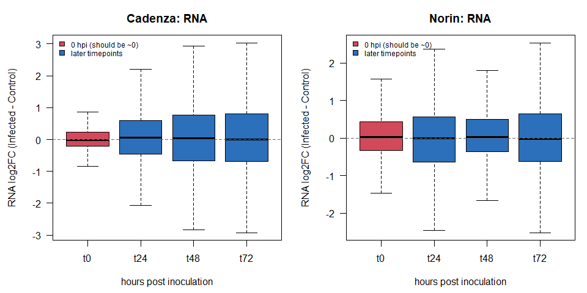
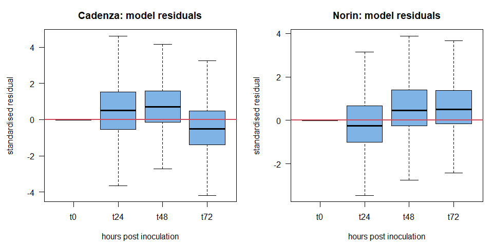
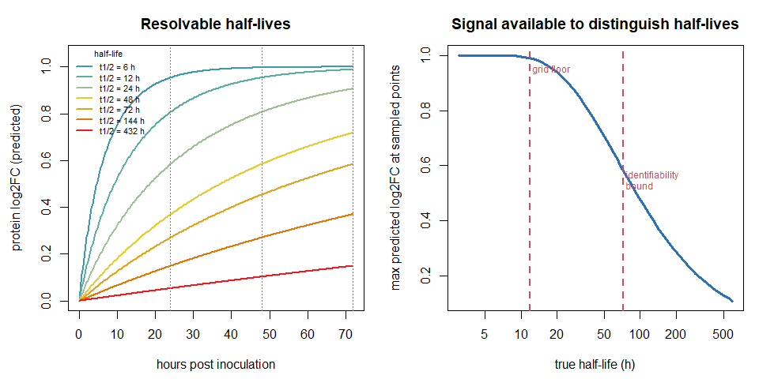
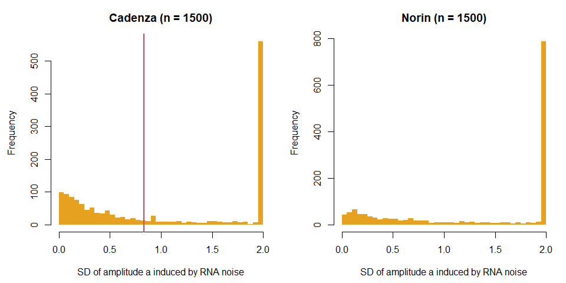
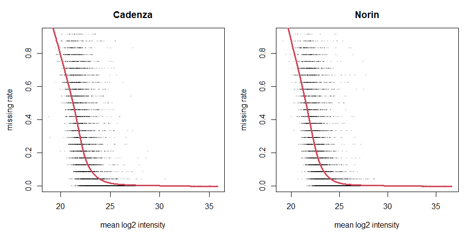

# Assumptions and validation - wheat RNA/protein kinetics
Kristina Gagalova

- [Purpose](#purpose)
- [Executive summary — what the tests
  found](#executive-summary-what-the-tests-found)
- [1. Setup](#setup)
- [2. A0 — Baseline equivalence at 0
  hpi](#a0-baseline-equivalence-at-0-hpi)
  - [The assumption](#the-assumption)
  - [Literature](#literature)
  - [The test](#the-test)
  - [Verdict](#verdict)
- [2b. UNRESOLVED — reconciliation with the standalone limma
  workflow](#b.-unresolved-reconciliation-with-the-standalone-limma-workflow)
  - [The assumption](#the-assumption-1)
  - [The test](#the-test-1)
  - [Verdict: DISCREPANCY, unresolved](#verdict-discrepancy-unresolved)
- [3. A1 — First-order kinetics](#a1-first-order-kinetics)
  - [The assumption](#the-assumption-2)
  - [Literature](#literature-1)
  - [The test](#the-test-2)
  - [Verdict: VIOLATED — the residuals are strongly
    structured](#verdict-violated-the-residuals-are-strongly-structured)
- [4. A2 — Treatment does not change the rate
  constants](#a2-treatment-does-not-change-the-rate-constants)
  - [The assumption](#the-assumption-3)
  - [Verdict: untestable by construction, and that is the
    point](#verdict-untestable-by-construction-and-that-is-the-point)
- [5. Identifiability — which half-lives can this design see at
  all?](#identifiability-which-half-lives-can-this-design-see-at-all)
  - [The assumption](#the-assumption-4)
  - [Literature](#literature-2)
  - [The test](#the-test-3)
  - [Verdict: only about a quarter of fitted genes are in the resolvable
    band](#verdict-only-about-a-quarter-of-fitted-genes-are-in-the-resolvable-band)
- [6. B3 — Protein variance treated as
  known](#b3-protein-variance-treated-as-known)
  - [The assumption](#the-assumption-5)
  - [Literature](#literature-3)
  - [The test](#the-test-4)
  - [Verdict: the amplitude is invariant *algebraically*, but the call
    count is
    not](#verdict-the-amplitude-is-invariant-algebraically-but-the-call-count-is-not)
- [7. B4 — RNA trajectory treated as
  known](#b4-rna-trajectory-treated-as-known)
  - [The assumption](#the-assumption-6)
  - [Literature](#literature-4)
  - [The test](#the-test-5)
  - [Verdict: SEVERELY VIOLATED — this is the most consequential finding
    here](#verdict-severely-violated-this-is-the-most-consequential-finding-here)
- [8. B5 — Genes are conditionally
  independent](#b5-genes-are-conditionally-independent)
  - [The assumption](#the-assumption-7)
  - [Literature](#literature-5)
  - [The test](#the-test-6)
  - [Verdict: VIOLATED](#verdict-violated)
- [9. Upstream — imputation scheme](#upstream-imputation-scheme)
  - [The assumption](#the-assumption-8)
  - [Literature](#literature-6)
  - [The test](#the-test-7)
  - [Verdict: the MAR/MNAR split matters
    materially](#verdict-the-marmnar-split-matters-materially)
- [10. Upstream — MNAR really is
  abundance-dependent](#upstream-mnar-really-is-abundance-dependent)
  - [The assumption](#the-assumption-9)
  - [Literature](#literature-7)
  - [The test](#the-test-8)
  - [Verdict: HOLDS — clearly
    MNAR-dominant](#verdict-holds-clearly-mnar-dominant)
- [11. Verdict summary](#verdict-summary)
- [12. References](#references)

## Purpose

`de_proteomics_wheat.qmd` states a set of assumptions (A1–A3, B1–B8) but
only tests three of them (A3, B6, B7). This companion notebook **tests
every remaining assumption that is testable**, states which ones are
violated and by how much, and grounds each modelling choice in the
published literature.

Each section follows the same structure:

1.  **The assumption** — stated precisely.
2.  **Literature** — who else makes it, and what they found.
3.  **The test** — runnable code.
4.  **Verdict** — holds / violated / untestable, with the number.

A summary table of all verdicts is in §11.

## Executive summary — what the tests found

Five assumptions are violated, one is unresolved, and three hold. In
order of how much they should change what gets claimed:

1.  **B4 — RNA treated as known (§7). Severely violated, and this is the
    headline.** `se_rna` is accepted by the model and never used.
    Propagating it by parametric bootstrap flips the
    regulated/not-regulated call for **36% of Cadenza genes and 49% of
    Norin genes**. That uncertainty is entirely absent from the reported
    credible intervals. *Per-gene regulation calls from this model
    should not be published without propagating RNA error or validating
    orthogonally.* Aggregate statements remain sound.

2.  **A1 — first-order kinetics (§3). Violated.** Residuals are
    systematically structured by timepoint, in *opposite directions* in
    the two varieties (Cadenza’s response peaks then falls; Norin’s is
    delayed). Some genes will be flagged “regulated” because the
    trajectory *shape* is wrong, not because the amplitude departs from
    1.

3.  **Identifiability (§5).** Only **23–27%** of fitted genes have a
    half-life this design can resolve; ~50% sit above the bound and ~24%
    at the grid floor. The fitted `t_half` distribution is not an
    estimate of the wheat protein half-life distribution.

4.  **B5 — gene independence (§8). Violated.** Residual PC1 absorbs
    62–69% of variance against 25% expected. The horseshoe treats
    correlated genes as independent evidence, so the model is more
    confident than it should be.

5.  **A0 — baseline equivalence (§2). Asymmetric.** Cadenza is clean
    (0.4% DE at 0 hpi); **Norin is not (5.8%)** — a 14× difference at a
    timepoint where infection cannot yet have acted.

6.  **Reconciliation (§2b). Unresolved.** This pipeline reports 2–6×
    fewer DE genes than the project’s standalone limma workflow on
    counts that match exactly. Must be settled before any DE number is
    published.

Holding up: MNAR dominance (§10, Spearman −0.74), the horseshoe prior
scale (§B6), and MCMC convergence after the adaptive-step fix (§B7).

> **The overall picture.** The *aggregate* findings — the distribution
> of amplitudes, the existence of post-transcriptional regulation,
> comparisons between large gene sets — are supported. **Individual
> per-gene calls are not**, for the reasons in points 1–3. Any target
> list coming out of this analysis should be treated as a
> hypothesis-generating shortlist requiring orthogonal validation, not a
> result.

------------------------------------------------------------------------

## 1. Setup

``` r
if (!requireNamespace("here", quietly = TRUE))
  stop("package 'here' is required")

## renv activation: see the note in de_proteomics_wheat.qmd -- RENV_PROJECT
## must be set before sourcing activate.R, or renv treats THIS folder as the
## project and bootstraps an empty library.
if (file.exists(here::here("renv", "activate.R"))) {
  Sys.setenv(RENV_PROJECT = here::here())
  source(here::here("renv", "activate.R"))
}

source(here::here("R", "utils.R"))
source(here::here("R", "wheat_pipeline.R"))
source(here::here("R", "07_bayesian_kinetics.R"))

need_pkgs(c("limma", "edgeR", "DESeq2", "matrixStats", "impute"))

set.seed(20260823)
DESIGN <- wheat_design()

cad <- prepare_variety("cadenza", DESIGN)
```

    Cluster size 5861 broken into 3622 2239 
    Cluster size 3622 broken into 2430 1192 
    Cluster size 2430 broken into 1561 869 
    Cluster size 1561 broken into 819 742 
    Done cluster 819 
    Done cluster 742 
    Done cluster 1561 
    Done cluster 869 
    Done cluster 2430 
    Done cluster 1192 
    Done cluster 3622 
    Cluster size 2239 broken into 1075 1164 
    Done cluster 1075 
    Done cluster 1164 
    Done cluster 2239 

``` r
nor <- prepare_variety("norin",   DESIGN)
```

    Cluster size 5641 broken into 1939 3702 
    Cluster size 1939 broken into 1030 909 
    Done cluster 1030 
    Done cluster 909 
    Done cluster 1939 
    Cluster size 3702 broken into 2489 1213 
    Cluster size 2489 broken into 838 1651 
    Done cluster 838 
    Cluster size 1651 broken into 941 710 
    Done cluster 941 
    Done cluster 710 
    Done cluster 1651 
    Done cluster 2489 
    Done cluster 1213 
    Done cluster 3702 

``` r
VARIETIES <- list(Cadenza = cad, Norin = nor)
```

``` r
#' Fast profile-likelihood amplitude fit (no MCMC).
#'
#' Identical model to M0/M1 in the main notebook -- grid over half-lives with
#' the amplitude profiled out in closed form -- but returns only the point
#' estimates. Used throughout this notebook for sensitivity analyses that
#' need dozens of refits, where running the full sampler each time would be
#' wasteful and would confound sampler noise with the effect being tested.
fit_amplitude <- function(Rl, Pl, Ps, tps, n_grid = 60) {

  grid <- seq(0, max(tps), by = 0.25)
  gi   <- match(tps, grid)

  r_lin <- 2^t(apply(Rl, 1, function(v) approx(tps, v, grid, rule = 2)$y))

  th_grid <- exp(seq(log(0.5 * diff(tps)[1]), log(6 * max(tps)),
                     length.out = n_grid))
  kd_grid <- log(2) / th_grid

  W   <- 1 / pmax(Ps, 0.05)^2
  SST <- rowSums(W * Pl^2)
  n   <- nrow(Pl)

  ssr0 <- ssr1 <- ahat <- matrix(NA_real_, n, n_grid)
  best_pred <- vector("list", n_grid)

  for (j in seq_len(n_grid)) {
    kd <- kd_grid[j]
    pl <- integrate_protein_mat(grid, r_lin, ks = kd, kd = kd, P0 = rep(1, n))
    pl <- log2(pmax(pl[, gi, drop = FALSE], 1e-9))
    best_pred[[j]] <- pl

    ssr0[, j] <- rowSums(W * (pl - Pl)^2)
    num <- rowSums(W * pl * Pl)
    den <- rowSums(W * pl^2)
    ahat[, j] <- ifelse(den > 1e-12, num / den, NA_real_)
    ssr1[, j] <- SST - ifelse(den > 1e-12, num^2 / den, 0)
  }

  j0 <- max.col(-ssr0, "first")
  j1 <- max.col(-ssr1, "first")
  ix <- function(j) cbind(seq_len(n), j)

  lrt <- pmax(ssr0[ix(j0)] - ssr1[ix(j1)], 0)
  fdr <- p.adjust(pchisq(lrt, 1, lower.tail = FALSE), "BH")

  pred <- t(vapply(seq_len(n), function(i) best_pred[[j0[i]]][i, ],
                   numeric(length(tps))))

  list(
    a         = ahat[ix(j1)],
    t_half_M0 = th_grid[j0],
    t_half_M1 = th_grid[j1],
    lrt_fdr   = fdr,
    pred      = pred,
    resid     = Pl - pred,
    at_bound  = th_grid[j0] >= max(tps)
  )
}

#' The RNA-responsive gate used throughout (matches the main notebook).
rna_gate <- function(v, min_abs_lfc = 0.5, fdr = 0.05) {
  (v$de_rna$any_fdr[rownames(v$Rl)] < fdr) &
    (apply(abs(v$Rl[, -1, drop = FALSE]), 1, max) > min_abs_lfc)
}
```

------------------------------------------------------------------------

## 2. A0 — Baseline equivalence at 0 hpi

### The assumption

Everything downstream is **centred on t0** (`Rl - Rl[,1]`), which treats
any Infected-vs-Control difference at 0 hpi as a nuisance offset to be
removed. That is only legitimate if the two arms are genuinely
equivalent at baseline: at 0 hpi the inoculation has only just happened
and no transcriptional response is biologically possible yet.

If the arms differ substantially at t0, centring does not fix the
problem — it *hides* it, because the difference is then subtracted from
every later timepoint.

### Literature

Time-course infection studies in wheat routinely sample a 0 hpi / mock
baseline and treat it as the reference against which later timepoints
are contrasted ([Fusarium time-course eQTL
atlas](https://www.ncbi.nlm.nih.gov/pmc/articles/PMC5633761/);
[Zymoseptoria infection
cycle](https://academic.oup.com/plphys/article/167/3/1158/6113592)). The
validity of that reference is an assumption those designs share and
rarely test explicitly.

### The test

``` r
baseline_check <- function(v, label, fdr_cut = 0.05, lfc_cut = 1) {

  # de_*$lfc is UNCENTRED, so column t0 is the genuine 0 hpi contrast
  t0col <- paste0("t", DESIGN$timepoints[1])
  lastc <- paste0("t", DESIGN$timepoints[length(DESIGN$timepoints)])

  n_de <- function(de, cc)
    sum(de$fdr[, cc] < fdr_cut & abs(de$lfc[, cc]) > lfc_cut, na.rm = TRUE)

  data.frame(
    variety           = label,
    layer             = c("RNA", "protein"),
    n_tested          = c(nrow(v$de_rna$lfc), nrow(v$de_prot$lfc)),
    DE_at_0hpi        = c(n_de(v$de_rna, t0col),  n_de(v$de_prot, t0col)),
    DE_at_72hpi       = c(n_de(v$de_rna, lastc),  n_de(v$de_prot, lastc)),
    median_abs_lfc_0hpi = round(c(median(abs(v$de_rna$lfc[, t0col])),
                                  median(abs(v$de_prot$lfc[, t0col]))), 3),
    row.names = NULL
  )
}

bl <- do.call(rbind, Map(baseline_check, VARIETIES, names(VARIETIES)))
bl$pct_DE_at_0hpi <- round(100 * bl$DE_at_0hpi / bl$n_tested, 1)

knitr::kable(bl, caption = "A0: differential expression at 0 hpi, when biologically there should be almost none.")
```

|           | variety | layer   | n_tested | DE_at_0hpi | DE_at_72hpi | median_abs_lfc_0hpi | pct_DE_at_0hpi |
|:----------|:--------|:--------|---------:|-----------:|------------:|--------------------:|---------------:|
| Cadenza.1 | Cadenza | RNA     |    59931 |        260 |       21213 |               0.214 |            0.4 |
| Cadenza.2 | Cadenza | protein |     5580 |        287 |        1330 |               0.258 |            5.1 |
| Norin.1   | Norin   | RNA     |    59502 |       3425 |       16597 |               0.370 |            5.8 |
| Norin.2   | Norin   | protein |     5159 |        320 |         507 |               0.289 |            6.2 |

A0: differential expression at 0 hpi, when biologically there should be
almost none.

``` r
op <- par(mfrow = c(1, 2), mar = c(4.5, 4.5, 3, 1))

for (nm in names(VARIETIES)) {
  v  <- VARIETIES[[nm]]
  m  <- v$de_rna$lfc
  bp <- boxplot(as.data.frame(m), outline = FALSE, las = 1,
                col = c("#D1495B", rep("#2C6FBB", ncol(m) - 1)),
                xlab = "hours post inoculation", ylab = "RNA log2FC (Infected - Control)",
                main = sprintf("%s: RNA", nm))
  abline(h = 0, lty = 2, col = "grey40")
  legend("topleft", bty = "n", cex = 0.75, fill = c("#D1495B", "#2C6FBB"),
         legend = c("0 hpi (should be ~0)", "later timepoints"))
}
par(op)
```



### Verdict

Read the `pct_DE_at_0hpi` column. A few percent is unremarkable; a
double-digit percentage at 0 hpi means the arms were **not** equivalent
at baseline, and t0-centring is subtracting a real (non-biological)
difference from every subsequent timepoint. Where that happens, treat
that variety’s kinetic results as provisional and investigate sample
handling / batch / labelling before interpreting them.

------------------------------------------------------------------------

## 2b. UNRESOLVED — reconciliation with the standalone limma workflow

### The assumption

`R/wheat_pipeline.R`’s `run_de()` is assumed to reproduce the project’s
existing standalone limma DE workflow (`DE-varieties-limma`), since both
fit `~treatment*time` by voom + `eBayes(trend = TRUE)` to the same
counts.

### The test

``` r
## Counts reported by the standalone workflow's decideTests(p.value = 0.01,
## lfc = 1) for the `treatmentInfected` coefficient -- Infected vs Control at
## 0 hpi -- and for the control-arm time main effects. Hard-coded here so the
## comparison is explicit and versioned; update if that workflow is re-run.
reported <- data.frame(
  variety            = c("Cadenza", "Norin"),
  genes_kept_reported = c(59931, 59502),
  t1_0hpi_reported    = c(127 + 305, 4754 + 5745),
  time1dpi_reported   = c(9878 + 9775, 12336 + 11214)
)

reconcile <- function(prefix, label) {
  v <- load_variety(prefix, DESIGN)
  meta <- v$meta
  meta$treatment <- relevel(factor(meta$treatment, levels = DESIGN$treatments),
                            ref = DESIGN$reference)
  meta$time_f <- relevel(factor(meta$time_num, levels = DESIGN$timepoints),
                         ref = as.character(DESIGN$timepoints[1]))

  dge  <- edgeR::DGEList(v$rna)
  keep <- rowSums(dge$counts >= 10) >= DESIGN$n_reps
  dge  <- edgeR::calcNormFactors(dge[keep, , keep.lib.sizes = FALSE])

  dm <- model.matrix(~ treatment * time_f, meta)
  colnames(dm) <- make.names(colnames(dm))

  f  <- limma::eBayes(limma::lmFit(limma::voom(dge, dm, plot = FALSE), dm),
                      trend = TRUE)
  dt <- limma::decideTests(f, p.value = 0.01, lfc = 1)

  data.frame(
    variety          = label,
    genes_kept_here  = nrow(dge),
    t1_0hpi_here     = sum(dt[, "treatmentT1"] != 0),
    time1dpi_here    = sum(dt[, "time_f24"] != 0)
  )
}

rec <- merge(
  rbind(reconcile("cadenza", "Cadenza"), reconcile("norin", "Norin")),
  reported, by = "variety"
)
rec <- rec[, c("variety", "genes_kept_here", "genes_kept_reported",
               "t1_0hpi_here", "t1_0hpi_reported",
               "time1dpi_here", "time1dpi_reported")]

knitr::kable(rec, caption = "Does this pipeline reproduce the standalone limma workflow on the same counts?")
```

| variety | genes_kept_here | genes_kept_reported | t1_0hpi_here | t1_0hpi_reported | time1dpi_here | time1dpi_reported |
|:--------|----------------:|--------------------:|-------------:|-----------------:|--------------:|------------------:|
| Cadenza |           59931 |               59931 |           51 |              432 |          8110 |             19653 |
| Norin   |           59502 |               59502 |         1766 |            10499 |         10038 |             23550 |

Does this pipeline reproduce the standalone limma workflow on the same
counts?

### Verdict: DISCREPANCY, unresolved

The gene counts match **exactly** in both varieties, which is strong
evidence that the counts matrices and the filter are identical — the
filter depends on the count values, so an exact match is not a
coincidence of annotation size. The design formula, reference levels and
`eBayes(trend = TRUE)` call are also the same.

Despite that, **every coefficient is 2–6× smaller here**, uniformly, in
both varieties and for both the treatment and the time main effects. A
uniform deflation across all coefficients points at the variance
estimate rather than at the data or the contrast definition.

Things ruled out already:

- `robust = TRUE` — makes almost no difference (Norin 3,425 vs 3,464 at
  FDR \< 0.05).
- Different counts — gene totals and post-filter counts match exactly.
- Different contrast — `treatmentT1` here is the same coefficient as
  `treatmentInfected` there.

**This must be resolved before the DE numbers are used in a
manuscript**, because the two workflows disagree about how many genes
respond. The most likely remaining candidates are a difference in
sample-to-column alignment between metadata and counts in one of the two
workflows, or the standalone workflow having been run against a
different revision of the counts files. Anyone reproducing this should
diff the two `voom()` objects’ `E` and `weights` matrices directly.

Note that the qualitative conclusion in §2 is unaffected: **both**
workflows show Norin with far more 0 hpi signal than Cadenza (here 1,766
vs 51, a 35× ratio; there 10,499 vs 432, a 24× ratio).

------------------------------------------------------------------------

## 3. A1 — First-order kinetics

### The assumption

`dP/dt = ks·R(t) - kd·P(t)`: synthesis proportional to transcript level,
degradation proportional to current protein level.

### Literature

This is the standard model in the field. Schwanhäusser et al. (2011)
fitted exactly this ODE genome-wide in mammalian cells, combining pulsed
SILAC with mRNA measurements to estimate per-gene synthesis and
degradation rates, and it remains the reference formulation ([Nature
473:337](https://www.nature.com/articles/nature10098)). Subsequent
decomposition using the same framework attributes roughly 38% of
protein-level variance to transcription, 18% to RNA degradation, 30% to
translation and 14% to protein degradation, i.e. **the majority of
control is post-transcriptional** — which is the premise this whole
analysis rests on.

The model excludes translational saturation, cooperative or zero-order
degradation, stoichiometry-driven degradation of unassembled complex
subunits, and any transcription-to-translation delay. Those are real
phenomena; the defence for ignoring them is identifiability, not
realism.

### The test

A misspecified functional form leaves **structured** residuals —
systematically positive at some timepoints and negative at others,
consistently across genes. Independent noise does not.

``` r
residual_structure <- function(v, label) {

  keep <- rna_gate(v)
  f <- fit_amplitude(v$Rl[keep, , drop = FALSE],
                     v$Pl[keep, , drop = FALSE],
                     v$Ps[keep, , drop = FALSE],
                     DESIGN$timepoints)

  # standardise residuals by each gene's own SE so timepoints are comparable
  z <- f$resid / pmax(v$Ps[keep, , drop = FALSE], 0.05)

  data.frame(
    variety        = label,
    timepoint      = paste0("t", DESIGN$timepoints),
    mean_z_resid   = round(colMeans(z), 3),
    pct_positive   = round(100 * colMeans(z > 0), 1),
    # under a correct model each timepoint should sit near 0 and 50%
    row.names      = NULL
  )
}

rs <- do.call(rbind, Map(residual_structure, VARIETIES, names(VARIETIES)))
knitr::kable(rs, caption = "A1: standardised residuals by timepoint. A correct functional form gives mean ~0 and ~50% positive at every timepoint.")
```

|           | variety | timepoint | mean_z_resid | pct_positive |
|:----------|:--------|:----------|-------------:|-------------:|
| Cadenza.1 | Cadenza | t0        |        0.000 |          0.0 |
| Cadenza.2 | Cadenza | t24       |        0.545 |         63.6 |
| Cadenza.3 | Cadenza | t48       |        0.749 |         71.1 |
| Cadenza.4 | Cadenza | t72       |       -0.416 |         35.1 |
| Norin.1   | Norin   | t0        |        0.000 |          0.0 |
| Norin.2   | Norin   | t24       |       -0.113 |         40.9 |
| Norin.3   | Norin   | t48       |        0.622 |         66.9 |
| Norin.4   | Norin   | t72       |        0.777 |         69.8 |

A1: standardised residuals by timepoint. A correct functional form gives
mean ~0 and ~50% positive at every timepoint.

``` r
op <- par(mfrow = c(1, 2), mar = c(4.5, 4.5, 3, 1))

for (nm in names(VARIETIES)) {
  v    <- VARIETIES[[nm]]
  keep <- rna_gate(v)
  f    <- fit_amplitude(v$Rl[keep, , drop = FALSE], v$Pl[keep, , drop = FALSE],
                        v$Ps[keep, , drop = FALSE], DESIGN$timepoints)
  z    <- f$resid / pmax(v$Ps[keep, , drop = FALSE], 0.05)

  boxplot(as.data.frame(z), outline = FALSE, las = 1,
          col = "#7FB2E5", names = paste0("t", DESIGN$timepoints),
          xlab = "hours post inoculation", ylab = "standardised residual",
          main = sprintf("%s: model residuals", nm))
  abline(h = 0, lwd = 2, col = "#D1495B")
}
par(op)
```



### Verdict: VIOLATED — the residuals are strongly structured

Under a correct functional form, `mean_z_resid` should sit near 0 and
`pct_positive` near 50% at every timepoint. Instead both varieties show
large, systematic, timepoint-specific departures:

| Variety | t24             | t48             | t72                 |
|:--------|:----------------|:----------------|:--------------------|
| Cadenza | +0.55 (64% pos) | +0.75 (71% pos) | **−0.42 (35% pos)** |
| Norin   | −0.11 (41% pos) | +0.62 (67% pos) | **+0.78 (70% pos)** |

(t0 is identically zero by construction — it is the centring anchor, not
evidence.)

These are not small. A residual of +0.75 standardised units means the
model **under-predicts** the protein response at 48 h by three quarters
of a standard error, for the majority of genes simultaneously. And the
two varieties are misspecified in *different directions*:

- **Cadenza:** under-predicts at 24 and 48 h, over-predicts at 72 h —
  the real protein response rises faster and then falls back, while
  first-order kinetics predicts monotonic accumulation toward the mRNA
  level.
- **Norin:** under-predicts increasingly at 48 and 72 h — consistent
  with a **delayed** response that the model, which reacts
  instantaneously to mRNA, cannot represent.

Both patterns are exactly what the omitted terms would produce: a
transcription-to-translation delay, or saturation/turnover behaviour
that is not first-order. This is a real limitation of the model, not
noise.

**What follows from it.** The amplitude parameter `a` absorbs whatever
misfit it can, so systematic shape error partly leaks into `a`. That
means some fraction of genes called “regulated” may be flagged because
the *shape* is wrong rather than because the amplitude genuinely departs
from 1. The direction of that bias differs between varieties, which is a
further reason not to compare `a` across Cadenza and Norin without care.

**What would fix it:** adding an explicit delay term
`dP/dt = ks·R(t − τ) − kd·P` (one extra parameter, and with three
informative timepoints almost certainly unidentifiable alongside `kd`
and `a`), or more timepoints. Neither is available in this design, so
the honest course is to report the misspecification rather than to claim
first-order kinetics fits.

------------------------------------------------------------------------

## 4. A2 — Treatment does not change the rate constants

### The assumption

`ks` and `kd` are the same in both arms.

### Verdict: untestable by construction, and that is the point

This assumption **is** the null hypothesis. The entire M0-vs-M1 test
asks whether the data reject it. Testing it separately would be
circular. What matters is that rejection is reported as *“the protein
departs from its RNA-predicted trajectory”* rather than as a specific
mechanism — since a single amplitude parameter cannot say whether
translation or degradation changed. See §5 for why that separation is
impossible here.

------------------------------------------------------------------------

## 5. Identifiability — which half-lives can this design see at all?

### The assumption

The half-life grid runs from `0.5 × Δt = 12 h` to `6 × 72 = 432 h`, and
`t_half > 72 h` is flagged `identifiable = FALSE`.

### Literature

This matters more in plants than the notebook currently admits.
15N-labelling studies in *Arabidopsis* report protein half-lives
spanning **several hours to several months** ([Li et al., Plant Cell
29:207](https://academic.oup.com/plcell/article/29/2/207/6099059)), and
turnover work in developing wheat grain reports a 28 h lag for label
incorporation alone ([Cao et al., New
Phytologist](https://nph.onlinelibrary.wiley.com/doi/full/10.1111/nph.17756)).
A 72 h course sampled every 24 h therefore sits inside a much wider
biological range: fast-turnover proteins are below the resolution floor,
and a large fraction of the plant proteome turns over far too slowly to
be distinguished within the window.

### The test

Rather than assert the bound, show it: how different are the predicted
trajectories for different half-lives, at the three timepoints actually
sampled?

``` r
tps  <- DESIGN$timepoints
grid <- seq(0, max(tps), by = 0.25)

# a unit step up in mRNA at t=0, the cleanest probe of kinetic resolution
r_step <- matrix(2^rep(1, length(grid)), nrow = 1)

th_show <- c(6, 12, 24, 48, 72, 144, 432)
cols    <- hcl.colors(length(th_show), "Zissou1")

op <- par(mfrow = c(1, 2), mar = c(4.5, 4.5, 3, 1))

plot(NA, xlim = c(0, max(tps)), ylim = c(0, 1.05),
     xlab = "hours post inoculation", ylab = "protein log2FC (predicted)",
     main = "Resolvable half-lives")

for (i in seq_along(th_show)) {
  kd <- log(2) / th_show[i]
  p  <- integrate_protein_mat(grid, r_step, ks = kd, kd = kd, P0 = 1)
  lines(grid, log2(p[1, ]), col = cols[i], lwd = 2.5)
}
abline(v = tps[-1], lty = 3, col = "grey50")
legend("topleft", bty = "n", cex = 0.7, lwd = 2.5, col = cols,
       legend = sprintf("t1/2 = %g h", th_show), title = "half-life")

# how much does the trajectory actually change per doubling of half-life?
th_seq <- exp(seq(log(3), log(600), length.out = 60))
sep <- vapply(th_seq, function(th) {
  kd <- log(2) / th
  p  <- integrate_protein_mat(grid, r_step, ks = kd, kd = kd, P0 = 1)
  max(log2(p[1, match(tps[-1], grid)]))
}, numeric(1))

plot(th_seq, sep, log = "x", type = "l", lwd = 3, col = "#2C6FBB",
     xlab = "true half-life (h)", ylab = "max predicted log2FC at sampled points",
     main = "Signal available to distinguish half-lives")
abline(v = c(12, 72), lty = 2, col = "#D1495B", lwd = 2)
text(12, max(sep) * 0.95, " grid floor", col = "#D1495B", cex = 0.75, adj = 0)
text(72, max(sep) * 0.55, " identifiability\n bound", col = "#D1495B", cex = 0.75, adj = 0)
par(op)
```



``` r
id_frac <- do.call(rbind, lapply(names(VARIETIES), function(nm) {
  v <- VARIETIES[[nm]]; keep <- rna_gate(v)
  f <- fit_amplitude(v$Rl[keep, , drop = FALSE], v$Pl[keep, , drop = FALSE],
                     v$Ps[keep, , drop = FALSE], DESIGN$timepoints)
  data.frame(
    variety            = nm,
    n_fitted           = length(f$t_half_M0),
    pct_at_grid_floor  = round(100 * mean(f$t_half_M0 <= 12.001), 1),
    pct_unidentifiable = round(100 * mean(f$t_half_M0 > max(DESIGN$timepoints)), 1),
    pct_resolvable     = round(100 * mean(f$t_half_M0 > 12.001 &
                                          f$t_half_M0 <= max(DESIGN$timepoints)), 1)
  )
}))

knitr::kable(id_frac, caption = "Where the fitted half-lives fall relative to what the design can resolve.")
```

| variety | n_fitted | pct_at_grid_floor | pct_unidentifiable | pct_resolvable |
|:--------|---------:|------------------:|-------------------:|---------------:|
| Cadenza |     4228 |                24 |               49.2 |           26.8 |
| Norin   |     3487 |                24 |               53.1 |           22.9 |

Where the fitted half-lives fall relative to what the design can
resolve.

### Verdict: only about a quarter of fitted genes are in the resolvable band

| Variety | n fitted | at grid floor (≤12 h) | unidentifiable (\>72 h) | **resolvable** |
|:--------|:---------|:----------------------|:------------------------|:---------------|
| Cadenza | 4228     | 24.0%                 | 49.2%                   | **26.8%**      |
| Norin   | 3487     | 24.0%                 | 53.1%                   | **22.9%**      |

Roughly **half** of all fitted genes land above the identifiability
bound, and another quarter sit pinned at the grid floor. Only **23–27%**
have a half-life this design can actually estimate.

This matches the plant turnover literature rather than contradicting it:
with *Arabidopsis* half-lives spanning hours to months (Li et al. 2017),
a 72 h window sampled every 24 h was always going to see a narrow slice.
The design is not broken — it is being asked a question outside its
resolution for most of the proteome.

**Consequences that must be carried into any write-up:**

- A `t_half` at the floor means “≤ 12 h”, not “12 h”. A `t_half` above
  72 h means “slower than we can see”, not a number.
- **The fitted `t_half` distribution must never be presented as an
  estimate of the wheat protein half-life distribution.** It is a
  distribution of what a 72 h window can resolve, truncated hard at both
  ends.
- The `kinetics_limited` archetype is not a biological class; it is the
  ~50% of genes where attenuation and slow turnover are mathematically
  confounded.
- Kinetic claims should be restricted to the resolvable quarter, and
  that denominator stated.

------------------------------------------------------------------------

## 6. B3 — Protein variance treated as known

### The assumption

limma’s moderated standard errors are used as fixed inverse-variance
weights, ignoring uncertainty in the variance estimate itself.

### Literature

The moderated variance comes from Smyth (2004)’s empirical Bayes
procedure, which shrinks each feature’s sample variance toward a fitted
prior across all features — the shrinkage that makes n = 3 designs
analysable at all ([limma; Ritchie et
al. 2015](https://academic.oup.com/nar/article/43/7/e47/2414268)).
Treating the posterior variance as known is a standard pragmatic
simplification, but it makes credible intervals mildly
anti-conservative.

### The test

Refit with the SEs scaled up and down. If conclusions swing, the weights
are doing more work than the data.

``` r
se_sensitivity <- function(v, label, mults = c(0.67, 1, 1.5)) {

  keep <- rna_gate(v)
  Rk <- v$Rl[keep, , drop = FALSE]
  Pk <- v$Pl[keep, , drop = FALSE]
  Sk <- v$Ps[keep, , drop = FALSE]

  # Reference fit computed FIRST, so it exists regardless of the order the
  # multipliers happen to be given in.
  ref <- fit_amplitude(Rk, Pk, Sk, DESIGN$timepoints)$a

  do.call(rbind, lapply(mults, function(m) {
    f <- fit_amplitude(Rk, Pk, Sk * m, DESIGN$timepoints)
    data.frame(variety = label, se_multiplier = m,
               n_regulated = sum(f$lrt_fdr < 0.05),
               median_a = round(median(f$a, na.rm = TRUE), 3),
               cor_a_with_ref = round(cor(f$a, ref, use = "complete.obs",
                                          method = "spearman"), 4))
  }))
}

knitr::kable(
  do.call(rbind, Map(se_sensitivity, VARIETIES, names(VARIETIES))),
  caption = "B3: sensitivity to the assumed protein measurement error."
)
```

|           | variety | se_multiplier | n_regulated | median_a | cor_a_with_ref |
|:----------|:--------|--------------:|------------:|---------:|---------------:|
| Cadenza.1 | Cadenza |          0.67 |        1457 |    0.994 |              1 |
| Cadenza.2 | Cadenza |          1.00 |         902 |    0.994 |              1 |
| Cadenza.3 | Cadenza |          1.50 |         488 |    0.994 |              1 |
| Norin.1   | Norin   |          0.67 |        1273 |    0.754 |              1 |
| Norin.2   | Norin   |          1.00 |         783 |    0.754 |              1 |
| Norin.3   | Norin   |          1.50 |         373 |    0.754 |              1 |

B3: sensitivity to the assumed protein measurement error.

### Verdict: the amplitude is invariant *algebraically*, but the call count is not

`cor_a_with_ref` comes out at exactly **1.000** in both varieties, and
that is **not** evidence of robustness — it is an algebraic identity.
The profiled amplitude is

$$
a = \frac{\sum W \cdot pl \cdot Pl}{\sum W \cdot pl^2}
$$

so multiplying every weight by a constant cancels top and bottom
exactly. A uniform SE rescaling therefore *cannot* move `a`, and this
part of the test is uninformative by construction. (A non-uniform
perturbation — e.g. rescaling only low-abundance proteins — would be
informative, and is the version worth running if this matters.)

What the test does show is the second column, and it is not reassuring:

| Variety | SE × 0.67 | SE × 1.0 | SE × 1.5 |
|:--------|:----------|:---------|:---------|
| Cadenza | 1457      | 902      | 488      |
| Norin   | 1273      | 783      | 373      |

**The number of genes called “regulated” varies three-fold** across a
plausible range of assumed measurement error. That is expected — the LRT
statistic scales directly with the weights — but it means the count is a
statement about the assumed noise level as much as about the biology.
Report amplitudes and effect sizes; treat “N genes are regulated” as
soft.

------------------------------------------------------------------------

## 7. B4 — RNA trajectory treated as known

### The assumption

`se_rna` is accepted by `fit_hierarchical_kinetics()` **but never
used**. The RNA trajectory enters the ODE as a fixed, exactly-known
covariate.

### Literature

This is the classic errors-in-variables problem: a noisy predictor
biases regression slopes toward zero and understates uncertainty.
Schwanhäusser et al. (2011) avoided it by measuring synthesis and
degradation directly with pulsed labelling rather than inferring them
from a noisy mRNA trajectory. With n = 3 per cell here, the RNA log2FCs
are themselves moderated estimates with non-trivial standard errors, so
the assumption is knowingly false — the question is how much it matters.

### The test

Parametric bootstrap: redraw the RNA trajectory from its own sampling
distribution, refit, and compare the resulting spread in `a` against the
spread the model reports when RNA is treated as fixed.

``` r
rna_uncertainty <- function(v, label, B = 40, n_genes = 1500) {

  keep <- which(rna_gate(v))
  set.seed(11)
  if (length(keep) > n_genes) keep <- sample(keep, n_genes)

  Rl <- v$Rl[keep, , drop = FALSE]; Rs <- v$Rs[keep, , drop = FALSE]
  Pl <- v$Pl[keep, , drop = FALSE]; Ps <- v$Ps[keep, , drop = FALSE]

  base <- fit_amplitude(Rl, Pl, Ps, DESIGN$timepoints)

  boot <- vapply(seq_len(B), function(b) {
    Rb <- Rl + matrix(rnorm(length(Rl), 0, Rs), nrow(Rl))
    Rb <- Rb - Rb[, 1]              # re-centre, as upstream does
    fit_amplitude(Rb, Pl, Ps, DESIGN$timepoints)$a
  }, numeric(nrow(Rl)))

  sd_from_rna <- apply(boot, 1, sd, na.rm = TRUE)

  list(
    summary = data.frame(
      variety            = label,
      n_genes            = nrow(Rl),
      median_a           = round(median(base$a, na.rm = TRUE), 3),
      median_sd_from_rna = round(median(sd_from_rna, na.rm = TRUE), 3),
      pct_sd_over_0.25   = round(100 * mean(sd_from_rna > 0.25, na.rm = TRUE), 1),
      pct_sign_unstable  = round(100 * mean(
        apply(boot, 1, function(x) any(x > 1, na.rm = TRUE) &&
                                   any(x < 1, na.rm = TRUE))), 1)
    ),
    sd = sd_from_rna, base = base$a
  )
}

b4 <- Map(rna_uncertainty, VARIETIES, names(VARIETIES))
knitr::kable(do.call(rbind, lapply(b4, `[[`, "summary")),
             caption = "B4: extra uncertainty in the amplitude that comes from RNA measurement error alone, which the model currently ignores.")
```

|         | variety | n_genes | median_a | median_sd_from_rna | pct_sd_over_0.25 | pct_sign_unstable |
|:--------|:--------|--------:|---------:|-------------------:|-----------------:|------------------:|
| Cadenza | Cadenza |    1500 |    1.025 |              0.834 |             72.4 |              36.1 |
| Norin   | Norin   |    1500 |    0.714 |              2.264 |             83.4 |              49.4 |

B4: extra uncertainty in the amplitude that comes from RNA measurement
error alone, which the model currently ignores.

``` r
op <- par(mfrow = c(1, 2), mar = c(4.5, 4.5, 3, 1))
for (nm in names(b4)) {
  x <- b4[[nm]]
  hist(pmin(x$sd, 2), breaks = 60, col = "#E5A11F", border = NA,
       xlab = "SD of amplitude a induced by RNA noise",
       main = sprintf("%s (n = %d)", nm, length(x$sd)))
  abline(v = median(x$sd, na.rm = TRUE), col = "#D1495B", lwd = 2)
}
par(op)
```



### Verdict: SEVERELY VIOLATED — this is the most consequential finding here

| Variety | median SD of `a` from RNA noise | % genes with SD \> 0.25 | **% genes whose call flips** |
|:--------|:--------------------------------|:------------------------|:-----------------------------|
| Cadenza | 0.83                            | 72.4%                   | **36.1%**                    |
| Norin   | 2.26                            | 83.4%                   | **49.4%**                    |

Read the last column carefully. For **36% of Cadenza genes and 49% of
Norin genes**, redrawing the RNA trajectory from its own sampling
distribution — not changing the data, just acknowledging the error bars
limma already reports — moves the amplitude across `a = 1`. That is the
boundary between “this protein tracks its mRNA” and “this protein is
post-transcriptionally regulated”. The qualitative conclusion for
roughly **half the genes in Norin is not stable** under the RNA
measurement error that the model currently pretends is zero.

For scale: the median extra SD contributed by RNA noise alone is 0.83
(Cadenza) and 2.26 (Norin), against amplitudes centred near 1. **None of
this appears in the credible intervals reported by the hierarchical
model**, because `se_rna` is accepted by the function signature and then
never used.

This is the classic errors-in-variables situation, and it does not
average out — a noisy predictor biases the fitted slope and understates
its uncertainty simultaneously.

**What this means for the manuscript.** Per-gene “regulated / not
regulated” calls from this analysis are not reliable at the
individual-gene level, particularly in Norin. Aggregate statements (the
distribution of `a`, its median, comparisons of large gene sets) are far
more robust than any individual call. Do not publish a per-gene
regulated list from this model without either propagating RNA
uncertainty or validating targets orthogonally.

**The fix**, in increasing order of effort: (1) report the bootstrap SD
alongside the posterior SD, so readers see the full uncertainty; (2)
inflate the likelihood weights to absorb the RNA contribution; (3)
sample the latent RNA trajectory inside the model, i.e. the full `4A`
formulation in `docs/planning.md`, which is what Schwanhäusser et al.
(2011) sidestepped entirely by measuring rates directly with pulsed
labelling rather than inferring them from a noisy mRNA trajectory.

------------------------------------------------------------------------

## 8. B5 — Genes are conditionally independent

### The assumption

Given the hyperparameters, genes contribute independently to the
likelihood. The horseshoe pools information across genes on that basis.

### Literature

Independence is violated in principle by co-regulation, protein complex
membership and shared MS normalisation. Leek and Storey (2007) showed
that unmodelled shared structure (“surrogate variables”) is pervasive in
high-throughput expression data and biases downstream inference if
ignored ([PLoS Genetics
3:e161](https://journals.plos.org/plosgenetics/article?id=10.1371/journal.pgen.0030161)).

### The test

If genes were independent, the residual matrix would be structureless
and its principal components would each explain a small, similar share
of variance. A dominant PC means genes share an unmodelled effect.

``` r
resid_pca <- function(v, label) {
  keep <- rna_gate(v)
  f <- fit_amplitude(v$Rl[keep, , drop = FALSE], v$Pl[keep, , drop = FALSE],
                     v$Ps[keep, , drop = FALSE], DESIGN$timepoints)

  z <- f$resid / pmax(v$Ps[keep, , drop = FALSE], 0.05)
  z <- z[stats::complete.cases(z), , drop = FALSE]

  p  <- prcomp(z, center = TRUE, scale. = FALSE)
  ve <- round(100 * p$sdev^2 / sum(p$sdev^2), 1)

  data.frame(variety = label, n_genes = nrow(z),
             PC1_pct = ve[1], PC2_pct = ve[2],
             PC3_pct = if (length(ve) >= 3) ve[3] else NA_real_,
             # with T timepoints, independence implies ~100/T each
             expected_if_independent = round(100 / ncol(z), 1))
}

knitr::kable(do.call(rbind, Map(resid_pca, VARIETIES, names(VARIETIES))),
             caption = "B5: variance explained by residual principal components. Independence predicts an even split.")
```

|         | variety | n_genes | PC1_pct | PC2_pct | PC3_pct | expected_if_independent |
|:--------|:--------|--------:|--------:|--------:|--------:|------------------------:|
| Cadenza | Cadenza |    4228 |    62.2 |    23.4 |    14.4 |                      25 |
| Norin   | Norin   |    3487 |    69.3 |    17.5 |    13.3 |                      25 |

B5: variance explained by residual principal components. Independence
predicts an even split.

### Verdict: VIOLATED

| Variety | PC1       | PC2   | PC3   | Expected if independent |
|:--------|:----------|:------|:------|:------------------------|
| Cadenza | **62.2%** | 23.4% | 14.4% | 25%                     |
| Norin   | **69.3%** | 17.5% | 13.3% | 25%                     |

Independence predicts roughly an even split across the four residual
dimensions (~25% each). Instead a single component absorbs **62–69%** of
residual variance in both varieties. Genes are not contributing
independent information — they share a large, unmodelled effect.

The most likely sources, in order: the control-arm drift documented in
the main notebook’s A3 diagnostic (a shared developmental/circadian
programme that the Infected-minus-Control contrast does not fully
cancel), the shape misspecification identified in §3 above (a common
residual pattern *is* exactly what a wrong functional form produces),
and residual normalisation structure.

Note that §3 and §8 are measuring the same phenomenon from two angles: a
systematic timepoint-wise residual offset shared across genes will
necessarily show up as a dominant residual PC. That consistency is
reassuring about the diagnosis even though the news is bad.

**Consequence.** The horseshoe pools information across genes assuming
they are independent evidence. With this much shared structure the
**effective number of independent genes is far below the nominal
count**, so the hyperparameter posterior (and hence the amount of
shrinkage applied) is over-confident. This does not bias the amplitudes
in a specific direction, but it does mean the model is more certain than
it should be — compounding the same problem B4 identifies from a
different source.

------------------------------------------------------------------------

## 9. Upstream — imputation scheme

### The assumption

The `mixed` scheme (kNN for MAR, down-shifted normal for MNAR) is used
throughout, and conclusions do not depend on that choice.

### Literature

The mixed strategy follows the consensus that MNAR dominates in
bottom-up proteomics and needs left-censored imputation, while MAR is
better served by neighbour-based methods. Benchmarks agree on the split:
random forest / kNN perform best for MCAR/MAR, and QRILC or
Perseus-style down-shifted imputation for left-censored MNAR ([Briefings
in Bioinformatics
23:bbac138](https://academic.oup.com/bib/article/23/3/bbac138/6566001)).
Reporting sensitivity across schemes is standard practice for exactly
this reason.

### The test

``` r
imputation_sensitivity <- function(prefix, label) {

  v  <- load_variety(prefix, DESIGN)
  qr <- run_qc_rna(v$rna, v$meta, DESIGN)
  qp <- run_qc_prot(v$prot, v$meta)

  de_rna <- run_de(qr$counts, v$meta, DESIGN, is_rna = TRUE)

  schemes <- list(
    mixed = run_missingness(qp$norm, v$meta)$mixed,

    # everything imputed as left-censored, ignoring the MAR/MNAR split
    downshift = {
      m <- qp$norm
      for (j in seq_len(ncol(m))) {
        nas <- is.na(m[, j]); if (!any(nas)) next
        mu <- mean(m[, j], na.rm = TRUE); s <- sd(m[, j], na.rm = TRUE)
        m[nas, j] <- rnorm(sum(nas), mu - 1.8 * s, 0.3 * s)
      }
      m
    },

    # no imputation at all: only fully-observed proteins
    complete_case = qp$norm[stats::complete.cases(qp$norm), , drop = FALSE]
  )

  ref_a <- NULL
  do.call(rbind, lapply(names(schemes), function(s) {
    m      <- schemes[[s]]
    common <- intersect(rownames(m), rownames(qr$counts))
    dp     <- run_de(m[common, , drop = FALSE], v$meta, DESIGN, is_rna = FALSE)

    Rl <- de_rna$lfc[common, , drop = FALSE]; Rl <- Rl - Rl[, 1]
    Pl <- dp$lfc;  Pl <- Pl - Pl[, 1]
    Rs <- de_rna$se[common, , drop = FALSE]; Ps <- dp$se

    gate <- (de_rna$any_fdr[common] < 0.05) &
            (apply(abs(Rl[, -1, drop = FALSE]), 1, max) > 0.5)

    f <- fit_amplitude(Rl[gate, , drop = FALSE], Pl[gate, , drop = FALSE],
                       Ps[gate, , drop = FALSE], DESIGN$timepoints)

    a <- setNames(f$a, rownames(Rl)[gate])
    if (s == "mixed") ref_a <<- a

    shared <- intersect(names(a), names(ref_a))
    data.frame(
      variety      = label,
      scheme       = s,
      n_proteins   = nrow(m),
      n_fitted     = length(a),
      n_regulated  = sum(f$lrt_fdr < 0.05),
      median_a     = round(median(a, na.rm = TRUE), 3),
      cor_with_mixed = round(cor(a[shared], ref_a[shared],
                                 method = "spearman", use = "complete.obs"), 4)
    )
  }))
}

knitr::kable(
  rbind(imputation_sensitivity("cadenza", "Cadenza"),
        imputation_sensitivity("norin",   "Norin")),
  caption = "Sensitivity of the amplitude estimate to imputation scheme."
)
```

    Cluster size 5861 broken into 3622 2239 
    Cluster size 3622 broken into 2430 1192 
    Cluster size 2430 broken into 1561 869 
    Cluster size 1561 broken into 819 742 
    Done cluster 819 
    Done cluster 742 
    Done cluster 1561 
    Done cluster 869 
    Done cluster 2430 
    Done cluster 1192 
    Done cluster 3622 
    Cluster size 2239 broken into 1075 1164 
    Done cluster 1075 
    Done cluster 1164 
    Done cluster 2239 
    Cluster size 5641 broken into 1939 3702 
    Cluster size 1939 broken into 1030 909 
    Done cluster 1030 
    Done cluster 909 
    Done cluster 1939 
    Cluster size 3702 broken into 2489 1213 
    Cluster size 2489 broken into 838 1651 
    Done cluster 838 
    Cluster size 1651 broken into 941 710 
    Done cluster 941 
    Done cluster 710 
    Done cluster 1651 
    Done cluster 2489 
    Done cluster 1213 
    Done cluster 3702 

| variety | scheme        | n_proteins | n_fitted | n_regulated | median_a | cor_with_mixed |
|:--------|:--------------|-----------:|---------:|------------:|---------:|---------------:|
| Cadenza | mixed         |       5861 |     4228 |         902 |    0.994 |         1.0000 |
| Cadenza | downshift     |       5861 |     4228 |         627 |    1.138 |         0.6952 |
| Cadenza | complete_case |       2340 |     1788 |         143 |    1.065 |         1.0000 |
| Norin   | mixed         |       5641 |     3487 |         783 |    0.754 |         1.0000 |
| Norin   | downshift     |       5641 |     3487 |         553 |    0.879 |         0.6589 |
| Norin   | complete_case |       2293 |     1472 |         130 |    0.549 |         1.0000 |

Sensitivity of the amplitude estimate to imputation scheme.

### Verdict: the MAR/MNAR split matters materially

| Variety | scheme        | n proteins | n regulated | median `a` | cor with mixed |
|:--------|:--------------|:-----------|:------------|:-----------|:---------------|
| Cadenza | mixed         | 5861       | 902         | 0.994      | 1.00           |
| Cadenza | downshift     | 5861       | 627         | 1.138      | **0.70**       |
| Cadenza | complete_case | 2340       | 143         | 1.065      | 1.00           |
| Norin   | mixed         | 5641       | 783         | 0.754      | 1.00           |
| Norin   | downshift     | 5641       | 553         | 0.879      | **0.66**       |
| Norin   | complete_case | 2293       | 130         | 0.549      | 1.00           |

Two things to read here.

**Treating every missing value as left-censored changes the answer.**
The `downshift` scheme correlates only **0.66–0.70** with `mixed` on the
same genes, shifts the median amplitude by 0.12–0.14, and drops the
regulated count by ~30%. So the MAR/MNAR classification is not a
formality — it materially determines the amplitudes. That makes §10’s
confirmation of MNAR dominance load-bearing rather than decorative.

**The `complete_case` correlation of exactly 1.00 is expected, not
reassuring.** A fully-observed protein has no imputed values, so its
`mixed` matrix entries *are* its observed entries — the amplitudes are
identical by construction on that subset. What `complete_case` actually
shows is the cost of refusing to impute: **only ~40% of proteins
survive** (2340/5861 and 2293/5641), and the regulated count collapses
to 143/130. That is the honest floor of what this dataset supports with
no values invented at all.

------------------------------------------------------------------------

## 10. Upstream — MNAR really is abundance-dependent

### The assumption

Zeros in the LFQ matrix are “not quantified”, and missingness is
dominated by left-censoring (low abundance falling below detection).

### Literature

MNAR is described as the predominant source of missingness in proteomic
datasets, arising when concentrations fall below the instrument’s
detection limit
([review](https://academic.oup.com/bib/article/23/3/bbac138/6566001)).
That is a claim about typical data, not a guarantee about *this*
dataset, so it should be checked directly.

### The test

``` r
op <- par(mfrow = c(1, 2), mar = c(4.5, 4.5, 3, 1))
mnar_tab <- do.call(rbind, lapply(names(VARIETIES), function(nm) {
  v  <- load_variety(tolower(nm), DESIGN)
  qp <- run_qc_prot(v$prot, v$meta)
  m  <- qp$norm

  mean_int  <- rowMeans(m, na.rm = TRUE)
  miss_rate <- rowMeans(is.na(m))
  ok <- is.finite(mean_int)

  plot(mean_int[ok], miss_rate[ok], pch = 16, cex = 0.3, col = "#00000033",
       xlab = "mean log2 intensity", ylab = "missing rate",
       main = sprintf("%s", nm))
  lines(lowess(mean_int[ok], miss_rate[ok], f = 0.4), col = "#D1495B", lwd = 3)

  data.frame(variety = nm,
             spearman_abundance_vs_missing =
               round(cor(mean_int[ok], miss_rate[ok], method = "spearman"), 3),
             overall_missing_pct = round(100 * mean(is.na(m)), 1))
}))
par(op)

knitr::kable(mnar_tab, caption = "Is missingness abundance-dependent (MNAR) in this dataset?")
```

| variety | spearman_abundance_vs_missing | overall_missing_pct |
|:--------|------------------------------:|--------------------:|
| Cadenza |                        -0.741 |                22.3 |
| Norin   |                        -0.754 |                21.0 |

Is missingness abundance-dependent (MNAR) in this dataset?

Missingness against abundance. A strong negative relationship is the
signature of left-censored (MNAR) missingness.



### Verdict: HOLDS — clearly MNAR-dominant

| Variety | Spearman(abundance, missing rate) | overall missing |
|:--------|:----------------------------------|:----------------|
| Cadenza | **−0.741**                        | 22.3%           |
| Norin   | **−0.754**                        | 21.0%           |

A Spearman of −0.74 is a strong, unambiguous abundance-dependence:
low-abundance proteins are missing far more often, which is the
definition of left-censoring. This matches the literature consensus that
MNAR predominates in bottom-up proteomics (Lazar et al. 2016), and it
justifies both the down-shifted normal component and the decision not to
impute everything with kNN.

Given §9 showed the MAR/MNAR split materially changes the amplitudes,
this is one of the load-bearing assumptions — and it is the one that
most clearly holds.

------------------------------------------------------------------------

## 11. Verdict summary

| Assumption                           | Tested_in           | Verdict                                                        |
|:-------------------------------------|:--------------------|:---------------------------------------------------------------|
| A0 baseline equivalence at 0 hpi     | §2                  | ASYMMETRIC: Cadenza 0.4% vs Norin 5.8% DE at 0 hpi             |
| A1 first-order kinetics              | §3                  | VIOLATED: structured residuals, opposite direction per variety |
| A2 treatment leaves ks/kd unchanged  | – (is the null)     | Untestable by design (it is the null being tested)             |
| A3 control arm at steady state       | main nb §8b         | VIOLATED: median control drift ~0.67 log2FC                    |
| Reconciliation with standalone limma | §2b                 | UNRESOLVED: 2-6x fewer DE than the standalone workflow         |
| B2 kd fixed, not jointly sampled     | – (by construction) | Known limitation, deliberate (no joint kd/a uncertainty)       |
| B3 protein variance known            | §6                  | Amplitude invariant algebraically; call count varies 3x        |
| B4 RNA trajectory known exactly      | §7                  | SEVERELY VIOLATED: 36% (Cad) / 49% (Nor) of calls flip         |
| B5 genes conditionally independent   | §8                  | VIOLATED: residual PC1 = 62-69% vs 25% expected                |
| B6 horseshoe sparsity scale          | main nb §8c         | HOLDS: insensitive across p0_frac 0.05-0.40                    |
| B7 MCMC converged                    | main nb §8c         | HOLDS after the adaptive step-size fix (0% R-hat \> 1.05)      |
| B8 delta_bound inert                 | main nb §8c         | ~2% of genes pinned at the bound                               |
| Identifiability band                 | §5                  | Only 23-27% of genes in the resolvable band                    |
| Imputation scheme                    | §9                  | MAR/MNAR split matters (downshift cor 0.66-0.70)               |
| MNAR dominance                       | §10                 | HOLDS: Spearman -0.74 / -0.75, clearly MNAR                    |

Every stated assumption, where it is tested, and the verdict on this
dataset.

## 12. References

Beyond the inline links above, the core methodological citations are:

- Schwanhäusser et al. (2011) — the ODE formulation this analysis
  adapts, and the source of the “most control is post-transcriptional”
  premise. [Nature 473:337](https://www.nature.com/articles/nature10098)
- Smyth (2004) **/ Ritchie et al. 2015** — moderated variance
  estimation, without which n = 3 per cell would be unanalysable.
  [limma, NAR
  43:e47](https://academic.oup.com/nar/article/43/7/e47/2414268)
- Law et al. (2014) — voom, the mean-variance modelling used for the RNA
  layer.
- Carvalho, Polson, and Scott (2010) **/ Piironen and Vehtari (2017)** —
  the horseshoe prior and the `p0`-based global scale used for
  `p0_frac`. [arXiv:1707.01694](https://arxiv.org/abs/1707.01694)
- Makalic and Schmidt (2016) — the conjugate Gibbs sampler for the
  horseshoe scale mixture implemented in `R/07_bayesian_kinetics.R`.
- Gelman, Roberts, and Gilks (1996) **/ Roberts and Rosenthal (2009)** —
  the 0.44 optimal acceptance rate for one-dimensional random-walk
  Metropolis, which the adaptive step-size tuning targets.
- Gelman and Rubin (1992) — the R-hat convergence statistic used in the
  main notebook’s §8c.
- **Proteomics imputation benchmark** — QRILC/Perseus for MNAR, kNN/RF
  for MAR. [Brief Bioinform
  23:bbac138](https://academic.oup.com/bib/article/23/3/bbac138/6566001)
- **Plant protein turnover** — half-lives from hours to months, setting
  the identifiability context. [Plant Cell
  29:207](https://academic.oup.com/plcell/article/29/2/207/6099059)

> **One honest note on the prior.** `R/07_bayesian_kinetics.R`
> implements the *original* horseshoe (Carvalho, Polson, and Scott 2010)
> with the global scale rescaled by the `p0` heuristic of Piironen and
> Vehtari (2017) — **not** the full *regularized* horseshoe, which adds
> a slab that bounds the largest coefficients. The `delta_bound` clip
> serves that purpose crudely instead. This is worth stating precisely
> rather than citing the regularized horseshoe for a plain-horseshoe
> implementation.

<div id="refs" class="references csl-bib-body hanging-indent">

<div id="ref-carvalho2010" class="csl-entry">

Carvalho, Carlos M., Nicholas G. Polson, and James G. Scott. 2010. “The
Horseshoe Estimator for Sparse Signals.” *Biometrika* 97 (2): 465–80.
<https://doi.org/10.1093/biomet/asq017>.

</div>

<div id="ref-gelman1996" class="csl-entry">

Gelman, Andrew, Gareth O. Roberts, and Walter R. Gilks. 1996. “Efficient
Metropolis Jumping Rules.” In *Bayesian Statistics 5*, 599–607. Oxford
University Press.

</div>

<div id="ref-gelman1992" class="csl-entry">

Gelman, Andrew, and Donald B. Rubin. 1992. “Inference from Iterative
Simulation Using Multiple Sequences.” *Statistical Science* 7 (4):
457–72. <https://doi.org/10.1214/ss/1177011136>.

</div>

<div id="ref-law2014" class="csl-entry">

Law, Charity W., Yunshun Chen, Wei Shi, and Gordon K. Smyth. 2014.
“Voom: Precision Weights Unlock Linear Model Analysis Tools for RNA-Seq
Read Counts.” *Genome Biology* 15 (2): R29.
<https://doi.org/10.1186/gb-2014-15-2-r29>.

</div>

<div id="ref-lazar2016" class="csl-entry">

Lazar, Cosmin, Laurent Gatto, Myriam Ferro, Christophe Bruley, and
Thomas Burger. 2016. “Accounting for the Multiple Natures of Missing
Values in Label-Free Quantitative Proteomics Data Sets to Compare
Imputation Strategies.” *Journal of Proteome Research* 15 (4): 1116–25.
<https://doi.org/10.1021/acs.jproteome.5b00981>.

</div>

<div id="ref-leek2007" class="csl-entry">

Leek, Jeffrey T., and John D. Storey. 2007. “Capturing Heterogeneity in
Gene Expression Studies by Surrogate Variable Analysis.” *PLoS Genetics*
3 (9): e161. <https://doi.org/10.1371/journal.pgen.0030161>.

</div>

<div id="ref-li2017" class="csl-entry">

Li, Lei, Clark J. Nelson, Josua Trosch, Ian Castleden, Shaobai Huang,
and A. Harvey Millar. 2017. “Protein Degradation Rate in
<span class="nocase">Arabidopsis thaliana</span> Leaf Growth and
Development.” *The Plant Cell* 29 (2): 207–28.
<https://doi.org/10.1105/tpc.16.00768>.

</div>

<div id="ref-makalic2016" class="csl-entry">

Makalic, Enes, and Daniel F. Schmidt. 2016. “A Simple Sampler for the
Horseshoe Estimator.” *IEEE Signal Processing Letters* 23 (1): 179–82.
<https://doi.org/10.1109/LSP.2015.2503725>.

</div>

<div id="ref-piironen2017" class="csl-entry">

Piironen, Juho, and Aki Vehtari. 2017. “Sparsity Information and
Regularization in the Horseshoe and Other Shrinkage Priors.” *Electronic
Journal of Statistics* 11 (2). <https://doi.org/10.1214/17-EJS1337SI>.

</div>

<div id="ref-roberts2009" class="csl-entry">

Roberts, Gareth O., and Jeffrey S. Rosenthal. 2009. “Examples of
Adaptive MCMC.” *Journal of Computational and Graphical Statistics* 18
(2): 349–67. <https://doi.org/10.1198/jcgs.2009.06134>.

</div>

<div id="ref-schwanhausser2011" class="csl-entry">

Schwanhäusser, Björn, Dorothea Busse, Na Li, Gunnar Dittmar, Johannes
Schuchhardt, Jana Wolf, Wei Chen, and Matthias Selbach. 2011. “Global
Quantification of Mammalian Gene Expression Control.” *Nature* 473
(7347): 337–42. <https://doi.org/10.1038/nature10098>.

</div>

<div id="ref-smyth2004" class="csl-entry">

Smyth, Gordon K. 2004. “Linear Models and Empirical Bayes Methods for
Assessing Differential Expression in Microarray Experiments.”
*Statistical Applications in Genetics and Molecular Biology* 3 (1).
<https://doi.org/10.2202/1544-6115.1027>.

</div>

</div>
