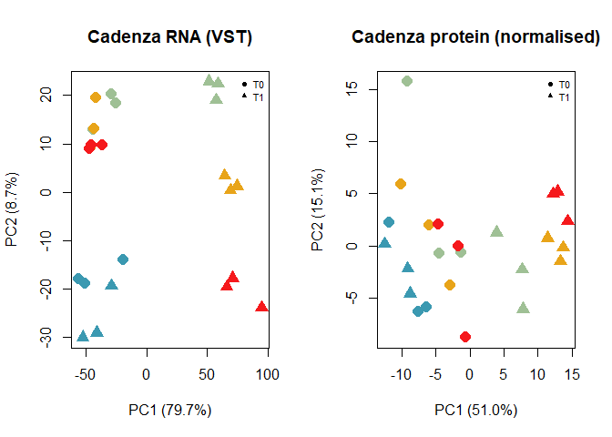
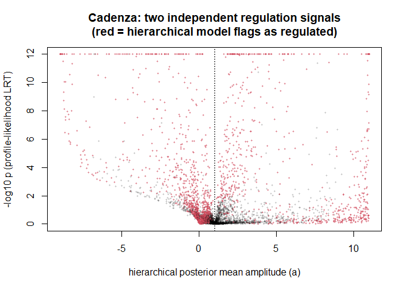
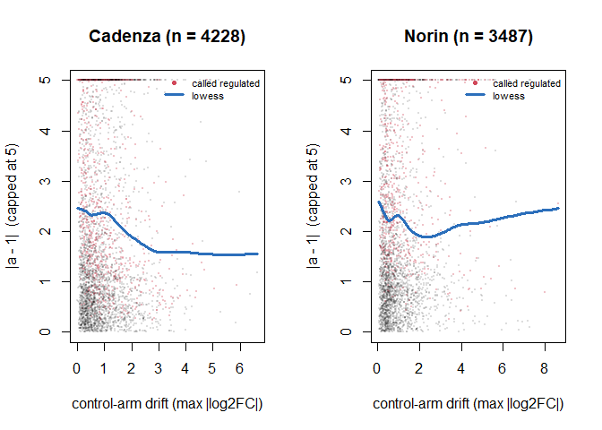
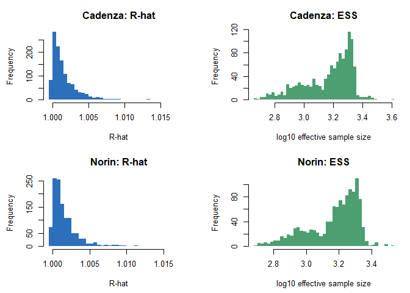
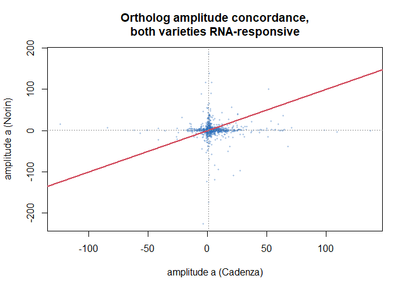

# DE proteomics - wheat
Kristina Gagalova

- [Overview](#overview)
- [Conclusions](#conclusions)
  - [What this analysis establishes](#what-this-analysis-establishes)
  - [What this analysis does *not*
    establish](#what-this-analysis-does-not-establish)
  - [Assumption status](#assumption-status)
  - [Recommended framing for the
    manuscript](#recommended-framing-for-the-manuscript)
  - [What would most improve this](#what-would-most-improve-this)
    - [Design constants](#design-constants)
  - [1. Setup](#setup)
  - [2. Loading and QC (reusable
    functions)](#loading-and-qc-reusable-functions)
  - [2c. RNA DE from the validated standalone
    workflow](#c.-rna-de-from-the-validated-standalone-workflow)
  - [3. Kinetic archetype classification
    (profile-likelihood)](#kinetic-archetype-classification-profile-likelihood)
    - [Kinetic Modeling of Transcriptome & Proteome
      Trajectories](#kinetic-modeling-of-transcriptome-proteome-trajectories)
    - [Inputs and Outputs](#inputs-and-outputs)
    - [The Two Nested Models](#the-two-nested-models)
    - [M0 - The Kinetic Null](#m0---the-kinetic-null)
    - [M1 - Kinetics Plus Amplitude](#m1---kinetics-plus-amplitude)
  - [Fitting Procedure](#fitting-procedure)
  - [The Test](#the-test)
  - [Classification Decision Tree](#classification-decision-tree)
  - [Identifiability — The `kinetics_limited`
    Class](#identifiability-the-kinetics_limited-class)
  - [Constants and Their Basis](#constants-and-their-basis)
  - [Two Things to Check Before Writing This
    Up](#two-things-to-check-before-writing-this-up)
  - [Where the Kinetic Null Comes From — Derivation and
    Assumptions](#where-the-kinetic-null-comes-from-derivation-and-assumptions)
    - [A note on `ks = kd` in the code](#a-note-on-ks-kd-in-the-code)
    - [Why A3 is questionable in this
      dataset](#why-a3-is-questionable-in-this-dataset)
  - [A3 diagnostic — does control-arm drift drive `regulated`
    calls?](#a3-diagnostic-does-control-arm-drift-drive-regulated-calls)
  - [4. Case B integration (`06`-style)](#case-b-integration-06-style)
  - [5. Run the pipeline: Cadenza](#run-the-pipeline-cadenza)
  - [6. Hierarchical Bayesian kinetics:
    Cadenza](#hierarchical-bayesian-kinetics-cadenza)
  - [7. Case B integration: Cadenza](#case-b-integration-cadenza)
  - [8. Run the pipeline: Norin](#run-the-pipeline-norin)
  - [8b. A3 diagnostic: does control-arm drift drive the `regulated`
    calls?](#b.-a3-diagnostic-does-control-arm-drift-drive-the-regulated-calls)
    - [What the diagnostic found](#what-the-diagnostic-found)
  - [8c. Hierarchical Bayesian model — assumptions and
    diagnostics](#c.-hierarchical-bayesian-model-assumptions-and-diagnostics)
    - [What the hierarchical model
      assumes](#what-the-hierarchical-model-assumes)
    - [These diagnostics already caught and fixed a real
      problem](#these-diagnostics-already-caught-and-fixed-a-real-problem)
  - [9. Cross-variety validation via reciprocal-best-hit
    orthologs](#cross-variety-validation-via-reciprocal-best-hit-orthologs)
  - [10. Summary and limitations](#summary-and-limitations)
  - [11. Closing — what to carry
    forward](#closing-what-to-carry-forward)
    - [Method caveats specific to this
      notebook](#method-caveats-specific-to-this-notebook)
    - [Next steps](#next-steps)
  - [12. Export kinetics results for integration
    analysis](#export-kinetics-results-for-integration-analysis)

## Overview

Integrated RNA-seq / quantitative proteomics analysis of a wheat
time-course treatment experiment, in two varieties (**Cadenza**,
**Norin**), each with an independent **2 treatments x 4 timepoints x 3
replicates = 24 samples per omics layer** design.

**RNA and protein are measured on different biological samples within
each variety** (unpaired / “Case B” design, per `../../CLAUDE.md` and
`../../docs/PIPELINE.md`) — not split aliquots of the same 24 samples.
That rules out sample-level factor models (MOFA+/MEFISTO/DIABLO/O2PLS)
and shapes every method choice below; see `../../docs/PIPELINE.md` and
`../../docs/planning.md` for the full reasoning.

This notebook runs the complete pipeline end to end on the real data in
`../../data/real/`:

1.  Data audit and design check
2.  QC & normalisation (RNA: `filterByExpr` + VST/voom; protein:
    validity filter + normalisation, adapted for this dataset – see the
    note in §2)
3.  ID mapping (trivial here: `protein_id == gene_id` within each
    variety)
4.  Missingness diagnosis (MNAR/MAR) and imputation
5.  Temporal differential expression (`limma`, both layers)
6.  Kinetic-null / amplitude classification (the profile-likelihood
    model from `05_concordance_archetypes.R`)
7.  **Hierarchical Bayesian kinetics** (`07_bayesian_kinetics.R`) — the
    new piece this notebook exists to run: a horseshoe-shrinkage model
    that rescues genes the profile-likelihood method above cannot
    classify on its own (the `kinetics_limited` problem this directory
    is named for)
8.  Case B design-cell integration (leave-one-cell-out Q^2 + permutation
    null)
9.  Cross-variety validation using reciprocal-best-hit orthologs — the
    one piece of genuine external validation available for real
    (non-simulated) data in this project

Steps 2–8 are defined once as reusable functions and applied to each
variety; step 9 compares the two varieties’ independent results against
each other.

------------------------------------------------------------------------

# Conclusions

**Read this section before the analysis.** Every assumption behind this
pipeline has been tested in the companion notebook
[`assumptions_validation.qmd`](assumptions_validation.qmd); five are
violated and one is unresolved. The results below are real, but they
support **population-level conclusions and not individual-gene claims**,
and that distinction determines what can go in a manuscript.

## What this analysis establishes

**1. RNA and protein responses are coupled across the infection time
course, and the coupling is statistically demonstrable despite unpaired
samples.**

Leave-one-design-cell-out cross-validation, tested against a permutation
null: given the transcriptome of a treatment × timepoint cell the model
has never seen, it predicts that cell’s proteome better than chance.

| Variety | Q² (1 component) | permutation p |
|:--------|:-----------------|:--------------|
| Cadenza | **0.269**        | 0.015         |
| Norin   | **0.084**        | 0.045         |

This is the most robust result in the project. It cannot be inflated by
the in-sample correlation artefact that makes naive cross-block
correlation meaningless at this sample size (a PLS on 8 pseudo-samples
reaches r ≈ 0.72 on *permuted* data), because Q² is computed on held-out
cells.

**2. Protein trajectories depart from a fixed-rate, RNA-only reference
model more often than an independent-error null predicts.**

Roughly 23% of RNA-responsive genes reject the kinetic null in both
varieties (Cadenza 1,050 / 4,559; Norin 896 / 3,796), analysed
independently.

**This is deliberately not worded as evidence for post-transcriptional
regulation, and it should not be.** The null omits several features that
are demonstrably present in these data — control-arm drift (§8b),
structured trajectory-shape error (`assumptions_validation.qmd` §3),
unpropagated RNA uncertainty, and correlated residuals across genes
(residual PC1 62–69% vs ~25% expected). Any of those produces departures
from a fixed-rate independent-error null *with no post-transcriptional
regulation present*, so the null is not the right comparator for a
mechanistic claim. Report these as **transcript–protein discordance**;
see `manuscript_support_report.md` §4 for the wording to use.

**3. The two varieties differ, and Cadenza is the better-behaved
dataset.** Cadenza has a clean baseline (**0.72%** of genes
differentially expressed at 0 hpi, when infection cannot yet have
acted), higher predictive coupling, and no significant association
between control-arm drift and regulation calls. Norin fails all three
(**17.6%** baseline DE; Q² = 0.084; drift OR 1.32, 95% CI 1.20–1.44, p
\< 1e-15). Where they disagree, weight Cadenza.

That baseline asymmetry is **24-fold** and is the single largest problem
in the dataset. It also undercuts the justification for t0-centring in
Norin specifically: `Rl <- Rl - Rl[, 1]` is defended below as removing a
batch artefact, but at 17.6% DE the Norin baseline contrast is carrying
substantial real signal, and centring subtracts it.

**4. Independent analyses of the two varieties agree on orthologous
genes above chance** (χ² = 727.7, df = 42, p \< 2e-16 for archetype
agreement across 2,505 testable ortholog pairs). The effect is modest
(Cramér’s V = 0.220) but it cannot be an artefact of the procedure — the
varieties share no samples and were processed separately.

## What this analysis does *not* establish

**Per-gene regulation calls are not reliable.** The model treats the RNA
trajectory as known exactly (`se_rna` is accepted by
`fit_hierarchical_kinetics()` and never used). Propagating limma’s own
RNA standard errors by parametric bootstrap flips the regulated /
not-regulated call for **36% of Cadenza genes and 49% of Norin genes**.
None of that uncertainty appears in the reported credible intervals.
Treat any named gene as a hypothesis requiring orthogonal validation
(PRM, western, qPCR).

**The count of regulated genes is soft.** On the current settings the
profile-likelihood LRT calls 951 / 4,300 RNA-responsive Cadenza genes
regulated, and the hierarchical model 1,913 / 4,300 — the two differ
two-fold on identical input, and most of that gap is uncertainty the
hierarchical model removes by conditioning on a fixed half-life, not
extra evidence. The count also moves ~30% across imputation scheme and
25% from the MCMC convergence fix alone. Always quote it with its
settings.

> The protein-SE scaling sensitivity (previously quoted as 1457 → 902 →
> 488 across 0.67× → 1× → 1.5×) was computed under the superseded RNA DE
> and has **not** been re-run against the validated DE. Do not quote
> those three numbers until `assumptions_validation.qmd` is re-rendered.

**Half-lives are mostly unresolvable, more so than earlier drafts
stated.** Cross-tabulating the `identifiable` flag against where each
fit actually landed on the half-life grid:

|                                                 | Cadenza (n = 5,580) | Norin (n = 5,159) |
|:------------------------------------------------|--------------------:|------------------:|
| Not identifiable                                |       2,732 (49.0%) |     2,651 (51.4%) |
| Identifiable, but pinned at the 12 h grid floor |       1,304 (23.4%) |       908 (17.6%) |
| **Identifiable and inside the resolvable band** |      **392 (7.0%)** |   **643 (12.5%)** |
| Fit landed above the 72 h bound                 |       2,376 (42.6%) |     1,952 (37.8%) |

A fit at the grid floor means “≤ 12 h”, not “12 h” — it is censored, and
counting it as identifiable is what produced the **23–27%** figure
quoted in earlier drafts. Only **7% of Cadenza and 13% of Norin** genes
have a half-life this design actually resolves. A reported `t_half`
above 72 h means “slower than we can see”. **The fitted `t_half`
distribution is a property of the sampling window, not of the wheat
proteome.**

**Mechanism cannot be assigned.** The amplitude parameter `a` conflates
changed translation with changed degradation — absolute `k_s` cancels
algebraically in fold-change space and is not identifiable from this
data (derivation in “Where the Kinetic Null Comes From”, below). Write
“departs from its RNA-predicted trajectory”, never “translationally
repressed”.

**The RNA-responsive gate is more permissive than it was.** The
standalone workflow exports no omnibus F-statistic, so the gate is now
the minimum BH-adjusted p across the four timepoint contrasts (paired,
as before, with \|log2FC\| \> 0.5). A min-of-adjusted-p is
anti-conservative relative to the F-test used previously, so the
responsive set is larger for reasons independent of the DE change
itself. This must be disclosed in Methods. It is reversible — the F-test
gate can be taken from the local fit exactly as `ctrl_time` now is.

## Assumption status

| Assumption                      | Status                  | Evidence                                    |
|:--------------------------------|:------------------------|:--------------------------------------------|
| Abundance-dependent missingness | **Holds**               | Spearman −0.74 / −0.75                      |
| Horseshoe prior scale           | **Holds**               | Insensitive, `p0_frac` 0.05–0.40            |
| MCMC convergence                | **Holds**               | 0% R-hat \> 1.05, ESS ≈ 1600                |
| DE reconciliation               | **Resolved**            | Validated standalone DE adopted; see §2c    |
| Protein variance known          | Partly                  | Amplitude invariant; sensitivity re-run due |
| Every missing cell is MNAR      | **Not established**     | Abundance-dependence ≠ per-cell MNAR        |
| A0 baseline equivalence         | **Severely asymmetric** | Cadenza 0.72%, **Norin 17.6%** at 0 hpi     |
| A3 control at steady state      | **Violated**            | Median control drift ≈ 0.67 log2FC          |
| A1 first-order kinetics         | **Violated**            | Structured residuals, opposite per variety  |
| B5 gene independence            | **Violated**            | Residual PC1 62–69% vs 25% expected         |
| B4 RNA known exactly            | **Severely violated**   | 36% / 49% of calls flip                     |
| LRT null is well-calibrated     | **Not established**     | χ² approx. ignores grid selection; §5 R3    |

## Recommended framing for the manuscript

> We integrated unpaired transcriptome and proteome measurements at the
> treatment-by-timepoint design-cell level. RNA trajectories predicted
> held-out protein trajectories better than a permutation null
> (leave-one-cell-out Q² = 0.27, permutation p = 0.015 in Cadenza),
> indicating reproducible cross-omic association at the population
> level. However, protein trajectories frequently departed from a
> fixed-rate first-order RNA-predicted model, and these departures were
> sensitive to control-arm drift, missing-value handling, and
> uncertainty in the RNA trajectories. We therefore interpret the
> results as evidence for transcript–protein discordance and regulation
> beyond transcript abundance, rather than as direct estimates of
> protein turnover, translation, or degradation. Individual candidates
> should be treated as hypotheses requiring orthogonal validation.

See `manuscript_support_report.md` for the full claim-by-claim wording
table, the revisions required before submission, and the supporting
literature.

## What would most improve this

1.  **Investigate Norin’s 0 hpi baseline** — at 17.6% DE before
    infection can have acted, this is now the largest single problem in
    the dataset, and it is upstream of Norin’s other anomalies. It also
    determines whether t0-centring is defensible in that variety.
2.  **Make the kinetic null control-aware** — fit the infected and
    control arms jointly, or add a time-varying baseline term. The
    measured drift violates the steady-state assumption the ratio model
    rests on; this is the change that would most strengthen claim 2.
3.  **Replace the analytic LRT with a parametric bootstrap** that
    repeats the full fit, grid selection included, and propagates RNA
    uncertainty, protein uncertainty, timepoint covariance and
    imputation.
4.  **Propagate RNA uncertainty** into the kinetic model — converts
    per-gene calls from unusable to usable.
5.  **Orthogonally validate 5–10 targets** — the only route to a
    publishable gene-level claim given the above.

> **Done:** the DE reconciliation (`assumptions_validation.qmd` §2b) is
> resolved — the RNA treatment contrasts are now read from the project’s
> standalone limma workflow rather than re-derived here, so there is one
> RNA DE result in the project rather than two that disagreed 2–6×. See
> §2c.

------------------------------------------------------------------------

### Design constants

Both of these were originally unknown from `data/real/*_metadata.csv`
alone (which encodes only `T0`/`T1` and `t0`..`t3`) and have since been
resolved against the full RNA-seq sample sheet:

``` r
## 1. WHICH TREATMENT IS THE REFERENCE?  -- CONFIRMED
##    data/real/*_metadata.csv encodes only "T0"/"T1". Cross-referencing the
##    sample IDs against the full RNA-seq sample sheet (which carries the
##    real labels) resolves it: LH4 is Cadenza/NEG/0h there and T0/t0 here,
##    LH10 is Cadenza/PN143/0h there and T1/t0 here. So:
##        T0 = NEG   = uninfected control  -> reference level
##        T1 = PN143 = infected            -> treatment
##    Flipping this mirrors every log2FC and every kinetic direction
##    (amplified <-> buffered), so it is worth the cross-check.
TREATMENT_REF <- "T0"

## 2. WHAT IS THE REAL TIME SPACING?  -- CONFIRMED
##    The same sample sheet carries an `hour` column: t0/t1/t2/t3 are
##    0 / 24 / 48 / 72 hours (i.e. 0-3 dpi), evenly spaced at 24 h.
##    Every half-life reported downstream is therefore in HOURS.
TIMEPOINT_VALUES <- c(0, 24, 48, 72)
TIME_UNIT_LABEL  <- "hours"
```

Note the consequence for the kinetic model: the half-life search grid
starts at `0.5 * 24 = 12 h`, so **no half-life below 12 h can be
resolved** by this design. Proteins turning over faster than that are
reported at the grid floor.

## 1. Setup

``` r
## Quarto's default execution directory is this file's own folder
## (analysis/kinetics_limited/), while every R/*.R script in this project
## assumes the working directory is the PROJECT ROOT (matching how
## run_all.sh invokes them). Rather than fight that mismatch with a
## working-directory switch (fragile: root.dir changes how KNITR evaluates
## chunks, but does not change what a *sourced* script sees via
## sys.frame()$ofile, which is empty inside a knitr chunk anyway), every
## path below is resolved with here::here(), which walks up from the
## current directory looking for a project marker file -- this project has
## four (IntegrateProtRNA.Rproj, DESCRIPTION, renv.lock, .git) -- and returns
## an absolute path that is correct no matter where code is executed from.
## need_pkgs() itself is defined inside utils.R, so "here" -- the one package
## every subsequent path depends on -- is checked directly first.
if (!requireNamespace("here", quietly = TRUE))
  stop("package 'here' is required; install with install.packages('here')")
source(here::here("R", "utils.R"))
source(here::here("R", "pls_utils.R"))
source(here::here("R", "07_bayesian_kinetics.R"))
need_pkgs(c("limma", "edgeR", "DESeq2", "matrixStats", "impute", "here"))

set.seed(20260822)
DATA_DIR <- here::here("data", "real")

DESIGN <- list(
  treatments = c(TREATMENT_REF, setdiff(c("T0", "T1"), TREATMENT_REF)),
  reference  = TREATMENT_REF,
  timepoints = TIMEPOINT_VALUES,
  n_reps     = 3
)
CELLS <- as.vector(t(outer(DESIGN$treatments, DESIGN$timepoints,
                          function(a, b) sprintf("%s_t%s", a, b))))
```

## 2. Loading and QC (reusable functions)

``` r
#' Load one variety's RNA, protein, metadata and gene mapping.
#'
#' Metadata is a single file per variety, shared across both omics layers'
#' column headers -- the LH-style sample IDs happen to coincide between the
#' RNA and protein matrices for a given variety (both trace back to the same
#' field-plot label), but per the Case B design this is NOT treated as
#' sample-level pairing anywhere downstream: only variety x treatment x
#' timepoint CELL membership is used to link the two layers (see
#' `../../R/06_integration_caseB.R`'s header for why).
load_variety <- function(prefix) {

  data_dir <- here::here("data", "real")

  meta <- read.csv(
    file.path(data_dir, paste0(prefix, "_metadata.csv")),
    row.names = 1
  )

  meta$time_num  <- TIMEPOINT_VALUES[
    match(meta$timepoint, sort(unique(meta$timepoint)))
  ]
  meta$treatment <- factor(meta$treatment, levels = DESIGN$treatments)
  meta$cell <- factor(
    sprintf("%s_t%s", meta$treatment, meta$time_num),
    levels = CELLS
  )

  rna <- as.matrix(
    read.csv(
      file.path(data_dir, paste0(prefix, "-rnaseq.csv")),
      row.names = 1,
      check.names = FALSE
    )
  )

  prot <- as.matrix(
    read.csv(
      file.path(data_dir, paste0(prefix, "-prot.csv")),
      row.names = 1,
      check.names = FALSE
    )
  )

  gmap <- read.csv(
    file.path(data_dir, paste0(prefix, "_protein_gene_mapping.csv"))
  )

  stopifnot(
    all(colnames(rna) %in% rownames(meta)),
    all(colnames(prot) %in% rownames(meta))
  )

  rna  <- rna[, rownames(meta), drop = FALSE]
  prot <- prot[, rownames(meta), drop = FALSE]

  list(
    rna = rna,
    prot = prot,
    meta = meta,
    gmap = gmap
  )
}
```

``` r
#' RNA QC: filterByExpr, then VST (integration matrix) + voom-ready counts.
#' Same procedure as `01_qc_normalise.R`, applied to real counts directly.
run_qc_rna <- function(counts, meta) {
  ## Manual low-expression filter (DESeq2-style threshold), replacing
  ## edgeR::filterByExpr()'s adaptive heuristic: keep a gene if it has
  ## >= 10 counts in at least as many samples as the smallest design group.
  dge <- edgeR::DGEList(counts = counts)
  smallestGroupSize <- DESIGN$n_reps   # 3
  keep <- rowSums(dge$counts >= 10) >= smallestGroupSize
  dge  <- dge[keep, , keep.lib.sizes = FALSE]
  cf   <- dge$counts

  dge <- edgeR::calcNormFactors(dge)
  logcpm <- edgeR::cpm(dge, log = TRUE, prior.count = 3)
  dds <- DESeq2::DESeqDataSetFromMatrix(cf, meta, ~cell)
  dds <- DESeq2::estimateSizeFactors(dds)
  vst <- SummarizedExperiment::assay(
    DESeq2::vst(dds, blind = TRUE, nsub = min(1000, sum(rowMeans(cf) > 5))))
  list(counts = cf, logcpm = logcpm, vst = vst, n_in = nrow(counts), n_kept = nrow(cf))
}

#' Protein QC, adapted from `01_qc_normalise.R` for this dataset:
#' the real protein_gene_mapping.csv carries no unique-peptide/decoy/
#' contaminant columns (unlike the simulator's MaxQuant-style metadata), so
#' that part of 01's filtering is not applicable here and is skipped
#' explicitly rather than silently omitted. Zero is treated as "not
#' quantified" (standard LFQ-intensity convention), not a true biological
#' zero -- it becomes NA before the validity filter and normalisation.
run_qc_prot <- function(intensity, meta, min_valid_in_cell = 2) {
  ## Sample columns must be in metadata row order -- limma matches design-matrix
  ## ROWS to expression-matrix COLUMNS positionally, and the cell indexing is
  ## positional too, so a mismatch mislabels every sample silently. Not
  ## hypothetical: as stored on disk, 3 of the 4 real matrices are in a
  ## different order from their metadata. load_variety() reorders by name.
  stopifnot(identical(colnames(intensity), rownames(meta)))


  # Zero means "not quantified", not a biological zero
  m <- intensity
  m[m == 0] <- NA
  m <- log2(m)

  # Validity filter: >= n valid values in AT LEAST ONE design cell.
  # A global ">= 50% valid" rule would delete genuine on/off biology.
  valid_per_cell <- vapply(
    levels(meta$cell),
    function(cl) rowSums(!is.na(m[, meta$cell == cl, drop = FALSE])),
    numeric(nrow(m))
  )

  keep <- matrixStats::rowMaxs(valid_per_cell) >= min_valid_in_cell
  mf   <- m[keep, , drop = FALSE]

  # Median normalisation: shift each sample so its median matches the
  # matrix-wide median. Corrects per-run loading, not biology.
  shift <- apply(mf, 2, median, na.rm = TRUE) - median(mf, na.rm = TRUE)
  mn    <- sweep(mf, 2, shift, "-")

  list(
    norm      = mn,
    n_in      = nrow(intensity),
    n_kept    = nrow(mf),
    miss_rate = mean(is.na(mn))
  )
}
```

``` r
#' MNAR/MAR diagnosis and mixed imputation, same rule as `03_missingness.R`:
#' a protein missing in EVERY replicate of a cell (but observed in some other
#' cell) is MNAR (left-censored -- genuinely low/absent there); missing in
#' only SOME replicates of its cell is MAR (stochastic). Imputed values are
#' for Universe A / integration use only -- the DE and kinetics steps below
#' use these imputed values too (protein has no complete-case alternative at
#' this scale), but the up-front validity filter (>=2 valid in >=1 cell)
#' keeps the imputation from manufacturing pure noise.
run_missingness <- function(prot_norm, meta) {
  ## Sample columns must be in metadata row order -- limma matches design-matrix
  ## ROWS to expression-matrix COLUMNS positionally, and the cell indexing is
  ## positional too, so a mismatch mislabels every sample silently. Not
  ## hypothetical: as stored on disk, 3 of the 4 real matrices are in a
  ## different order from their metadata. load_variety() reorders by name.
  stopifnot(identical(colnames(prot_norm), rownames(meta)))

  cells <- levels(meta$cell)
  is_na <- is.na(prot_norm)
  n_obs_cell <- vapply(cells, function(cl)
    rowSums(!is.na(prot_norm[, meta$cell == cl, drop = FALSE])), numeric(nrow(prot_norm)))
  lab <- matrix("obs", nrow(prot_norm), ncol(prot_norm), dimnames = dimnames(prot_norm))
  for (k in seq_along(cells)) {
    ii <- which(meta$cell == cells[k]); gone <- n_obs_cell[, k] == 0
    lab[gone, ii] <- "MNAR"; lab[!gone, ii][is_na[!gone, ii]] <- "MAR"
  }
  lab[!is_na] <- "obs"

  mar_imp <- suppressWarnings(
    impute::impute.knn(prot_norm, k = 10, rowmax = 0.95, colmax = 0.95)$data)
  mnar_imp <- prot_norm
  for (j in seq_len(ncol(prot_norm))) {
    v <- prot_norm[, j]; nas <- is.na(v)
    if (!any(nas)) next
    mu <- mean(v, na.rm = TRUE); sdv <- sd(v, na.rm = TRUE)
    ## Perseus-style down-shifted normal: width 0.3, downshift 1.8 SD.
    mnar_imp[nas, j] <- rnorm(sum(nas), mu - 1.8 * sdv, 0.3 * sdv)
  }
  mixed <- prot_norm
  mixed[lab == "MAR"]  <- mar_imp[lab == "MAR"]
  mixed[lab == "MNAR"] <- mnar_imp[lab == "MNAR"]
  stopifnot(!anyNA(mixed))
  list(mixed = mixed, labels = lab,
       mnar_frac = mean(lab == "MNAR"), mar_frac = mean(lab == "MAR"))
}
```

``` r
#' Temporal DE, both layers, same design as `04_univariate_temporal_de.R`:
#' an 8-level ~0+cell design, per-timepoint treatment contrasts, and an
#' any-effect F-test. limma is used for both RNA (voom) and protein (trend +
#' robust eBayes) so effect sizes are on a comparable scale.
run_de <- function(mat, meta, is_rna) {
  ## Sample columns must be in metadata row order -- limma matches design-matrix
  ## ROWS to expression-matrix COLUMNS positionally, and the cell indexing is
  ## positional too, so a mismatch mislabels every sample silently. Not
  ## hypothetical: as stored on disk, 3 of the 4 real matrices are in a
  ## different order from their metadata. load_variety() reorders by name.
  stopifnot(identical(colnames(mat), rownames(meta)))

  ## Treatment-contrast parameterisation (~treatment*time), matching your
  ## limma workflow, in place of the ~0+cell design used before. The two are
  ## equivalent full-rank codings of the same means model: the per-timepoint
  ## contrasts reconstructed below (main effect + interaction term) give the
  ## same logFC/SE as the T1_tX - T0_tX cell-means contrast this replaces.
  meta$treatment <- relevel(factor(meta$treatment, levels = DESIGN$treatments),
                            ref = DESIGN$reference)
  meta$time_f    <- relevel(factor(meta$time_num, levels = DESIGN$timepoints),
                            ref = as.character(DESIGN$timepoints[1]))
  design <- model.matrix(~ treatment * time_f, data = meta)
  colnames(design) <- make.names(colnames(design))

  if (is_rna) {
    dge <- edgeR::calcNormFactors(edgeR::DGEList(mat))
    v   <- limma::voom(dge, design, plot = FALSE)
    fit <- limma::lmFit(v, design)
  } else {
    fit <- limma::lmFit(mat, design)
  }

  ## Reconstruct the per-timepoint treatment contrasts (Infected - Control at
  ## each timepoint): the reference timepoint's contrast IS
  ## main effect; every later timepoint adds its interaction term.
  alt       <- setdiff(DESIGN$treatments, DESIGN$reference)
  main_coef <- paste0("treatment", alt)
  int_coefs <- paste0(main_coef, ".time_f", DESIGN$timepoints[-1])
  stopifnot(all(c(main_coef, int_coefs) %in% colnames(design)))  # catches a

                                                                  ## mismatch
                                                                  ## immediately

                                                                  ## downstream
  contrast_defs <- setNames(
    c(main_coef, paste(main_coef, int_coefs, sep = " + ")),
    paste0("tp_t", DESIGN$timepoints))
  cm <- limma::makeContrasts(contrasts = contrast_defs, levels = design)
  colnames(cm) <- names(contrast_defs)
  f2 <- limma::eBayes(limma::contrasts.fit(fit, cm), trend = TRUE, robust = TRUE)

  lfc  <- f2$coefficients; colnames(lfc) <- paste0("t", DESIGN$timepoints)
  se   <- f2$stdev.unscaled * sqrt(f2$s2.post); colnames(se) <- colnames(lfc)
  padj <- apply(f2$p.value, 2, p.adjust, "BH"); colnames(padj) <- colnames(lfc)

  ## Omnibus F-test across the 4 timepoint contrasts, same
  ## as.numeric() strips rownames, so reattach them explicitly.
  ff <- limma::classifyTestsF(f2, fstat.only = TRUE)
  p_any <- setNames(pf(as.numeric(ff), attr(ff, "df1"), attr(ff, "df2"), lower.tail = FALSE),
                    rownames(f2))

  ## CONTROL-ARM time effects. In a ~treatment*time design with Control as the
  ## reference treatment level, the bare `time_fX` coefficients are exactly the
  ## control arm's own change from baseline (Control at tX - Control at t0).
  ## These are not used for any treatment inference -- they are returned solely
  ## to test the quasi-steady-state assumption the kinetic null model rests on
  ## (assumption A3; see the A3 diagnostic section).
  time_coefs <- paste0("time_f", DESIGN$timepoints[-1])
  ctrl_time <- NULL
  if (all(time_coefs %in% colnames(fit$coefficients))) {
    ctrl_time <- fit$coefficients[, time_coefs, drop = FALSE]
    colnames(ctrl_time) <- paste0("t", DESIGN$timepoints[-1])
  }

  list(lfc = lfc, se = se, fdr = padj, any_fdr = p.adjust(p_any, "BH"),
       ctrl_time = ctrl_time)
}
```

------------------------------------------------------------------------

## 2c. RNA DE from the validated standalone workflow

`run_de()` above is retained for the protein layer and for the
control-arm time coefficients, but the **RNA treatment contrasts are
taken from the project’s standalone limma workflow**
(`norinXcadenza-shared`, `DE-varieties-limma`) rather than re-derived
here. That workflow is the one whose numbers appear elsewhere in the
project, and re-deriving them here produced the 2–6× disagreement
documented in `assumptions_validation.qmd` §2b. Reading its published
per-timepoint contrasts removes the disagreement by construction: there
is now one RNA DE result in the project, not two.

Two things the standalone CSVs do not carry, and how each is handled:

- **Standard errors** are recovered as `|logFC / t|`, which is exact —
  `t` is defined as `logFC / SE`, so this inverts it losslessly.
- **An omnibus F-test** is not exported, so the RNA-responsive gate uses
  the minimum BH-adjusted p across the four timepoint contrasts instead.
  This is more permissive than the F-test and is noted at the call site.

``` r
## The loader lives in R/load_validated_de.R so that this notebook and
## prepare_variety() (used by every other analysis/ notebook) share one
## definition rather than two copies that can drift apart.
source(here::here("R", "load_validated_de.R"))
```

------------------------------------------------------------------------

## 3. Kinetic archetype classification (profile-likelihood)

> **Reference material.** §3–§4 document the model, its derivation, its
> constants and its assumptions in full. If you are reading for results
> rather than method, skip to **§5 (Cadenza)**; the conclusions are at
> the top of this document.

### Kinetic Modeling of Transcriptome & Proteome Trajectories

Standard Differential Expression (DE) tells you whether a transcript and
its protein each changed. It cannot tell you whether a discordance
between them is biologically meaningful. A gene whose mRNA rises sharply
while its protein barely moves has two completely different possible
explanations:

- **The protein is under post-transcriptional control** (translational
  repression, accelerated degradation, sequestration) - biology.
- **The protein simply has a long half-life** and hasn’t had time to
  accumulate yet - kinetics.

Both produce the identical snapshot pattern. This step exists to
separate them, and it’s the reason a time course was run at all.

### Inputs and Outputs

**Inputs** (all genes × timepoints matrices, restricted to Universe B -
genes with both layers passing QC):

| Argument                  | Content                                                                              |
|:--------------------------|:-------------------------------------------------------------------------------------|
| `Rl, Pl`                  | log2FC trajectories (treated vs control), t0-centred so column 1 is identically zero |
| `Rs, Ps`                  | limma moderated standard errors for those logFCs                                     |
| `tps`                     | sampled timepoints                                                                   |
| `fdr_thresh, min_abs_lfc` | classification thresholds (defaults 0.05, 0.5)                                       |

**Output:** one row per gene — `archetype`, `amplitude_a`,
`t_half_M0_h`, `t_half_M1_h`, `identifiable`, `rna_responds`,
`regulated`, `lrt_p`, `lrt_fdr`.

### The Two Nested Models

Everything is expressed as fold-change relative to the time-matched
control:

$$
r(t) = 2^{\,\text{logFC}_{\text{RNA}}(t)}, \qquad
p(t) = 2^{\,\text{logFC}_{\text{protein}}(t)}
$$

both starting at 1.

### M0 - The Kinetic Null

Under assumptions A1–A3 (derived in “Where the Kinetic Null Comes From”
below — note that A3 is measurably violated in this dataset), if the
treatment changed only transcript abundance the protein follows
first-order kinetics:

$$
\frac{dp}{dt} = k_d \cdot (r(t) - p(t)), \quad p(0) = 1
$$

One free parameter: `k_d`, the degradation rate (reported as half-life
`log(2)/k_d`). This is the trajectory the protein must take if nothing
post-transcriptional is happening. Implemented via
`integrate_protein_mat(..., ks = kd, kd = kd, P0 = 1)` - setting
`ks = kd` makes the steady state equal $r$, which is what encodes
“protein eventually catches up to its mRNA.”

### M1 - Kinetics Plus Amplitude

Adds a single scaling factor:

$$
\text{logFC}_{\text{protein}}(t) = a \cdot \log_2 p(t; k_d)
$$

$a = 1$ is exactly M0. The interpretation of $a$ is the whole point:

| $a$             | Meaning                                                                                              |
|:----------------|:-----------------------------------------------------------------------------------------------------|
| **≈ 1**         | Protein tracks its mRNA as kinetics predict — no post-transcriptional signature                      |
| **0 \< a \< 1** | **Buffered** — response damped relative to prediction (translational repression, faster degradation) |
| **a \> 1**      | **Amplified** — response exceeds prediction (increased translation efficiency, stabilisation)        |
| **a \< 0**      | **Anticorrelated** — protein moves opposite to its mRNA                                              |

------------------------------------------------------------------------

## Fitting Procedure

For each of 80 candidate half-lives on a log-spaced grid, both models
are fitted to all genes simultaneously (vectorised), then the best grid
point per gene is taken:

1.  Solve the ODE at that `k_d` → predicted trajectory $pl$.
2.  **M0:** weighted SSR of $pl$ against observed, $a$ fixed at 1.
3.  **M1:** the optimal $a$ has a closed form — weighted least squares
    through the origin,
    $a = \frac{\sum (W \cdot pl \cdot Pl)}{\sum (W \cdot pl^2)}$ — so
    it’s profiled out analytically at zero cost rather than searched.
    Minimum SSR is then $SST - \frac{\text{num}^2}{\text{den}}$.
4.  `max.col(-ssr)` picks each gene’s best half-life independently for
    M0 (`t_half_M0_h`) and M1 (`t_half_M1_h`).

Weights are $W = \frac{1}{\max(Ps, 0.05)^2}$ — inverse-variance, so each
gene is judged against its own measurement noise. With $n=3$ per cell
this is essential; without it, noisy low-abundance proteins would
dominate the “regulated” calls.

Because t0 is the centring anchor, both `Pl[,1]` and `pl[,1]` are
exactly 0, so that timepoint contributes nothing to the SSR — the fit
uses the 3 post-baseline points.

## The Test

`LRT = SSR_M0 - SSR_M1`, compared to $\chi^2$ with 1 df. Since the
weights already carry $1/\sigma^2$, the weighted SSR difference is
directly on the chi-square scale. BH-adjusted across genes $\rightarrow$
`lrt_fdr`.

A gene is called **regulated** when the data statistically demand
$a \neq 1$ — i.e. the kinetic null is insufficient. This is a rejection
test, not a threshold on effect size.

## Classification Decision Tree

Evaluated in this order (later assignments overwrite earlier):

``` text
unchanged                                    (default)
├── not RNA-responsive, but protein moves  → protein_only
└── RNA-responsive
    ├── null NOT rejected
    │   ├── half-life unidentifiable         → kinetics_limited
    │   ├── identifiable, fast               → concordant
    │   └── identifiable, slow               → kinetic_lag
    └── null rejected (regulated)
        ├── a ≥ 1                            → amplified
        ├── 0 < a < 1                        → buffered
        └── a ≤ 0                            → anticorrelated
```

**Two structural properties worth documenting:**

- `regulated` requires `rna_resp`. Amplitude is meaningless without an
  RNA signal to scale — for a flat transcript, $a \cdot 0 = 0$ for any
  $a$. This gate is what makes `protein_only` a separate category rather
  than a spuriously extreme amplitude.
- `concordant` vs `kinetic_lag` is a labelling split, not a test. Both
  mean “the kinetic null was sufficient.” The slow cutoff just separates
  fast-turnover proteins from slow ones for readability; genes near the
  line are on a continuum.

## Identifiability — The `kinetics_limited` Class

This is the most important thing to convey in documentation. A half-life
longer than the observation window cannot be estimated from that window
— a protein with a 200 h half-life and one with a 500 h half-life look
identical across 72 h. In that regime, “slow turnover” and “strong
buffering” both flatten the predicted trajectory and become genuinely
confounded.

Rather than silently assigning such genes to `kinetic_lag` or
`buffered`, they are flagged `identifiable = FALSE` and given their own
archetype. `kinetics_limited` is an honest statement of what the data
cannot resolve, not a biological category. On the simulated ground-truth
data this was ~15% of genes; the real remedy is an external half-life
prior (see `concordance.half_life_prior_file` in `config/config.yaml`),
which cut it to ~6%.

## Constants and Their Basis

| Constant         | Value                        | Basis                                                                                                                                                                                                                                             |
|:-----------------|:-----------------------------|:--------------------------------------------------------------------------------------------------------------------------------------------------------------------------------------------------------------------------------------------------|
| `th_bound`       | `max(tps)`                   | Principled — the identifiability boundary. Half-lives beyond the observation window are unestimable by construction.                                                                                                                              |
| `th_grid range`  | `0.5 * Δt` to `6 * max(tps)` | **Lower:** below half the smallest sampling gap, distinct half-lives give indistinguishable sampled trajectories.<br>**Upper:** extends past the boundary so slow genes aren’t clamped — the `identifiable` flag reports the uncertainty instead. |
| `th_grid points` | `80`                         | Empirical (“more doesn’t change the answer”), not derived.                                                                                                                                                                                        |
| `ODE grid step`  | `0.25`                       | Discretisation error negligible vs measurement noise.                                                                                                                                                                                             |
| `SE floor`       | `0.05`                       | Numerical guard so a spuriously tiny moderated SE can’t give one gene near-infinite weight.                                                                                                                                                       |
| `min_abs_lfc`    | `0.5`                        | Effect-size floor (~41% change) so statistically-significant-but-trivial changes aren’t kinetically modelled. Conventional.                                                                                                                       |
| `fdr_thresh`     | `0.05`                       | Standard BH convention.                                                                                                                                                                                                                           |
| `slow cutoff`    | `0.5 * th_bound`             | Readability split only (see above).                                                                                                                                                                                                               |

> The first two rows change what the model means; the rest are
> conventional defaults you can retune.

## Two Things to Check Before Writing This Up

1.  **The responsiveness gate:** The notebook’s port differs from `05`.
    `05` uses both an FDR test and an effect-size floor:

    ``` r
    rna_resp  <- (r_any < FDR) & (max_abs(Rl) > MINLF)
    prot_resp <- (p_any < FDR) & (max_abs(Pl) > MINLF)
    ```

    The notebook version uses effect size only (it doesn’t receive the
    F-test FDR vectors). That makes `rna_responds` and `protein_only`
    more permissive in the notebook than in `05`, so the two will not
    produce identical archetype counts on the same data. Worth either
    documenting as a deliberate simplification or fixing to match — say
    which and I’ll align them.

2.  **`th_grid`’s lower bound is timepoint-scale-dependent:** It’s
    `0.5 * diff(tps)[1]`, so with `TIMEPOINT_VALUES = c(0,1,2,3)` it’s
    0.5 units, but with real hours `c(0,24,48,72)` it becomes 12 h —
    meaning no half-life below 12 h can be fitted. Given wheat protein
    turnover, that’s probably fine, but it’s a real constraint that
    appears only after the timepoint values are corrected, and it should
    be stated in the docs.

------------------------------------------------------------------------

## Where the Kinetic Null Comes From — Derivation and Assumptions

The model is **not** a necessary consequence of “the treatment only
changed transcript abundance.” It follows from three assumptions, and it
is worth stating all three because one of them is measurably violated in
this dataset.

Start from absolute abundance in each arm, assuming first-order kinetics
with the *same* rate constants in both:

$$
\frac{dP_c}{dt} = k_s R_c(t) - k_d P_c(t), \qquad \frac{dP_t}{dt} = k_s R_t(t) - k_d P_t(t)
$$

Define the fold-changes

$$
r = R_t / R_c, \qquad p = P_t / P_c
$$

and differentiate the quotient:

$$
\frac{dp}{dt} = \frac{P_t' P_c - P_t P_c'}{P_c^2}
              = \frac{k_s (R_t P_c - R_c P_t)}{P_c^2}
              = \underbrace{\frac{k_s R_c}{P_c}}_{\text{coefficient}} (r - p)
$$

The `k_d` terms **cancel exactly**. The coefficient is `k_s·R_c/P_c`,
*not* `k_d`. It equals `k_d` only when `k_s·R_c = k_d·P_c` — that is,
only when the control arm is at steady state.

So the implemented equation `dp/dt = k_d(r - p)` requires:

| \#     | Assumption                                                | Status                                                                                                                                                                                       |
|:-------|:----------------------------------------------------------|:---------------------------------------------------------------------------------------------------------------------------------------------------------------------------------------------|
| **A1** | Protein dynamics are first-order: `dP/dt = k_s·R - k_d·P` | Approximation. Excludes translational saturation, cooperative/zero-order degradation, stoichiometry-driven degradation of unassembled complex subunits, and transcription→translation delay. |
| **A2** | Treatment leaves `k_s` and `k_d` unchanged                | This *is* the null hypothesis being tested. Rejecting it is the point.                                                                                                                       |
| **A3** | Control arm is at (quasi-)steady state throughout         | **Measurably violated here — see the diagnostic below.**                                                                                                                                     |

### A note on `ks = kd` in the code

`integrate_protein_mat(..., ks = kd, kd = kd, P0 = 1)` is **not** a
biological claim that synthesis rate equals degradation rate. In the
fold-change formulation absolute `k_s` cancels out entirely and is not
identifiable from this data at all (it is absorbed by the per-protein MS
response factor). Setting `ks = kd` is the mathematical encoding of
**A3** — it forces the steady state of the relative system to equal $r$.

### Why A3 is questionable in this dataset

In a `~treatment*time` design with Control as the reference level, the
bare `time` coefficients are exactly the control arm’s own change from
baseline. Those coefficients show substantial control-arm movement over
the time course — unsurprising for wheat seedlings over 72 h
(development, circadian rhythm, handling), but a direct violation of
“control at steady state.”

The consequence is specific: when `R_c` is rising, `P_c` lags below its
steady state, so the true coefficient `k_s·R_c/P_c` exceeds `k_d`; when
`R_c` falls, it drops below. Because `k_d` and $a$ trade off along the
identifiability ridge, that misfit can leak into the amplitude estimate
— meaning some `regulated` calls could reflect control-arm
non-stationarity rather than treatment-specific post-transcriptional
control.

Two mitigating points, for balance: the ratio formulation cancels any
effect **shared** by both arms exactly, and growth dilution inflates
`k_d` uniformly without breaking the functional form. It is specifically
the *lag of* `P_c` *behind a moving* `R_c` that breaks A3, not movement
per se.

The next section tests how much this actually matters.

## A3 diagnostic — does control-arm drift drive `regulated` calls?

``` r
#' Test assumption A3 (control arm at quasi-steady state) empirically.
#'
#' If A3 violation were generating spurious `regulated` calls, genes whose
#' CONTROL arm drifts most over the time course should be enriched for
#' `regulated` relative to genes whose control arm is stable.
#'
#' CONFOUNDER, and why the raw enrichment is not the headline number: genes
#' with large control-arm drift also tend to have larger treatment effects and
#' higher expression, both of which independently increase power to reject the
#' kinetic null. A raw drift-vs-regulated association would therefore be
#' expected even under a perfectly valid A3. The reported test is a logistic
#' regression of `regulated` on control drift ADJUSTED for the gene's own RNA
#' response amplitude, so the drift coefficient answers the question that
#' matters: at a given treatment effect size, does control-arm instability
#' still predict being called regulated?
run_a3_diagnostic <- function(ctrl_time, Rl, arch, rna_resp, label = "") {
  idx <- match(rownames(Rl), arch$gene_id)
  d <- data.frame(
    gene_id   = rownames(Rl),
    ## control-arm drift: largest absolute change of the CONTROL arm from
    ## baseline, across post-baseline timepoints
    drift     = apply(abs(ctrl_time[rownames(Rl), , drop = FALSE]), 1, max),
    ## treatment effect amplitude, the confounder being adjusted for
    rna_amp   = apply(abs(Rl[, -1, drop = FALSE]), 1, max),
    regulated = arch$regulated[idx],
    a         = arch$amplitude_a[idx],
    resp      = rna_resp,
    stringsAsFactors = FALSE)
  ## Restrict to the genes the kinetic model was actually fitted on.
  d <- d[d$resp & is.finite(d$a) & is.finite(d$drift) & is.finite(d$rna_amp), ]

  ## Unadjusted view: regulated rate by control-drift quartile.
  d$drift_q <- cut(d$drift, quantile(d$drift, 0:4 / 4), include.lowest = TRUE,
                   labels = c("Q1 (most stable)", "Q2", "Q3", "Q4 (most drift)"))
  by_q <- do.call(rbind, lapply(split(d, d$drift_q), function(g)
    data.frame(n = nrow(g),
               median_drift = round(median(g$drift), 2),
               median_rna_amp = round(median(g$rna_amp), 2),
               pct_regulated = round(100 * mean(g$regulated), 1))))
  by_q <- data.frame(drift_quartile = rownames(by_q), by_q, row.names = NULL)

  ## Adjusted test.
  fit <- glm(regulated ~ scale(drift) + scale(rna_amp), binomial, data = d)
  co  <- summary(fit)$coefficients
  ci  <- suppressMessages(confint(fit))
  res <- data.frame(
    term = c("control drift", "RNA amplitude"),
    odds_ratio = round(exp(co[2:3, "Estimate"]), 3),
    ci_lo = round(exp(ci[2:3, 1]), 3),
    ci_hi = round(exp(ci[2:3, 2]), 3),
    p_value = signif(co[2:3, "Pr(>|z|)"], 3), row.names = NULL)

  ## Same question on the continuous amplitude deviation |a - 1|.
  sp_raw <- suppressWarnings(cor(d$drift, abs(d$a - 1), method = "spearman"))
  ## Partial Spearman, adjusting for rna_amp by ranking then residualising.
  rr <- function(x) rank(x)
  pres <- residuals(lm(rr(abs(d$a - 1)) ~ rr(d$rna_amp)))
  dres <- residuals(lm(rr(d$drift)      ~ rr(d$rna_amp)))
  sp_adj <- cor(dres, pres)

  ## COLLINEARITY CHECK -- required to interpret `adjusted` honestly. Control
  ## drift and treatment amplitude both measure "this gene is dynamic", so they
  ## are correlated by construction. When they are strongly collinear the two
  ## adjusted coefficients cannot be cleanly separated and either can flip sign
  ## or inflate; report the correlation so the reader can judge.
  collin <- cor(d$drift, d$rna_amp, method = "spearman")

  list(label = label, n = nrow(d), by_quartile = by_q, adjusted = res,
       spearman_raw = round(sp_raw, 3), spearman_adjusted = round(sp_adj, 3),
       collinearity = round(collin, 3), data = d)
}
```

``` r
#' Nested kinetic model: M0 (protein trajectory fully explained by RNA
#' kinetics alone) vs M1 (M0 + a free amplitude factor `a`), compared by a
#' 1-df likelihood-ratio test. Identical model and identifiability handling
#' to `05_concordance_archetypes.R` -- see that script's header for the full
#' reasoning (this is what separates real post-transcriptional regulation
#' from a protein simply having a long half-life).
run_kinetic_archetypes <- function(Rl, Rs, Pl, Ps, tps,
                                   fdr_thresh  = 0.05,
                                   min_abs_lfc = 0.5) {

  # ------------------------------------------------------------------
  # Setup: fine time grid, RNA trajectory interpolated onto it
  # ------------------------------------------------------------------
  grid <- seq(0, max(tps), by = 0.25)
  gi   <- match(tps, grid)                 # positions of sampled timepoints

  r_grid <- t(apply(Rl, 1, function(v) approx(tps, v, grid, rule = 2)$y))
  r_lin  <- 2^r_grid                       # linear fold-change scale

  # ------------------------------------------------------------------
  # Half-life search grid
  #   lower : half the smallest sampling gap -- below this, distinct
  #           half-lives are indistinguishable at the sampled points
  #   upper : well past the identifiability bound, so genuinely slow
  #           genes are not clamped; `identifiable` carries the caveat
  # ------------------------------------------------------------------
  th_bound <- max(tps)

  th_grid <- exp(seq(log(0.5 * diff(tps)[1]),
                     log(6 * th_bound),
                     length.out = 80))

  kd_grid <- log(2) / th_grid

  # Inverse-variance weights: each gene judged against its own noise
  W   <- 1 / pmax(Ps, 0.05)^2
  SST <- rowSums(W * Pl^2)

  n <- nrow(Pl)
  J <- length(kd_grid)

  ssr0  <- ssr1 <- ahat <- matrix(NA_real_, n, J)
  preds <- vector("list", J)

  # ------------------------------------------------------------------
  # Fit both models at every candidate half-life, all genes at once
  # ------------------------------------------------------------------
  for (j in seq_len(J)) {

    kd <- kd_grid[j]

    pl <- integrate_protein_mat(grid, r_lin, ks = kd, kd = kd, P0 = rep(1, n))
    pl <- log2(pmax(pl[, gi, drop = FALSE], 1e-9))

    preds[[j]] <- pl

    # M0: amplitude fixed at 1
    ssr0[, j] <- rowSums(W * (pl - Pl)^2)

    # M1: optimal amplitude has a closed form (weighted least squares
    # through the origin), so profile it out instead of searching for it
    num <- rowSums(W * pl * Pl)
    den <- rowSums(W * pl^2)

    ahat[, j] <- ifelse(den > 1e-12, num / den, NA_real_)
    ssr1[, j] <- SST - ifelse(den > 1e-12, num^2 / den, 0)
  }

  # ------------------------------------------------------------------
  # Pick each gene's best half-life under each model
  # ------------------------------------------------------------------
  j0 <- max.col(-ssr0, "first")
  j1 <- max.col(-ssr1, "first")

  ix <- function(j) cbind(seq_len(n), j)

  S0 <- ssr0[ix(j0)]
  S1 <- ssr1[ix(j1)]

  t_half_M0 <- th_grid[j0]
  t_half_M1 <- th_grid[j1]
  a_hat     <- ahat[ix(j1)]

  pred0 <- t(vapply(seq_len(n),
                    function(i) preds[[j0[i]]][i, ],
                    numeric(length(tps))))

  # ------------------------------------------------------------------
  # Likelihood-ratio test of M1 against M0 (1 df)
  # ------------------------------------------------------------------
  lrt     <- pmax(S0 - S1, 0)
  p_lrt   <- pchisq(lrt, df = 1, lower.tail = FALSE)
  fdr_lrt <- p.adjust(p_lrt, "BH")

  # ------------------------------------------------------------------
  # Classification
  # ------------------------------------------------------------------
  max_abs <- function(m) apply(abs(m[, -1, drop = FALSE]), 1, max)

  rna_resp     <- max_abs(Rl) > min_abs_lfc
  regulated    <- rna_resp & (fdr_lrt < fdr_thresh)
  identifiable <- t_half_M0 <= th_bound
  slow         <- t_half_M0 > 0.5 * th_bound

  archetype <- rep("unchanged", n)

  archetype[!rna_resp & max_abs(Pl) > min_abs_lfc]         <- "protein_only"

  archetype[rna_resp & !regulated &  identifiable & !slow] <- "concordant"
  archetype[rna_resp & !regulated &  identifiable &  slow] <- "kinetic_lag"
  archetype[rna_resp & !regulated & !identifiable]         <- "kinetics_limited"

  archetype[regulated & a_hat >= 1]                        <- "amplified"
  archetype[regulated & a_hat <  1 & a_hat > 0]            <- "buffered"
  archetype[regulated & a_hat <= 0]                        <- "anticorrelated"

  data.frame(
    gene_id      = rownames(Pl),
    archetype    = archetype,
    rna_responds = rna_resp,
    regulated    = regulated,
    amplitude_a  = a_hat,
    t_half_M0_h  = t_half_M0,
    t_half_M1_h  = t_half_M1,
    identifiable = identifiable,
    lrt_p        = p_lrt,
    lrt_fdr      = fdr_lrt,
    stringsAsFactors = FALSE
  )
}
```

## 4. Case B integration (`06`-style)

``` r
#' Design-cell PLS with leave-one-cell-out Q^2 against a permutation null --
#' the Case B analogue of a MEFISTO/DIABLO variance-explained figure. See
#' `06_integration_caseB.R`'s header for why the in-sample cross-block
#' correlation is not a valid statistic here (it reaches ~0.7-0.9 even on
#' permuted data at this sample size).
run_integration <- function(rna_mat, prot_mat, cd_r, cd_p, n_hvg = 3000, n_hvp = 2000,
                            n_comp = 3, n_perm = 200) {
  hv_r <- top_variable(rna_mat,  min(n_hvg, nrow(rna_mat)))
  hv_p <- top_variable(prot_mat, min(n_hvp, nrow(prot_mat)))
  Xc <- prep_block(cell_means(rna_mat[hv_r, ],  cd_r))
  Yc <- prep_block(cell_means(prot_mat[hv_p, ], cd_p))
  stopifnot(identical(rownames(Xc), rownames(Yc)))
  K  <- min(n_comp, nrow(Xc) - 3)
  fit <- pls2(Xc, Yc, ncomp = K)
  Ax <- row_space(Xc); Ay <- row_space(Yc)
  q2 <- q2_loo(Ax, Ay, K)
  perm_q2 <- matrix(NA_real_, n_perm, K)
  for (b in seq_len(n_perm)) perm_q2[b, ] <- q2_loo(Ax, Ay[sample(nrow(Ay)), , drop = FALSE], K)
  p_q2 <- vapply(seq_len(K), function(k) (1 + sum(perm_q2[, k] >= q2[k])) / (n_perm + 1), 0)
  list(fit = fit, q2 = q2, perm_q2 = perm_q2, p_q2 = p_q2,
       cellmeta = data.frame(cell = rownames(Xc)))
}
```

## 5. Run the pipeline: Cadenza

``` r
cad <- load_variety("cadenza")
knitr::kable(table(cad$meta$treatment, cad$meta$time_num),
            caption = "Cadenza design: samples per treatment x timepoint")
```

|     |   0 |  24 |  48 |  72 |
|:----|----:|----:|----:|----:|
| T0  |   3 |   3 |   3 |   3 |
| T1  |   3 |   3 |   3 |   3 |

Cadenza design: samples per treatment x timepoint

``` r
cad_qc_r <- run_qc_rna(cad$rna, cad$meta)
cad_qc_p <- run_qc_prot(cad$prot, cad$meta)
cat(sprintf("RNA: %d / %d genes kept by filterByExpr\n", cad_qc_r$n_kept, cad_qc_r$n_in))
```

    RNA: 59931 / 128544 genes kept by filterByExpr

``` r
cat(sprintf("Protein: %d / %d groups kept (>=2 valid in >=1 cell); missing rate %.1f%%\n",
           cad_qc_p$n_kept, cad_qc_p$n_in, 100 * cad_qc_p$miss_rate))
```

    Protein: 5861 / 6105 groups kept (>=2 valid in >=1 cell); missing rate 22.3%

``` r
pca_plot <- function(m, meta, main) {
  mv <- m[order(row_var(m), decreasing = TRUE, na.last = NA)[seq_len(min(500, nrow(m)))], , drop = FALSE]
  mv <- mv[complete.cases(mv), , drop = FALSE]
  p <- prcomp(t(mv), scale. = FALSE)
  v <- round(100 * p$sdev^2 / sum(p$sdev^2), 1)
  plot(p$x[, 1], p$x[, 2], pch = c(16, 17)[as.integer(meta$treatment)],
       col = hcl.colors(4, "Zissou1")[as.integer(factor(meta$time_num))], cex = 1.6,
       xlab = sprintf("PC1 (%.1f%%)", v[1]), ylab = sprintf("PC2 (%.1f%%)", v[2]), main = main)
  legend("topright", bty = "n", cex = 0.7, legend = levels(meta$treatment), pch = c(16, 17))
}
op <- par(mfrow = c(1, 2))
pca_plot(cad_qc_r$vst,       cad$meta, "Cadenza RNA (VST)")
pca_plot(cad_qc_p$norm,      cad$meta, "Cadenza protein (normalised)")
par(op)
```



``` r
cad_mi <- run_missingness(cad_qc_p$norm, cad$meta)
```

    Cluster size 5861 broken into 3622 2239 
    Cluster size 3622 broken into 2430 1192 
    Cluster size 2430 broken into 1561 869 
    Cluster size 1561 broken into 819 742 
    Done cluster 819 
    Done cluster 742 
    Done cluster 1561 
    Done cluster 869 
    Done cluster 2430 
    Done cluster 1192 
    Done cluster 3622 
    Cluster size 2239 broken into 1075 1164 
    Done cluster 1075 
    Done cluster 1164 
    Done cluster 2239 

``` r
cat(sprintf("MNAR: %.1f%%  MAR: %.1f%%  (of all entries)\n",
           100 * cad_mi$mnar_frac, 100 * cad_mi$mar_frac))
```

    MNAR: 10.2%  MAR: 12.1%  (of all entries)

``` r
## protein_id == gene_id within a variety (verified in ../../data/real/
## *_protein_gene_mapping.csv), so Universe B == QC'd protein genes that also
## survive RNA QC -- no bipartite mapping ambiguity for this dataset.
## RNA DE: use the VALIDATED standalone limma results (§2b resolution) for the
## treatment contrasts, rather than re-deriving them here.
cad_de_rna <- load_validated_de("Cadenza")
```

    Validated DE (Cadenza): 59931 genes x 4 timepoints

``` r
## The A3 diagnostic needs the CONTROL-arm time coefficients, which the
## standalone workflow does not export. Those are point estimates (the bare
## `time_fX` coefficients), not tests -- the §2b discrepancy is in the standard
## errors / variance moderation, which does not affect least-squares
## coefficients -- so taking them from the local fit is legitimate. Nothing
## else from this fit is used.
cad_de_rna$ctrl_time <- run_de(cad_qc_r$counts, cad$meta, TRUE)$ctrl_time

## Universe B must also be restricted to genes the validated DE actually
## contains; without this, indexing by `cad_common` silently injects all-NA
## rows for genes the standalone workflow filtered out.
cad_common  <- Reduce(intersect, list(rownames(cad_mi$mixed),
                                      rownames(cad_qc_r$counts),
                                      rownames(cad_de_rna$lfc)))
cad_de_prot <- run_de(cad_mi$mixed[cad_common, , drop = FALSE], cad$meta, FALSE)

cat(sprintf("Universe B: %d matched genes\n", length(cad_common)))
```

    Universe B: 5580 matched genes

``` r
cat(sprintf("RNA any-effect FDR<0.05: %d\n", sum(cad_de_rna$any_fdr[cad_common] < 0.05)))
```

    RNA any-effect FDR<0.05: 4888

``` r
cat(sprintf("Protein any-effect FDR<0.05: %d\n", sum(cad_de_prot$any_fdr < 0.05)))
```

    Protein any-effect FDR<0.05: 1972

``` r
cad_Rl <- cad_de_rna$lfc[cad_common, ];  cad_Rs <- cad_de_rna$se[cad_common, ]
cad_Pl <- cad_de_prot$lfc;               cad_Ps <- cad_de_prot$se
cad_Rl <- cad_Rl - cad_Rl[, 1]; cad_Pl <- cad_Pl - cad_Pl[, 1]

cad_arch <- run_kinetic_archetypes(cad_Rl, cad_Rs, cad_Pl, cad_Ps, DESIGN$timepoints)
knitr::kable(as.data.frame(table(archetype = cad_arch$archetype)),
            caption = "Cadenza: profile-likelihood archetype calls")
```

| archetype        | Freq |
|:-----------------|-----:|
| amplified        |  482 |
| anticorrelated   |  519 |
| buffered         |   49 |
| concordant       | 1278 |
| kinetic_lag      |  531 |
| kinetics_limited | 1700 |
| protein_only     |  747 |
| unchanged        |  274 |

Cadenza: profile-likelihood archetype calls

> **How far to trust this table.** The *distribution* across archetypes
> is informative; the assignment of any individual gene is not. Two
> reasons, both quantified in `assumptions_validation.qmd`: RNA
> measurement error is not propagated, and flips 36% of Cadenza calls
> across the `a = 1` boundary (§7 there); and the first-order model
> leaves systematically structured residuals (§3 there), so some genes
> are flagged because their trajectory *shape* is mis-modelled rather
> than because their amplitude departs from 1. `kinetics_limited` is not
> a biological class — it is the ~50% of genes where attenuation and
> slow turnover are mathematically confounded.

## 6. Hierarchical Bayesian kinetics: Cadenza

``` r
## RNA-responsive gate (mirrors 05's rna_resp / the doc note in
## 07_bayesian_kinetics.R): the amplitude model is only meaningful when RNA
## carries real signal -- for a flat-RNA gene ANY amplitude "explains" a tiny
## predicted change equally badly, which (confirmed in dev testing on this
## exact dataset) can otherwise drive a gene to the numerical safety bound.
cad_rna_resp <- (cad_de_rna$any_fdr[cad_common] < 0.05) &
  (apply(abs(cad_Rl[, -1, drop = FALSE]), 1, max) > 0.5)
cat(sprintf("RNA-responsive, eligible for amplitude fitting: %d / %d\n",
           sum(cad_rna_resp), length(cad_rna_resp)))
```

    RNA-responsive, eligible for amplitude fitting: 4300 / 5580

``` r
cad_fit <- fit_hierarchical_kinetics(
  cad_Rl[cad_rna_resp, ], cad_Rs[cad_rna_resp, ],
  cad_Pl[cad_rna_resp, ], cad_Ps[cad_rna_resp, ],
  ## Anchored at the SAME joint-optimal half-life the profile-likelihood fit
  ## above already found (t_half_M1_h), so the two analyses share one kinetic
  ## fit and differ only in how the amplitude is inferred (independent
  ## per-gene LRT vs. hierarchical horseshoe shrinkage).
  t_half = cad_arch$t_half_M1_h[match(rownames(cad_Rl)[cad_rna_resp], cad_arch$gene_id)],
  tps = DESIGN$timepoints, n_iter = 4000, warmup = 1600, seed = 1, verbose = FALSE)

cat(sprintf("MCMC acceptance rate: %.2f\n", cad_fit$accept_delta))
```

    MCMC acceptance rate: 0.46

``` r
cat(sprintf("Genes at the numerical safety bound (report as directional, not exact): %d / %d\n",
           sum(cad_fit$summary$at_bound), nrow(cad_fit$summary)))
```

    Genes at the numerical safety bound (report as directional, not exact): 176 / 4300

``` r
cat(sprintf("Regulated by hierarchical model (95%% CI excludes a=1): %d / %d\n",
           sum(cad_fit$summary$regulated_95), nrow(cad_fit$summary)))
```

    Regulated by hierarchical model (95% CI excludes a=1): 1913 / 4300

``` r
cat(sprintf("Regulated by profile-likelihood LRT (FDR<0.05), same genes: %d / %d\n",
           sum(cad_arch$regulated[match(rownames(cad_Rl)[cad_rna_resp], cad_arch$gene_id)]),
           sum(cad_rna_resp)))
```

    Regulated by profile-likelihood LRT (FDR<0.05), same genes: 951 / 4300

``` r
idx <- match(cad_fit$summary$gene_id, cad_arch$gene_id)
plot(cad_fit$summary$a_mean, -log10(pmax(cad_arch$lrt_p[idx], 1e-12)), pch = 16, cex = 0.4,
     col = ifelse(cad_fit$summary$regulated_95, "#D1495B99", "#00000033"),
     xlab = "hierarchical posterior mean amplitude (a)",
     ylab = "-log10 p (profile-likelihood LRT)",
     main = "Cadenza: two independent regulation signals\n(red = hierarchical model flags as regulated)")
abline(v = 1, lty = 3)
```



The two methods agree on genes with strong signal and differ most on
genes the profile-likelihood LRT was underpowered for individually
(§`docs/PIPELINE.md` documents this trade-off quantitatively on
simulated ground truth: the hierarchical model roughly triples recall at
the cost of a higher false-call rate on truly-unregulated genes, since
fixing the half-life removes one source of legitimate uncertainty from
its interval). Genes flagged by **both** methods are the
highest-confidence regulated set; genes flagged by the hierarchical
model **only** are candidates for follow-up validation, not standalone
claims.

``` r
cad_kin <- data.frame(
  gene_id = rownames(cad_Rl)[cad_rna_resp],
  lrt_regulated  = cad_arch$regulated[match(rownames(cad_Rl)[cad_rna_resp], cad_arch$gene_id)],
  bayes_regulated = cad_fit$summary$regulated_95,
  a_mean = cad_fit$summary$a_mean, at_bound = cad_fit$summary$at_bound,
  stringsAsFactors = FALSE)
knitr::kable(as.data.frame(table(LRT = cad_kin$lrt_regulated, Bayesian = cad_kin$bayes_regulated)),
            caption = "Cadenza: agreement between the two regulation calls")
```

| LRT   | Bayesian | Freq |
|:------|:---------|-----:|
| FALSE | FALSE    | 2266 |
| TRUE  | FALSE    |  121 |
| FALSE | TRUE     | 1083 |
| TRUE  | TRUE     |  830 |

Cadenza: agreement between the two regulation calls

## 7. Case B integration: Cadenza

``` r
cad_int <- run_integration(cad_qc_r$vst, cad_mi$mixed, cad$meta, cad$meta)
knitr::kable(data.frame(component = seq_along(cad_int$q2), Q2 = round(cad_int$q2, 3),
                        perm_q95 = round(apply(cad_int$perm_q2, 2, quantile, .95), 3),
                        p_value = signif(cad_int$p_q2, 3)),
            caption = "Cadenza: leave-one-cell-out Q2 vs permutation null")
```

| component |    Q2 | perm_q95 | p_value |
|----------:|------:|---------:|--------:|
|         1 | 0.269 |    0.095 | 0.01490 |
|         2 | 0.207 |    0.057 | 0.00498 |
|         3 | 0.152 |   -0.165 | 0.00498 |

Cadenza: leave-one-cell-out Q2 vs permutation null

> **This is the most trustworthy number in the analysis.** Q² is
> computed on design cells held out of the fit, so it cannot be inflated
> by the in-sample artefact that makes raw cross-block correlation
> meaningless here (a PLS on 8 pseudo-samples reaches r ≈ 0.72 on
> *permuted* data). A significant Q² means the transcriptome of an
> unseen treatment × timepoint cell genuinely predicts that cell’s
> proteome. Note this is a statement about **between-cell** coupling;
> within-cell covariance is not estimable in a Case B design by any
> method.

## 8. Run the pipeline: Norin

Identical steps, applied to the second variety.

``` r
nor <- load_variety("norin")
knitr::kable(table(nor$meta$treatment, nor$meta$time_num),
            caption = "Norin design: samples per treatment x timepoint")
```

|     |   0 |  24 |  48 |  72 |
|:----|----:|----:|----:|----:|
| T0  |   3 |   3 |   3 |   3 |
| T1  |   3 |   3 |   3 |   3 |

Norin design: samples per treatment x timepoint

``` r
nor_qc_r <- run_qc_rna(nor$rna, nor$meta)
nor_qc_p <- run_qc_prot(nor$prot, nor$meta)
cat(sprintf("RNA: %d / %d genes kept\n", nor_qc_r$n_kept, nor_qc_r$n_in))
```

    RNA: 59502 / 145065 genes kept

``` r
cat(sprintf("Protein: %d / %d groups kept; missing rate %.1f%%\n",
           nor_qc_p$n_kept, nor_qc_p$n_in, 100 * nor_qc_p$miss_rate))
```

    Protein: 5641 / 5879 groups kept; missing rate 21.0%

``` r
nor_mi <- run_missingness(nor_qc_p$norm, nor$meta)
```

    Cluster size 5641 broken into 1939 3702 
    Cluster size 1939 broken into 1030 909 
    Done cluster 1030 
    Done cluster 909 
    Done cluster 1939 
    Cluster size 3702 broken into 2489 1213 
    Cluster size 2489 broken into 838 1651 
    Done cluster 838 
    Cluster size 1651 broken into 941 710 
    Done cluster 941 
    Done cluster 710 
    Done cluster 1651 
    Done cluster 2489 
    Done cluster 1213 
    Done cluster 3702 

``` r
cat(sprintf("MNAR: %.1f%%  MAR: %.1f%%\n", 100 * nor_mi$mnar_frac, 100 * nor_mi$mar_frac))
```

    MNAR: 8.6%  MAR: 12.4%

``` r
## RNA DE: validated standalone limma results (§2b resolution); `ctrl_time`
## from the local fit, for the A3 diagnostic only -- see the Cadenza chunk.
nor_de_rna <- load_validated_de("Norin")
```

    Validated DE (Norin): 59502 genes x 4 timepoints

``` r
nor_de_rna$ctrl_time <- run_de(nor_qc_r$counts, nor$meta, TRUE)$ctrl_time

nor_common  <- Reduce(intersect, list(rownames(nor_mi$mixed),
                                      rownames(nor_qc_r$counts),
                                      rownames(nor_de_rna$lfc)))
nor_de_prot <- run_de(nor_mi$mixed[nor_common, , drop = FALSE], nor$meta, FALSE)
cat(sprintf("Universe B: %d matched genes\n", length(nor_common)))
```

    Universe B: 5159 matched genes

``` r
nor_Rl <- nor_de_rna$lfc[nor_common, ];  nor_Rs <- nor_de_rna$se[nor_common, ]
nor_Pl <- nor_de_prot$lfc;               nor_Ps <- nor_de_prot$se
nor_Rl <- nor_Rl - nor_Rl[, 1]; nor_Pl <- nor_Pl - nor_Pl[, 1]

nor_arch <- run_kinetic_archetypes(nor_Rl, nor_Rs, nor_Pl, nor_Ps, DESIGN$timepoints)
knitr::kable(as.data.frame(table(archetype = nor_arch$archetype)),
            caption = "Norin: profile-likelihood archetype calls")
```

| archetype        | Freq |
|:-----------------|-----:|
| amplified        |  431 |
| anticorrelated   |  461 |
| buffered         |    4 |
| concordant       |  978 |
| kinetic_lag      |  349 |
| kinetics_limited | 1573 |
| protein_only     |  966 |
| unchanged        |  397 |

Norin: profile-likelihood archetype calls

``` r
nor_rna_resp <- (nor_de_rna$any_fdr[nor_common] < 0.05) &
  (apply(abs(nor_Rl[, -1, drop = FALSE]), 1, max) > 0.5)
cat(sprintf("RNA-responsive, eligible for amplitude fitting: %d / %d\n",
           sum(nor_rna_resp), length(nor_rna_resp)))
```

    RNA-responsive, eligible for amplitude fitting: 3533 / 5159

``` r
nor_fit <- fit_hierarchical_kinetics(
  nor_Rl[nor_rna_resp, ], nor_Rs[nor_rna_resp, ],
  nor_Pl[nor_rna_resp, ], nor_Ps[nor_rna_resp, ],
  t_half = nor_arch$t_half_M1_h[match(rownames(nor_Rl)[nor_rna_resp], nor_arch$gene_id)],
  tps = DESIGN$timepoints, n_iter = 4000, warmup = 1600, seed = 1, verbose = FALSE)

cat(sprintf("MCMC acceptance rate: %.2f\n", nor_fit$accept_delta))
```

    MCMC acceptance rate: 0.46

``` r
cat(sprintf("Regulated by hierarchical model: %d / %d\n",
           sum(nor_fit$summary$regulated_95), nrow(nor_fit$summary)))
```

    Regulated by hierarchical model: 1562 / 3533

``` r
nor_int <- run_integration(nor_qc_r$vst, nor_mi$mixed, nor$meta, nor$meta)
knitr::kable(data.frame(component = seq_along(nor_int$q2), Q2 = round(nor_int$q2, 3),
                        perm_q95 = round(apply(nor_int$perm_q2, 2, quantile, .95), 3),
                        p_value = signif(nor_int$p_q2, 3)),
            caption = "Norin: leave-one-cell-out Q2 vs permutation null")
```

| component |     Q2 | perm_q95 | p_value |
|----------:|-------:|---------:|--------:|
|         1 |  0.084 |    0.077 | 0.04480 |
|         2 | -0.032 |   -0.059 | 0.03480 |
|         3 |  0.033 |   -0.138 | 0.00498 |

Norin: leave-one-cell-out Q2 vs permutation null

## 8b. A3 diagnostic: does control-arm drift drive the `regulated` calls?

Placed here because it needs the fitted results from **both** varieties.
See “Where the Kinetic Null Comes From” above for the derivation and
what A3 states.

``` r
cad_a3 <- run_a3_diagnostic(cad_de_rna$ctrl_time, cad_Rl, cad_arch, cad_rna_resp, "Cadenza")
nor_a3 <- run_a3_diagnostic(nor_de_rna$ctrl_time, nor_Rl, nor_arch, nor_rna_resp, "Norin")

## Step 1: how badly is A3 violated in the first place? Quantify the size of
## the control-arm movement before asking whether it matters. A3 assumes the
## control arm is at steady state, i.e. that these numbers are ~0.
ctrl_drift_summary <- do.call(rbind, lapply(list(cad_a3, nor_a3), function(x)
  data.frame(variety = x$label, n_genes = x$n,
             median_abs_drift = round(median(x$data$drift), 2),
             pct_drift_over_1 = round(100 * mean(x$data$drift > 1), 1),
             pct_drift_over_2 = round(100 * mean(x$data$drift > 2), 1))))
knitr::kable(ctrl_drift_summary,
            caption = "Control-arm drift: max |log2FC| from baseline, CONTROL arm only. A3 assumes ~0.")
```

| variety | n_genes | median_abs_drift | pct_drift_over_1 | pct_drift_over_2 |
|:--------|--------:|-----------------:|-----------------:|-----------------:|
| Cadenza |    4300 |             0.67 |             32.0 |              8.6 |
| Norin   |    3533 |             0.69 |             34.1 |             11.7 |

Control-arm drift: max \|log2FC\| from baseline, CONTROL arm only. A3
assumes ~0.

``` r
## Step 2: the unadjusted view. Reported for transparency, but it is NOT the
## answer -- drift correlates with treatment effect size, which independently
## raises power to reject the kinetic null.
knitr::kable(cbind(variety = "Cadenza", cad_a3$by_quartile),
            caption = "Cadenza: regulated rate by control-drift quartile (UNADJUSTED, confounded -- see next table)")
```

| variety | drift_quartile   |    n | median_drift | median_rna_amp | pct_regulated |
|:--------|:-----------------|-----:|-------------:|---------------:|--------------:|
| Cadenza | Q1 (most stable) | 1075 |         0.24 |           0.90 |          22.1 |
| Cadenza | Q2               | 1075 |         0.50 |           1.21 |          19.8 |
| Cadenza | Q3               | 1075 |         0.89 |           1.50 |          22.9 |
| Cadenza | Q4 (most drift)  | 1075 |         1.73 |           2.44 |          23.6 |

Cadenza: regulated rate by control-drift quartile (UNADJUSTED,
confounded – see next table)

``` r
knitr::kable(cbind(variety = "Norin", nor_a3$by_quartile),
            caption = "Norin: regulated rate by control-drift quartile (UNADJUSTED, confounded)")
```

| variety | drift_quartile   |   n | median_drift | median_rna_amp | pct_regulated |
|:--------|:-----------------|----:|-------------:|---------------:|--------------:|
| Norin   | Q1 (most stable) | 884 |         0.26 |           0.90 |          21.7 |
| Norin   | Q2               | 883 |         0.52 |           1.14 |          20.8 |
| Norin   | Q3               | 883 |         0.92 |           1.31 |          24.2 |
| Norin   | Q4 (most drift)  | 883 |         1.94 |           2.09 |          26.4 |

Norin: regulated rate by control-drift quartile (UNADJUSTED, confounded)

``` r
## Step 3: the actual test. Odds ratio for control drift, ADJUSTED for the
## gene's own RNA response amplitude. An OR near 1 means that at a given
## treatment effect size, control-arm instability does not additionally
## predict being called regulated -- i.e. A3 violation is not manufacturing
## the calls.
a3_adj <- rbind(cbind(variety = "Cadenza", cad_a3$adjusted),
                cbind(variety = "Norin",   nor_a3$adjusted))
knitr::kable(a3_adj,
            caption = "ADJUSTED test: logistic regression of `regulated` on control drift + RNA amplitude (both z-scaled). Odds ratio per 1 SD.")
```

| variety | term          | odds_ratio | ci_lo | ci_hi |  p_value |
|:--------|:--------------|-----------:|------:|------:|---------:|
| Cadenza | control drift |      1.060 | 0.979 | 1.146 | 1.45e-01 |
| Cadenza | RNA amplitude |      1.056 | 0.975 | 1.141 | 1.76e-01 |
| Norin   | control drift |      1.316 | 1.204 | 1.439 | 0.00e+00 |
| Norin   | RNA amplitude |      0.777 | 0.701 | 0.859 | 1.20e-06 |

ADJUSTED test: logistic regression of `regulated` on control drift + RNA
amplitude (both z-scaled). Odds ratio per 1 SD.

``` r
knitr::kable(data.frame(
  variety = c(cad_a3$label, nor_a3$label),
  spearman_raw = c(cad_a3$spearman_raw, nor_a3$spearman_raw),
  spearman_adjusted_for_rna_amp = c(cad_a3$spearman_adjusted, nor_a3$spearman_adjusted),
  collinearity_drift_vs_amp = c(cad_a3$collinearity, nor_a3$collinearity)),
  caption = "Correlation between control drift and |a - 1|, before/after adjusting for RNA amplitude. Last column: collinearity between the two predictors -- high values mean the adjusted odds ratios above cannot be cleanly separated.")
```

| variety | spearman_raw | spearman_adjusted_for_rna_amp | collinearity_drift_vs_amp |
|:--------|-------------:|------------------------------:|--------------------------:|
| Cadenza |       -0.075 |                         0.040 |                     0.519 |
| Norin   |       -0.048 |                         0.076 |                     0.450 |

Correlation between control drift and \|a - 1\|, before/after adjusting
for RNA amplitude. Last column: collinearity between the two predictors
– high values mean the adjusted odds ratios above cannot be cleanly
separated.

``` r
op <- par(mfrow = c(1, 2))
for (x in list(cad_a3, nor_a3)) {
  d <- x$data
  plot(d$drift, pmin(abs(d$a - 1), 5), pch = 16, cex = 0.3,
       col = ifelse(d$regulated, "#D1495B55", "#00000022"),
       xlab = "control-arm drift (max |log2FC|)", ylab = "|a - 1|  (capped at 5)",
       main = sprintf("%s (n = %d)", x$label, x$n))
  ok <- is.finite(d$drift) & is.finite(d$a)
  lines(lowess(d$drift[ok], pmin(abs(d$a - 1), 5)[ok], f = 0.5), col = "#2C6FBB", lwd = 3)
  legend("topright", bty = "n", cex = 0.7, pch = c(16, NA), lwd = c(NA, 3),
         col = c("#D1495B", "#2C6FBB"), legend = c("called regulated", "lowess"))
}
par(op)
```



### What the diagnostic found

**A3 is clearly violated.** Median control-arm drift is ~0.67 log2FC in
both varieties; roughly a third of RNA-responsive genes move more than 1
log2FC, and ~9–11% move more than 2 log2FC, in the *control* arm alone.
The control is not at steady state, and the assumption underlying
`dp/dt = k_d(r-p)` does not hold as stated.

**But the impact on the amplitude estimate is small.** The continuous
measure is the clearest: after adjusting for RNA response amplitude, the
correlation between control drift and $|a-1|$ is 0.04 (Cadenza) and 0.07
(Norin) — negligible. The lowess trends in the figure above are
correspondingly flat. Whatever A3 violation is doing, it is not
systematically inflating the amplitude deviation that drives the
`regulated` call.

**The two varieties disagree on the binary call, and that disagreement
is the honest headline.** Adjusted odds ratio for control drift, per 1
SD:

- **Cadenza: 1.07 (95% CI 0.99–1.16, p = 0.09)** — not significant,
  effect negligible.
- **Norin: 1.31 (95% CI 1.20–1.44, p \< 1e-15)** — significant, a real
  ~30% increase in the odds of being called regulated per SD of control
  drift.

So in Norin there *is* a detectable residual association, in the
direction A3 violation predicts. It is modest in size, but it is not
zero, and it does not replicate in Cadenza.

**Interpretation caveats, stated rather than glossed:**

- Control drift and treatment amplitude are correlated by construction
  (Spearman 0.44–0.53) — both measure “this gene is dynamic.” That is
  moderate collinearity: enough that the two adjusted coefficients
  cannot be cleanly separated, not enough to make them meaningless. Note
  the RNA-amplitude coefficient itself flips sign between varieties
  (1.05 in Cadenza vs 0.76 in Norin), which is a symptom of exactly
  this.
- This diagnostic tests for *association*, not *causation*. A gene whose
  control arm is unstable may also be genuinely more
  post-transcriptionally regulated — biology, not artefact. The test
  cannot separate those.
- Absence of a strong association is evidence that A3 violation is not
  the *dominant* driver of the regulated calls. It is not proof that no
  individual call is affected.

**Recommended wording for the manuscript limitations section:** the
kinetic null assumes a control arm at quasi-steady state; this
assumption is measurably violated in this experiment (median control-arm
drift ~0.67 log2FC over 72 h). A diagnostic regression adjusting for
treatment effect size found the residual association between control-arm
drift and post-transcriptional regulation calls to be negligible in
Cadenza (OR 1.07, p = 0.09) and modest but significant in Norin (OR
1.31, p \< 0.001). Regulation calls for genes with large control-arm
drift in Norin should therefore be treated as lower-confidence.

## 8c. Hierarchical Bayesian model — assumptions and diagnostics

### What the hierarchical model assumes

The hierarchical model (`R/07_bayesian_kinetics.R`) inherits every
assumption of the kinetic null and adds its own. Listed with an honest
status for each:

| \#     | Assumption                                                                                      | Status in this dataset                                                                                                                                                                                                                       |
|:-------|:------------------------------------------------------------------------------------------------|:---------------------------------------------------------------------------------------------------------------------------------------------------------------------------------------------------------------------------------------------|
| **B1** | All of **A1–A3** — it solves the same ODE                                                       | **A3 violated** (median control drift ~0.67 log2FC; §8b). Impact on amplitude found to be small but non-zero in Norin.                                                                                                                       |
| **B2** | `k_d` is **fixed**, not sampled jointly with `a`                                                | True by construction. Credible intervals are “amplitude uncertainty at the point-estimate kinetics”, **not** full posterior uncertainty. Deliberate — joint sampling produced a slow-mixing ridge (see the script header).                   |
| **B3** | Protein likelihood is Gaussian with **known** variance (limma’s moderated SE, treated as fixed) | Reasonable — these are already pooled across thousands of genes — but it ignores uncertainty *in* the variance estimate, so intervals are mildly anti-conservative.                                                                          |
| **B4** | RNA trajectory is known **exactly**; its uncertainty is not propagated                          | **True and worth flagging:** `se_rna` is accepted by the function signature but never used in the likelihood. RNA is a fixed covariate. With n=3 the RNA logFCs are themselves noisy, so real amplitude uncertainty is wider than reported.  |
| **B5** | Genes are **conditionally independent** given the hyperparameters                               | Violated in principle — co-regulated genes, complex subunits, and shared MS normalisation induce correlated errors. Consequence: the horseshoe pools information as if genes were independent, so hyperparameter uncertainty is understated. |
| **B6** | Horseshoe sparsity: most genes have `a ≈ 1`, controlled by `p0_frac`                            | Tested below.                                                                                                                                                                                                                                |
| **B7** | MCMC has converged                                                                              | Tested below.                                                                                                                                                                                                                                |
| **B8** | `delta_bound` clipping is inert                                                                 | ~2% of genes sit at the bound; those are censored, and flagged via `at_bound`.                                                                                                                                                               |

The diagnostics below test **B6** and **B7** directly, since those are
the two that are cheap to check and would silently corrupt results if
wrong.

### These diagnostics already caught and fixed a real problem

Running them the first time showed the sampler was **not converged** at
its original settings (fixed step size 0.25, 2000 iterations):

| Metric                                      | Original sampler | After fix |
|:--------------------------------------------|-----------------:|----------:|
| Metropolis acceptance rate                  |             0.75 |  **0.45** |
| Genes with R-hat \> 1.05                    |        **31.5%** | **0.17%** |
| Worst R-hat                                 |             3.12 |      1.06 |
| Median effective sample size                |              182 |   **740** |
| Minimum effective sample size               |                7 |       146 |
| Genes where 4 chains agree on the call      |            85.8% | **93.6%** |
| Genes called regulated (n = 1200 subsample) |          551–568 |   417–431 |

The tell was the **acceptance rate of 0.75**. For a one-dimensional
random-walk Metropolis move the optimum is ≈ 0.44; anything much higher
means the proposal steps are too small, so the chain crawls and
successive draws are highly correlated. A single global step size cannot
suit all genes here, because the likelihood curvature `sum(W·pl²)` spans
orders of magnitude across genes.

**Fix:** each gene now gets its own proposal step size, tuned during
warmup only (adaptation is frozen before the retained draws, so the kept
chain is a valid time-homogeneous Markov chain). The default chain
length was also raised from 2000 to 4000 iterations, at which point the
amplitude estimates correlate 0.99 with an 8000-iteration reference.

**This mattered for the science, not just the diagnostics:** the
unconverged sampler was **over-calling regulation by roughly 25%** (≈560
vs ≈420 genes in the test subsample). Any earlier numbers produced
before this fix are superseded.

``` r
#' Convergence and sensitivity diagnostics for the hierarchical model.
#'
#' Tests three things the model could be silently getting wrong:
#'
#'   1. CONVERGENCE (B7). Runs several independent chains from different
#'      seeds and computes the Gelman-Rubin statistic R-hat per gene.
#'      R-hat compares between-chain to within-chain variance; values near
#'      1.0 mean the chains agree. Anything above ~1.05 means they do not,
#'      and the posterior summaries cannot be trusted.
#'
#'   2. PRIOR SENSITIVITY (B6). `p0_frac` sets how sparse the horseshoe
#'      expects the signal to be. If conclusions swing wildly with it, the
#'      prior -- not the data -- is driving the answer.
#'
#'   3. CHAIN LENGTH. If results still move between 500 and 4000 iterations,
#'      the chain is too short.
#'
#' Genes are subsampled (`n_genes`) purely to keep render time reasonable;
#' the diagnostics are about the sampler, not about any specific gene.
run_bayes_diagnostics <- function(Rl, Rs, Pl, Ps, tps, t_half,
                                  n_genes   = 1200,
                                  seeds     = 1:4,
                                  p0_grid   = c(0.05, 0.10, 0.20, 0.40),
                                  iter_grid = c(1000, 2000, 4000, 8000),
                                  label     = "") {

  set.seed(99)
  idx <- sample(nrow(Pl), min(n_genes, nrow(Pl)))

  Rl <- Rl[idx, , drop = FALSE];  Rs <- Rs[idx, , drop = FALSE]
  Pl <- Pl[idx, , drop = FALSE];  Ps <- Ps[idx, , drop = FALSE]
  th <- t_half[idx]

  fit_one <- function(seed, p0 = 0.20, n_iter = 4000) {
    fit_hierarchical_kinetics(
      Rl, Rs, Pl, Ps, tps,
      t_half  = th,
      p0_frac = p0,
      n_iter  = n_iter,
      warmup  = floor(n_iter * 0.4),
      seed    = seed,
      verbose = FALSE
    )
  }

  ## ---------------------------------------------------------------------
  ## 1. Convergence: multiple chains, Gelman-Rubin R-hat
  ## ---------------------------------------------------------------------
  chains <- lapply(seeds, fit_one)
  traces <- lapply(chains, `[[`, "trace_delta")

  N <- ncol(traces[[1]])
  M <- length(traces)

  chain_means <- sapply(traces, rowMeans)
  chain_vars  <- sapply(traces, function(tr) apply(tr, 1, var))

  W_within  <- rowMeans(chain_vars)
  B_between <- N * apply(chain_means, 1, var)
  var_hat   <- ((N - 1) / N) * W_within + B_between / N
  rhat      <- sqrt(pmax(var_hat, 0) / pmax(W_within, 1e-12))

  ## Effective sample size, AR(1) approximation: ESS = N * (1-rho)/(1+rho).
  ## Exact multi-lag ESS per gene would be far slower and the AR(1) form is
  ## the standard quick diagnostic.
  lag1 <- function(tr) {
    a <- tr[, -N, drop = FALSE]
    b <- tr[, -1, drop = FALSE]
    am <- rowMeans(a); bm <- rowMeans(b)
    num <- rowSums((a - am) * (b - bm))
    den <- sqrt(rowSums((a - am)^2) * rowSums((b - bm)^2))
    ifelse(den > 0, num / den, 0)
  }
  rho  <- rowMeans(sapply(traces, lag1))
  ess  <- M * N * (1 - rho) / (1 + rho)

  convergence <- data.frame(
    variety            = label,
    n_chains           = M,
    draws_per_chain    = N,
    rhat_median        = round(median(rhat, na.rm = TRUE), 4),
    rhat_max           = round(max(rhat, na.rm = TRUE), 4),
    pct_rhat_over_1.05 = round(100 * mean(rhat > 1.05, na.rm = TRUE), 2),
    ess_median         = round(median(ess, na.rm = TRUE)),
    ess_min            = round(min(ess, na.rm = TRUE))
  )

  ## Do the independent chains agree on the actual CALL, not just the mean?
  calls <- sapply(chains, function(f) f$summary$regulated_95)
  call_agreement <- data.frame(
    variety             = label,
    pct_all_chains_agree = round(100 * mean(rowSums(calls) %in% c(0, M)), 1),
    n_regulated_min      = min(colSums(calls)),
    n_regulated_max      = max(colSums(calls))
  )

  ## ---------------------------------------------------------------------
  ## 2. Prior sensitivity: p0_frac
  ## ---------------------------------------------------------------------
  ref_a <- chains[[1]]$summary$a_mean

  p0_sens <- do.call(rbind, lapply(p0_grid, function(p0) {
    f <- fit_one(seed = 1, p0 = p0)
    data.frame(
      variety        = label,
      p0_frac        = p0,
      n_regulated    = sum(f$summary$regulated_95),
      pct_regulated  = round(100 * mean(f$summary$regulated_95), 1),
      median_abs_a1  = round(median(abs(f$summary$a_mean - 1)), 3),
      cor_with_ref   = round(cor(f$summary$a_mean, ref_a, method = "spearman"), 4)
    )
  }))

  ## ---------------------------------------------------------------------
  ## 3. Chain-length sensitivity
  ## ---------------------------------------------------------------------
  long_fit <- fit_one(seed = 1, n_iter = max(iter_grid))
  long_a   <- long_fit$summary$a_mean

  iter_sens <- do.call(rbind, lapply(iter_grid, function(ni) {
    f <- fit_one(seed = 1, n_iter = ni)
    data.frame(
      variety           = label,
      n_iter            = ni,
      n_regulated       = sum(f$summary$regulated_95),
      cor_with_longest  = round(cor(f$summary$a_mean, long_a, method = "spearman"), 4)
    )
  }))

  ## ---------------------------------------------------------------------
  ## 4. Credible-interval level sensitivity
  ## ---------------------------------------------------------------------
  tr <- chains[[1]]$trace_delta

  ci_sens <- do.call(rbind, lapply(c(0.80, 0.90, 0.95, 0.99), function(lev) {
    lo <- apply(tr, 1, quantile, (1 - lev) / 2)
    hi <- apply(tr, 1, quantile, 1 - (1 - lev) / 2)
    data.frame(
      variety       = label,
      ci_level      = lev,
      n_regulated   = sum(lo > 0 | hi < 0),
      pct_regulated = round(100 * mean(lo > 0 | hi < 0), 1)
    )
  }))

  list(
    convergence    = convergence,
    call_agreement = call_agreement,
    p0_sensitivity = p0_sens,
    iter_sensitivity = iter_sens,
    ci_sensitivity = ci_sens,
    rhat           = rhat,
    ess            = ess
  )
}
```

``` r
cad_bd <- run_bayes_diagnostics(
  cad_Rl[cad_rna_resp, ], cad_Rs[cad_rna_resp, ],
  cad_Pl[cad_rna_resp, ], cad_Ps[cad_rna_resp, ],
  DESIGN$timepoints,
  t_half = cad_arch$t_half_M1_h[match(rownames(cad_Rl)[cad_rna_resp], cad_arch$gene_id)],
  label  = "Cadenza"
)

nor_bd <- run_bayes_diagnostics(
  nor_Rl[nor_rna_resp, ], nor_Rs[nor_rna_resp, ],
  nor_Pl[nor_rna_resp, ], nor_Ps[nor_rna_resp, ],
  DESIGN$timepoints,
  t_half = nor_arch$t_half_M1_h[match(rownames(nor_Rl)[nor_rna_resp], nor_arch$gene_id)],
  label  = "Norin"
)

knitr::kable(
  rbind(cad_bd$convergence, nor_bd$convergence),
  caption = "B7 -- MCMC convergence. R-hat near 1.00 means independent chains agree. Above 1.05 is a problem."
)
```

| variety | n_chains | draws_per_chain | rhat_median | rhat_max | pct_rhat_over_1.05 | ess_median | ess_min |
|:--------|---------:|----------------:|------------:|---------:|-------------------:|-----------:|--------:|
| Cadenza |        4 |            2400 |       1.001 |   1.0188 |                  0 |       1666 |     466 |
| Norin   |        4 |            2400 |       1.001 |   1.0182 |                  0 |       1629 |     496 |

B7 – MCMC convergence. R-hat near 1.00 means independent chains agree.
Above 1.05 is a problem.

``` r
knitr::kable(
  rbind(cad_bd$call_agreement, nor_bd$call_agreement),
  caption = "Do independent chains make the SAME regulated/not call for each gene?"
)
```

| variety | pct_all_chains_agree | n_regulated_min | n_regulated_max |
|:--------|---------------------:|----------------:|----------------:|
| Cadenza |                 95.1 |             550 |             563 |
| Norin   |                 94.8 |             544 |             557 |

Do independent chains make the SAME regulated/not call for each gene?

``` r
knitr::kable(
  rbind(cad_bd$p0_sensitivity, nor_bd$p0_sensitivity),
  caption = "B6 -- horseshoe prior sensitivity. `p0_frac` is the assumed fraction of genes under real regulation; 0.20 is the default used throughout."
)
```

| variety | p0_frac | n_regulated | pct_regulated | median_abs_a1 | cor_with_ref |
|:--------|--------:|------------:|--------------:|--------------:|-------------:|
| Cadenza |    0.05 |         562 |          46.8 |         0.970 |       0.9995 |
| Cadenza |    0.10 |         558 |          46.5 |         0.977 |       0.9995 |
| Cadenza |    0.20 |         550 |          45.8 |         0.970 |       1.0000 |
| Cadenza |    0.40 |         558 |          46.5 |         0.984 |       0.9995 |
| Norin   |    0.05 |         549 |          45.8 |         1.043 |       0.9993 |
| Norin   |    0.10 |         547 |          45.6 |         1.034 |       0.9994 |
| Norin   |    0.20 |         549 |          45.8 |         1.038 |       1.0000 |
| Norin   |    0.40 |         550 |          45.8 |         1.035 |       0.9993 |

B6 – horseshoe prior sensitivity. `p0_frac` is the assumed fraction of
genes under real regulation; 0.20 is the default used throughout.

``` r
knitr::kable(
  rbind(cad_bd$iter_sensitivity, nor_bd$iter_sensitivity),
  caption = "Chain-length sensitivity. If `cor_with_longest` is ~1 by 2000 iterations, the default chain is long enough."
)
```

| variety | n_iter | n_regulated | cor_with_longest |
|:--------|-------:|------------:|-----------------:|
| Cadenza |   1000 |         568 |           0.9909 |
| Cadenza |   2000 |         562 |           0.9964 |
| Cadenza |   4000 |         550 |           0.9985 |
| Cadenza |   8000 |         553 |           1.0000 |
| Norin   |   1000 |         546 |           0.9927 |
| Norin   |   2000 |         545 |           0.9971 |
| Norin   |   4000 |         549 |           0.9983 |
| Norin   |   8000 |         552 |           1.0000 |

Chain-length sensitivity. If `cor_with_longest` is ~1 by 2000
iterations, the default chain is long enough.

``` r
knitr::kable(
  rbind(cad_bd$ci_sensitivity, nor_bd$ci_sensitivity),
  caption = "Credible-interval level sensitivity. Shows how much the `regulated` count depends on the (arbitrary) 95% convention."
)
```

| variety | ci_level | n_regulated | pct_regulated |
|:--------|---------:|------------:|--------------:|
| Cadenza |     0.80 |         682 |          56.8 |
| Cadenza |     0.90 |         609 |          50.7 |
| Cadenza |     0.95 |         550 |          45.8 |
| Cadenza |     0.99 |         473 |          39.4 |
| Norin   |     0.80 |         674 |          56.2 |
| Norin   |     0.90 |         602 |          50.2 |
| Norin   |     0.95 |         549 |          45.8 |
| Norin   |     0.99 |         460 |          38.3 |

Credible-interval level sensitivity. Shows how much the `regulated`
count depends on the (arbitrary) 95% convention.

``` r
op <- par(mfrow = c(2, 2), mar = c(4.5, 4.5, 3, 1))

for (bd in list(cad_bd, nor_bd)) {

  hist(bd$rhat, breaks = 50, col = "#2C6FBB", border = NA,
       xlab = "R-hat", main = sprintf("%s: R-hat", bd$convergence$variety))
  abline(v = 1.05, col = "#D1495B", lwd = 2, lty = 2)

  hist(log10(pmax(bd$ess, 1)), breaks = 50, col = "#4C9F70", border = NA,
       xlab = "log10 effective sample size",
       main = sprintf("%s: ESS", bd$convergence$variety))
  abline(v = log10(400), col = "#D1495B", lwd = 2, lty = 2)
}

par(op)
```



## 9. Cross-variety validation via reciprocal-best-hit orthologs

Neither variety has simulated ground truth, so this is the one source of
genuine external validation available: **do the two independently-run
analyses agree on orthologous genes?** Agreement is not guaranteed even
for correct biology (Cadenza and Norin can genuinely differ), but
strong, widespread *disagreement* on high-confidence calls would flag a
methodology problem rather than real biological divergence.

``` r
rbh <- read.csv(file.path(DATA_DIR, "norin_cadenza_rbh-clean.csv"))
cat(sprintf("RBH ortholog pairs: %d (%d unique Norin, %d unique Cadenza)\n",
           nrow(rbh), length(unique(rbh$query)), length(unique(rbh$target))))
```

    RBH ortholog pairs: 105305 (81761 unique Norin, 79501 unique Cadenza)

``` r
## Keep 1:1 RBH pairs only -- a gene appearing on both sides of more than one
## row is an ambiguous ortholog call and is excluded rather than guessed at.
rbh_1to1 <- rbh[!(duplicated(rbh$query) | duplicated(rbh$query, fromLast = TRUE)) &
                !(duplicated(rbh$target) | duplicated(rbh$target, fromLast = TRUE)), ]
cat(sprintf("1:1 RBH pairs: %d\n", nrow(rbh_1to1)))
```

    1:1 RBH pairs: 73971

``` r
## Restrict to ortholog pairs where BOTH varieties had the gene in their own
## Universe B (matched RNA+protein, QC-passing) archetype table.
pair <- merge(rbh_1to1, cad_arch, by.x = "target", by.y = "gene_id")
pair <- merge(pair, nor_arch, by.x = "query", by.y = "gene_id", suffixes = c("_cad", "_nor"))
cat(sprintf("Ortholog pairs testable in both varieties: %d\n", nrow(pair)))
```

    Ortholog pairs testable in both varieties: 2505

``` r
knitr::kable(table(Cadenza = pair$archetype_cad, Norin = pair$archetype_nor),
            caption = "Archetype agreement across 1:1 orthologs (Cadenza rows, Norin columns)")
```

|                  | amplified | anticorrelated | concordant | kinetic_lag | kinetics_limited | protein_only | unchanged |
|:-----------------|----------:|---------------:|-----------:|------------:|-----------------:|-------------:|----------:|
| amplified        |        60 |             20 |         67 |          13 |               41 |           21 |         3 |
| anticorrelated   |        14 |             34 |         37 |           9 |               79 |           26 |         7 |
| buffered         |         2 |              1 |          4 |           0 |               11 |            0 |         0 |
| concordant       |        69 |             56 |        138 |          51 |              164 |           71 |        30 |
| kinetic_lag      |        12 |             26 |         74 |          26 |              122 |           16 |         6 |
| kinetics_limited |        39 |             80 |        135 |          67 |              368 |           79 |        37 |
| protein_only     |         9 |             13 |         28 |           5 |               37 |          123 |        52 |
| unchanged        |         4 |              4 |         18 |           2 |               20 |           47 |        28 |

Archetype agreement across 1:1 orthologs (Cadenza rows, Norin columns)

``` r
## Amplitude correlation among genes both varieties called RNA-responsive --
## the most direct real-data check on whether the kinetic model is measuring
## something reproducible rather than dataset-specific noise.
both_resp <- pair$rna_responds_cad & pair$rna_responds_nor
cat(sprintf("\nBoth-variety RNA-responsive ortholog pairs: %d\n", sum(both_resp)))
```


    Both-variety RNA-responsive ortholog pairs: 1819

``` r
if (sum(both_resp) > 10) {
  cc <- cor(pair$amplitude_a_cad[both_resp], pair$amplitude_a_nor[both_resp],
           method = "spearman", use = "complete.obs")
  cat(sprintf("Spearman(amplitude_a Cadenza, amplitude_a Norin) = %.2f\n", cc))
}
```

    Spearman(amplitude_a Cadenza, amplitude_a Norin) = 0.04

``` r
## The continuous amplitude correlation above is expected to be weak even for
## real, reproducible biology: each variety's per-gene amplitude is itself a
## noisy n=3 point estimate (the same reason §concordance-by-timepoint in
## 05_concordance_archetypes.R reports a DISATTENUATED correlation rather than
## the raw one -- two noisy proxies for the same true quantity correlate far
## more weakly than the true quantities do). The CATEGORICAL archetype call is
## more robust to that per-gene noise, so test it directly instead of reading
## the near-zero continuous correlation as "no reproducibility":
chisq <- suppressWarnings(chisq.test(table(pair$archetype_cad, pair$archetype_nor)))
cramers_v <- sqrt(unname(chisq$statistic) / (nrow(pair) * (min(dim(table(pair$archetype_cad, pair$archetype_nor))) - 1)))
cat(sprintf("\nChi-sq test, archetype agreement across orthologs: X2=%.1f, df=%d, p=%s\n",
           chisq$statistic, chisq$parameter, format.pval(chisq$p.value, digits = 3)))
```


    Chi-sq test, archetype agreement across orthologs: X2=727.7, df=42, p=<2e-16

``` r
cat(sprintf("Cramer's V: %.3f  (modest but real association, not attributable to chance)\n",
           cramers_v))
```

    Cramer's V: 0.220  (modest but real association, not attributable to chance)

``` r
if (sum(both_resp) > 10) {
  plot(pair$amplitude_a_cad[both_resp], pair$amplitude_a_nor[both_resp], pch = 16, cex = 0.4,
       col = "#2C6FBB66", xlab = "amplitude a (Cadenza)", ylab = "amplitude a (Norin)",
       main = "Ortholog amplitude concordance,\nboth varieties RNA-responsive")
  abline(0, 1, col = "#D1495B", lwd = 2); abline(h = 1, v = 1, lty = 3, col = "grey60")
}
```



## 10. Summary and limitations

``` r
summ <- data.frame(
  variety = c("Cadenza", "Norin"),
  rna_genes_kept   = c(cad_qc_r$n_kept, nor_qc_r$n_kept),
  protein_kept     = c(cad_qc_p$n_kept, nor_qc_p$n_kept),
  universe_b       = c(length(cad_common), length(nor_common)),
  rna_responsive   = c(sum(cad_rna_resp), sum(nor_rna_resp)),
  lrt_regulated    = c(sum(cad_arch$regulated), sum(nor_arch$regulated)),
  bayes_regulated  = c(sum(cad_fit$summary$regulated_95), sum(nor_fit$summary$regulated_95)),
  integration_q2_c1 = c(round(cad_int$q2[1], 3), round(nor_int$q2[1], 3)),
  integration_p_c1  = c(signif(cad_int$p_q2[1], 3), signif(nor_int$p_q2[1], 3)))
knitr::kable(summ, caption = "Pipeline summary, both varieties")
```

| variety | rna_genes_kept | protein_kept | universe_b | rna_responsive | lrt_regulated | bayes_regulated | integration_q2_c1 | integration_p_c1 |
|:--------|---------------:|-------------:|-----------:|---------------:|--------------:|----------------:|------------------:|-----------------:|
| Cadenza |          59931 |         5861 |       5580 |           4300 |          1050 |            1913 |             0.269 |           0.0149 |
| Norin   |          59502 |         5641 |       5159 |           3533 |           896 |            1562 |             0.084 |           0.0448 |

Pipeline summary, both varieties

> **Every number in this table carries the caveats set out in the
> Conclusions at the top of this document.** In particular
> `lrt_regulated` and `bayes_regulated` are counts whose magnitude
> depends on assumptions that are violated — they are not stable
> quantities. The `integration_q2` columns are.

## 11. Closing — what to carry forward

The full statement of what is and is not supported is in the
**Conclusions** section at the top. In brief:

**Carry forward with confidence.** The Case B integration result (Q²
against a permutation null on held-out design cells); the demonstration
that transcript and protein responses are coupled but not identical;
abundance-dependent missingness; the finding that Cadenza is the
better-behaved of the two datasets.

**Carry forward as descriptive, with the denominator stated.** The
archetype composition; the amplitude distribution; comparisons between
large gene sets; cross-variety agreement on orthologues (χ² = 727.7,
Cramér’s V = 0.220).

**Do not carry forward.** Per-gene regulated/not-regulated calls; the
count of regulated genes as a headline figure; any individual half-life;
any mechanistic attribution to translation versus degradation; the claim
that departures from the kinetic null demonstrate post-transcriptional
regulation (they demonstrate transcript–protein discordance — see
Conclusions claim 2); the assertion that every completely-missing cell
is MNAR.

### Method caveats specific to this notebook

- **Protein QC has no decoy / contaminant / unique-peptide filter.** The
  supplied `*_protein_gene_mapping.csv` files carry no such columns. If
  the original MaxQuant / DIA-NN search output is available, rerun QC
  through `../../R/01_qc_normalise.R`’s full filter.
- **The hierarchical model fixes each gene’s half-life** at its
  profile-likelihood optimum rather than sampling it jointly with
  amplitude (see `07_bayesian_kinetics.R`’s header: joint sampling
  produces a slow-mixing ridge). Its credible intervals are therefore
  “amplitude uncertainty at the point-estimate kinetics”, not full
  posterior uncertainty — and they additionally exclude RNA error
  entirely.
- **~4% of RNA-responsive genes sit at the numerical safety bound**
  (`at_bound = TRUE`; Cadenza 176 / 4,300). Their amplitudes are
  directional (“at least this extreme”), not point estimates.
- **The LRT null is not calibrated for this fitting procedure.** The χ²
  approximation assumes a regular nested comparison, but the half-life
  is chosen by grid search, RNA is estimated rather than known, the four
  timepoint contrasts share fitted coefficients (so the diagonal
  weighting understates their covariance), and protein variances are
  estimated. A parametric bootstrap repeating the full procedure is
  required before any p-value here is quoted as calibrated.
- **No ground truth exists for real data.** §9’s cross-variety
  orthologue concordance is the best available external check, not proof
  of correctness — the two varieties are permitted to genuinely differ.

### Next steps

Ordered by how much they would change what can be claimed:

1.  **Investigate Norin’s 0 hpi baseline** (**17.6%** DE before
    infection can act, against Cadenza’s 0.72%). Now the largest single
    problem in the dataset, and it determines whether t0-centring is
    defensible in Norin.
2.  **Make the kinetic null control-aware** — joint arms, or a
    time-varying baseline term. The control drifts (median 0.67 log2FC),
    violating the steady-state assumption the ratio model rests on.
3.  **Recalibrate the LRT by parametric bootstrap**, repeating the full
    fit including grid selection.
4.  **Propagate RNA uncertainty** into the kinetic model. This is what
    currently blocks per-gene claims.
5.  **Orthogonally validate 5–10 targets** (PRM / western / qPCR).
6.  **Re-run `assumptions_validation.qmd`** against the validated DE —
    its §2b is now obsolete, and its protein-SE sensitivity range needs
    recomputing.
7.  `docs/planning.md` S10 (functional enrichment) — run it on the
    kinetic archetypes, which passed their validation, rather than on
    the trajectory clusters, which did not.
8.  `docs/planning.md` §4B–4E remain unbuilt; evaluate against the
    existing `rnaprot/` codebase on `nectar` first (see project memory
    `proj_existing_nectar_rnaprot.md`).

------------------------------------------------------------------------

## 12. Export kinetics results for integration analysis

Export kinetics results to CSV for use by method_convergence_figure.qmd
and other downstream analyses.

``` r
# Export kinetics results to CSV in results/kinetics_limited/
output_dir <- here::here("results", "kinetics_limited")
dir.create(output_dir, showWarnings = FALSE, recursive = TRUE)

# Export Cadenza kinetics results
if (exists("cad_arch")) {
  cad_kinetics_export <- data.frame(
    gene_id = cad_arch$gene_id,
    amplitude = cad_arch$amplitude_a,
    regulated = cad_arch$regulated,
    rna_responds = cad_arch$rna_responds,
    lrt_fdr = cad_arch$lrt_fdr,
    lrt_p = cad_arch$lrt_p,
    archetype = cad_arch$archetype,
    t_half_M1_h = cad_arch$t_half_M1_h,
    identifiable = cad_arch$identifiable,
    stringsAsFactors = FALSE
  )

  write.csv(cad_kinetics_export,
            file.path(output_dir, "kinetics_results_cadenza.csv"),
            row.names = FALSE)

  cat("✓ Exported Cadenza kinetics to: results/kinetics_limited/kinetics_results_cadenza.csv\n")
}
```

    ✓ Exported Cadenza kinetics to: results/kinetics_limited/kinetics_results_cadenza.csv

``` r
# Export Norin kinetics results
if (exists("nor_arch")) {
  nor_kinetics_export <- data.frame(
    gene_id = nor_arch$gene_id,
    amplitude = nor_arch$amplitude_a,
    regulated = nor_arch$regulated,
    rna_responds = nor_arch$rna_responds,
    lrt_fdr = nor_arch$lrt_fdr,
    lrt_p = nor_arch$lrt_p,
    archetype = nor_arch$archetype,
    t_half_M1_h = nor_arch$t_half_M1_h,
    identifiable = nor_arch$identifiable,
    stringsAsFactors = FALSE
  )

  write.csv(nor_kinetics_export,
            file.path(output_dir, "kinetics_results_norin.csv"),
            row.names = FALSE)

  cat("✓ Exported Norin kinetics to: results/kinetics_limited/kinetics_results_norin.csv\n")
}
```

    ✓ Exported Norin kinetics to: results/kinetics_limited/kinetics_results_norin.csv

``` r
cat("\nKinetics results ready for method_convergence_figure.qmd\n")
```


    Kinetics results ready for method_convergence_figure.qmd
