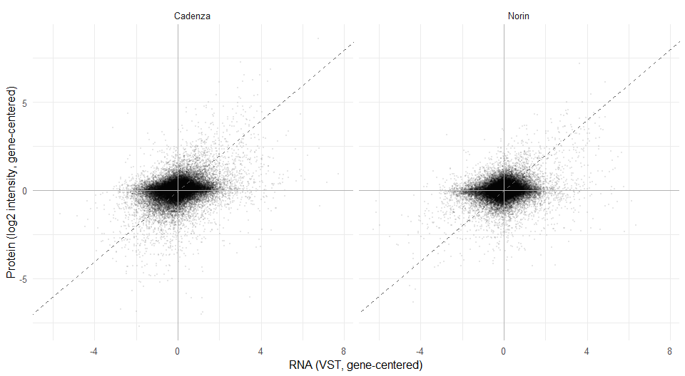
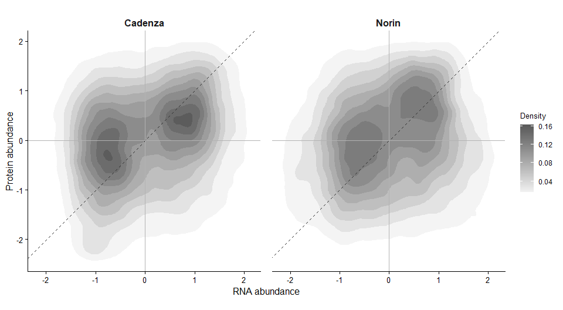
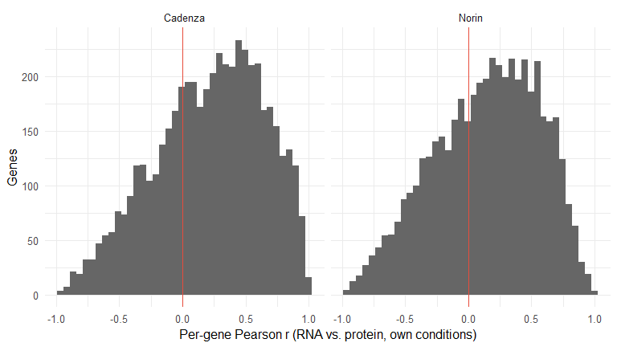

# Simple RNA-protein match: normalized, centered scatter and correlation
Kristina Gagalova

- [Purpose and scope](#purpose-and-scope)
- [1. Setup](#setup)
- [2. Choosing an RNA-seq
  normalization](#choosing-an-rna-seq-normalization)
- [3. Average replicates per condition, then center per
  gene](#average-replicates-per-condition-then-center-per-gene)
- [4. Scatter plot](#scatter-plot)
- [5. Correlation and R²](#correlation-and-r²)
- [6. Is the 1:1 diagonal even a fair comparison? Scale-correcting each
  gene](#is-the-11-diagonal-even-a-fair-comparison-scale-correcting-each-gene)
- [7. Per-gene concordance (does the pooled number hold
  gene-by-gene?)](#per-gene-concordance-does-the-pooled-number-hold-gene-by-gene)
- [8. What this does and doesn’t show](#what-this-does-and-doesnt-show)

## Purpose and scope

Every other notebook in this project asks a *shaped* question of the
RNA/protein relationship: a mechanistic kinetic model in
`analysis/kinetics_limited`, a per-gene profile distance in
`analysis/gene-distance`, cross-validated aggregate prediction in
`analysis/dimensionality-reduction`. This notebook deliberately asks the
plainest version instead:

> **For an individual gene, in an individual treatment x timepoint
> condition, does the protein level track the RNA level – as a simple 2D
> scatter, with a Pearson correlation and an R²?**

No DE model, no imputation, no kinetics, no shared embedding. Just:
normalize each layer, average the 3 replicates within each condition
(`R/utils.R::cell_means()`), remove each gene’s own baseline so the two
layers (different units, different dynamic range) are comparable, and
look at the scatter.

This is a fast descriptive check, not a replacement for the validated
analyses elsewhere – see 8 for what it does and does not show.

## 1. Setup

``` r
if (!requireNamespace("here", quietly = TRUE)) stop("package 'here' required")

## RENV_PROJECT must be set before sourcing activate.R, or renv treats this
## subdirectory as the project and bootstraps an empty library.
if (file.exists(here::here("renv", "activate.R"))) {
  Sys.setenv(RENV_PROJECT = here::here())
  source(here::here("renv", "activate.R"))
}

source(here::here("R", "utils.R"))
source(here::here("R", "wheat_pipeline.R"))
need_pkgs(c("limma", "edgeR", "DESeq2", "matrixStats", "yaml", "ggplot2"))

library(ggplot2)

set.seed(20260902)
```

## 2. Choosing an RNA-seq normalization

Three candidates, for turning raw RNA-seq counts into something
comparable to log2 protein intensity:

| Option                 | What it does                                                                                                                                      | Why / why not here                                                                                                                                                                                                                                                                                                                                             |
|------------------------|---------------------------------------------------------------------------------------------------------------------------------------------------|----------------------------------------------------------------------------------------------------------------------------------------------------------------------------------------------------------------------------------------------------------------------------------------------------------------------------------------------------------------|
| **log2-CPM**           | Library-size normalize, log-transform                                                                                                             | What was proposed earlier. Simple, but CPM does not stabilise variance across the expression range: low-count genes have disproportionately high variance on this scale, which inflates their leverage on a Pearson correlation computed across all genes at once.                                                                                             |
| **vsn** (Huber et al.) | Variance-stabilizing normalization via a fitted glog transform                                                                                    | Built for continuous intensity data – microarrays, and proteomics intensities (it *is* what’s implicitly appropriate for the protein layer below). It is not designed for raw count data and has no standard entry point for RNA-seq counts.                                                                                                                   |
| **VST** (DESeq2)       | Fits the negative-binomial mean-variance trend from the counts themselves, then transforms to make variance ~constant across the expression range | The count-data analogue of the vsn idea: same goal (stable variance for correlation/distance-type work), but modeled on counts directly instead of assuming continuous intensities. Already computed by `run_qc_rna()` and already the choice used for exactly this kind of cross-layer comparison in `analysis/gene-distance/gene_distance_shared_space.qmd`. |

**Decision: VST for RNA**, log2 + median-normalization for protein
(`run_qc_prot()`, unchanged) – revising the earlier CPM proposal, and
keeping this notebook’s normalization consistent with the rest of the
project rather than introducing a third convention.

One deliberate difference from `prepare_variety()` elsewhere in the
project: this notebook stops at `run_qc_prot()` and does **not** run
`run_missingness()`’s MNAR/MAR imputation. Imputed values are modelled
draws (a down-shifted normal for MNAR cells), and folding modelled draws
into a correlation meant to be a plain, transparent check would let the
imputation model manufacture some of the correlation it’s reporting.
Genuinely missing gene x condition cells are dropped instead (3).

Low-coverage RNA genes are dropped by the same rule as the DE workflow,
not a separate one invented here: `run_qc_rna()` (`R/wheat_pipeline.R`)
keeps a gene only if it has `>= 10` counts in `>= n_reps` (3) samples –
the DESeq2-style criterion `prepare_variety()` already uses for
`run_de()` and `run_missingness()` elsewhere in the project. This
notebook calls that same function unchanged, so the filter is identical,
not merely similar.

``` r
DESIGN <- wheat_design()

#' Load one variety and normalize each layer, without DE/imputation.
normalize_variety <- function(prefix, design) {
  v  <- load_variety(prefix, design)
  qr <- run_qc_rna(v$rna, v$meta, design)
  qp <- run_qc_prot(v$prot, v$meta)
  list(meta = v$meta, vst = qr$vst, prot = qp$norm,
       n_rna_in = qr$n_in, n_rna_kept = qr$n_kept,
       n_prot_in = qp$n_in, n_prot_kept = qp$n_kept)
}

cad <- normalize_variety("cadenza", DESIGN)
nor <- normalize_variety("norin",   DESIGN)

data.frame(
  variety          = c("Cadenza", "Norin"),
  rna_in           = c(cad$n_rna_in,  nor$n_rna_in),
  rna_kept         = c(cad$n_rna_kept, nor$n_rna_kept),
  rna_dropped_low_count = c(cad$n_rna_in - cad$n_rna_kept, nor$n_rna_in - nor$n_rna_kept),
  prot_in          = c(cad$n_prot_in,  nor$n_prot_in),
  prot_kept        = c(cad$n_prot_kept, nor$n_prot_kept)
)
```

      variety rna_in rna_kept rna_dropped_low_count prot_in prot_kept
    1 Cadenza 128544    59931                 68613    6105      5861
    2   Norin 145065    59502                 85563    5879      5641

## 3. Average replicates per condition, then center per gene

`cell_means()` averages the 3 replicates within each treatment x
timepoint cell (`na.rm = TRUE`; a cell with zero valid protein
replicates comes back `NA` and is dropped below, rather than imputed).
Centering then subtracts each gene’s own across-condition mean,
separately for RNA and protein – otherwise the plot is dominated by
between-gene differences in absolute scale (VST units vs log2 intensity
units aren’t the same axis to begin with), rather than by whether a
gene’s *pattern* of change across conditions matches between layers.

``` r
#' Cell-mean, center, and reshape one variety's matched RNA/protein layers to
#' long format (one row per gene x condition), dropping any (gene, condition)
#' pair genuinely missing in either layer.
#'
#' Protein has real per-cell missingness (a cell with 0 valid replicates ->
#' NA from cell_means()); RNA (VST) does not -- run_qc_rna()'s filter is
#' gene-level, not per-cell, so every kept gene has a defined VST value in
#' all 8 cells. A gene with only 1 surviving protein condition is dropped
#' BEFORE centering: `value - mean(value)` over a single point is always
#' exactly 0, which is a centering artefact, not RNA/protein agreement, and
#' would otherwise sit at (0, 0) in every downstream plot and statistic.
#'
#' Also computes a scale-corrected version (`rna_z`/`prot_z`, \S6): the
#' centered value divided by that gene's own SD across its valid conditions.
#' An SD from very few points is itself noisy (2 points = 1 df), so this
#' needs a stricter floor (`min_valid_cond_z`) than centering alone -- genes
#' below it, or with zero variance in either layer, get `NA` here but are
#' still kept for the uncentered/unscaled columns used in \S4-\S5.
match_table <- function(x, variety_label, min_valid_cond = 2, min_valid_cond_z = 4) {
  common <- intersect(rownames(x$vst), rownames(x$prot))

  R_cond <- cell_means(x$vst[common, , drop = FALSE],  x$meta)
  P_cond <- cell_means(x$prot[common, , drop = FALSE], x$meta)

  keep   <- rowSums(!is.na(P_cond)) >= min_valid_cond
  R_cond <- R_cond[keep, , drop = FALSE]
  P_cond <- P_cond[keep, , drop = FALSE]

  Rc <- R_cond - rowMeans(R_cond, na.rm = TRUE)
  Pc <- P_cond - rowMeans(P_cond, na.rm = TRUE)

  n_valid <- rowSums(!is.na(P_cond))
  r_sd    <- apply(Rc, 1, sd, na.rm = TRUE)
  p_sd    <- apply(Pc, 1, sd, na.rm = TRUE)
  z_ok    <- n_valid >= min_valid_cond_z & r_sd > 0 & p_sd > 0

  Rz <- Rc / r_sd
  Pz <- Pc / p_sd
  Rz[!z_ok, ] <- NA
  Pz[!z_ok, ] <- NA

  cells <- colnames(Rc)
  df <- data.frame(
    gene_id = rep(rownames(Rc), times = length(cells)),
    cell    = rep(cells,        each  = nrow(Rc)),
    rna     = as.vector(Rc),
    prot    = as.vector(Pc),
    rna_z   = as.vector(Rz),
    prot_z  = as.vector(Pz)
  )
  df <- df[!is.na(df$rna) & !is.na(df$prot), ]

  df$treatment <- sub("_t.*$", "", df$cell)
  df$timepoint <- as.numeric(sub("^.*_t", "", df$cell))
  df$variety   <- variety_label
  df
}

match_df <- rbind(
  match_table(cad, "Cadenza"),
  match_table(nor, "Norin")
)

data.frame(
  variety      = c("Cadenza", "Norin", "Combined"),
  gene_x_cell  = c(sum(match_df$variety == "Cadenza"),
                    sum(match_df$variety == "Norin"),
                    nrow(match_df)),
  n_genes      = c(length(unique(match_df$gene_id[match_df$variety == "Cadenza"])),
                    length(unique(match_df$gene_id[match_df$variety == "Norin"])),
                    length(unique(match_df$gene_id)))
)
```

       variety gene_x_cell n_genes
    1  Cadenza       40077    5551
    2    Norin       37706    5138
    3 Combined       77783   10689

## 4. Scatter plot

``` r
ggplot(match_df, aes(rna, prot)) +
  geom_point(alpha = 0.10, size = 0.5, shape = 16) +
  geom_abline(slope = 1, intercept = 0, linetype = "dashed",
              colour = "grey40", linewidth = 0.6) +
  geom_hline(yintercept = 0, colour = "grey70", linewidth = 0.3) +
  geom_vline(xintercept = 0, colour = "grey70", linewidth = 0.3) +
  facet_wrap(~ variety) +
  labs(
    x = "RNA (VST, gene-centered)",
    y = "Protein (log2 intensity, gene-centered)"
  ) +
  theme_minimal(base_size = 12)
```



## 5. Correlation and R²

``` r
#' Pearson r, Spearman rho, and R² (== r^2 here; a single-predictor lm) for
#' one gene x condition table.
cor_summary <- function(df) {
  fit <- lm(prot ~ rna, data = df)
  data.frame(
    n_points     = nrow(df),
    n_genes      = length(unique(df$gene_id)),
    pearson_r    = cor(df$rna, df$prot, method = "pearson"),
    spearman_rho = cor(df$rna, df$prot, method = "spearman"),
    r_squared    = summary(fit)$r.squared,
    slope        = unname(coef(fit)["rna"])
  )
}

stats_tbl <- rbind(
  cbind(variety = "Cadenza",  cor_summary(subset(match_df, variety == "Cadenza"))),
  cbind(variety = "Norin",    cor_summary(subset(match_df, variety == "Norin"))),
  cbind(variety = "Combined", cor_summary(match_df))
)
stats_tbl[, -1] <- round(stats_tbl[, -1], 4)
stats_tbl
```

       variety n_points n_genes pearson_r spearman_rho r_squared  slope
    1  Cadenza    40077    5551    0.3157       0.2618    0.0996 0.2435
    2    Norin    37706    5138    0.2467       0.1803    0.0608 0.1720
    3 Combined    77783   10689    0.2866       0.2242    0.0821 0.2120

## 6. Is the 1:1 diagonal even a fair comparison? Scale-correcting each gene

4’s diagonal compares raw VST units to raw log2-intensity units
directly, as if a change of “1” meant the same thing in both. It doesn’t
– the two layers have no shared scale, so distance from that diagonal
conflates two different things: a gene’s swing *size* differing between
layers (expected, uninformative – see 8’s last bullet) and its swing
*pattern* differing (the actual question). Dividing each gene’s
already-centered values by that gene’s own SD across conditions puts
both layers on a common “how many of my own SDs am I above/below my
average” scale, so a gene whose RNA and protein move by the same
*relative* amount now lands on the diagonal regardless of the raw units
either was measured in – making the diagonal a fair reference instead of
a confounded one.

This is not a free correction, though: an SD estimated from very few
points is itself mostly noise (2 points = 1 degree of freedom), so it
needs its own, stricter per-gene floor (`>= 4` of 8 valid conditions,
vs. `>= 2` for centering alone in 3) – and it gives every qualifying
gene *equal weight* regardless of how much it actually moves, which can
amplify genes whose real biological variance is small.

``` r
z_df <- match_df[
  !is.na(match_df$rna_z) &
  !is.na(match_df$prot_z),
]

ggplot(z_df, aes(x = rna_z, y = prot_z)) +
  stat_density_2d(
    aes(fill = after_stat(level)),
    geom = "polygon",
    contour = TRUE,
    bins = 12,
    alpha = 0.85
  ) +
  scale_fill_gradient(
    low = "grey95",
    high = "grey35",
    name = "Density"
  ) +
  geom_abline(
    slope = 1,
    intercept = 0,
    linetype = "dashed",
    colour = "grey20",
    linewidth = 0.6
  ) +
  geom_hline(
    yintercept = 0,
    colour = "grey70",
    linewidth = 0.3
  ) +
  geom_vline(
    xintercept = 0,
    colour = "grey70",
    linewidth = 0.3
  ) +
  coord_equal() +
  facet_wrap(~ variety) +
  labs(
    x = "RNA abundance",
    y = "Protein abundance"
  ) +
  theme_classic(base_size = 13) +
  theme(
    strip.background = element_blank(),
    strip.text = element_text(face = "bold", size = 12),
    axis.title = element_text(size = 12),
    axis.text = element_text(size = 10),
    legend.title = element_text(size = 10),
    legend.text = element_text(size = 9),
    panel.spacing = unit(1, "lines")
  )
```



``` r
z_stats_df <- data.frame(gene_id = z_df$gene_id, variety = z_df$variety,
                          rna = z_df$rna_z, prot = z_df$prot_z)

stats_tbl_z <- rbind(
  cbind(variety = "Cadenza",  cor_summary(subset(z_stats_df, variety == "Cadenza"))),
  cbind(variety = "Norin",    cor_summary(subset(z_stats_df, variety == "Norin"))),
  cbind(variety = "Combined", cor_summary(z_stats_df))
)
stats_tbl_z[, -1] <- round(stats_tbl_z[, -1], 4)
stats_tbl_z
```

       variety n_points n_genes pearson_r spearman_rho r_squared  slope
    1  Cadenza    39319    5256    0.2169       0.2211    0.0470 0.2152
    2    Norin    37187    4939    0.1434       0.1543    0.0206 0.1436
    3 Combined    76506   10195    0.1813       0.1890    0.0329 0.1807

Scaling by construction pulls the slope toward 1 (both axes are now in
the same “own-SD” units), so the slope column here is not the
interesting number – the correlation `r` is: whether it moved up, down,
or barely at all from 5’s r tells you whether the pooled correlation
there was mostly reporting scale differences, or whether it survives
once every gene is put on equal footing.

## 7. Per-gene concordance (does the pooled number hold gene-by-gene?)

The pooled correlation above mixes two different things: genes whose RNA
and protein both swing a lot across conditions (between-gene amplitude
concordance), and, within a single gene, whether its protein rises and
falls with its own RNA across the 4 timepoints x 2 treatments
(within-gene shape concordance). A pooled r can look strong even if most
individual genes track poorly, if a few high-amplitude genes dominate.
Restricting to genes with enough surviving (non-`NA`) conditions to make
a per-gene correlation meaningful:

``` r
per_gene <- do.call(rbind, lapply(split(match_df, list(match_df$gene_id, match_df$variety), drop = TRUE), function(g) {
  if (nrow(g) < 5) return(NULL)
  data.frame(gene_id = g$gene_id[1], variety = g$variety[1],
             n = nrow(g), r = suppressWarnings(cor(g$rna, g$prot)))
}))
per_gene <- per_gene[!is.na(per_gene$r), ]

ggplot(per_gene, aes(r)) +
  geom_histogram(bins = 40, fill = "grey40") +
  geom_vline(xintercept = 0, colour = "#e74c3c", linewidth = 0.5) +
  facet_wrap(~ variety) +
  labs(x = "Per-gene Pearson r (RNA vs. protein, own conditions)", y = "Genes") +
  theme_minimal(base_size = 12)

data.frame(
  variety      = c("Cadenza", "Norin"),
  n_genes      = c(sum(per_gene$variety == "Cadenza"), sum(per_gene$variety == "Norin")),
  median_r     = c(median(per_gene$r[per_gene$variety == "Cadenza"]),
                    median(per_gene$r[per_gene$variety == "Norin"])),
  frac_r_pos   = c(mean(per_gene$r[per_gene$variety == "Cadenza"] > 0),
                    mean(per_gene$r[per_gene$variety == "Norin"]   > 0))
)
```

      variety n_genes  median_r frac_r_pos
    1 Cadenza    5043 0.2592024  0.6926433
    2   Norin    4796 0.1843030  0.6449124



## 8. What this does and doesn’t show

- **What it shows:** a fast, model-free read of whether protein
  abundance tracks RNA abundance at the individual gene x condition
  level, with a transparent normalization choice (2) and no imputation.
- **What it doesn’t show:** significance / FDR (no null model here – for
  that, see the permutation nulls in `analysis/gene-distance`); a
  mechanistic account of *why* genes diverge (see the kinetic delay
  model in `analysis/kinetics_limited`); or a properly cross-validated
  aggregate predictability estimate (see
  `analysis/dimensionality-reduction`). Treat the pooled and per-gene
  numbers above as a sanity check that motivates those more careful
  analyses, not as a substitute for them.
- Per-gene centering removes each gene’s baseline offset but not its
  scale – a gene with a much larger RNA swing than protein swing (or
  vice versa) still lands far from the 1:1 diagonal in 4 even if its
  *pattern* is a perfect match (points fall on some *other* line through
  the origin, not off the diagonal at random). The plot deliberately
  does not fit a line to the data – the diagonal is a fixed 1:1
  reference, not a trend – so read scale mismatch from the fitted slope
  in 5 instead, which is well below 1 for both varieties: RNA swings are
  consistently larger than the protein swings they’re paired with.
