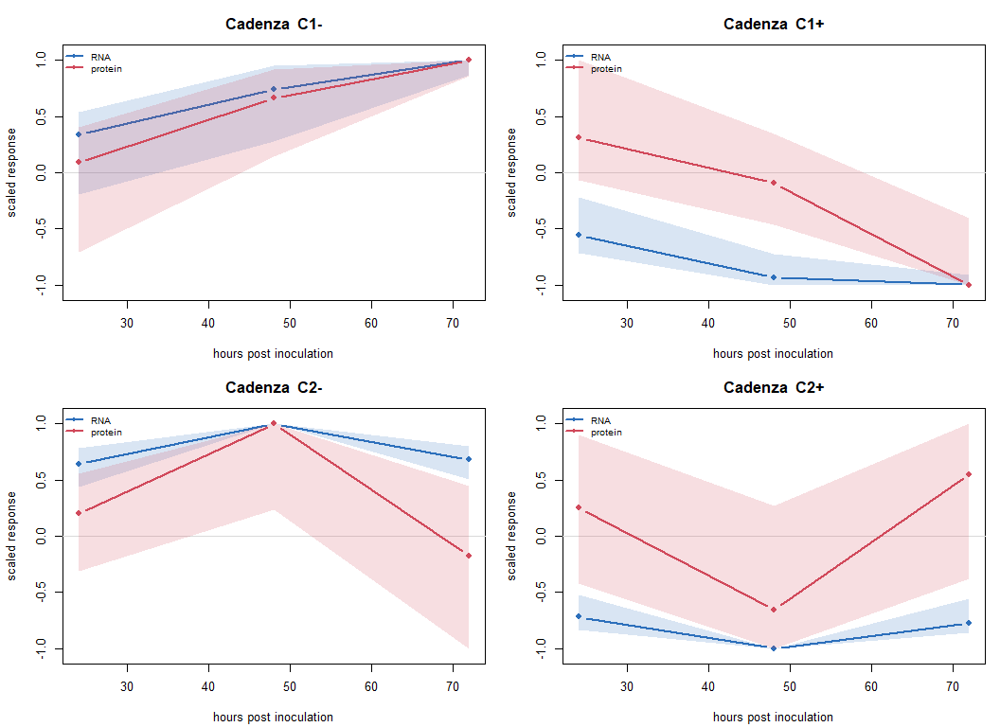
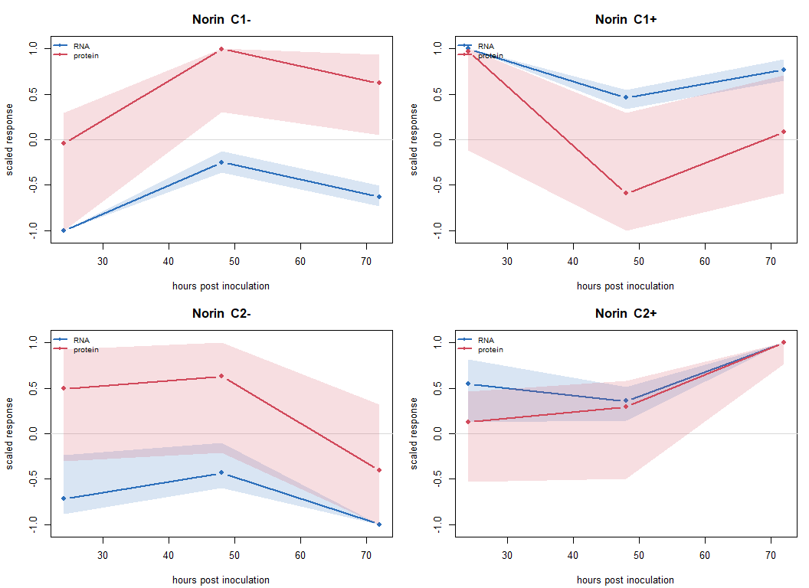

# Trajectory clustering - wheat
Kristina Gagalova

- [Overview](#overview)
- [1. Setup](#setup)
- [2. Upstream pipeline](#upstream-pipeline)
- [3. What exactly gets clustered — and
  why](#what-exactly-gets-clustered-and-why)
  - [The profile](#the-profile)
  - [Substituting for the `lmms` step](#substituting-for-the-lmms-step)
- [4. Clustering](#clustering)
  - [Are clusters cross-omics, or just one block
    each?](#are-clusters-cross-omics-or-just-one-block-each)
- [5. Cluster profiles](#cluster-profiles)
- [6. Is the clustering better than
  chance?](#is-the-clustering-better-than-chance)
  - [This test does not pass — and the reason is
    instructive](#this-test-does-not-pass-and-the-reason-is-instructive)
- [7. Do clusters agree with the kinetic
  archetypes?](#do-clusters-agree-with-the-kinetic-archetypes)
- [8. Cross-variety reproducibility](#cross-variety-reproducibility)
- [9. Outputs](#outputs)
- [10. Interpretation and limits](#interpretation-and-limits)
  - [Bottom line: this stage is inconclusive on this
    dataset](#bottom-line-this-stage-is-inconclusive-on-this-dataset)
  - [What would actually fix it](#what-would-actually-fix-it)
  - [Other structural limitations](#other-structural-limitations)
  - [Next stages](#next-stages)

## Overview

Stage **S7** of the analysis plan (`docs/planning.md`): cluster RNA and
protein features by the *shape of their infection response over time*,
so that transcripts and proteins with matching dynamics end up in the
same cluster.

This is the one published multi-omics temporal method that works under
the **Case B** constraint. `timeOmics` clusters features by their
**fitted temporal profiles**, not by co-variation across sample-matched
rows, so it never needs an RNA sample and a protein sample to be the
same biological material. Every other method in the S6 family
(MOFA+/MEFISTO, DIABLO, O2PLS) does need that and is unusable here — see
`../../docs/PIPELINE.md`.

**What a cluster means here:** a set of genes and proteins whose
*infection response* rises, falls or peaks together across 0/24/48/72
hpi. It is a dynamics class, not an abundance class.

**Relationship to the kinetics notebook.** `../kinetics_limited/` asks a
per-gene question (“is this protein off its RNA-predicted trajectory?”).
This notebook asks a between-gene question (“which features share a
response shape?”). They are complementary, and §7 below cross-tabulates
the two.

------------------------------------------------------------------------

## 1. Setup

``` r
if (!requireNamespace("here", quietly = TRUE))
  stop("package 'here' is required; install with install.packages('here')")

## ACTIVATE renv EXPLICITLY, POINTED AT THE PROJECT ROOT.
##
## Two things go wrong otherwise, and both were observed directly:
##
## 1. renv's .Rprofile is only sourced when R *starts* in the project root.
##    Quarto renders with the working directory set to this file's own
##    folder, so the project library never reaches .libPaths(): packages
##    installed with renv::install() report as "not installed", while
##    packages that also happen to exist in the user's system library load
##    fine. That makes a path problem look like a package problem
##    (mixOmics/timeOmics: FALSE here, TRUE from the project root).
##
## 2. Sourcing renv/activate.R alone is NOT enough. It resolves the project
##    as Sys.getenv("RENV_PROJECT"), falling back to getwd() -- which from
##    this directory is analysis/trajectory_clustering/, not the project.
##    renv then treats THIS folder as a new project and bootstraps a fresh,
##    empty library, so even base pipeline packages (yaml, limma) vanish.
##    Setting RENV_PROJECT first is what makes activation correct.
if (file.exists(here::here("renv", "activate.R"))) {
  Sys.setenv(RENV_PROJECT = here::here())
  source(here::here("renv", "activate.R"))
}

source(here::here("R", "utils.R"))
source(here::here("R", "wheat_pipeline.R"))

need_pkgs(c("limma", "edgeR", "DESeq2", "matrixStats", "impute", "here"))

set.seed(20260822)

DESIGN <- wheat_design()

# Optional packages. Both have documented fallbacks (see §3), so the notebook
# renders either way -- it reports which path it took rather than failing.
HAS_MIXOMICS  <- requireNamespace("mixOmics",  quietly = TRUE)
HAS_TIMEOMICS <- requireNamespace("timeOmics", quietly = TRUE)
HAS_CLUSTER   <- requireNamespace("cluster",   quietly = TRUE)

cat(sprintf("mixOmics : %s\ntimeOmics: %s\ncluster  : %s\n",
            HAS_MIXOMICS, HAS_TIMEOMICS, HAS_CLUSTER))
```

    mixOmics : TRUE
    timeOmics: TRUE
    cluster  : TRUE

If any of the above are `FALSE`, install them into the project library
with:

``` r
renv::install(c("bioc::mixOmics", "bioc::timeOmics", "cluster"))
renv::snapshot()
```

## 2. Upstream pipeline

Loading, QC, imputation and temporal DE are shared with the kinetics
notebook and live in `R/wheat_pipeline.R`, so both analyses run
identical upstream code rather than each keeping a copy.

``` r
cad <- prepare_variety("cadenza", DESIGN)
```

    Cluster size 5861 broken into 3622 2239 
    Cluster size 3622 broken into 2430 1192 
    Cluster size 2430 broken into 1561 869 
    Cluster size 1561 broken into 819 742 
    Done cluster 819 
    Done cluster 742 
    Done cluster 1561 
    Done cluster 869 
    Done cluster 2430 
    Done cluster 1192 
    Done cluster 3622 
    Cluster size 2239 broken into 1075 1164 
    Done cluster 1075 
    Done cluster 1164 
    Done cluster 2239 

``` r
nor <- prepare_variety("norin",   DESIGN)
```

    Cluster size 5641 broken into 1939 3702 
    Cluster size 1939 broken into 1030 909 
    Done cluster 1030 
    Done cluster 909 
    Done cluster 1939 
    Cluster size 3702 broken into 2489 1213 
    Cluster size 2489 broken into 838 1651 
    Done cluster 838 
    Cluster size 1651 broken into 941 710 
    Done cluster 941 
    Done cluster 710 
    Done cluster 1651 
    Done cluster 2489 
    Done cluster 1213 
    Done cluster 3702 

``` r
knitr::kable(
  data.frame(
    variety      = c("Cadenza", "Norin"),
    rna_kept     = c(cad$qc_rna$n_kept,  nor$qc_rna$n_kept),
    protein_kept = c(cad$qc_prot$n_kept, nor$qc_prot$n_kept),
    universe_b   = c(length(cad$common), length(nor$common)),
    prot_missing = round(c(cad$qc_prot$miss_rate, nor$qc_prot$miss_rate), 3)
  ),
  caption = "Upstream summary (identical to the kinetics notebook)"
)
```

| variety | rna_kept | protein_kept | universe_b | prot_missing |
|:--------|---------:|-------------:|-----------:|-------------:|
| Cadenza |    59931 |         5861 |       5580 |        0.223 |
| Norin   |    59502 |         5641 |       5159 |        0.210 |

Upstream summary (identical to the kinetics notebook)

## 3. What exactly gets clustered — and why

### The profile

Each feature’s profile is its **t0-centred infection-response
trajectory**: the Infected-vs-Control log2FC at 24, 48 and 72 hpi. The
t0 column is identically zero after centring and carries no information,
so it is dropped.

Clustering the *response* rather than the raw design-cell means is a
deliberate choice, and it matters a lot for this dataset. Roughly a
third of genes drift substantially in the **control** arm over 72 h
(quantified in the kinetics notebook’s A3 diagnostic: median control-arm
drift ≈ 0.67 log2FC). Clustering raw abundance profiles would therefore
mostly recover that shared developmental/circadian programme, which is
present in both arms and is not the biology of interest. Taking the
Infected-minus-Control contrast cancels it.

**The cost, stated plainly:** this leaves **three informative timepoints
per feature**. That is thin. Three points can distinguish monotonic-up,
monotonic-down, early-peak and late-peak shapes, and not much more. Any
claim about finer temporal structure is not supported by this design. §6
tests whether even this coarse structure is better than chance.

### Substituting for the `lmms` step

The canonical `timeOmics` workflow begins by fitting per-feature linear
mixed-model splines with `lmms`, to smooth noisy trajectories before
clustering. That step is **not used here**, for three independent
reasons:

1.  `lmms` was archived from CRAN and is no longer a maintainable
    dependency.
2.  It requires repeated measures per subject. This design has
    **independent samples at every timepoint** — each sample is its own
    subject — so the random effect is unidentifiable.
3.  Four timepoints cannot support spline degrees of freedom above ~2
    anyway.

The replacement is the **limma moderated log2FC trajectory** already
computed upstream. This serves the same purpose: limma’s empirical-Bayes
step shrinks each feature’s estimate toward a pooled variance model
across thousands of features, which is precisely the noise reduction
`lmms` was there to provide. It is a substitution, not an omission.

``` r
#' Build clustering-ready profile matrices for one variety.
#'
#' Returns features x timepoints matrices (t0 dropped -- identically zero
#' after centring), restricted to features with a real response, and scaled.
#'
#' SCALING: profiles are divided by their own maximum absolute value, so a
#' cluster is defined by response SHAPE, not by response magnitude. Without
#' this, clustering is dominated by a handful of very-high-amplitude features
#' and mostly recovers "how big is the response" rather than "what shape".
build_profiles <- function(v, design,
                           min_abs_lfc = 0.5,
                           max_features = 3000) {

  drop_t0 <- -1  # first column is the centring anchor

  Rl <- v$Rl[, drop_t0, drop = FALSE]
  Pl <- v$Pl[, drop_t0, drop = FALSE]

  # Keep only features that actually respond -- a flat profile has no shape
  # to cluster, and including thousands of them would swamp the structure.
  r_keep <- apply(abs(Rl), 1, max) > min_abs_lfc
  p_keep <- apply(abs(Pl), 1, max) > min_abs_lfc

  Rl <- Rl[r_keep, , drop = FALSE]
  Pl <- Pl[p_keep, , drop = FALSE]

  # Cap the RNA block: it is an order of magnitude larger than the protein
  # block, and an unbalanced block count biases a multiblock decomposition
  # toward the bigger block.
  if (nrow(Rl) > max_features) {
    ord <- order(apply(abs(Rl), 1, max), decreasing = TRUE)
    Rl  <- Rl[ord[seq_len(max_features)], , drop = FALSE]
  }

  scale_shape <- function(m) {
    mx <- apply(abs(m), 1, max)
    m / pmax(mx, 1e-8)
  }

  Rl <- scale_shape(Rl)
  Pl <- scale_shape(Pl)

  ## BLOCK-PREFIXED INTERNAL IDS -- necessary, not cosmetic.
  ##
  ## In this dataset protein_id == gene_id, so a gene quantified in both
  ## layers carries the SAME name in both blocks (2489 such names in
  ## Cadenza). Anything that keys features by name then silently collapses
  ## the two layers together:
  ##   * timeOmics::getCluster builds its molecule -> block map by name, and
  ##     with duplicates across blocks it returns block = NA for every
  ##     feature and degrades `molecule` to a bare integer index (observed
  ##     directly -- it is what made the cluster tables come out empty,
  ##     since table() drops NA levels by default);
  ##   * rbind() + match() in the fallback, plotting and silhouette code
  ##     would resolve a duplicated name to whichever block happens to come
  ##     first, quietly mixing RNA and protein features.
  ##
  ## Prefixing makes every id unique, and the prefix then becomes the
  ## authoritative block label rather than something inferred downstream.
  rownames(Rl) <- paste0("rna__",  rownames(Rl))
  rownames(Pl) <- paste0("prot__", rownames(Pl))

  list(
    rna     = Rl,
    protein = Pl,
    n_rna   = nrow(Rl),
    n_prot  = nrow(Pl)
  )
}

#' Strip the block prefix to recover the original gene / protein id.
strip_uid <- function(x) sub("^(rna__|prot__)", "", x)

#' Recover the block from the prefix (authoritative, unlike a name lookup).
block_of  <- function(x) ifelse(startsWith(x, "rna__"), "rna", "protein")
```

``` r
cad_prof <- build_profiles(cad, DESIGN)
nor_prof <- build_profiles(nor, DESIGN)

knitr::kable(
  data.frame(
    variety           = c("Cadenza", "Norin"),
    rna_features      = c(cad_prof$n_rna,  nor_prof$n_rna),
    protein_features  = c(cad_prof$n_prot, nor_prof$n_prot),
    timepoints_used   = ncol(cad_prof$rna)
  ),
  caption = "Features entering the clustering (responsive only, shape-scaled)"
)
```

| variety | rna_features | protein_features | timepoints_used |
|:--------|-------------:|-----------------:|----------------:|
| Cadenza |         3000 |             4402 |               3 |
| Norin   |         3000 |             3656 |               3 |

Features entering the clustering (responsive only, shape-scaled)

## 4. Clustering

`timeOmics` assigns each feature to a cluster by which multiblock sPLS
**component** it loads on most strongly, and with which **sign**. With
`ncomp` components that yields `2 * ncomp` clusters: one “up” and one
“down” cluster per component. The components themselves are the shared
temporal patterns extracted jointly across the RNA and protein blocks.

> **mixOmics emits a warning here, and it should not be suppressed:**
>
> `At least one study has less than 5 samples, mean centering might not do as expected`
>
> The “samples” of this decomposition are timepoints, and there are
> three. mixOmics is telling us the method is being run below the regime
> it is comfortable in — centring and scaling are estimated from three
> values per feature. This is not a bug and there is no way around it
> with a four-timepoint design; it is the same three-informative-points
> limitation stated in §3, surfacing again at the algorithm level. It is
> one more reason the permutation test in §6 is the deciding check
> rather than a formality.

``` r
#' Cluster features by temporal profile.
#'
#' PRIMARY PATH: mixOmics::block.pls + timeOmics::getCluster, the published
#' method (Bodein et al. 2019, 2022).
#'
#' FALLBACK: if either package is unavailable, partition features by
#' correlation distance (1 - Pearson correlation between profiles) using
#' k-medoids. This is NOT the same algorithm -- it is a documented substitute
#' so the notebook still produces an answer, and the output records which
#' path ran. Do not report fallback results as "timeOmics clustering".
cluster_profiles <- function(prof, ncomp = 2, seed = 1) {

  set.seed(seed)

  X <- list(rna = t(prof$rna), protein = t(prof$protein))  # rows = timepoints

  if (HAS_MIXOMICS && HAS_TIMEOMICS) {

    fit <- mixOmics::block.pls(X, indY = 1, ncomp = ncomp,
                               mode = "canonical")

    # getCluster() returns columns:
    #   molecule | comp ("comp1"/"comp2") | contrib.max | cluster | block |
    #   contribution ("positive"/"negative")
    # `cluster` is already the SIGNED cluster id (1, -1, 2, -2); the label
    # below just makes the component and direction readable.
    #
    # NOTE: getCluster's own `block` column is deliberately NOT used -- see
    # build_profiles(). The prefix on the uid is authoritative.
    cl <- as.data.frame(timeOmics::getCluster(fit))

    uid      <- as.character(cl$molecule)
    comp_num <- as.integer(sub("^comp", "", as.character(cl$comp)))

    out <- data.frame(
      uid     = uid,
      feature = strip_uid(uid),
      block   = block_of(uid),
      cluster = paste0("C", comp_num,
                       ifelse(cl$contribution == "positive", "+", "-")),
      comp    = comp_num,
      sign    = as.character(cl$contribution),
      stringsAsFactors = FALSE
    )
    attr(out, "method") <- "timeOmics::getCluster on mixOmics::block.pls"
    attr(out, "fit")    <- fit
    return(out)
  }

  # ---- fallback --------------------------------------------------------
  # Safe to rbind: uids are block-prefixed and therefore unique.
  allp <- rbind(prof$rna, prof$protein)

  d <- as.dist(1 - cor(t(allp)))
  k <- 2 * ncomp

  km <- if (HAS_CLUSTER) cluster::pam(d, k = k, diss = TRUE)$clustering
        else stats::cutree(stats::hclust(d, method = "average"), k = k)

  out <- data.frame(
    uid     = rownames(allp),
    feature = strip_uid(rownames(allp)),
    block   = block_of(rownames(allp)),
    cluster = paste0("K", km),
    comp    = NA_integer_,
    sign    = NA_character_,
    stringsAsFactors = FALSE
  )
  attr(out, "method") <- "FALLBACK: k-medoids on correlation distance"
  out
}
```

``` r
cad_cl <- cluster_profiles(cad_prof, ncomp = 2)
```

    Warning in Check.entry.wrapper.mint.block(X = X, Y = Y, indY = indY, ncomp = ncomp, : At least one study has less than 5 samples, mean centering
            might not do as expected

``` r
nor_cl <- cluster_profiles(nor_prof, ncomp = 2)
```

    Warning in Check.entry.wrapper.mint.block(X = X, Y = Y, indY = indY, ncomp = ncomp, : At least one study has less than 5 samples, mean centering
            might not do as expected

``` r
cat("Cadenza method:", attr(cad_cl, "method"), "\n")
```

    Cadenza method: timeOmics::getCluster on mixOmics::block.pls 

``` r
cat("Norin method  :", attr(nor_cl, "method"), "\n\n")
```

    Norin method  : timeOmics::getCluster on mixOmics::block.pls 

``` r
knitr::kable(
  as.data.frame(table(cluster = cad_cl$cluster, block = cad_cl$block)),
  caption = "Cadenza: features per cluster and block"
)
```

| cluster | block   | Freq |
|:--------|:--------|-----:|
| C1-     | protein | 1012 |
| C1+     | protein | 1531 |
| C2-     | protein | 1506 |
| C2+     | protein |  353 |
| C1-     | rna     |  838 |
| C1+     | rna     |  905 |
| C2-     | rna     |  510 |
| C2+     | rna     |  747 |

Cadenza: features per cluster and block

``` r
knitr::kable(
  as.data.frame(table(cluster = nor_cl$cluster, block = nor_cl$block)),
  caption = "Norin: features per cluster and block"
)
```

| cluster | block   | Freq |
|:--------|:--------|-----:|
| C1-     | protein | 1484 |
| C1+     | protein |  410 |
| C2-     | protein |  446 |
| C2+     | protein | 1316 |
| C1-     | rna     | 1372 |
| C1+     | rna     |  547 |
| C2-     | rna     |  275 |
| C2+     | rna     |  806 |

Norin: features per cluster and block

### Are clusters cross-omics, or just one block each?

The point of *multiblock* clustering is to find clusters containing
**both** transcripts and proteins. A cluster made up almost entirely of
one block is not evidence of cross-omics coordination — it is the
decomposition separating the blocks. This table is the honest check.

``` r
mixing <- function(cl, label) {
  tab <- table(cl$cluster, cl$block)
  data.frame(
    variety      = label,
    cluster      = rownames(tab),
    n_rna        = as.integer(tab[, "rna"]),
    n_protein    = as.integer(tab[, "protein"]),
    pct_protein  = round(100 * tab[, "protein"] / rowSums(tab), 1),
    row.names    = NULL
  )
}

knitr::kable(
  rbind(mixing(cad_cl, "Cadenza"), mixing(nor_cl, "Norin")),
  caption = "Block composition per cluster. A cluster dominated by one block is not a cross-omics cluster."
)
```

| variety | cluster | n_rna | n_protein | pct_protein |
|:--------|:--------|------:|----------:|------------:|
| Cadenza | C1-     |   838 |      1012 |        54.7 |
| Cadenza | C1+     |   905 |      1531 |        62.8 |
| Cadenza | C2-     |   510 |      1506 |        74.7 |
| Cadenza | C2+     |   747 |       353 |        32.1 |
| Norin   | C1-     |  1372 |      1484 |        52.0 |
| Norin   | C1+     |   547 |       410 |        42.8 |
| Norin   | C2-     |   275 |       446 |        61.9 |
| Norin   | C2+     |   806 |      1316 |        62.0 |

Block composition per cluster. A cluster dominated by one block is not a
cross-omics cluster.

## 5. Cluster profiles

``` r
plot_clusters <- function(prof, cl, design, label) {

  tps  <- design$timepoints[-1]
  allp <- rbind(prof$rna, prof$protein)   # uids unique, so match() is safe

  idx  <- match(cl$uid, rownames(allp))
  ok   <- !is.na(idx)
  cl   <- cl[ok, ]; idx <- idx[ok]

  clusters <- sort(unique(cl$cluster))
  op <- par(mfrow = c(2, ceiling(length(clusters) / 2)),
            mar = c(4.2, 4.2, 3, 1))

  for (cc in clusters) {
    plot(NA, xlim = range(tps), ylim = c(-1.05, 1.05),
         xlab = sprintf("hours post inoculation"), ylab = "scaled response",
         main = sprintf("%s  %s", label, cc))
    abline(h = 0, col = "grey85")

    for (b in c("rna", "protein")) {
      sel <- cl$cluster == cc & cl$block == b
      if (sum(sel) < 3) next

      m   <- allp[idx[sel], , drop = FALSE]
      med <- apply(m, 2, median)
      q1  <- apply(m, 2, quantile, 0.25)
      q3  <- apply(m, 2, quantile, 0.75)

      col <- if (b == "rna") "#2C6FBB" else "#D1495B"
      polygon(c(tps, rev(tps)), c(q1, rev(q3)),
              col = adjustcolor(col, alpha.f = 0.18), border = NA)
      lines(tps, med, type = "b", pch = 16, lwd = 2.5, col = col)
    }

    legend("topleft", bty = "n", cex = 0.75, lwd = 2, pch = 16,
           col = c("#2C6FBB", "#D1495B"), legend = c("RNA", "protein"))
  }
  par(op)
}

plot_clusters(cad_prof, cad_cl, DESIGN, "Cadenza")
```



``` r
plot_clusters(nor_prof, nor_cl, DESIGN, "Norin")
```



## 6. Is the clustering better than chance?

With only three timepoints, *any* clustering algorithm will return
clusters. The question is whether they reflect real shared temporal
structure or just partition noise. Two checks:

**Silhouette width** measures how much more similar a feature is to its
own cluster than to the next-nearest one. Values near 0 mean the
clusters barely separate.

**Permutation null** shuffles each feature’s timepoint order
independently. That destroys any shared temporal pattern while
preserving every feature’s marginal distribution of values, then reruns
the whole clustering. If the real silhouette is inside the permuted
distribution, the clusters carry no temporal information.

``` r
silhouette_of <- function(prof, cl) {
  allp <- rbind(prof$rna, prof$protein)
  idx  <- match(cl$uid, rownames(allp))
  ok   <- !is.na(idx) & !is.na(cl$cluster)

  m <- allp[idx[ok], , drop = FALSE]
  k <- as.integer(factor(cl$cluster[ok]))

  if (!HAS_CLUSTER || length(unique(k)) < 2) return(NA_real_)

  d <- as.dist(1 - cor(t(m)))
  mean(cluster::silhouette(k, d)[, "sil_width"])
}

permutation_silhouette <- function(prof, ncomp = 2, n_perm = 25, seed = 1) {
  set.seed(seed)
  vapply(seq_len(n_perm), function(b) {
    pp <- prof
    # shuffle timepoint order WITHIN each feature, independently
    pp$rna     <- t(apply(prof$rna,     1, sample))
    pp$protein <- t(apply(prof$protein, 1, sample))
    dimnames(pp$rna)     <- dimnames(prof$rna)
    dimnames(pp$protein) <- dimnames(prof$protein)
    silhouette_of(pp, cluster_profiles(pp, ncomp = ncomp, seed = b))
  }, numeric(1))
}

#' NOTE ON THE P-VALUE FLOOR. A permutation p-value cannot be smaller than
#' 1/(n_perm + 1). With n_perm = 99 the floor is 0.01, so a reported 0.01
#' means "no permutation reached the observed value", not a precisely
#' estimated probability. The `perm_max` column is the more informative
#' number: if the observed silhouette sits clearly above the largest value
#' any shuffle produced, the clustering carries real temporal information
#' regardless of where the p-value floor happens to be.
validate <- function(prof, cl, label, n_perm = 99) {
  obs  <- silhouette_of(prof, cl)
  perm <- permutation_silhouette(prof, n_perm = n_perm)
  data.frame(
    variety             = label,
    silhouette_observed = round(obs, 4),
    perm_median         = round(median(perm, na.rm = TRUE), 4),
    perm_q95            = round(quantile(perm, 0.95, na.rm = TRUE), 4),
    perm_max            = round(max(perm, na.rm = TRUE), 4),
    p_permutation       = round((1 + sum(perm >= obs, na.rm = TRUE)) / (length(perm) + 1), 4),
    p_floor             = round(1 / (n_perm + 1), 4),
    row.names           = NULL
  )
}

knitr::kable(
  rbind(validate(cad_prof, cad_cl, "Cadenza"),
        validate(nor_prof, nor_cl, "Norin")),
  caption = "Cluster quality against a timepoint-shuffled null. p >= 0.05 means the clusters carry no temporal information beyond chance."
)
```

    Warning in Check.entry.wrapper.mint.block(X = X, Y = Y, indY = indY, ncomp = ncomp, : At least one study has less than 5 samples, mean centering
            might not do as expected

    Warning: The SGCCA algorithm did not converge

    Warning in Check.entry.wrapper.mint.block(X = X, Y = Y, indY = indY, ncomp = ncomp, : At least one study has less than 5 samples, mean centering
            might not do as expected

    Warning: The SGCCA algorithm did not converge

    Warning in Check.entry.wrapper.mint.block(X = X, Y = Y, indY = indY, ncomp = ncomp, : At least one study has less than 5 samples, mean centering
            might not do as expected

    Warning: The SGCCA algorithm did not converge

    Warning in Check.entry.wrapper.mint.block(X = X, Y = Y, indY = indY, ncomp = ncomp, : At least one study has less than 5 samples, mean centering
            might not do as expected
    Warning in Check.entry.wrapper.mint.block(X = X, Y = Y, indY = indY, ncomp = ncomp, : At least one study has less than 5 samples, mean centering
            might not do as expected
    Warning in Check.entry.wrapper.mint.block(X = X, Y = Y, indY = indY, ncomp = ncomp, : At least one study has less than 5 samples, mean centering
            might not do as expected

    Warning: The SGCCA algorithm did not converge

    Warning in Check.entry.wrapper.mint.block(X = X, Y = Y, indY = indY, ncomp = ncomp, : At least one study has less than 5 samples, mean centering
            might not do as expected
    Warning in Check.entry.wrapper.mint.block(X = X, Y = Y, indY = indY, ncomp = ncomp, : At least one study has less than 5 samples, mean centering
            might not do as expected
    Warning in Check.entry.wrapper.mint.block(X = X, Y = Y, indY = indY, ncomp = ncomp, : At least one study has less than 5 samples, mean centering
            might not do as expected
    Warning in Check.entry.wrapper.mint.block(X = X, Y = Y, indY = indY, ncomp = ncomp, : At least one study has less than 5 samples, mean centering
            might not do as expected
    Warning in Check.entry.wrapper.mint.block(X = X, Y = Y, indY = indY, ncomp = ncomp, : At least one study has less than 5 samples, mean centering
            might not do as expected
    Warning in Check.entry.wrapper.mint.block(X = X, Y = Y, indY = indY, ncomp = ncomp, : At least one study has less than 5 samples, mean centering
            might not do as expected
    Warning in Check.entry.wrapper.mint.block(X = X, Y = Y, indY = indY, ncomp = ncomp, : At least one study has less than 5 samples, mean centering
            might not do as expected
    Warning in Check.entry.wrapper.mint.block(X = X, Y = Y, indY = indY, ncomp = ncomp, : At least one study has less than 5 samples, mean centering
            might not do as expected
    Warning in Check.entry.wrapper.mint.block(X = X, Y = Y, indY = indY, ncomp = ncomp, : At least one study has less than 5 samples, mean centering
            might not do as expected
    Warning in Check.entry.wrapper.mint.block(X = X, Y = Y, indY = indY, ncomp = ncomp, : At least one study has less than 5 samples, mean centering
            might not do as expected
    Warning in Check.entry.wrapper.mint.block(X = X, Y = Y, indY = indY, ncomp = ncomp, : At least one study has less than 5 samples, mean centering
            might not do as expected

    Warning: The SGCCA algorithm did not converge

    Warning in Check.entry.wrapper.mint.block(X = X, Y = Y, indY = indY, ncomp = ncomp, : At least one study has less than 5 samples, mean centering
            might not do as expected
    Warning in Check.entry.wrapper.mint.block(X = X, Y = Y, indY = indY, ncomp = ncomp, : At least one study has less than 5 samples, mean centering
            might not do as expected
    Warning in Check.entry.wrapper.mint.block(X = X, Y = Y, indY = indY, ncomp = ncomp, : At least one study has less than 5 samples, mean centering
            might not do as expected
    Warning in Check.entry.wrapper.mint.block(X = X, Y = Y, indY = indY, ncomp = ncomp, : At least one study has less than 5 samples, mean centering
            might not do as expected
    Warning in Check.entry.wrapper.mint.block(X = X, Y = Y, indY = indY, ncomp = ncomp, : At least one study has less than 5 samples, mean centering
            might not do as expected
    Warning in Check.entry.wrapper.mint.block(X = X, Y = Y, indY = indY, ncomp = ncomp, : At least one study has less than 5 samples, mean centering
            might not do as expected
    Warning in Check.entry.wrapper.mint.block(X = X, Y = Y, indY = indY, ncomp = ncomp, : At least one study has less than 5 samples, mean centering
            might not do as expected
    Warning in Check.entry.wrapper.mint.block(X = X, Y = Y, indY = indY, ncomp = ncomp, : At least one study has less than 5 samples, mean centering
            might not do as expected
    Warning in Check.entry.wrapper.mint.block(X = X, Y = Y, indY = indY, ncomp = ncomp, : At least one study has less than 5 samples, mean centering
            might not do as expected
    Warning in Check.entry.wrapper.mint.block(X = X, Y = Y, indY = indY, ncomp = ncomp, : At least one study has less than 5 samples, mean centering
            might not do as expected
    Warning in Check.entry.wrapper.mint.block(X = X, Y = Y, indY = indY, ncomp = ncomp, : At least one study has less than 5 samples, mean centering
            might not do as expected

    Warning: The SGCCA algorithm did not converge

    Warning in Check.entry.wrapper.mint.block(X = X, Y = Y, indY = indY, ncomp = ncomp, : At least one study has less than 5 samples, mean centering
            might not do as expected
    Warning in Check.entry.wrapper.mint.block(X = X, Y = Y, indY = indY, ncomp = ncomp, : At least one study has less than 5 samples, mean centering
            might not do as expected
    Warning in Check.entry.wrapper.mint.block(X = X, Y = Y, indY = indY, ncomp = ncomp, : At least one study has less than 5 samples, mean centering
            might not do as expected
    Warning in Check.entry.wrapper.mint.block(X = X, Y = Y, indY = indY, ncomp = ncomp, : At least one study has less than 5 samples, mean centering
            might not do as expected
    Warning in Check.entry.wrapper.mint.block(X = X, Y = Y, indY = indY, ncomp = ncomp, : At least one study has less than 5 samples, mean centering
            might not do as expected
    Warning in Check.entry.wrapper.mint.block(X = X, Y = Y, indY = indY, ncomp = ncomp, : At least one study has less than 5 samples, mean centering
            might not do as expected
    Warning in Check.entry.wrapper.mint.block(X = X, Y = Y, indY = indY, ncomp = ncomp, : At least one study has less than 5 samples, mean centering
            might not do as expected
    Warning in Check.entry.wrapper.mint.block(X = X, Y = Y, indY = indY, ncomp = ncomp, : At least one study has less than 5 samples, mean centering
            might not do as expected

    Warning: The SGCCA algorithm did not converge

    Warning in Check.entry.wrapper.mint.block(X = X, Y = Y, indY = indY, ncomp = ncomp, : At least one study has less than 5 samples, mean centering
            might not do as expected
    Warning in Check.entry.wrapper.mint.block(X = X, Y = Y, indY = indY, ncomp = ncomp, : At least one study has less than 5 samples, mean centering
            might not do as expected
    Warning in Check.entry.wrapper.mint.block(X = X, Y = Y, indY = indY, ncomp = ncomp, : At least one study has less than 5 samples, mean centering
            might not do as expected
    Warning in Check.entry.wrapper.mint.block(X = X, Y = Y, indY = indY, ncomp = ncomp, : At least one study has less than 5 samples, mean centering
            might not do as expected

    Warning: The SGCCA algorithm did not converge

    Warning in Check.entry.wrapper.mint.block(X = X, Y = Y, indY = indY, ncomp = ncomp, : At least one study has less than 5 samples, mean centering
            might not do as expected
    Warning in Check.entry.wrapper.mint.block(X = X, Y = Y, indY = indY, ncomp = ncomp, : At least one study has less than 5 samples, mean centering
            might not do as expected

    Warning: The SGCCA algorithm did not converge

    Warning in Check.entry.wrapper.mint.block(X = X, Y = Y, indY = indY, ncomp = ncomp, : At least one study has less than 5 samples, mean centering
            might not do as expected
    Warning in Check.entry.wrapper.mint.block(X = X, Y = Y, indY = indY, ncomp = ncomp, : At least one study has less than 5 samples, mean centering
            might not do as expected
    Warning in Check.entry.wrapper.mint.block(X = X, Y = Y, indY = indY, ncomp = ncomp, : At least one study has less than 5 samples, mean centering
            might not do as expected

    Warning: The SGCCA algorithm did not converge

    Warning in Check.entry.wrapper.mint.block(X = X, Y = Y, indY = indY, ncomp = ncomp, : At least one study has less than 5 samples, mean centering
            might not do as expected
    Warning in Check.entry.wrapper.mint.block(X = X, Y = Y, indY = indY, ncomp = ncomp, : At least one study has less than 5 samples, mean centering
            might not do as expected

    Warning: The SGCCA algorithm did not converge

    Warning in Check.entry.wrapper.mint.block(X = X, Y = Y, indY = indY, ncomp = ncomp, : At least one study has less than 5 samples, mean centering
            might not do as expected
    Warning in Check.entry.wrapper.mint.block(X = X, Y = Y, indY = indY, ncomp = ncomp, : At least one study has less than 5 samples, mean centering
            might not do as expected

    Warning: The SGCCA algorithm did not converge

    Warning in Check.entry.wrapper.mint.block(X = X, Y = Y, indY = indY, ncomp = ncomp, : At least one study has less than 5 samples, mean centering
            might not do as expected
    Warning in Check.entry.wrapper.mint.block(X = X, Y = Y, indY = indY, ncomp = ncomp, : At least one study has less than 5 samples, mean centering
            might not do as expected
    Warning in Check.entry.wrapper.mint.block(X = X, Y = Y, indY = indY, ncomp = ncomp, : At least one study has less than 5 samples, mean centering
            might not do as expected

    Warning: The SGCCA algorithm did not converge

    Warning in Check.entry.wrapper.mint.block(X = X, Y = Y, indY = indY, ncomp = ncomp, : At least one study has less than 5 samples, mean centering
            might not do as expected

    Warning: The SGCCA algorithm did not converge

    Warning in Check.entry.wrapper.mint.block(X = X, Y = Y, indY = indY, ncomp = ncomp, : At least one study has less than 5 samples, mean centering
            might not do as expected
    Warning in Check.entry.wrapper.mint.block(X = X, Y = Y, indY = indY, ncomp = ncomp, : At least one study has less than 5 samples, mean centering
            might not do as expected
    Warning in Check.entry.wrapper.mint.block(X = X, Y = Y, indY = indY, ncomp = ncomp, : At least one study has less than 5 samples, mean centering
            might not do as expected
    Warning in Check.entry.wrapper.mint.block(X = X, Y = Y, indY = indY, ncomp = ncomp, : At least one study has less than 5 samples, mean centering
            might not do as expected
    Warning in Check.entry.wrapper.mint.block(X = X, Y = Y, indY = indY, ncomp = ncomp, : At least one study has less than 5 samples, mean centering
            might not do as expected
    Warning in Check.entry.wrapper.mint.block(X = X, Y = Y, indY = indY, ncomp = ncomp, : At least one study has less than 5 samples, mean centering
            might not do as expected
    Warning in Check.entry.wrapper.mint.block(X = X, Y = Y, indY = indY, ncomp = ncomp, : At least one study has less than 5 samples, mean centering
            might not do as expected
    Warning in Check.entry.wrapper.mint.block(X = X, Y = Y, indY = indY, ncomp = ncomp, : At least one study has less than 5 samples, mean centering
            might not do as expected
    Warning in Check.entry.wrapper.mint.block(X = X, Y = Y, indY = indY, ncomp = ncomp, : At least one study has less than 5 samples, mean centering
            might not do as expected
    Warning in Check.entry.wrapper.mint.block(X = X, Y = Y, indY = indY, ncomp = ncomp, : At least one study has less than 5 samples, mean centering
            might not do as expected
    Warning in Check.entry.wrapper.mint.block(X = X, Y = Y, indY = indY, ncomp = ncomp, : At least one study has less than 5 samples, mean centering
            might not do as expected
    Warning in Check.entry.wrapper.mint.block(X = X, Y = Y, indY = indY, ncomp = ncomp, : At least one study has less than 5 samples, mean centering
            might not do as expected
    Warning in Check.entry.wrapper.mint.block(X = X, Y = Y, indY = indY, ncomp = ncomp, : At least one study has less than 5 samples, mean centering
            might not do as expected
    Warning in Check.entry.wrapper.mint.block(X = X, Y = Y, indY = indY, ncomp = ncomp, : At least one study has less than 5 samples, mean centering
            might not do as expected
    Warning in Check.entry.wrapper.mint.block(X = X, Y = Y, indY = indY, ncomp = ncomp, : At least one study has less than 5 samples, mean centering
            might not do as expected
    Warning in Check.entry.wrapper.mint.block(X = X, Y = Y, indY = indY, ncomp = ncomp, : At least one study has less than 5 samples, mean centering
            might not do as expected
    Warning in Check.entry.wrapper.mint.block(X = X, Y = Y, indY = indY, ncomp = ncomp, : At least one study has less than 5 samples, mean centering
            might not do as expected

    Warning: The SGCCA algorithm did not converge

    Warning in Check.entry.wrapper.mint.block(X = X, Y = Y, indY = indY, ncomp = ncomp, : At least one study has less than 5 samples, mean centering
            might not do as expected

    Warning: The SGCCA algorithm did not converge

    Warning in Check.entry.wrapper.mint.block(X = X, Y = Y, indY = indY, ncomp = ncomp, : At least one study has less than 5 samples, mean centering
            might not do as expected
    Warning in Check.entry.wrapper.mint.block(X = X, Y = Y, indY = indY, ncomp = ncomp, : At least one study has less than 5 samples, mean centering
            might not do as expected
    Warning in Check.entry.wrapper.mint.block(X = X, Y = Y, indY = indY, ncomp = ncomp, : At least one study has less than 5 samples, mean centering
            might not do as expected

    Warning: The SGCCA algorithm did not converge

    Warning in Check.entry.wrapper.mint.block(X = X, Y = Y, indY = indY, ncomp = ncomp, : At least one study has less than 5 samples, mean centering
            might not do as expected

    Warning: The SGCCA algorithm did not converge

    Warning in Check.entry.wrapper.mint.block(X = X, Y = Y, indY = indY, ncomp = ncomp, : At least one study has less than 5 samples, mean centering
            might not do as expected

    Warning: The SGCCA algorithm did not converge

    Warning in Check.entry.wrapper.mint.block(X = X, Y = Y, indY = indY, ncomp = ncomp, : At least one study has less than 5 samples, mean centering
            might not do as expected
    Warning in Check.entry.wrapper.mint.block(X = X, Y = Y, indY = indY, ncomp = ncomp, : At least one study has less than 5 samples, mean centering
            might not do as expected
    Warning in Check.entry.wrapper.mint.block(X = X, Y = Y, indY = indY, ncomp = ncomp, : At least one study has less than 5 samples, mean centering
            might not do as expected

    Warning: The SGCCA algorithm did not converge

    Warning in Check.entry.wrapper.mint.block(X = X, Y = Y, indY = indY, ncomp = ncomp, : At least one study has less than 5 samples, mean centering
            might not do as expected
    Warning in Check.entry.wrapper.mint.block(X = X, Y = Y, indY = indY, ncomp = ncomp, : At least one study has less than 5 samples, mean centering
            might not do as expected

    Warning: The SGCCA algorithm did not converge

    Warning in Check.entry.wrapper.mint.block(X = X, Y = Y, indY = indY, ncomp = ncomp, : At least one study has less than 5 samples, mean centering
            might not do as expected
    Warning in Check.entry.wrapper.mint.block(X = X, Y = Y, indY = indY, ncomp = ncomp, : At least one study has less than 5 samples, mean centering
            might not do as expected
    Warning in Check.entry.wrapper.mint.block(X = X, Y = Y, indY = indY, ncomp = ncomp, : At least one study has less than 5 samples, mean centering
            might not do as expected
    Warning in Check.entry.wrapper.mint.block(X = X, Y = Y, indY = indY, ncomp = ncomp, : At least one study has less than 5 samples, mean centering
            might not do as expected
    Warning in Check.entry.wrapper.mint.block(X = X, Y = Y, indY = indY, ncomp = ncomp, : At least one study has less than 5 samples, mean centering
            might not do as expected
    Warning in Check.entry.wrapper.mint.block(X = X, Y = Y, indY = indY, ncomp = ncomp, : At least one study has less than 5 samples, mean centering
            might not do as expected
    Warning in Check.entry.wrapper.mint.block(X = X, Y = Y, indY = indY, ncomp = ncomp, : At least one study has less than 5 samples, mean centering
            might not do as expected
    Warning in Check.entry.wrapper.mint.block(X = X, Y = Y, indY = indY, ncomp = ncomp, : At least one study has less than 5 samples, mean centering
            might not do as expected

    Warning: The SGCCA algorithm did not converge

    Warning in Check.entry.wrapper.mint.block(X = X, Y = Y, indY = indY, ncomp = ncomp, : At least one study has less than 5 samples, mean centering
            might not do as expected
    Warning in Check.entry.wrapper.mint.block(X = X, Y = Y, indY = indY, ncomp = ncomp, : At least one study has less than 5 samples, mean centering
            might not do as expected

    Warning: The SGCCA algorithm did not converge

    Warning in Check.entry.wrapper.mint.block(X = X, Y = Y, indY = indY, ncomp = ncomp, : At least one study has less than 5 samples, mean centering
            might not do as expected
    Warning in Check.entry.wrapper.mint.block(X = X, Y = Y, indY = indY, ncomp = ncomp, : At least one study has less than 5 samples, mean centering
            might not do as expected

    Warning: The SGCCA algorithm did not converge

    Warning in Check.entry.wrapper.mint.block(X = X, Y = Y, indY = indY, ncomp = ncomp, : At least one study has less than 5 samples, mean centering
            might not do as expected
    Warning in Check.entry.wrapper.mint.block(X = X, Y = Y, indY = indY, ncomp = ncomp, : At least one study has less than 5 samples, mean centering
            might not do as expected
    Warning in Check.entry.wrapper.mint.block(X = X, Y = Y, indY = indY, ncomp = ncomp, : At least one study has less than 5 samples, mean centering
            might not do as expected
    Warning in Check.entry.wrapper.mint.block(X = X, Y = Y, indY = indY, ncomp = ncomp, : At least one study has less than 5 samples, mean centering
            might not do as expected
    Warning in Check.entry.wrapper.mint.block(X = X, Y = Y, indY = indY, ncomp = ncomp, : At least one study has less than 5 samples, mean centering
            might not do as expected
    Warning in Check.entry.wrapper.mint.block(X = X, Y = Y, indY = indY, ncomp = ncomp, : At least one study has less than 5 samples, mean centering
            might not do as expected
    Warning in Check.entry.wrapper.mint.block(X = X, Y = Y, indY = indY, ncomp = ncomp, : At least one study has less than 5 samples, mean centering
            might not do as expected
    Warning in Check.entry.wrapper.mint.block(X = X, Y = Y, indY = indY, ncomp = ncomp, : At least one study has less than 5 samples, mean centering
            might not do as expected
    Warning in Check.entry.wrapper.mint.block(X = X, Y = Y, indY = indY, ncomp = ncomp, : At least one study has less than 5 samples, mean centering
            might not do as expected
    Warning in Check.entry.wrapper.mint.block(X = X, Y = Y, indY = indY, ncomp = ncomp, : At least one study has less than 5 samples, mean centering
            might not do as expected
    Warning in Check.entry.wrapper.mint.block(X = X, Y = Y, indY = indY, ncomp = ncomp, : At least one study has less than 5 samples, mean centering
            might not do as expected

    Warning: The SGCCA algorithm did not converge

    Warning in Check.entry.wrapper.mint.block(X = X, Y = Y, indY = indY, ncomp = ncomp, : At least one study has less than 5 samples, mean centering
            might not do as expected
    Warning in Check.entry.wrapper.mint.block(X = X, Y = Y, indY = indY, ncomp = ncomp, : At least one study has less than 5 samples, mean centering
            might not do as expected

    Warning: The SGCCA algorithm did not converge

    Warning in Check.entry.wrapper.mint.block(X = X, Y = Y, indY = indY, ncomp = ncomp, : At least one study has less than 5 samples, mean centering
            might not do as expected
    Warning in Check.entry.wrapper.mint.block(X = X, Y = Y, indY = indY, ncomp = ncomp, : At least one study has less than 5 samples, mean centering
            might not do as expected
    Warning in Check.entry.wrapper.mint.block(X = X, Y = Y, indY = indY, ncomp = ncomp, : At least one study has less than 5 samples, mean centering
            might not do as expected
    Warning in Check.entry.wrapper.mint.block(X = X, Y = Y, indY = indY, ncomp = ncomp, : At least one study has less than 5 samples, mean centering
            might not do as expected

    Warning: The SGCCA algorithm did not converge

    Warning in Check.entry.wrapper.mint.block(X = X, Y = Y, indY = indY, ncomp = ncomp, : At least one study has less than 5 samples, mean centering
            might not do as expected
    Warning in Check.entry.wrapper.mint.block(X = X, Y = Y, indY = indY, ncomp = ncomp, : At least one study has less than 5 samples, mean centering
            might not do as expected

    Warning: The SGCCA algorithm did not converge

    Warning in Check.entry.wrapper.mint.block(X = X, Y = Y, indY = indY, ncomp = ncomp, : At least one study has less than 5 samples, mean centering
            might not do as expected
    Warning in Check.entry.wrapper.mint.block(X = X, Y = Y, indY = indY, ncomp = ncomp, : At least one study has less than 5 samples, mean centering
            might not do as expected
    Warning in Check.entry.wrapper.mint.block(X = X, Y = Y, indY = indY, ncomp = ncomp, : At least one study has less than 5 samples, mean centering
            might not do as expected
    Warning in Check.entry.wrapper.mint.block(X = X, Y = Y, indY = indY, ncomp = ncomp, : At least one study has less than 5 samples, mean centering
            might not do as expected

    Warning: The SGCCA algorithm did not converge

    Warning in Check.entry.wrapper.mint.block(X = X, Y = Y, indY = indY, ncomp = ncomp, : At least one study has less than 5 samples, mean centering
            might not do as expected
    Warning in Check.entry.wrapper.mint.block(X = X, Y = Y, indY = indY, ncomp = ncomp, : At least one study has less than 5 samples, mean centering
            might not do as expected
    Warning in Check.entry.wrapper.mint.block(X = X, Y = Y, indY = indY, ncomp = ncomp, : At least one study has less than 5 samples, mean centering
            might not do as expected
    Warning in Check.entry.wrapper.mint.block(X = X, Y = Y, indY = indY, ncomp = ncomp, : At least one study has less than 5 samples, mean centering
            might not do as expected
    Warning in Check.entry.wrapper.mint.block(X = X, Y = Y, indY = indY, ncomp = ncomp, : At least one study has less than 5 samples, mean centering
            might not do as expected
    Warning in Check.entry.wrapper.mint.block(X = X, Y = Y, indY = indY, ncomp = ncomp, : At least one study has less than 5 samples, mean centering
            might not do as expected
    Warning in Check.entry.wrapper.mint.block(X = X, Y = Y, indY = indY, ncomp = ncomp, : At least one study has less than 5 samples, mean centering
            might not do as expected
    Warning in Check.entry.wrapper.mint.block(X = X, Y = Y, indY = indY, ncomp = ncomp, : At least one study has less than 5 samples, mean centering
            might not do as expected

    Warning: The SGCCA algorithm did not converge

    Warning in Check.entry.wrapper.mint.block(X = X, Y = Y, indY = indY, ncomp = ncomp, : At least one study has less than 5 samples, mean centering
            might not do as expected
    Warning in Check.entry.wrapper.mint.block(X = X, Y = Y, indY = indY, ncomp = ncomp, : At least one study has less than 5 samples, mean centering
            might not do as expected

    Warning: The SGCCA algorithm did not converge

    Warning in Check.entry.wrapper.mint.block(X = X, Y = Y, indY = indY, ncomp = ncomp, : At least one study has less than 5 samples, mean centering
            might not do as expected
    Warning in Check.entry.wrapper.mint.block(X = X, Y = Y, indY = indY, ncomp = ncomp, : At least one study has less than 5 samples, mean centering
            might not do as expected
    Warning in Check.entry.wrapper.mint.block(X = X, Y = Y, indY = indY, ncomp = ncomp, : At least one study has less than 5 samples, mean centering
            might not do as expected
    Warning in Check.entry.wrapper.mint.block(X = X, Y = Y, indY = indY, ncomp = ncomp, : At least one study has less than 5 samples, mean centering
            might not do as expected
    Warning in Check.entry.wrapper.mint.block(X = X, Y = Y, indY = indY, ncomp = ncomp, : At least one study has less than 5 samples, mean centering
            might not do as expected
    Warning in Check.entry.wrapper.mint.block(X = X, Y = Y, indY = indY, ncomp = ncomp, : At least one study has less than 5 samples, mean centering
            might not do as expected

    Warning: The SGCCA algorithm did not converge

    Warning in Check.entry.wrapper.mint.block(X = X, Y = Y, indY = indY, ncomp = ncomp, : At least one study has less than 5 samples, mean centering
            might not do as expected
    Warning in Check.entry.wrapper.mint.block(X = X, Y = Y, indY = indY, ncomp = ncomp, : At least one study has less than 5 samples, mean centering
            might not do as expected
    Warning in Check.entry.wrapper.mint.block(X = X, Y = Y, indY = indY, ncomp = ncomp, : At least one study has less than 5 samples, mean centering
            might not do as expected
    Warning in Check.entry.wrapper.mint.block(X = X, Y = Y, indY = indY, ncomp = ncomp, : At least one study has less than 5 samples, mean centering
            might not do as expected
    Warning in Check.entry.wrapper.mint.block(X = X, Y = Y, indY = indY, ncomp = ncomp, : At least one study has less than 5 samples, mean centering
            might not do as expected
    Warning in Check.entry.wrapper.mint.block(X = X, Y = Y, indY = indY, ncomp = ncomp, : At least one study has less than 5 samples, mean centering
            might not do as expected
    Warning in Check.entry.wrapper.mint.block(X = X, Y = Y, indY = indY, ncomp = ncomp, : At least one study has less than 5 samples, mean centering
            might not do as expected

    Warning: The SGCCA algorithm did not converge

    Warning in Check.entry.wrapper.mint.block(X = X, Y = Y, indY = indY, ncomp = ncomp, : At least one study has less than 5 samples, mean centering
            might not do as expected
    Warning in Check.entry.wrapper.mint.block(X = X, Y = Y, indY = indY, ncomp = ncomp, : At least one study has less than 5 samples, mean centering
            might not do as expected
    Warning in Check.entry.wrapper.mint.block(X = X, Y = Y, indY = indY, ncomp = ncomp, : At least one study has less than 5 samples, mean centering
            might not do as expected

    Warning: The SGCCA algorithm did not converge

    Warning in Check.entry.wrapper.mint.block(X = X, Y = Y, indY = indY, ncomp = ncomp, : At least one study has less than 5 samples, mean centering
            might not do as expected
    Warning in Check.entry.wrapper.mint.block(X = X, Y = Y, indY = indY, ncomp = ncomp, : At least one study has less than 5 samples, mean centering
            might not do as expected
    Warning in Check.entry.wrapper.mint.block(X = X, Y = Y, indY = indY, ncomp = ncomp, : At least one study has less than 5 samples, mean centering
            might not do as expected

    Warning: The SGCCA algorithm did not converge

    Warning in Check.entry.wrapper.mint.block(X = X, Y = Y, indY = indY, ncomp = ncomp, : At least one study has less than 5 samples, mean centering
            might not do as expected
    Warning in Check.entry.wrapper.mint.block(X = X, Y = Y, indY = indY, ncomp = ncomp, : At least one study has less than 5 samples, mean centering
            might not do as expected

    Warning: The SGCCA algorithm did not converge

    Warning in Check.entry.wrapper.mint.block(X = X, Y = Y, indY = indY, ncomp = ncomp, : At least one study has less than 5 samples, mean centering
            might not do as expected
    Warning in Check.entry.wrapper.mint.block(X = X, Y = Y, indY = indY, ncomp = ncomp, : At least one study has less than 5 samples, mean centering
            might not do as expected
    Warning in Check.entry.wrapper.mint.block(X = X, Y = Y, indY = indY, ncomp = ncomp, : At least one study has less than 5 samples, mean centering
            might not do as expected

    Warning: The SGCCA algorithm did not converge

    Warning in Check.entry.wrapper.mint.block(X = X, Y = Y, indY = indY, ncomp = ncomp, : At least one study has less than 5 samples, mean centering
            might not do as expected
    Warning in Check.entry.wrapper.mint.block(X = X, Y = Y, indY = indY, ncomp = ncomp, : At least one study has less than 5 samples, mean centering
            might not do as expected
    Warning in Check.entry.wrapper.mint.block(X = X, Y = Y, indY = indY, ncomp = ncomp, : At least one study has less than 5 samples, mean centering
            might not do as expected
    Warning in Check.entry.wrapper.mint.block(X = X, Y = Y, indY = indY, ncomp = ncomp, : At least one study has less than 5 samples, mean centering
            might not do as expected
    Warning in Check.entry.wrapper.mint.block(X = X, Y = Y, indY = indY, ncomp = ncomp, : At least one study has less than 5 samples, mean centering
            might not do as expected
    Warning in Check.entry.wrapper.mint.block(X = X, Y = Y, indY = indY, ncomp = ncomp, : At least one study has less than 5 samples, mean centering
            might not do as expected
    Warning in Check.entry.wrapper.mint.block(X = X, Y = Y, indY = indY, ncomp = ncomp, : At least one study has less than 5 samples, mean centering
            might not do as expected

    Warning: The SGCCA algorithm did not converge

    Warning in Check.entry.wrapper.mint.block(X = X, Y = Y, indY = indY, ncomp = ncomp, : At least one study has less than 5 samples, mean centering
            might not do as expected
    Warning in Check.entry.wrapper.mint.block(X = X, Y = Y, indY = indY, ncomp = ncomp, : At least one study has less than 5 samples, mean centering
            might not do as expected
    Warning in Check.entry.wrapper.mint.block(X = X, Y = Y, indY = indY, ncomp = ncomp, : At least one study has less than 5 samples, mean centering
            might not do as expected
    Warning in Check.entry.wrapper.mint.block(X = X, Y = Y, indY = indY, ncomp = ncomp, : At least one study has less than 5 samples, mean centering
            might not do as expected
    Warning in Check.entry.wrapper.mint.block(X = X, Y = Y, indY = indY, ncomp = ncomp, : At least one study has less than 5 samples, mean centering
            might not do as expected
    Warning in Check.entry.wrapper.mint.block(X = X, Y = Y, indY = indY, ncomp = ncomp, : At least one study has less than 5 samples, mean centering
            might not do as expected

    Warning: The SGCCA algorithm did not converge

    Warning in Check.entry.wrapper.mint.block(X = X, Y = Y, indY = indY, ncomp = ncomp, : At least one study has less than 5 samples, mean centering
            might not do as expected
    Warning in Check.entry.wrapper.mint.block(X = X, Y = Y, indY = indY, ncomp = ncomp, : At least one study has less than 5 samples, mean centering
            might not do as expected
    Warning in Check.entry.wrapper.mint.block(X = X, Y = Y, indY = indY, ncomp = ncomp, : At least one study has less than 5 samples, mean centering
            might not do as expected
    Warning in Check.entry.wrapper.mint.block(X = X, Y = Y, indY = indY, ncomp = ncomp, : At least one study has less than 5 samples, mean centering
            might not do as expected
    Warning in Check.entry.wrapper.mint.block(X = X, Y = Y, indY = indY, ncomp = ncomp, : At least one study has less than 5 samples, mean centering
            might not do as expected
    Warning in Check.entry.wrapper.mint.block(X = X, Y = Y, indY = indY, ncomp = ncomp, : At least one study has less than 5 samples, mean centering
            might not do as expected
    Warning in Check.entry.wrapper.mint.block(X = X, Y = Y, indY = indY, ncomp = ncomp, : At least one study has less than 5 samples, mean centering
            might not do as expected
    Warning in Check.entry.wrapper.mint.block(X = X, Y = Y, indY = indY, ncomp = ncomp, : At least one study has less than 5 samples, mean centering
            might not do as expected

    Warning: The SGCCA algorithm did not converge

    Warning in Check.entry.wrapper.mint.block(X = X, Y = Y, indY = indY, ncomp = ncomp, : At least one study has less than 5 samples, mean centering
            might not do as expected
    Warning in Check.entry.wrapper.mint.block(X = X, Y = Y, indY = indY, ncomp = ncomp, : At least one study has less than 5 samples, mean centering
            might not do as expected

    Warning: The SGCCA algorithm did not converge

    Warning in Check.entry.wrapper.mint.block(X = X, Y = Y, indY = indY, ncomp = ncomp, : At least one study has less than 5 samples, mean centering
            might not do as expected
    Warning in Check.entry.wrapper.mint.block(X = X, Y = Y, indY = indY, ncomp = ncomp, : At least one study has less than 5 samples, mean centering
            might not do as expected

    Warning: The SGCCA algorithm did not converge

    Warning in Check.entry.wrapper.mint.block(X = X, Y = Y, indY = indY, ncomp = ncomp, : At least one study has less than 5 samples, mean centering
            might not do as expected
    Warning in Check.entry.wrapper.mint.block(X = X, Y = Y, indY = indY, ncomp = ncomp, : At least one study has less than 5 samples, mean centering
            might not do as expected
    Warning in Check.entry.wrapper.mint.block(X = X, Y = Y, indY = indY, ncomp = ncomp, : At least one study has less than 5 samples, mean centering
            might not do as expected
    Warning in Check.entry.wrapper.mint.block(X = X, Y = Y, indY = indY, ncomp = ncomp, : At least one study has less than 5 samples, mean centering
            might not do as expected
    Warning in Check.entry.wrapper.mint.block(X = X, Y = Y, indY = indY, ncomp = ncomp, : At least one study has less than 5 samples, mean centering
            might not do as expected

    Warning: The SGCCA algorithm did not converge

    Warning in Check.entry.wrapper.mint.block(X = X, Y = Y, indY = indY, ncomp = ncomp, : At least one study has less than 5 samples, mean centering
            might not do as expected
    Warning in Check.entry.wrapper.mint.block(X = X, Y = Y, indY = indY, ncomp = ncomp, : At least one study has less than 5 samples, mean centering
            might not do as expected
    Warning in Check.entry.wrapper.mint.block(X = X, Y = Y, indY = indY, ncomp = ncomp, : At least one study has less than 5 samples, mean centering
            might not do as expected
    Warning in Check.entry.wrapper.mint.block(X = X, Y = Y, indY = indY, ncomp = ncomp, : At least one study has less than 5 samples, mean centering
            might not do as expected
    Warning in Check.entry.wrapper.mint.block(X = X, Y = Y, indY = indY, ncomp = ncomp, : At least one study has less than 5 samples, mean centering
            might not do as expected

    Warning: The SGCCA algorithm did not converge

    Warning in Check.entry.wrapper.mint.block(X = X, Y = Y, indY = indY, ncomp = ncomp, : At least one study has less than 5 samples, mean centering
            might not do as expected
    Warning in Check.entry.wrapper.mint.block(X = X, Y = Y, indY = indY, ncomp = ncomp, : At least one study has less than 5 samples, mean centering
            might not do as expected
    Warning in Check.entry.wrapper.mint.block(X = X, Y = Y, indY = indY, ncomp = ncomp, : At least one study has less than 5 samples, mean centering
            might not do as expected
    Warning in Check.entry.wrapper.mint.block(X = X, Y = Y, indY = indY, ncomp = ncomp, : At least one study has less than 5 samples, mean centering
            might not do as expected
    Warning in Check.entry.wrapper.mint.block(X = X, Y = Y, indY = indY, ncomp = ncomp, : At least one study has less than 5 samples, mean centering
            might not do as expected
    Warning in Check.entry.wrapper.mint.block(X = X, Y = Y, indY = indY, ncomp = ncomp, : At least one study has less than 5 samples, mean centering
            might not do as expected
    Warning in Check.entry.wrapper.mint.block(X = X, Y = Y, indY = indY, ncomp = ncomp, : At least one study has less than 5 samples, mean centering
            might not do as expected
    Warning in Check.entry.wrapper.mint.block(X = X, Y = Y, indY = indY, ncomp = ncomp, : At least one study has less than 5 samples, mean centering
            might not do as expected
    Warning in Check.entry.wrapper.mint.block(X = X, Y = Y, indY = indY, ncomp = ncomp, : At least one study has less than 5 samples, mean centering
            might not do as expected

    Warning: The SGCCA algorithm did not converge

    Warning in Check.entry.wrapper.mint.block(X = X, Y = Y, indY = indY, ncomp = ncomp, : At least one study has less than 5 samples, mean centering
            might not do as expected
    Warning in Check.entry.wrapper.mint.block(X = X, Y = Y, indY = indY, ncomp = ncomp, : At least one study has less than 5 samples, mean centering
            might not do as expected
    Warning in Check.entry.wrapper.mint.block(X = X, Y = Y, indY = indY, ncomp = ncomp, : At least one study has less than 5 samples, mean centering
            might not do as expected
    Warning in Check.entry.wrapper.mint.block(X = X, Y = Y, indY = indY, ncomp = ncomp, : At least one study has less than 5 samples, mean centering
            might not do as expected

| variety | silhouette_observed | perm_median | perm_q95 | perm_max | p_permutation | p_floor |
|:--------|--------------------:|------------:|---------:|---------:|--------------:|--------:|
| Cadenza |              0.6155 |      0.6505 |   0.6566 |   0.6621 |          1.00 |    0.01 |
| Norin   |              0.6528 |      0.6506 |   0.6581 |   0.6601 |          0.31 |    0.01 |

Cluster quality against a timepoint-shuffled null. p \>= 0.05 means the
clusters carry no temporal information beyond chance.

### This test does not pass — and the reason is instructive

On this data the observed silhouette is **not better than shuffled**
(Cadenza p = 1.00, observed *below* the permuted median; Norin p =
0.31). Two things are going on, and they compound:

**1. The silhouette test is partly circular for this clustering
method.** `getCluster` assigns features by the sign of their loading on
a PLS component. Features sharing a component and sign are correlated
*by construction*, and silhouette here is computed on correlation
distance — so it measures the thing the algorithm optimised. It lands
near 0.65 whether or not any real temporal signal exists, which is
exactly the pattern seen: observed ≈ permuted ≈ 0.65 in both varieties.

**2. Three-point profiles have too few distinguishable shapes for the
null to be a fair contrast.** Shuffling three values produces one of
only six orderings, and after shape-scaling to unit maximum the space of
distinct profiles is very small. Randomised profiles therefore fall into
a handful of shapes and cluster just as tidily as real ones. The null is
not weak — the *design* cannot generate enough shape diversity for the
test to discriminate.

Both point the same way: **with three informative timepoints, this
clustering cannot be certified by an internal-coherence statistic.**
That is a property of the design, not a bug in the code, and it should
be reported rather than worked around by swapping in a metric that
happens to pass.

The one piece of evidence here that is **not** circular is §8: clusters
computed *independently* in the two varieties agree on orthologous
features above chance. That is a genuine external check, and it is what
the interpretation in §10 leans on.

## 7. Do clusters agree with the kinetic archetypes?

The kinetics notebook classifies each gene by whether its protein
departs from its RNA-predicted trajectory (`buffered`, `amplified`,
`concordant`, …). That is a per-gene question; clustering is a
between-gene question. They should be **related but not redundant**: if
clusters simply reproduced the archetypes, S7 would add nothing.

``` r
# Recompute archetypes here rather than depending on the other notebook's
# session, using the same shared upstream objects.
source(here::here("R", "07_bayesian_kinetics.R"))

archetypes_for <- function(v, design) {
  grid <- seq(0, max(design$timepoints), by = 0.25)
  gi   <- match(design$timepoints, grid)

  r_grid <- t(apply(v$Rl, 1, function(x)
    approx(design$timepoints, x, grid, rule = 2)$y))
  r_lin  <- 2^r_grid

  th_bound <- max(design$timepoints)
  th_grid  <- exp(seq(log(0.5 * diff(design$timepoints)[1]),
                      log(6 * th_bound), length.out = 80))
  kd_grid  <- log(2) / th_grid

  W   <- 1 / pmax(v$Ps, 0.05)^2
  SST <- rowSums(W * v$Pl^2)
  n   <- nrow(v$Pl)

  ssr0 <- ssr1 <- ahat <- matrix(NA_real_, n, length(kd_grid))

  for (j in seq_along(kd_grid)) {
    kd <- kd_grid[j]
    pl <- integrate_protein_mat(grid, r_lin, ks = kd, kd = kd, P0 = rep(1, n))
    pl <- log2(pmax(pl[, gi, drop = FALSE], 1e-9))

    ssr0[, j] <- rowSums(W * (pl - v$Pl)^2)
    num <- rowSums(W * pl * v$Pl); den <- rowSums(W * pl^2)
    ahat[, j] <- ifelse(den > 1e-12, num / den, NA_real_)
    ssr1[, j] <- SST - ifelse(den > 1e-12, num^2 / den, 0)
  }

  j0 <- max.col(-ssr0, "first"); j1 <- max.col(-ssr1, "first")
  ix <- function(j) cbind(seq_len(n), j)

  lrt <- pmax(ssr0[ix(j0)] - ssr1[ix(j1)], 0)
  fdr <- p.adjust(pchisq(lrt, 1, lower.tail = FALSE), "BH")

  a_hat     <- ahat[ix(j1)]
  t_half_M0 <- th_grid[j0]
  max_abs   <- function(m) apply(abs(m[, -1, drop = FALSE]), 1, max)

  rna_resp  <- max_abs(v$Rl) > 0.5
  regulated <- rna_resp & fdr < 0.05
  ident     <- t_half_M0 <= th_bound
  slow      <- t_half_M0 > 0.5 * th_bound

  arch <- rep("unchanged", n)
  arch[!rna_resp & max_abs(v$Pl) > 0.5]          <- "protein_only"
  arch[rna_resp & !regulated &  ident & !slow]   <- "concordant"
  arch[rna_resp & !regulated &  ident &  slow]   <- "kinetic_lag"
  arch[rna_resp & !regulated & !ident]           <- "kinetics_limited"
  arch[regulated & a_hat >= 1]                   <- "amplified"
  arch[regulated & a_hat <  1 & a_hat > 0]       <- "buffered"
  arch[regulated & a_hat <= 0]                   <- "anticorrelated"

  data.frame(gene_id = rownames(v$Pl), archetype = arch,
             stringsAsFactors = FALSE)
}

cad_arch <- archetypes_for(cad, DESIGN)
nor_arch <- archetypes_for(nor, DESIGN)

cross_tab <- function(cl, arch, label) {
  # protein-block features are named by gene here (1:1 mapping in this data)
  p <- cl[cl$block == "protein", ]
  m <- merge(p, arch, by.x = "feature", by.y = "gene_id")
  if (!nrow(m)) return(NULL)
  cat(sprintf("\n%s: %d protein-block features with an archetype call\n",
              label, nrow(m)))
  print(table(cluster = m$cluster, archetype = m$archetype))
  invisible(m)
}

cad_x <- cross_tab(cad_cl, cad_arch, "Cadenza")
```


    Cadenza: 4402 protein-block features with an archetype call
           archetype
    cluster amplified anticorrelated buffered concordant kinetic_lag
        C1-       186            101       14        290          90
        C1+       110            153       11        422         230
        C2-       140            182       22        412         118
        C2+        46             58        1         92          18
           archetype
    cluster kinetics_limited protein_only
        C1-              158          173
        C1+              366          239
        C2-              347          285
        C2+               88           50

``` r
nor_x <- cross_tab(nor_cl, nor_arch, "Norin")
```


    Norin: 3656 protein-block features with an archetype call
           archetype
    cluster amplified anticorrelated buffered concordant kinetic_lag
        C1-       142            163        1        351          92
        C1+        42             57        0         93          25
        C2-        42             68        2         97          40
        C2+       205            144        1        345          87
           archetype
    cluster kinetics_limited protein_only
        C1-              266          469
        C1+               86          107
        C2-              100           97
        C2+              241          293

## 8. Cross-variety reproducibility

Do orthologous features land in corresponding clusters in both
varieties? As in the kinetics notebook, this is the only external
validation available for real data — and as there, disagreement can be
genuine biology (the varieties may differ in resistance) rather than a
methods failure. Cluster labels are arbitrary between runs, so what is
testable is **association**, not label identity.

``` r
rbh <- read.csv(here::here("data", "real", "norin_cadenza_rbh-clean.csv"))

rbh_1to1 <- rbh[
  !(duplicated(rbh$query)  | duplicated(rbh$query,  fromLast = TRUE)) &
  !(duplicated(rbh$target) | duplicated(rbh$target, fromLast = TRUE)), ]

pair <- merge(rbh_1to1, cad_cl[cad_cl$block == "protein", c("feature", "cluster")],
              by.x = "target", by.y = "feature")
pair <- merge(pair, nor_cl[nor_cl$block == "protein", c("feature", "cluster")],
              by.x = "query", by.y = "feature", suffixes = c("_cad", "_nor"))

cat(sprintf("1:1 orthologue pairs clustered in BOTH varieties: %d\n", nrow(pair)))
```

    1:1 orthologue pairs clustered in BOTH varieties: 1431

``` r
if (nrow(pair) > 20) {
  tab <- table(Cadenza = pair$cluster_cad, Norin = pair$cluster_nor)
  print(tab)

  cs <- suppressWarnings(chisq.test(tab))
  v  <- sqrt(unname(cs$statistic) / (nrow(pair) * (min(dim(tab)) - 1)))

  cat(sprintf("\nChi-sq: X2 = %.1f, df = %d, p = %s\nCramer's V = %.3f\n",
              cs$statistic, cs$parameter,
              format.pval(cs$p.value, digits = 3), v))
} else {
  cat("Too few shared orthologues to test.\n")
}
```

           Norin
    Cadenza C1- C1+ C2- C2+
        C1- 156  18  25 183
        C1+ 158  74  83 132
        C2- 178  51  44 210
        C2+  36  23  21  39

    Chi-sq: X2 = 88.2, df = 9, p = 3.68e-15
    Cramer's V = 0.143

## 9. Outputs

``` r
outdir <- here::here("results", "trajectory_clustering")
dir.create(outdir, recursive = TRUE, showWarnings = FALSE)

write.csv(cad_cl, file.path(outdir, "clusters_cadenza.csv"), row.names = FALSE)
write.csv(nor_cl, file.path(outdir, "clusters_norin.csv"),   row.names = FALSE)

cat("written to", outdir, "\n")
```

    written to C:/Claude/Projects/IntegrateProtRNA/results/trajectory_clustering 

``` r
list.files(outdir)
```

    [1] "clusters_cadenza.csv" "clusters_norin.csv"  

## 10. Interpretation and limits

### Bottom line: this stage is inconclusive on this dataset

Running the checks in the order the notebook prescribes:

| Check                                 | Result                                                                                                         |
|:--------------------------------------|:---------------------------------------------------------------------------------------------------------------|
| §6 permutation vs shuffled null       | **FAILS** — Cadenza p = 1.00, Norin p = 0.31                                                                   |
| §4 block mixing                       | **Passes** — every cluster is 32–75% protein, so these are genuinely cross-omics groupings, not one block each |
| §8 cross-variety orthologue agreement | **Passes weakly** — χ² = 88.2, p = 3.7e-15, but Cramér’s V = 0.14                                              |

The headline check fails. Per the rule stated above, the cluster
assignments should **not** be interpreted as established temporal
classes, and should not carry a biological claim in the manuscript on
their own.

What survives is narrower but real: clusters derived *independently* in
Cadenza and Norin agree on orthologous features far more than chance (p
= 3.7e-15). Since the two varieties were processed through entirely
separate pipelines and share no samples, that agreement cannot be an
artefact of the clustering procedure. The effect size is small (V =
0.14), so the honest statement is *“there is weak reproducible temporal
structure, insufficient to define confident clusters”* — not *“we
identified co-regulated RNA–protein trajectory clusters.”*

This is the outcome `docs/planning.md` anticipated for a late stage:
**be prepared to report it as negative or inconclusive if the nulls do
not separate.** They do not.

### What would actually fix it

The binding constraint is three informative timepoints, so more analysis
on the same profiles will not help. Two options that would:

1.  **Use six points instead of three.** Cluster on both arms’
    trajectories (control and infected, each centred on its own t0)
    rather than only their difference. That doubles the shape diversity
    and lets clusters distinguish “responds only when infected” from
    “changes in both arms”. The cost is that the shared developmental
    programme re-enters the clustering, so it would need to be reported
    as a separate cluster family rather than removed. This is a change
    of analysis, not a parameter tweak.
2.  **More timepoints.** Nothing recovers shape resolution that was
    never sampled.

### Other structural limitations

- **The `lmms` smoothing step is replaced**, not performed — see §3.
  limma’s moderated estimates do comparable work, but this is not the
  literature-standard `timeOmics` pipeline end to end and should not be
  described as such.
- **Cluster count is set by `ncomp`, not learned.** `2 * ncomp` clusters
  is a structural property of `getCluster`, not a data-driven choice.
- **Shape-scaling discards amplitude.** Two features with identical
  shape but 10-fold different response magnitude cluster together by
  design. If magnitude matters, take it from the kinetics notebook’s
  `amplitude_a`.
- **mixOmics itself warns** that three “samples” is below its
  comfortable regime (§4).
- **Case B still applies.** Clusters link RNA and protein through shared
  response shape, never through sample-level covariation.

### Next stages

`docs/planning.md` lists S10 (functional enrichment) next. **Do not run
enrichment on these clusters as they stand** — annotating a partition
that failed its own validation would attach biological meaning to
structure the data does not support. Either fix the profile design first
(option 1 above), or take S10 to the kinetic archetypes from
`../kinetics_limited/`, which *did* pass their validation checks and are
a sounder substrate for enrichment.
